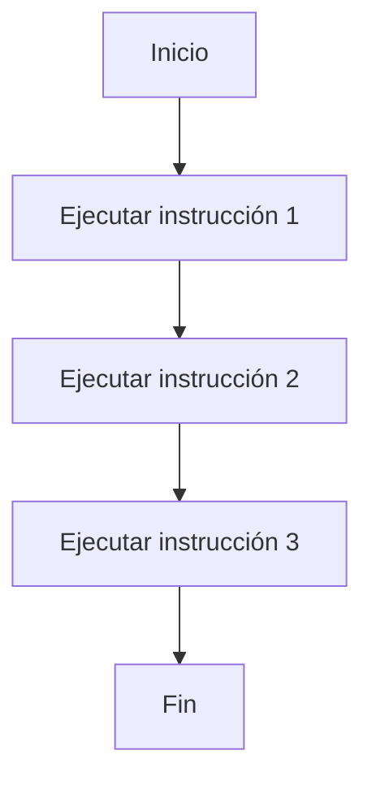
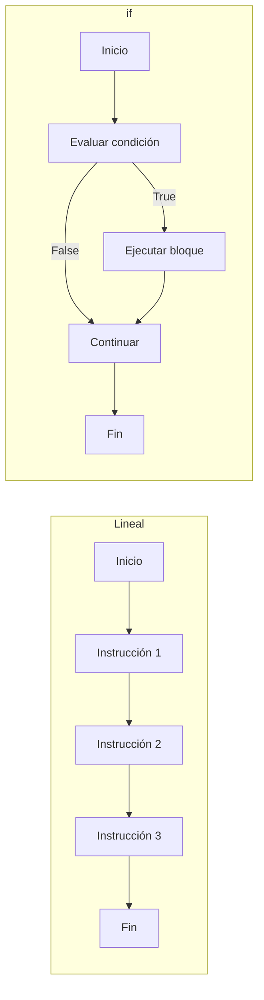

# :material-arrow-decision: Clase 3

## De la ejecución secuencial a la toma de decisiones

Hasta este momento, todos los programas construidos han seguido un **flujo secuencial**.
Esto significa que las instrucciones se ejecutan **una tras otra**, en el orden en que aparecen escritas.

```python
print("Inicio")
print("Proceso")
print("Fin")
```

El flujo no cambia bajo ninguna condición.

> Este tipo de ejecución es suficiente cuando **todas las instrucciones deben ejecutarse siempre**.
> Sin embargo, muchos problemas reales requieren que el programa **decida qué hacer dependiendo de una condición**.

### El problema de la secuencia rígida

Suponga que un programa solicita la edad de una persona:

```python
edad = int(input("Digite su edad: "))
print("Puede ingresar al sistema.")
```

Con esta estructura, el programa siempre mostrará el mismo mensaje, independientemente del valor ingresado.

- El programa **no está tomando decisiones**.
- No está analizando el estado actual.
- No está adaptando su comportamiento.

!!! question "¿Qué debería ocurrir?"

    Si la edad es menor a cierto valor, el programa debería comportarse diferente.
    Es decir, el flujo del programa debería modificarse según una condición.

## Bloques de código

En Python, cuando se necesita que varias instrucciones se ejecuten juntas bajo una misma regla, se agrupan en un **bloque de código**.

Un bloque de código se define mediante **indentación**.

```python
if True:
    print("Esta línea pertenece al bloque.")
```

Observe que:

- La línea indentada pertenece al bloque.
- La indentación no es opcional.
- Python utiliza la indentación para determinar la estructura lógica del programa.

!!! warning "La indentación define la estructura"

    A diferencia de otros lenguajes que utilizan llaves `{ }`,
    Python utiliza la indentación para delimitar bloques.

    Una indentación incorrecta genera un `IndentationError`.

## Cambio en el flujo del programa

Cuando se introduce una estructura condicional, el programa:

- Evalúa una condición.
- Decide si ejecuta o no un bloque de código.
- Puede omitir instrucciones dependiendo del resultado.

> El programa deja de ser estrictamente lineal y comienza a ser dinámico.



Ese es el flujo secuencial tradicional.

## Evaluación de condiciones lógicas en contexto

Una estructura _condicional_ necesita algo fundamental: una **condición que pueda evaluarse como verdadera o falsa**.

En Python, cualquier expresión que produzca un valor `True` o `False` puede utilizarse como condición.

```python title="Ejemplo de expresión booleana"
edad = 18
print(edad >= 18)
```

### ¿Qué ocurre cuando Python evalúa una condición?

Cuando una condición aparece dentro de una estructura condicional:

1. Python evalúa la expresión.
2. Obtiene un resultado booleano (`True`/`False`).
3. Decide si ejecuta el bloque asociado.

!!! note "Una condición siempre se reduce a `True` o `False`"

    Aunque la expresión sea larga, Python siempre la evalúa hasta obtener un único valor booleano, según las reglas de precedencia vistas la clase anterior.

### Condiciones compuestas

En muchos casos, una sola comparación no es suficiente.
Se pueden combinar expresiones para formar condiciones más completas.

```python hl_lines="4"
edad = 17
tiene_permiso = True

print(edad >= 18 or tiene_permiso)
```

## Estructura `if`

La estructura `if` permite ejecutar un bloque de código **únicamente cuando una condición es verdadera**.

Su sintaxis básica es la siguiente:

```python
if condicion:
    bloque de instrucciones
```

!!! warning "Preste atención al formato..."

    - Después de la condición se coloca `:`
    - El bloque debe estar indentado.
    - Si la condición es falsa, el bloque simplemente no se ejecuta.

```python title="Ejemplo inicial"
edad = int(input("Digite su edad: "))

if edad >= 18:
    print("Es mayor de edad.")
```

- Si la condición es verdadera, se imprime el mensaje.
- Si es falsa, el programa continúa sin ejecutar el bloque.

### Flujo lineal vs toma de decisión

El siguiente diagrama muestra una comparación visual entre un programa completamente lineal
y un programa que utiliza `if`.



## Estructura `if-else`

La estructura `if-else` se utiliza cuando el programa debe elegir **entre dos caminos posibles**.
A diferencia del `if` simple, siempre se ejecuta uno de los bloques.

Su sintaxis es:

```python
if condicion:
    bloque_si
else:
    bloque_no
```

!!! abstract "Consideraciones"

    - Si la condición es verdadera, se ejecuta el primer bloque.
    - Si es falsa, se ejecuta el segundo.
    - Uno de los dos bloques siempre se ejecuta.

### Ejemplo básico

```python
numero = int(input("Digite un número: "))

if numero % 2 == 0:
    print("El número es par.")   # (1)!
else:
    print("El número es impar.") # (2)!
```

1. Si la condición es verdadera, el número es par.
2. En cualquier otro caso, se ejecuta el bloque `else`.

### ¿Cuándo usar `if-else`?

Se utiliza cuando el problema plantea una decisión binaria:

- Aprobado o reprobado.
- Mayor o menor.
- Permitido o denegado.
- Par o impar.

!!! tip "Cuidado con la lógica incompleta"

    Un error frecuente ocurre cuando se usa un `if` simple
    cuando realmente se necesitaba un `if-else`.

## Estructura `if-elif-else`

Cuando el problema no se limita a dos posibles resultados, sino que existen **varias condiciones mutuamente excluyentes**, se utiliza la estructura `if-elif-else`.

Su sintaxis general es:

```python
if condicion_1:
    bloque_1
elif condicion_2:
    bloque_2
elif condicion_3:
    bloque_3
else:
    bloque_final
```

El funcionamiento es el siguiente:

1. Python evalúa la primera condición.
2. Si es verdadera, ejecuta su bloque y termina la estructura.
3. Si es falsa, evalúa la siguiente.
4. El proceso continúa hasta encontrar una condición verdadera.
5. Si ninguna condición se cumple, se ejecuta el bloque `else`.

### Ejemplo de uso

```python
nota = int(input("Digite su nota: "))

if nota >= 90:
    print("Excelente")
elif nota >= 80:
    print("Muy bueno")
elif nota >= 70:
    print("Bueno")
else:
    print("Debe mejorar")
```

Observe que:

- No es necesario escribir condiciones como `nota >= 80 and nota < 90`.
- El orden de las condiciones es fundamental.
- Una vez que una condición es verdadera, las demás no se evalúan.

### Importancia del orden

El orden en que se escriben las condiciones puede cambiar completamente el resultado.

Considere:

```python
nota = 95

if nota >= 70:
    print("Bueno")
elif nota >= 90:
    print("Excelente")
```

El resultado será: `Bueno`, porque la primera condición ya se cumple y Python no evalúa la segunda.

### Diferencia entre múltiples `if` y `if-elif`

```python
if nota >= 90:
    print("Excelente")

if nota >= 80:
    print("Muy bueno")
```

Aquí ambas condiciones pueden ejecutarse.

En cambio, con `if-elif`, solo se ejecuta la primera condición verdadera.

## Condicionales anidados

Un condicional anidado ocurre cuando una estructura condicional se encuentra **dentro de otra**.

Esto permite modelar decisiones jerárquicas, donde una segunda condición solo se evalúa si la primera ya se cumplió.

### Estructura general

```python
if condicion_1:
    if condicion_2:
        bloque_interno
```

Observe que:

- El segundo `if` está dentro del bloque del primero.
- La indentación indica el nivel jerárquico.
- La segunda condición solo se evalúa si la primera es verdadera.

### Ejemplo práctico

Suponga un sistema que:

- Verifica si la persona es mayor de edad.
- Luego verifica si tiene una contraseña correcta.

```python
edad = int(input("Digite su edad: "))

if edad >= 18:
    clave = input("Digite la contraseña: ")

    if clave == "1234":
        print("Acceso concedido.")
```

En este caso:

1. Si la persona no es mayor de edad, nunca se solicita la contraseña.
2. Si la edad es válida, entonces se evalúa la segunda condición.

### Uso adecuado del anidamiento

Los condicionales anidados son útiles cuando:

- Una decisión depende de otra.
- Existen reglas jerárquicas.
- El problema tiene niveles de validación.

> Sin embargo, un exceso de anidamiento puede hacer que el código sea difícil de leer.

## ¿Qué es un string?

Un _string_ (cadena de caracteres) es un tipo de dato que permite representar texto.

En Python, un string se escribe entre comillas:

```python
mensaje = "Hola mundo"
```

Hay dos formas válidas:

- Comillas dobles `" "`
- Comillas simples `' '`

El contenido entre las comillas se interpreta como texto, aunque contenga números.

### Strings como secuencias

Un string está compuesto por **caracteres individuales organizados en orden**.
Por ejemplo: `H  o  l  a`.

Cada carácter ocupa una posición.

!!! note "Un string es una secuencia ordenada"

    Esto significa que los caracteres tienen posición,
    y esa posición puede utilizarse para acceder a ellos.

### Inmutabilidad

Los strings en Python son **inmutables**.

Esto significa que:

- Una vez creado el string,
- Sus caracteres no pueden modificarse directamente.

Ejemplo conceptual:

```python
texto = "Hola"
```

No es posible cambiar solo una letra dentro del string.
Si se necesita una modificación, debe crearse un nuevo string.

### Relación con la entrada del usuario

Cuando se utiliza la función `input()`, el valor recibido siempre es un string.

```python
dato = input("Digite algo: ")
```

Aunque la persona usuaria digite números, Python los recibe como texto.

Esto convierte a los strings en un tipo de dato fundamental, puesto que todo dato ingresado comienza siendo una cadena.

### Representación en memoria

Cuando se crea un string:

- Python reserva espacio en memoria.
- Guarda los caracteres en orden.
- La variable apunta a esa secuencia.

## Operaciones con strings

Una vez que se entiende qué es un string, es necesario aprender las operaciones que se pueden realizar con ellos.

### Concatenación

La **concatenación** consiste en unir dos o más cadenas.

Se realiza utilizando el operador `+`.

```python
nombre = "Ana"
saludo = "Hola " + nombre
print(saludo)
```

No se modifica el string original; se crea uno nuevo combinando ambos.

También es posible concatenar varias cadenas:

```python
mensaje = "Buenos" + " " + "días"
print(mensaje)
```

!!! tip "Hay que agregar espacios explícitos"

    Python no agrega espacios automáticamente.
    Si se desea un espacio entre palabras, debe incluirse dentro de las comillas.

### Repetición de cadenas

Un string puede repetirse utilizando el operador `*`.

```python
print("ja" * 3) # (1)!
```

1. `jajaja`

### Longitud de una cadena

Para conocer la cantidad de caracteres que contiene un string, se utiliza la función `len()`.

```python
texto = "Hola"
print(len(texto)) # (1)!
```

1. `4`

Cada carácter cuenta, ya sean:

- Letras
- Espacios
- Números
- Símbolos

### Acceso por índice

Dado que un string es una secuencia ordenada, cada carácter tiene una posición.

!!! danger "Python posee _zero-based indexing_"

    Las posiciones comienzan en **0**.

```python
palabra = "Python"

print(palabra[0]) # (1)!
print(palabra[1]) # (2)!
print(palabra[2]) # (3)!
```

1. `P`
2. `y`
3. `t`

### Índices negativos

Python permite acceder desde el final utilizando índices negativos.
El índice `-1` representa el último carácter.

```python
palabra = "Python"

print(palabra[-1]) # (1)!
print(palabra[-2]) # (2)!
```

1. `n`
2. `o`

### Error por índice inválido

Si se intenta acceder a una posición inexistente,
Python genera un `IndexError`.

```python
texto = "Hola"
print(texto[10])
```

Este error ocurre porque esa posición no existe.

## Métodos de procesamiento de strings

Además de las operaciones básicas, los strings poseen **métodos integrados** que permiten transformar o analizar texto.

Un método se invoca utilizando la notación:

```python
variable.metodo()
```

Estos métodos **no modifican el string original**.
Devuelven una nueva cadena como resultado.

### Conversión a minúsculas y mayúsculas

```python
texto = "Hola Mundo"

print(texto.lower()) # (1)!
print(texto.upper()) # (2)!
```

1. `hola mundo`
2. `HOLA MUNDO`

Estos métodos son útiles cuando se desea comparar texto sin que influyan las mayúsculas o minúsculas.

### Eliminación de espacios

El método `strip()` elimina espacios al inicio y al final del texto.

```python
entrada = "   Python   "
print(entrada.strip()) # (1)!
```

1. `Python`

Esto es especialmente útil cuando el texto proviene de `input()`.

### Reemplazo de texto

Permite sustituir una parte del texto por otra.

```python
frase = "Me gusta Java"
nueva = frase.replace("Java", "Python")
print(nueva) # (1)!
```

1. `Me gusta Python`

### Búsqueda de texto

El método `find()` devuelve la posición donde aparece un texto.
Si no lo encuentra, devuelve `-1`.

```python
mensaje = "Programación"
print(mensaje.find("gra")) # (1)!
print(mensaje.find("xyz")) # (2)!
```

1. `3`
2. `-1`

### Conteo de apariciones

Permite contar cuántas veces aparece un carácter o subcadena.

```python
texto = "manzana"
print(texto.count("a")) # (1)!
```

1. `3`

### Comparación de texto

Cuando se trabaja con entrada del usuario, es recomendable _normalizar_ el texto antes de compararlo.

```python
respuesta = input("Digite si o no: ")

if respuesta.lower().strip() == "si":
    print("Confirmado")
```

- Se convierte todo a minúsculas.
- Se eliminan espacios innecesarios.
- Luego se compara.

### Separación de texto en listas

El método `split()` divide un string en partes y devuelve una **lista de subcadenas**.
Más adelante se va a analizar la estructura de datos de lista.

```python
frase = "Python es un lenguaje de programación"
palabras = frase.split()
print(palabras) # (1)!
```

1. `["Python", "es", "un", "lenguaje", "de", "programación"]`

Por defecto, separa por espacios.
También puede especificarse un separador:

```python
datos = "rojo,verde,azul"
colores = datos.split(",")
print(colores) # (1)!
```

1. `['rojo', 'verde', 'azul']`

Este método es muy útil para procesar texto separados por comas (`.csv`), por ejemplo.

### Uso de `f-strings`

Los **f-strings** permiten insertar variables dentro de una cadena de manera clara y directa.
Se escriben colocando la letra `f` antes de las comillas.

> No es necesario realizar conversiones entre tipos de datos.

```python
nombre = "Ana"
edad = 16

mensaje = f"{nombre} tiene {edad} años."
print(mensaje) # (1)!
```

1. `Ana tiene 16 años.`

Dentro de las llaves `{}` se pueden colocar:

- Variables
- Expresiones
- Operaciones simples

```python
a = 5
b = 3

print(f"La suma es {a + b}")
```
