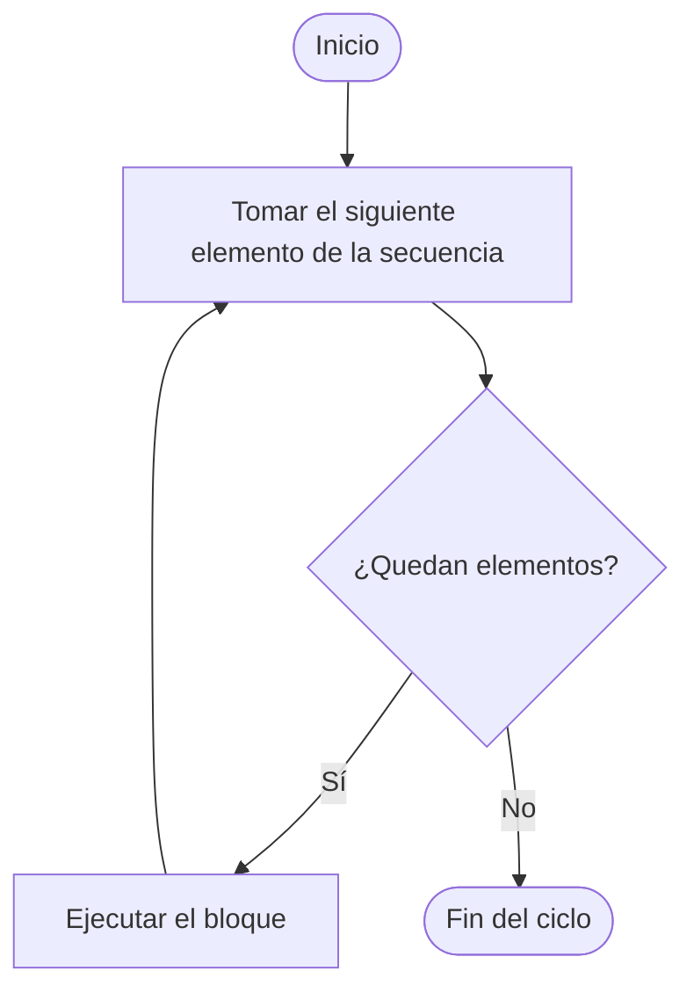
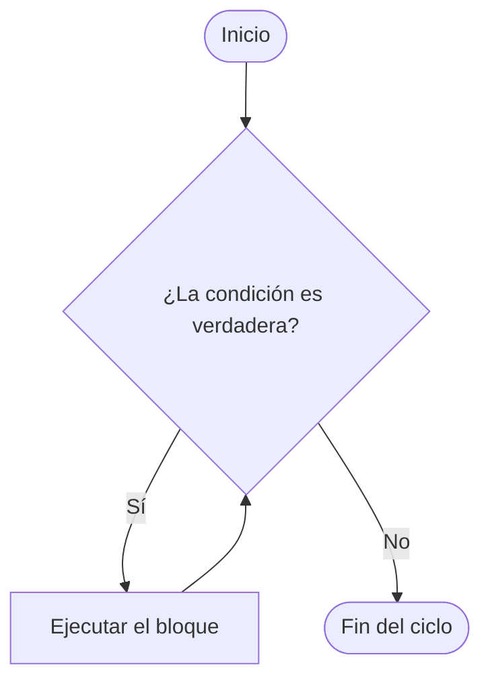
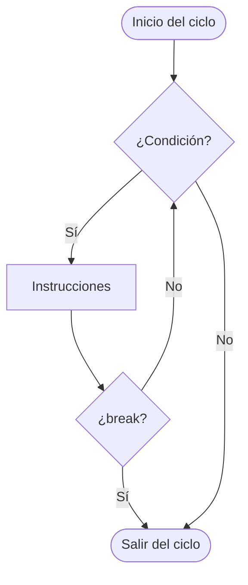
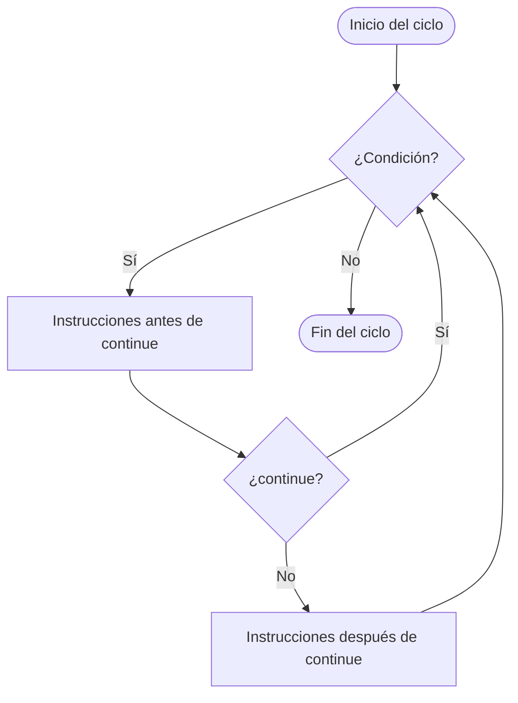

<!-- Colocar formato matemático -->
<script id="MathJax-script" async src="https://unpkg.com/mathjax@3/es5/tex-mml-chtml.js"></script>
<script>
  window.MathJax = {
    tex: {
      inlineMath: [["\\(", "\\)"]],
      displayMath: [["\\[", "\\]"]],
      processEscapes: true,
      processEnvironments: true
    },
    options: {
      ignoreHtmlClass: ".*|",
      processHtmlClass: "arithmatex"
    }
  };
</script>

# :material-repeat: Clase 5

## ¿Por qué necesitamos repetir instrucciones?

En la clase anterior se aprendió a agrupar datos en listas. Con una sola variable es posible almacenar las notas de todos los estudiantes del grupo:

```python
notas = [85, 90, 72, 88, 95]
```

Ahora surge una nueva necesidad: **procesar cada elemento de esa lista**. Por ejemplo, imprimir todas las notas una por una.

Sin ninguna herramienta nueva, la única opción sería acceder a cada posición manualmente:

```python
notas = [85, 90, 72, 88, 95]

print(notas[0])
print(notas[1])
print(notas[2])
print(notas[3])
print(notas[4])
```

Esto funciona, pero tiene un problema evidente: si la lista tuviera 100 notas, habría que escribir 100 líneas de `print`. Si tuviera 1000, habría que escribir 1000.

!!! question "¿Qué pasaría si la lista crece?"

    El código escrito manualmente no escala. Agregar un elemento a la lista obliga a agregar una línea nueva al programa. Esto no es programación eficiente.

Los **ciclos** (también llamados _loops_) resuelven exactamente este problema. Un ciclo es una estructura que permite **ejecutar un bloque de instrucciones varias veces**, sin necesidad de repetirlo manualmente en el código.

Con un ciclo, el ejemplo anterior se convierte en:

```python
notas = [85, 90, 72, 88, 95]

for nota in notas:
    print(nota)
```

No importa si la lista tiene 5 elementos o 5000: el código es idéntico. El ciclo se encarga de recorrer cada elemento automáticamente.

!!! abstract "Idea central"

    Un ciclo separa **qué se quiere hacer** (imprimir una nota) de **cuántas veces se quiere hacer** (una vez por cada elemento). El programador define la lógica una sola vez; el ciclo se encarga de repetirla.

Python ofrece dos tipos de ciclos, cada uno diseñado para un escenario distinto:

| Ciclo   | ¿Cuándo usarlo?                                          |
| ------- | -------------------------------------------------------- |
| `for`   | Cuando se sabe de antemano cuántas veces se va a repetir |
| `while` | Cuando la repetición depende de una condición            |

Los dos ciclos se estudian en esta clase, junto con las instrucciones `break` y `continue`, que permiten controlar el flujo dentro de un ciclo de forma precisa.

## Ciclo `for`

El ciclo `for` repite un bloque de instrucciones **una vez por cada elemento de una secuencia**. La cantidad de repeticiones queda definida desde el inicio: si la secuencia tiene 5 elementos, el ciclo ejecuta el bloque exactamente 5 veces.

### Sintaxis básica

```python
for variable in secuencia: # (1)!
    instrucción             # (2)!
```

1. `variable` toma el valor de cada elemento en cada vuelta. `secuencia` puede ser una lista, un rango, un string, u otro iterable.
2. Todo lo que esté indentado dentro del `for` se ejecuta en cada iteración.

El flujo de ejecución es el siguiente:



!!! note "La variable del ciclo"

    El nombre de la variable es libre. Por convención se usa un nombre que describa
    lo que representa cada elemento: `nota` para una lista de notas, `fruta` para
    una lista de frutas, `i` para índices numéricos.

### Iterar con `range()`

Muchas veces se necesita repetir un bloque una cantidad fija de veces, no sobre una lista existente. Para eso se usa `range()`, que genera una **secuencia de números enteros** sin necesidad de declararla como lista.

#### `range()` con un argumento

Cuando se pasa un solo argumento `n`, `range(n)` genera los números desde `0` hasta `n - 1`.

```python
for i in range(5): # (1)!
    print(i)
```

1. Genera los valores `0, 1, 2, 3, 4`. El valor `5` no se incluye.

```
0
1
2
3
4
```

!!! abstract "`range()` no incluye el límite superior"

    `range(5)` genera `0, 1, 2, 3, 4` (excluye el `5`).
    Esta convención es consistente con los índices de las listas, que también empiezan en `0`.

#### `range()` con dos argumentos

Con dos argumentos `range(inicio, fin)` genera números desde `inicio` hasta `fin - 1`.

```python
for i in range(1, 6): # (1)!
    print(i)
```

1. Genera los valores `1, 2, 3, 4, 5`. El `6` no se incluye.

```
1
2
3
4
5
```

Esto es útil cuando se quiere contar desde un número distinto de `0`. Por ejemplo, para mostrar las opciones de un menú numeradas desde `1`:

```python
for opcion in range(1, 4):
    print(f"Opción {opcion}")
```

```
Opción 1
Opción 2
Opción 3
```

#### `range()` con tres argumentos

El tercer argumento es el **paso**: la cantidad que se suma al valor en cada iteración.

=== "Paso positivo"

    ```python
    for i in range(0, 11, 2): # (1)!
        print(i)
    ```

    1. Comienza en `0`, termina antes de `11`, avanza de `2` en `2`.

    ```
    0
    2
    4
    6
    8
    10
    ```

=== "Paso negativo"

    ```python
    for i in range(5, 0, -1): # (1)!
        print(i)
    ```

    1. Comienza en `5`, termina antes de `0`, retrocede de `1` en `1`. Útil para cuenta regresiva.

    ```
    5
    4
    3
    2
    1
    ```

!!! warning "Paso negativo requiere inicio mayor que fin"

    `range(5, 0, -1)` funciona porque `5 > 0`.
    Si se escribe `range(0, 5, -1)`, Python genera una secuencia vacía y el ciclo no ejecuta ninguna iteración.

### Iterar sobre una lista

El caso más común del ciclo `for` es recorrer una lista elemento por elemento. En cada vuelta, la variable del ciclo toma el valor del elemento actual.

```python
frutas = ["manzana", "pera", "uva", "mango"]

for fruta in frutas: # (1)!
    print(fruta)
```

1. En la primera vuelta `fruta` vale `"manzana"`, en la segunda `"pera"`, y así sucesivamente.

```
manzana
pera
uva
mango
```

El bloque dentro del ciclo puede contener cualquier lógica. Por ejemplo, aplicar una condición a cada elemento:

```python
notas = [85, 90, 72, 88, 95, 61]

for nota in notas:
    if nota >= 70:
        print(f"{nota} — Aprobado")
    else:
        print(f"{nota} — Reprobado")
```

```
85 — Aprobado
90 — Aprobado
72 — Aprobado
88 — Aprobado
95 — Aprobado
61 — Reprobado
```

### Iterar sobre una lista con índice — `enumerate()`

A veces se necesita el **valor** de cada elemento y también su **posición** dentro de la lista. La función `enumerate()` entrega ambos en cada iteración.

```python
frutas = ["manzana", "pera", "uva", "mango"]

for indice, fruta in enumerate(frutas): # (1)!
    print(f"{indice}: {fruta}")
```

1. En cada vuelta, `indice` recibe la posición (comenzando en `0`) y `fruta` recibe el valor del elemento.

```
0: manzana
1: pera
2: uva
3: mango
```

Si se prefiere que la numeración comience en `1`, se puede indicar como segundo argumento:

```python
for numero, fruta in enumerate(frutas, 1): # (1)!
    print(f"{numero}. {fruta}")
```

1. El segundo argumento de `enumerate()` define el valor inicial del contador.

```
1. manzana
2. pera
3. uva
4. mango
```

!!! tip "`enumerate()` vs `range(len())`"

    Hay dos formas de acceder al índice y al valor en un `for`:

    ```python
    # Con enumerate
    for i, fruta in enumerate(frutas):
        print(i, fruta)

    # Con range(len())
    for i in range(len(frutas)):
        print(i, frutas[i])
    ```

    Ambas producen el mismo resultado. `enumerate()` es la forma idiomática de Python.

### Iterar sobre strings

Un string es una secuencia de caracteres, y el ciclo `for` puede recorrerlo exactamente igual que una lista.

```python
nombre = "Python"

for letra in nombre:
    print(letra)
```

```
P
y
t
h
o
n
```

Esto es útil para analizar el contenido de un texto carácter por carácter. Por ejemplo, contar cuántas vocales tiene una palabra:

```python
palabra = "programacion"
vocales = "aeiou"
conteo = 0

for letra in palabra:
    if letra in vocales:
        conteo += 1

print(f"La palabra tiene {conteo} vocales.") # (1)!
```

1. `La palabra tiene 5 vocales.`

### Contadores dentro de un `for`

Un **contador** es una variable que se declara antes del ciclo y se actualiza en cada iteración.
Es el patrón fundamental para calcular totales, promedios o conteos a partir de una lista.

#### Suma acumulada

```python
notas = [85, 90, 72, 88, 95]
total = 0 # (1)!

for nota in notas:
    total += nota # (2)!

promedio = total / len(notas)
print(f"Suma total: {total}")       # (3)!
print(f"Promedio: {promedio:.1f}")  # (4)!
```

1. El contador se inicializa en `0` antes de entrar al ciclo.
2. En cada vuelta se suma la nota actual al contador.
3. `Suma total: 430`
4. `Promedio: 86.0`

!!! warning "Inicializar siempre fuera del ciclo"

    Si el contador se declara dentro del ciclo, se reinicia a `0` en cada iteración
    y nunca acumula nada útil. Siempre debe declararse **antes** de que el ciclo comience.

#### Conteo condicional

Un contador también puede servir para **contar** cuántos elementos cumplen una condición específica.

```python
notas = [85, 90, 72, 88, 95, 61, 78, 55]
aprobados = 0  # (1)!
reprobados = 0

for nota in notas:
    if nota >= 70:
        aprobados += 1
    else:
        reprobados += 1

print(f"Aprobados:  {aprobados}")   # (2)!
print(f"Reprobados: {reprobados}")  # (3)!
```

1. Se necesita un contador separado para cada categoría.
2. `Aprobados:  6`
3. `Reprobados: 2`

### `for` anidado

Un ciclo `for` puede contener otro ciclo `for` en su interior. Esto se llama **ciclo anidado**: por cada iteración del ciclo externo, el ciclo interno completa **todas** sus iteraciones.

```python
for fila in range(1, 4):      # (1)!
    for columna in range(1, 4): # (2)!
        print(f"({fila},{columna})", end=" ")
    print() # (3)!
```

1. El ciclo externo controla las filas: recorre `1, 2, 3`.
2. El ciclo interno controla las columnas: por cada fila, recorre `1, 2, 3`.
3. `print()` sin argumentos imprime un salto de línea al terminar cada fila.

```
(1,1) (1,2) (1,3)
(2,1) (2,2) (2,3)
(3,1) (3,2) (3,3)
```

Un uso práctico es generar la tabla de multiplicar de un número:

```python
numero = 7

for i in range(1, 11):
    print(f"{numero} × {i} = {numero * i}")
```

```
7 × 1 = 7
7 × 2 = 14
7 × 3 = 21
7 × 4 = 28
7 × 5 = 35
7 × 6 = 42
7 × 7 = 49
7 × 8 = 56
7 × 9 = 63
7 × 10 = 70
```

!!! warning "Cuidado con la complejidad de los ciclos anidados"

    Con ciclos anidados, la cantidad de iteraciones se multiplica.
    Un ciclo externo de 100 iteraciones con uno interno de 100 ejecuta el bloque **10 000 veces**.
    Usar ciclos anidados solo cuando el problema realmente lo requiere.

    > Esto representa una complejidad temporal de $O(n^2)$.

## Ciclo `while`

El ciclo `while` repite un bloque de instrucciones **mientras una condición sea verdadera**. A diferencia del `for`, no recorre una secuencia fija: sigue ejecutándose hasta que la condición se vuelve falsa, sin importar cuántas vueltas tome.

### Sintaxis básica

```python
while condición: # (1)!
    instrucción  # (2)!
```

1. La condición se evalúa **antes** de cada iteración. Si es `True`, se ejecuta el bloque. Si es `False`, el ciclo termina.
2. Todo lo que esté indentado dentro del `while` se ejecuta mientras la condición sea verdadera.

El flujo de ejecución es el siguiente:



!!! warning "La condición debe volverse falsa en algún momento"

    Si la condición nunca deja de ser `True`, el ciclo se ejecuta indefinidamente.
    Esto se conoce como **ciclo infinito** y es uno de los errores más comunes al usar `while`.

### Ciclo controlado por contador

El caso más similar al `for` es cuando se usa una variable numérica como contador y se actualiza manualmente en cada iteración.

```python
contador = 1    # (1)!

while contador <= 5:     # (2)!
    print(contador)
    contador += 1        # (3)!
```

1. El contador se inicializa antes del ciclo.
2. La condición verifica si el contador aún está dentro del rango deseado.
3. El contador debe actualizarse dentro del ciclo. Si se omite esta línea, el ciclo nunca termina.

```
1
2
3
4
5
```

!!! tip "`for` vs `while` para contar"

    Este ejemplo se puede escribir más fácilmente con `for i in range(1, 6)`.
    Usar `while` para contar tiene sentido solo cuando la cantidad de repeticiones
    **no se conoce de antemano** o depende de lo que ocurra durante la ejecución.

### Ciclo controlado por condición lógica

El `while` es ideal cuando el ciclo debe continuar mientras cierta situación sea verdadera, sin que la cantidad de repeticiones esté definida desde el inicio.

```python
temperatura = 100  # (1)!

while temperatura > 0:
    print(f"Temperatura actual: {temperatura}°C")
    temperatura -= 15  # (2)!

print("La temperatura llegó a cero o menos.")
```

1. La variable que controla el ciclo puede ser de cualquier tipo, no necesariamente un contador.
2. En cada iteración la temperatura baja 15 grados, hasta que deja de ser mayor que 0.

```
Temperatura actual: 100°C
Temperatura actual: 85°C
Temperatura actual: 70°C
Temperatura actual: 55°C
Temperatura actual: 40°C
Temperatura actual: 25°C
Temperatura actual: 10°C
La temperatura llegó a cero o menos.
```

### Ciclo controlado por centinela

Un **valor centinela** es un valor especial que el usuario puede ingresar para indicar que desea detener el ciclo. Este patrón es muy útil cuando no se sabe cuántos datos va a ingresar el usuario.

```python
suma = 0
cantidad = 0

numero = int(input("Digite un número (-1 para terminar): ")) # (1)!

while numero != -1:                                          # (2)!
    suma += numero
    cantidad += 1
    numero = int(input("Digite un número (-1 para terminar): "))

if cantidad > 0:
    print(f"Suma: {suma}")
    print(f"Promedio: {suma / cantidad:.1f}")
else:
    print("No se ingresó ningún número.")
```

1. Se lee el primer número **antes** del ciclo para poder evaluarlo en la condición.
2. El ciclo continúa mientras el número ingresado no sea el centinela `-1`.

=== "Con datos"

    ```
    Digite un número (-1 para terminar): 10
    Digite un número (-1 para terminar): 25
    Digite un número (-1 para terminar): 8
    Digite un número (-1 para terminar): -1
    Suma: 43
    Promedio: 14.3
    ```

=== "Sin datos"

    ```
    Digite un número (-1 para terminar): -1
    No se ingresó ningún número.
    ```

!!! note "¿Por qué leer el número antes del ciclo?"

    La condición del `while` necesita evaluar `numero` antes de entrar. Si se lee dentro
    del ciclo, la primera evaluación usaría un valor no inicializado o incorrecto.

### Ciclo de validación de entrada

Uno de los usos más frecuentes del `while` es garantizar que el usuario ingrese un valor válido antes de continuar con el programa.

```python
nota = int(input("Digite la nota (0-100): "))

while nota < 0 or nota > 100:                  # (1)!
    print("Error: la nota debe estar entre 0 y 100.")
    nota = int(input("Digite la nota (0-100): "))

print(f"Nota registrada: {nota}")
```

1. Mientras la nota esté fuera del rango permitido, el programa sigue pidiendo al usuario que la corrija.

=== "Entrada válida directa"

    ```
    Digite la nota (0-100): 85
    Nota registrada: 85
    ```

=== "Con correcciones"

    ```
    Digite la nota (0-100): -5
    Error: la nota debe estar entre 0 y 100.
    Digite la nota (0-100): 110
    Error: la nota debe estar entre 0 y 100.
    Digite la nota (0-100): 78
    Nota registrada: 78
    ```

!!! abstract "Patrón de validación"

    Este patrón (pedir el dato, verificar si es válido, y volver a pedirlo si no lo es)
    es tan común que conviene memorizarlo. Aparece en casi cualquier programa que recibe
    datos del usuario.

### Validación de tipo con `try-except`

El patrón anterior asume que el usuario ingresa un número. Pero si escribe texto, `int()` genera un `ValueError` y el programa se detiene con un error.

Combinando `while` con `try-except` se puede manejar tanto el tipo incorrecto como el valor fuera de rango en un solo bloque:

```python
continuar = True
while continuar:
    try:
        nota = int(input("Digite la nota (0-100): ")) # (1)!
        if nota < 0 or nota > 100:
            print("Error: la nota debe estar entre 0 y 100.")
        else:
            continuar = False
    except ValueError:
        print("Error: debe ingresar un número entero.") # (3)!

print(f"Nota registrada: {nota}")
```

1. Si el usuario escribe texto, `int()` lanza un `ValueError` que es capturado por el `except`.
2. Solo se sale del ciclo cuando el dato es un número entero dentro del rango permitido.
3. Si la conversión falla, se informa el error y el ciclo vuelve a pedir el dato.

=== "Texto ingresado"

    ```
    Digite la nota (0-100): hola
    Error: debe ingresar un número entero.
    Digite la nota (0-100): 85
    Nota registrada: 85
    ```

=== "Número fuera de rango"

    ```
    Digite la nota (0-100): -10
    Error: la nota debe estar entre 0 y 100.
    Digite la nota (0-100): 200
    Error: la nota debe estar entre 0 y 100.
    Digite la nota (0-100): 72
    Nota registrada: 72
    ```

=== "Entrada válida directa"

    ```
    Digite la nota (0-100): 90
    Nota registrada: 90
    ```

### Ciclo infinito y su riesgo

Un ciclo `while True` se ejecuta indefinidamente por diseño. Es un patrón válido siempre que el ciclo tenga una instrucción `break` que permita salir cuando sea necesario.

```python
while True:                  # (1)!
    respuesta = input("¿Desea continuar? (s/n): ").lower()
    if respuesta == "n":
        break                # (2)!
    print("Continuando...")

print("Programa finalizado.")
```

1. El ciclo nunca termina por su condición; siempre es `True`.
2. La única salida es el `break`. Se verá con detalle en la sección siguiente.

!!! danger "Ciclo infinito no intencional"

    Un ciclo infinito que no tiene salida bloquea el programa. Ocurre cuando
    la condición siempre es verdadera por error, o cuando se olvida actualizar
    la variable que controla el ciclo.

    ```python
    # Este ciclo nunca termina
    n = 1
    while n > 0:
        print(n)
        # Falta n -= 1
    ```

    En la terminal se puede interrumpir con ++ctrl+c++.

### Comparación `for` vs `while`

| Característica             | `for`                             | `while`                                   |
| -------------------------- | --------------------------------- | ----------------------------------------- |
| Cantidad de repeticiones   | Conocida desde el inicio          | Depende de una condición                  |
| Actualización del contador | Automática                        | Manual, dentro del bloque                 |
| Uso típico                 | Recorrer listas, rangos numéricos | Validar entradas, centinelas, menús       |
| Riesgo de ciclo infinito   | No                                | Sí, si la condición nunca se vuelve falsa |

## Instrucciones de control de ciclo

Dentro de cualquier ciclo (`for` o `while`) existen dos instrucciones que permiten alterar el flujo normal de las iteraciones: `break` y `continue`.

Por defecto, un ciclo completa todas sus iteraciones de principio a fin. Estas instrucciones permiten **interrumpir** ese comportamiento de forma controlada.

### `break`: interrumpir el ciclo

La instrucción `break` **detiene el ciclo inmediatamente** y transfiere la ejecución a la primera línea después del bloque del ciclo, sin importar si quedaban iteraciones pendientes.



#### `break` dentro de un `for`

Un uso común es detener la búsqueda en una lista en el momento en que se encuentra el elemento deseado, sin procesar el resto innecesariamente.

```python
nombres = ["Ana", "Luis", "María", "Carlos", "Sofía"]
buscado = "María"

for nombre in nombres:
    if nombre == buscado:
        print(f"¡{buscado} encontrado!")
        break                            # (1)!
    print(f"Revisando: {nombre}...")
```

1. Al encontrar el nombre, el ciclo se detiene. Las iteraciones restantes no se ejecutan.

```
Revisando: Ana...
Revisando: Luis...
¡María encontrado!
```

Sin el `break`, el ciclo continuaría revisando `"Carlos"` y `"Sofía"` aunque ya se encontró el resultado.

#### `break` dentro de un `while`

El patrón `while True` con `break` es la forma idiomática de crear un ciclo que se repite hasta que se cumple una condición interna, útil cuando esa condición solo puede verificarse dentro del bloque.

```python
intentos = 0
clave_correcta = "python123"

while True:
    clave = input("Digite la clave: ")
    intentos += 1

    if clave == clave_correcta:
        print(f"Acceso concedido. Intentos: {intentos}")
        break                                           # (1)!
    else:
        print("Clave incorrecta. Intente de nuevo.")
```

1. El ciclo solo termina cuando la clave ingresada coincide con la correcta.

=== "Primer intento correcto"

    ```
    Digite la clave: python123
    Acceso concedido. Intentos: 1
    ```

=== "Con intentos fallidos"

    ```
    Digite la clave: hola
    Clave incorrecta. Intente de nuevo.
    Digite la clave: 12345
    Clave incorrecta. Intente de nuevo.
    Digite la clave: python123
    Acceso concedido. Intentos: 3
    ```

### `continue`: saltar una iteración

La instrucción `continue` **omite el resto del bloque en la iteración actual** y pasa directamente a la siguiente. El ciclo no termina: solo salta ese paso.



#### `continue` dentro de un `for`

Un uso típico es filtrar elementos de una lista: procesar solo los que cumplen cierta condición e ignorar los demás.

```python
notas = [85, 90, 42, 88, 55, 95, 61]

print("Notas por debajo de 70:")

for nota in notas:
    if nota >= 70:
        continue          # (1)!
    print(nota)
```

1. Si la nota es mayor o igual a 70, se salta el `print` y se pasa a la siguiente iteración.

```
Notas por debajo de 70:
42
55
61
```

#### `continue` dentro de un `while`

```python
numero = 0

while numero < 10:
    numero += 1
    if numero % 2 == 0:
        continue           # (1)!
    print(numero)
```

1. Si el número es par, se omite el `print` y se continúa con la siguiente iteración.

```
1
3
5
7
9
```

!!! note "continue no reinicia el ciclo"

    `continue` no vuelve al inicio del ciclo desde cero. Solo salta las instrucciones
    que vendrían después de él **en esa iteración**. La variable del ciclo sigue
    avanzando con normalidad.

### Diferencia entre `break` y `continue`

| Instrucción | Efecto                                | El ciclo continúa |
| ----------- | ------------------------------------- | :---------------: |
| `break`     | Termina el ciclo por completo         |        No         |
| `continue`  | Salta el resto de la iteración actual |        Sí         |

Para ilustrar la diferencia con el mismo ejemplo:

=== "Con `break`"

    ```python
    for i in range(1, 8):
        if i == 4:
            break
        print(i)
    ```

    ```
    1
    2
    3
    ```

    El ciclo se detiene en cuanto `i` vale `4`. Los valores `4, 5, 6, 7` nunca se procesan.

=== "Con `continue`"

    ```python
    for i in range(1, 8):
        if i == 4:
            continue
        print(i)
    ```

    ```
    1
    2
    3
    5
    6
    7
    ```

    El valor `4` se omite, pero el ciclo sigue ejecutándose para `5, 6, 7`.

## Ejercicio integrador

=== "Enunciado"

    El grupo de décimo año realiza una votación para elegir al representante estudiantil.
    Se presentan tres candidatos. El programa debe permitir registrar los votos uno por uno
    y al finalizar mostrar los resultados.

    El programa debe cumplir con los siguientes requisitos:

    1. Almacenar los **nombres de los tres candidatos** en una lista.
    2. Usar un ciclo `while` para recibir votos de forma continua. En cada vuelta:
        - Solicitar al usuario que ingrese el **número del candidato** (1, 2 o 3) o `0` para terminar la votación.
        - Usar `try-except` para manejar entradas que no sean números enteros.
        - Si el número ingresado es `0`, terminar el ciclo con `break`.
        - Si el número ingresado no corresponde a ningún candidato válido (distinto de 1, 2 o 3), mostrar un mensaje de voto inválido y usar `continue` para no registrarlo.
        - Si el voto es válido, registrarlo en una lista de conteos.
    3. Al terminar la votación, usar un ciclo `for` con `enumerate()` para mostrar los resultados: nombre del candidato, votos obtenidos y porcentaje sobre el total.
    4. Indicar el nombre del candidato ganador.
    5. Si no se registró ningún voto, mostrar un mensaje indicándolo.

=== "Solución"

    #### Paso 1: Declarar las estructuras de datos

    Se necesitan dos listas: una con los nombres de los candidatos y otra con sus conteos de votos, inicializados en cero.

    ```python
    candidatos = ["Valeria Mora", "Diego Solís", "Camila Brenes"]
    votos = [0, 0, 0] # (1)!
    ```

    1. Cada posición en `votos` corresponde al mismo índice en `candidatos`. `votos[0]` es el conteo de `"Valeria Mora"`, y así sucesivamente.

    #### Paso 2: Ciclo principal de votación

    Se usa `while True` para recibir votos indefinidamente hasta que el usuario ingrese `0`.
    Dentro del ciclo, `try-except` protege contra entradas no numéricas.

    ```python
    print("=== Votación estudiantil ===")
    print("Candidatos: 1. Valeria Mora  |  2. Diego Solís  |  3. Camila Brenes")
    print("Digite 0 para cerrar la votación.\n")

    while True:
        try:
            opcion = int(input("Voto: "))
        except ValueError:
            print("Entrada inválida: debe ingresar un número.")
            continue                                    # (1)!

        if opcion == 0:
            break                                       # (2)!

        if opcion < 1 or opcion > 3:
            print(f"Voto inválido: no existe el candidato {opcion}.")
            continue                                    # (3)!

        votos[opcion - 1] += 1                          # (4)!
        print(f"Voto registrado para {candidatos[opcion - 1]}.")
    ```

    1. Si `int()` falla, se informa el error y se salta al siguiente ciclo sin registrar nada.
    2. El usuario ingresó `0`: la votación termina.
    3. El número es entero pero no corresponde a ningún candidato: se descarta.
    4. `opcion` es 1, 2 o 3, pero los índices empiezan en 0, por eso se resta 1.

    #### Paso 3: Mostrar resultados con `for`

    Se calcula el total de votos y se usa `for` con `enumerate()` para mostrar los resultados de cada candidato.

    ```python
    total = sum(votos)

    print("\n=== Resultados ===")

    if total == 0:
        print("No se registró ningún voto.")
    else:
        for i, candidato in enumerate(candidatos):
            porcentaje = votos[i] / total * 100          # (1)!
            print(f"{candidato}: {votos[i]} votos ({porcentaje:.1f}%)")

        ganador = candidatos[votos.index(max(votos))]    # (2)!
        print(f"\nGanador: {ganador}")
    ```

    1. El porcentaje se calcula dividiendo los votos del candidato entre el total y multiplicando por 100.
    2. `max(votos)` obtiene el mayor conteo. `.index()` encuentra su posición. Con esa posición se accede al nombre en `candidatos`.

    #### Programa completo

    ```python
    candidatos = ["Valeria Mora", "Diego Solís", "Camila Brenes"]
    votos = [0, 0, 0]

    print("=== Votación estudiantil ===")
    print("Candidatos: 1. Valeria Mora  |  2. Diego Solís  |  3. Camila Brenes")
    print("Digite 0 para cerrar la votación.\n")

    while True:
        try:
            opcion = int(input("Voto: "))
        except ValueError:
            print("Entrada inválida: debe ingresar un número.")
            continue

        if opcion == 0:
            break

        if opcion < 1 or opcion > 3:
            print(f"Voto inválido: no existe el candidato {opcion}.")
            continue

        votos[opcion - 1] += 1
        print(f"Voto registrado para {candidatos[opcion - 1]}.")

    total = sum(votos)

    print("\n=== Resultados ===")

    if total == 0:
        print("No se registró ningún voto.")
    else:
        for i, candidato in enumerate(candidatos):
            porcentaje = votos[i] / total * 100
            print(f"{candidato}: {votos[i]} votos ({porcentaje:.1f}%)")

        ganador = candidatos[votos.index(max(votos))]
        print(f"\nGanador: {ganador}")
    ```

    !!! example "Ejemplos de ejecución"

        === "Votación normal"

            ```
            === Votación estudiantil ===
            Candidatos: 1. Valeria Mora  |  2. Diego Solís  |  3. Camila Brenes
            Digite 0 para cerrar la votación.

            Voto: 1
            Voto registrado para Valeria Mora.
            Voto: 2
            Voto registrado para Diego Solís.
            Voto: 1
            Voto registrado para Valeria Mora.
            Voto: 3
            Voto registrado para Camila Brenes.
            Voto: 1
            Voto registrado para Valeria Mora.
            Voto: 0

            === Resultados ===
            Valeria Mora: 3 votos (60.0%)
            Diego Solís: 1 votos (20.0%)
            Camila Brenes: 1 votos (20.0%)

            Ganador: Valeria Mora
            ```

        === "Con entradas inválidas"

            ```
            === Votación estudiantil ===
            Candidatos: 1. Valeria Mora  |  2. Diego Solís  |  3. Camila Brenes
            Digite 0 para cerrar la votación.

            Voto: hola
            Entrada inválida: debe ingresar un número.
            Voto: 5
            Voto inválido: no existe el candidato 5.
            Voto: 2
            Voto registrado para Diego Solís.
            Voto: 0

            === Resultados ===
            Valeria Mora: 0 votos (0.0%)
            Diego Solís: 1 votos (100.0%)
            Camila Brenes: 0 votos (0.0%)

            Ganador: Diego Solís
            ```

        === "Sin votos"

            ```
            === Votación estudiantil ===
            Candidatos: 1. Valeria Mora  |  2. Diego Solís  |  3. Camila Brenes
            Digite 0 para cerrar la votación.

            Voto: 0

            === Resultados ===
            No se registró ningún voto.
            ```
