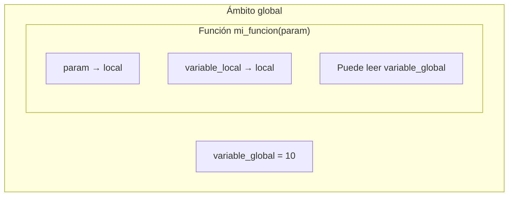
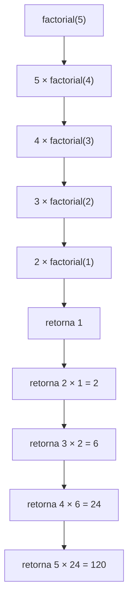

<!-- Colocar formato matemático -->
<script id="MathJax-script" async src="https://unpkg.com/mathjax@3/es5/tex-mml-chtml.js"></script>
<script>
  window.MathJax = {
    tex: {
      inlineMath: [["\\(", "\\)"]],
      displayMath: [["\\[", "\\]"]],
      processEscapes: true,
      processEnvironments: true
    },
    options: {
      ignoreHtmlClass: ".*|",
      processHtmlClass: "arithmatex"
    }
  };
</script>

# :material-function: Clase 7

## ¿Por qué necesitamos funciones?

En las clases anteriores, los programas crecieron en complejidad: ciclos, listas, validaciones, menús.
Con el tiempo, aparece un problema nuevo: **el código se repite**.

Suponga que se necesita calcular el promedio de tres grupos de estudiantes distintos:

```python
notas_a = [85, 90, 72, 88, 95]
suma_a = sum(notas_a)
promedio_a = suma_a / len(notas_a)
print(f"Grupo A - Promedio: {promedio_a:.1f}")

notas_b = [78, 82, 69, 91, 74]
suma_b = sum(notas_b)
promedio_b = suma_b / len(notas_b)
print(f"Grupo B - Promedio: {promedio_b:.1f}")

notas_c = [95, 88, 76, 80, 93]
suma_c = sum(notas_c)
promedio_c = suma_c / len(notas_c)
print(f"Grupo C - Promedio: {promedio_c:.1f}")
```

La lógica es exactamente la misma en los tres bloques.
Si después se necesita cambiar el formato de salida o agregar una condición, habría que modificar el código en tres lugares distintos.

!!! question "¿Qué pasa cuando hay diez grupos?"

    Con diez grupos, habría que duplicar la lógica diez veces.
    Cualquier corrección exigiría cambiar el código en diez lugares.
    Un solo olvido introduce un error difícil de encontrar.

Las _funciones_ resuelven este problema.

> Una función es un bloque de código con nombre que realiza una tarea específica y puede ejecutarse todas las veces que se necesite, desde cualquier parte del programa.

Con una función, el ejemplo anterior se convierte en:

```python
def calcular_promedio(notas):
    return sum(notas) / len(notas)

notas_a = [85, 90, 72, 88, 95]
notas_b = [78, 82, 69, 91, 74]
notas_c = [95, 88, 76, 80, 93]

print(f"Grupo A - Promedio: {calcular_promedio(notas_a):.1f}")
print(f"Grupo B - Promedio: {calcular_promedio(notas_b):.1f}")
print(f"Grupo C - Promedio: {calcular_promedio(notas_c):.1f}")
```

La lógica se escribe **una sola vez** y se reutiliza tres veces. Si se necesita cambiar algo, el cambio se hace en un único lugar.

!!! abstract "Idea central"

    Una función separa **qué se quiere hacer** (calcular un promedio) de **cuándo y con qué datos hacerlo**. El programador define la lógica una sola vez; la función se encarga de aplicarla cuantas veces sea necesario.

## Definición y uso de funciones

### Sintaxis básica

Para crear una función en Python se usa la palabra reservada `def`, seguida del nombre de la función y paréntesis:

```python
def saludar(): # (1)!
    print("¡Hola mundo!") # (2)!
```

1. `def` indica que se está definiendo una función. `saludar` es el nombre. Los paréntesis `()` son obligatorios, aunque la función no reciba datos.
2. Todo el código indentado dentro de la función forma su cuerpo. Se ejecuta cada vez que la función es llamada.

Para **ejecutar** la función, se escribe su nombre seguido de paréntesis:

```python
saludar() # (1)!
saludar() # (2)!
```

1. Primera llamada: imprime `¡Hola mundo!`
2. Segunda llamada: imprime `¡Hola mundo!` de nuevo.

!!! warning "Definir antes de llamar"

    La función debe **definirse antes** de ser llamada.
    Si se intenta llamar una función que aún no existe en el código, Python genera un `NameError`.

    ```python
    saludar()  # (1)!

    def saludar():
        print("¡Hola!")
    ```

    1. Error: aún no está definida

### Flujo de ejecución

Cuando Python encuentra una llamada a una función, **pausa** el código actual, ejecuta el cuerpo de la función completo y luego **retoma** desde donde se detuvo.

```python
print("Antes de la función") # (1)!

def despedirse():
    print("¡Hasta luego!")

despedirse() # (2)!

print("Después de la función") # (3)!
```

1. `Antes de la función`
2. `¡Hasta luego!`
3. `Después de la función`

### Nombre de una función

El nombre de una función debe describir claramente **qué hace**.
Por convención en Python se usa `snake_case`: palabras en minúscula separadas por guion bajo.

!!! note "Las funciones son verbos"

    Un buen nombre de función generalmente comienza con un verbo: `calcular`, `mostrar`, `verificar`, `obtener`, `imprimir`.
    Esto refleja que las funciones **hacen** algo.

## Parámetros y argumentos

Una función puede recibir datos desde afuera para trabajar con ellos.
Estos datos se definen como **parámetros** en la declaración de la función y se pasan como **argumentos** al llamarla.

### Función con un parámetro

```python
def saludar_estudiante(nombre): # (1)!
    print(f"¡Hola {nombre}! Bienvenido.")
```

1. `nombre` es el **parámetro**: una variable local que recibe el valor que se pase al llamar la función.

Al llamar la función, se pasa el **argumento** entre paréntesis:

```python
saludar_estudiante("Ana")    # (1)!
saludar_estudiante("Carlos") # (2)!
saludar_estudiante("Sofía")  # (3)!
```

1. `¡Hola Ana! Bienvenido.`
2. `¡Hola Carlos! Bienvenido.`
3. `¡Hola Sofía! Bienvenido.`

### Función con varios parámetros

Una función puede recibir más de un parámetro, separados por comas.

```python
def mostrar_nota(nombre, nota): # (1)!
    if nota >= 70:
        estado = "Aprobado"
    else:
        estado = "Reprobado"
    print(f"{nombre}: {nota} — {estado}")
```

1. La función recibe dos datos: el nombre del estudiante y su nota.

```python
mostrar_nota("Ana", 92)     # (1)!
mostrar_nota("Luis", 65)    # (2)!
mostrar_nota("María", 78)   # (3)!
```

1. `Ana: 92 — Aprobado`
2. `Luis: 65 — Reprobado`
3. `María: 78 — Aprobado`

!!! warning "El orden de los argumentos importa"

    Los argumentos se asignan a los parámetros **en el mismo orden** en que se declaran.
    Llamar `mostrar_nota(92, "Ana")` causaría un error porque intentaría comparar `"Ana" >= 70`.

### Parámetros con valor por defecto

Un parámetro puede tener un **valor por defecto** que se usa cuando el argumento no se proporciona al llamar la función.

```python
def mostrar_bienvenida(nombre, saludo="¡Hola"): # (1)!
    print(f"{saludo}, {nombre}!")
```

1. Si no se pasa un segundo argumento, `saludo` tomará el valor `"¡Hola"` por defecto.

```python
mostrar_bienvenida("Ana")                  # (1)!
mostrar_bienvenida("Luis", "¡Buenos días") # (2)!
```

1. `¡Hola, Ana!`
2. `¡Buenos días, Luis!`

!!! note "Los parámetros con defecto van al final"

    En Python, los parámetros con valor por defecto siempre deben ir **después** de los parámetros sin valor por defecto. `def f(a="x", b)` generaría un error de sintaxis.

## Retorno de valores

Hasta ahora, las funciones imprimen resultados directamente. Sin embargo, muchas veces se necesita que la función **devuelva un valor** para que el programa pueda usarlo después.

La instrucción `return` devuelve un valor al lugar desde donde se llamó la función y la **termina inmediatamente**.

### Función con `return`

```python
def calcular_promedio(notas): # (1)!
    return sum(notas) / len(notas)
```

1. La función no imprime nada: **devuelve** el promedio calculado.

El valor devuelto puede guardarse en una variable o usarse directamente:

```python
notas = [85, 90, 72, 88, 95]

promedio = calcular_promedio(notas)    # (1)!
print(f"El promedio es: {promedio:.1f}") # (2)!
```

1. El resultado de la función se guarda en `promedio`.
2. `El promedio es: 86.0`

También se puede usar directamente sin guardar:

```python
print(f"El promedio es: {calcular_promedio(notas):.1f}") # (1)!
```

1. El valor de retorno se usa directamente dentro del f-string.

!!! tip "¿`return` o `print`?"

    Una función que usa `print` solo muestra el resultado en pantalla. No puede enviarse a otra función ni guardarse para usarlo después.

    Una función que usa `return` devuelve el resultado para que **el código que la llamó** decida qué hacer con él. Esto la hace mucho más flexible y reutilizable.

    La regla general: las funciones deben **calcular y retornar**. La tarea de imprimir queda fuera de la función, en el código principal.

### Múltiples puntos de retorno

Una función puede tener más de un `return`, aunque solo se ejecutará el primero que se alcance.

```python
def clasificar_nota(nota):
    if nota >= 90:
        return "Excelente"
    elif nota >= 80:
        return "Muy bueno"
    elif nota >= 70:
        return "Bueno"
    else:
        return "Debe mejorar"
```

```python
print(clasificar_nota(95))  # (1)!
print(clasificar_nota(82))  # (2)!
print(clasificar_nota(61))  # (3)!
```

1. `Excelente`
2. `Muy bueno`
3. `Debe mejorar`

### Funciones sin `return`

Si una función no tiene `return` (o tiene `return` sin valor), devuelve `None` implícitamente. `None` es el valor en Python que representa "ausencia de valor".

```python
def saludar():
    print("¡Hola!")

resultado = saludar() # (1)!
print(resultado)      # (2)!
```

1. La función se ejecuta e imprime `¡Hola!`, pero no retorna ningún valor.
2. `None`

!!! abstract "Resumen: `return` en funciones"

    | Caso                         | Qué devuelve      |
    | ---------------------------- | ----------------- |
    | `return valor`               | El valor indicado |
    | `return` (sin valor)         | `None`            |
    | Sin instrucción `return`     | `None`            |

## Alcance de variables

El **alcance** (o _scope_) de una variable define en qué partes del programa esa variable es accesible.

### Variables locales

Una variable definida **dentro** de una función solo existe dentro de ella. Se crea cuando la función se ejecuta y se destruye cuando la función termina.

```python
def calcular_area(base, altura):
    area = base * altura # (1)!
    return area

calcular_area(5, 3)
print(area)          # (2)!
```

1. `area` es una variable **local**: solo existe dentro de `calcular_area`.
2. `NameError: name 'area' is not defined`. La variable `area` no existe fuera de la función.

### Variables globales

Una variable definida **fuera** de todas las funciones es **global** y puede leerse desde cualquier función.

```python
umbral_aprobacion = 70  # (1)!

def aprobo(nota):
    return nota >= umbral_aprobacion  # (2)!

print(aprobo(85))  # (3)!
print(aprobo(60))  # (4)!
```

1. `umbral_aprobacion` es una variable **global**: se define fuera de cualquier función.
2. La función puede leer la variable global directamente.
3. `True`
4. `False`

!!! warning "Modificar variables globales dentro de funciones"

    En Python, **leer** una variable global dentro de una función está permitido. Pero **modificarla** requiere usar la palabra reservada `global`, lo cual no es una buena práctica.

    La forma correcta es pasar los datos que la función necesita como **parámetros** y recibir los resultados a través de `return`.

    ```python
    # No recomendado
    contador = 0
    def incrementar():
        global contador
        contador += 1

    # Recomendado
    def incrementar(contador):
        return contador + 1
    ```

### Resumen de alcance



!!! abstract "Regla práctica"

    Los datos que una función necesita deben **entrar como parámetros** y los resultados deben **salir como `return`**. Las variables globales son para constantes o configuraciones que no cambian.

## Descomposición de problemas y reutilización de código

Las funciones no solo evitan repetición: son la herramienta principal para **dividir un problema complejo en partes manejables**.

### El principio de responsabilidad única

Cada función debe hacer **una sola cosa** y hacerla bien. Un programa bien diseñado es una colección de funciones pequeñas, cada una con una responsabilidad clara.

Suponga que se necesita un programa que analice las notas de un grupo: muestre el promedio, identifique al mejor estudiante y cuente cuántos aprobaron.

Sin funciones, todo estaría en un solo bloque difícil de leer y mantener:

```python
# Sin funciones — difícil de leer y mantener
nombres = ["Ana", "Luis", "María", "Carlos", "Sofía"]
notas   = [92, 78, 85, 65, 90]

suma = 0
for nota in notas:
    suma += nota
promedio = suma / len(notas)
print(f"Promedio: {promedio:.1f}")

maximo = notas[0]
indice_max = 0
for i in range(1, len(notas)):
    if notas[i] > maximo:
        maximo = notas[i]
        indice_max = i
print(f"Mejor estudiante: {nombres[indice_max]} con {maximo}")

aprobados = 0
for nota in notas:
    if nota >= 70:
        aprobados += 1
print(f"Aprobados: {aprobados}")
```

Con funciones, cada tarea queda aislada con un nombre claro:

```python
def calcular_promedio(notas):
    return sum(notas) / len(notas)

def encontrar_mejor(nombres, notas):
    indice = notas.index(max(notas))
    return nombres[indice], notas[indice]

def contar_aprobados(notas, umbral=70):
    return sum(1 for nota in notas if nota >= umbral)

nombres = ["Ana", "Luis", "María", "Carlos", "Sofía"]
notas   = [92, 78, 85, 65, 90]

print(f"Promedio: {calcular_promedio(notas):.1f}")

mejor_nombre, mejor_nota = encontrar_mejor(nombres, notas)
print(f"Mejor estudiante: {mejor_nombre} con {mejor_nota}")

print(f"Aprobados: {contar_aprobados(notas)}")
```

```
Promedio: 82.0
Mejor estudiante: Ana con 92
Aprobados: 4
```

!!! note "Ventajas de la descomposición"

    - Cada función puede **probarse de forma independiente**.
    - Si hay un error, es más fácil localizarlo en una función pequeña que en un bloque largo.
    - Cada función puede **reutilizarse** en otros programas o en otras partes del mismo programa.

### Funciones que llaman a otras funciones

Las funciones pueden llamarse entre sí. Esto permite construir **capas de abstracción**: funciones complejas construidas sobre funciones simples.

```python
def es_par(numero):
    return numero % 2 == 0

def filtrar_pares(lista):   # (1)!
    pares = []
    for numero in lista:
        if es_par(numero):  # (2)!
            pares.append(numero)
    return pares

numeros = [1, 4, 7, 8, 12, 15, 20]
print(filtrar_pares(numeros))  # (3)!
```

1. `filtrar_pares` depende de `es_par` para su lógica.
2. Cada número se verifica con `es_par` antes de agregarlo.
3. `[4, 8, 12, 20]`

## Introducción a la recursividad

Hasta ahora, todas las funciones vistas resuelven su tarea usando ciclos o estructuras simples. Existe otro enfoque poderoso: una función que **se llama a sí misma**. Esto se llama **recursividad**.

### La idea detrás de la recursividad

La recursividad es útil cuando un problema se puede expresar en términos de **versiones más pequeñas del mismo problema**.

Por ejemplo, el factorial de un número:

$$5! = 5 \cdot 4 \cdot 3 \cdot 2 \cdot 1 = 120$$

Pero también se puede expresar así:

$$
5! = 5 \cdot 4!, \quad
4! = 4 \cdot 3!, \quad
3! = 3 \cdot 2!, \quad
2! = 2 \cdot 1!, \quad
1! = 1
$$

Cada factorial se define en términos del factorial anterior. El problema se va reduciendo hasta llegar a un caso conocido: $1! = 1$.

### Caso base y caso recursivo

Toda función recursiva correcta tiene dos partes obligatorias:

| Parte              | Descripción                                                                                    |
| ------------------ | ---------------------------------------------------------------------------------------------- |
| **Caso base**      | La condición que detiene la recursión. Sin esto, la función se llama a sí misma infinitamente. |
| **Caso recursivo** | La llamada a la propia función con un problema más pequeño.                                    |

### Factorial recursivo

```python
def factorial(n):          # (1)!
    if n == 1:             # (2)!
        return 1
    return n * factorial(n - 1)  # (3)!
```

1. La función recibe el número `n` del que se quiere calcular el factorial.
2. **Caso base**: cuando `n` llega a `1`, se retorna `1` directamente. Aquí se detiene la recursión.
3. **Caso recursivo**: el factorial de `n` es `n` multiplicado por el factorial de `n - 1`.

```python
print(factorial(5))  # (1)!
print(factorial(3))  # (2)!
```

1. `120`
2. `6`

El proceso de ejecución para `factorial(5)` se puede visualizar así:



### Comparación: iterativo vs recursivo

El mismo problema puede resolverse de dos formas:

=== "Iterativo (con ciclo)"

    ```python
    def factorial_iterativo(n):
        resultado = 1
        for i in range(2, n + 1):
            resultado *= i
        return resultado

    print(factorial_iterativo(5))  # 120
    ```

=== "Recursivo"

    ```python
    def factorial_recursivo(n):
        if n == 1:
            return 1
        return n * factorial_recursivo(n - 1)

    print(factorial_recursivo(5))  # 120
    ```

Ambas versiones producen el mismo resultado. La recursiva es más cercana a la definición matemática; la iterativa es más eficiente en memoria para números grandes.

!!! danger "El caso base es obligatorio"

    Sin caso base, la función se llama a sí misma indefinidamente hasta que Python detiene el programa con un `RecursionError`.

    ```python
    def factorial_roto(n):
        return n * factorial_roto(n - 1)  # Nunca termina

    factorial_roto(5)  # RecursionError: maximum recursion depth exceeded
    ```

### Suma recursiva de una lista

La recursividad no se limita a problemas matemáticos. Calcular la suma de una lista también puede expresarse recursivamente: la suma de una lista es el primer elemento más la suma del resto.

```python
def suma_lista(lista):
    if len(lista) == 0:          # (1)!
        return 0
    return lista[0] + suma_lista(lista[1:])  # (2)!
```

1. **Caso base**: una lista vacía tiene suma `0`.
2. **Caso recursivo**: el primer elemento más la suma del resto de la lista.

```python
print(suma_lista([1, 2, 3, 4, 5]))  # (1)!
```

1. `15`

!!! tip "¿Cuándo usar recursividad?"

    La recursividad es especialmente útil cuando el problema tiene una **estructura naturalmente jerárquica o repetitiva** que se reduce a sí misma. Para problemas simples de iteración, los ciclos suelen ser más claros y eficientes.

## Ejercicio integrador

=== "Enunciado"

    Una estudiante de décimo año necesita un programa para analizar las temperaturas registradas durante una semana. El programa debe organizarse completamente en funciones.

    El programa debe cumplir con los siguientes requisitos:

    1. Definir una función `pedir_temperaturas()` que solicite al usuario **7 temperaturas** (una por día) y las retorne en una lista. Cada temperatura debe ser validada: debe estar entre `-10` y `50` grados Celsius.
    2. Definir una función `calcular_estadisticas(temps)` que reciba la lista y retorne una **tupla** con: promedio, temperatura mínima y temperatura máxima.
    3. Definir una función `clasificar_dia(temp)` que reciba una temperatura y retorne una clasificación:
        - Menor a 15°C: `"Frío"`
        - Entre 15°C y 28°C: `"Agradable"`
        - Mayor a 28°C: `"Caluroso"`
    4. Definir una función `mostrar_reporte(temps)` que use `clasificar_dia` para imprimir la clasificación de cada día, luego muestre las estadísticas obtenidas de `calcular_estadisticas`.
    5. El programa principal debe llamar a `pedir_temperaturas()` y luego a `mostrar_reporte()`.

=== "Solución"

    #### Paso 1: Función para validar y pedir temperaturas

    Esta función usa un ciclo `while` para pedir cada temperatura y valida que esté dentro del rango permitido antes de agregarla a la lista.

    ```python
    def pedir_temperaturas():
        dias = ["Lunes", "Martes", "Miércoles", "Jueves",
                "Viernes", "Sábado", "Domingo"]
        temperaturas = []

        for dia in dias:
            while True:
                try:
                    temp = float(input(f"Temperatura del {dia} (°C): ")) # (1)!
                    if temp < -10 or temp > 50:
                        print("Error: la temperatura debe estar entre -10 y 50°C.")
                    else:
                        temperaturas.append(temp)
                        break
                except ValueError:
                    print("Error: debe ingresar un número.")

        return temperaturas
    ```

    1. Se usa `float` para aceptar temperaturas con decimales como `23.5`.

    #### Paso 2: Función para calcular estadísticas

    Recibe la lista de temperaturas y retorna los tres valores calculados agrupados en una tupla.

    ```python
    def calcular_estadisticas(temps):
        promedio = sum(temps) / len(temps)
        minima   = min(temps)
        maxima   = max(temps)
        return promedio, minima, maxima # (1)!
    ```

    1. Python permite retornar múltiples valores separados por coma. El resultado es una **tupla** que puede desempaquetarse al recibirla.

    #### Paso 3: Función para clasificar un día

    Recibe una sola temperatura y retorna su categoría como string.

    ```python
    def clasificar_dia(temp):
        if temp < 15:
            return "Frío"
        elif temp <= 28:
            return "Agradable"
        else:
            return "Caluroso"
    ```

    #### Paso 4: Función para mostrar el reporte

    Esta función **usa las otras funciones**: llama a `clasificar_dia` para cada temperatura y a `calcular_estadisticas` para las estadísticas finales.

    ```python
    def mostrar_reporte(temps):
        dias = ["Lunes", "Martes", "Miércoles", "Jueves",
                "Viernes", "Sábado", "Domingo"]

        print("\n--- Reporte semanal ---")
        for i, temp in enumerate(temps):            # (1)!
            clasificacion = clasificar_dia(temp)
            print(f"{dias[i]}: {temp:.1f}°C — {clasificacion}")

        promedio, minima, maxima = calcular_estadisticas(temps) # (2)!
        print(f"\nPromedio semanal: {promedio:.1f}°C")
        print(f"Temperatura mínima: {minima:.1f}°C")
        print(f"Temperatura máxima: {maxima:.1f}°C")
    ```

    1. `enumerate` entrega el índice y el valor en cada iteración, lo que permite acceder al nombre del día correspondiente.
    2. Los tres valores de la tupla se desempaquetan en tres variables separadas.

    #### Programa completo

    ```python
    def pedir_temperaturas():
        dias = ["Lunes", "Martes", "Miércoles", "Jueves",
                "Viernes", "Sábado", "Domingo"]
        temperaturas = []

        for dia in dias:
            while True:
                try:
                    temp = float(input(f"Temperatura del {dia} (°C): "))
                    if temp < -10 or temp > 50:
                        print("Error: la temperatura debe estar entre -10 y 50°C.")
                    else:
                        temperaturas.append(temp)
                        break
                except ValueError:
                    print("Error: debe ingresar un número.")

        return temperaturas


    def calcular_estadisticas(temps):
        promedio = sum(temps) / len(temps)
        minima   = min(temps)
        maxima   = max(temps)
        return promedio, minima, maxima


    def clasificar_dia(temp):
        if temp < 15:
            return "Frío"
        elif temp <= 28:
            return "Agradable"
        else:
            return "Caluroso"


    def mostrar_reporte(temps):
        dias = ["Lunes", "Martes", "Miércoles", "Jueves",
                "Viernes", "Sábado", "Domingo"]

        print("\n--- Reporte semanal ---")
        for i, temp in enumerate(temps):
            clasificacion = clasificar_dia(temp)
            print(f"{dias[i]}: {temp:.1f}°C — {clasificacion}")

        promedio, minima, maxima = calcular_estadisticas(temps)
        print(f"\nPromedio semanal: {promedio:.1f}°C")
        print(f"Temperatura mínima: {minima:.1f}°C")
        print(f"Temperatura máxima: {maxima:.1f}°C")


    # Programa principal
    temperaturas = pedir_temperaturas()
    mostrar_reporte(temperaturas)
    ```

    !!! example "Ejemplos de ejecución"

        === "Ejecución normal"

            ```
            Temperatura del Lunes (°C): 22
            Temperatura del Martes (°C): 18
            Temperatura del Miércoles (°C): 30
            Temperatura del Jueves (°C): 27
            Temperatura del Viernes (°C): 14
            Temperatura del Sábado (°C): 12
            Temperatura del Domingo (°C): 25

            --- Reporte semanal ---
            Lunes: 22.0°C — Agradable
            Martes: 18.0°C — Agradable
            Miércoles: 30.0°C — Caluroso
            Jueves: 27.0°C — Agradable
            Viernes: 14.0°C — Frío
            Sábado: 12.0°C — Frío
            Domingo: 25.0°C — Agradable

            Promedio semanal: 21.1°C
            Temperatura mínima: 12.0°C
            Temperatura máxima: 30.0°C
            ```

        === "Con entrada inválida"

            ```
            Temperatura del Lunes (°C): hola
            Error: debe ingresar un número.
            Temperatura del Lunes (°C): 200
            Error: la temperatura debe estar entre -10 y 50°C.
            Temperatura del Lunes (°C): 22
            Temperatura del Martes (°C): ...
            ```
