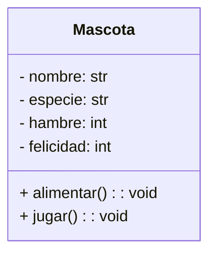

# :material-cube-outline: Clase 1

Con esta clase inicia el segundo semestre y un nuevo paradigma de programación: la **Programación Orientada a Objetos (POO)**.
Hasta ahora, los programas se organizaron mediante variables, listas, diccionarios y funciones sueltas. A partir de hoy, esos datos y esas funciones se agrupan dentro de una misma estructura: el **objeto**.

## ¿Por qué necesitamos objetos?

En el primer semestre, cuando un programa necesitaba representar una entidad con varias características (un equipo, un estudiante, un producto), la solución era un **diccionario**.

```python
tigres = {"nombre": "Tigres", "PJ": 0, "PG": 0, "PE": 0, "PP": 0, "Pts": 0}
halcones = {"nombre": "Halcones", "PJ": 0, "PG": 0, "PE": 0, "PP": 0, "Pts": 0}
```

Esto funciona, pero tiene varios problemas a medida que el programa crece:

- No hay ninguna garantía de que todos los diccionarios tengan las mismas claves. Un compañero podría escribir `"Pts"` y otro `"pts"`, y Python no avisaría del error hasta que el programa fallara.
- Las funciones que operan sobre esos diccionarios (`actualizar_stats()`, `ver_tabla()`) quedan **separadas** de los datos que procesan. Nada en el código deja claro que esas funciones "pertenecen" a un equipo.
- No existe una forma de definir un **comportamiento por defecto**: cada vez que se crea un equipo nuevo, hay que recordar inicializar manualmente todas las claves en cero.

!!! question "¿Qué pasaría si el programa manejara equipos, jugadores y árbitros al mismo tiempo?"

    Tendríamos diccionarios sueltos por todos lados, y funciones sueltas por todos lados, sin ninguna relación explícita entre ellos en el código.
    La POO resuelve esto agrupando **los datos y el comportamiento que les pertenece** en una sola unidad: la clase.

## ¿Qué es una clase? ¿Qué es un objeto?

Una **clase** es una plantilla o molde que describe qué **atributos** (datos) y qué **métodos** (comportamiento) va a tener un tipo de entidad.

Un **objeto** es una instancia concreta de esa clase: algo construido a partir del molde, con sus propios valores.

!!! tip "Analogía del molde de galletas"

    La clase es el **molde**: define la forma que van a tener todas las galletas.
    Cada **galleta** horneada con ese molde es un objeto: todas comparten la misma forma (los mismos atributos), pero cada una puede tener su propio color de decoración o su propio sabor (sus propios valores).

    Un mismo molde puede producir muchas galletas distintas entre sí, aunque todas tengan la misma estructura.

> En Python, todo lo que se ha usado hasta ahora es en realidad un objeto: un `str`, una `list`, un `dict`. Todos son instancias de clases ya construidas por el lenguaje (`str`, `list`, `dict`). A partir de hoy, se aprenderá a **definir clases propias**.

## Declaración de una clase

Una clase se declara con la palabra reservada `class`, seguida del nombre de la clase y dos puntos.

```python
class Mascota:
    pass
```

!!! note "Convención de nombres"

    Los nombres de clases se escriben en **PascalCase**: cada palabra inicia con mayúscula y sin guiones bajos (`Mascota`, `CuentaBancaria`, `LibroDigital`).
    Esto las distingue visualmente de las variables y funciones, que se escriben en `snake_case`.

La palabra `pass` es un marcador temporal que indica "esta clase no hace nada todavía". Se usa para que el código sea válido mientras se construye la clase por partes.

## El método `__init__` y el parámetro `self`

Para que una clase tenga datos propios, se necesita un **método constructor**: una función especial que se ejecuta automáticamente cada vez que se crea un objeto nuevo. En Python, ese método siempre se llama `__init__`.

```python
class Mascota:
    def __init__(self, nombre):
        self.nombre = nombre
```

Dos elementos son nuevos aquí:

**`self`** representa **al objeto que se está creando**. Es el primer parámetro de todo método de una clase, y Python lo pasa automáticamente; nunca se escribe explícitamente al llamar al método.

**`self.nombre = nombre`** guarda el valor recibido como parámetro dentro del objeto, como un **atributo**. Sin esta línea, el valor de `nombre` se perdería en cuanto terminara de ejecutarse `__init__`.

!!! warning "`self` no es una palabra reservada"

    `self` es solo una convención (muy fuertemente respetada por toda la comunidad de Python). Técnicamente podría llamarse de otra forma, pero **nunca se debe cambiar**: todo el código Python del mundo asume que el primer parámetro de un método se llama `self`.

## Atributos de instancia

Los **atributos de instancia** son los datos que pertenecen a cada objeto individual. Se definen dentro de `__init__` usando `self.nombre_del_atributo = valor`.

Una clase puede tener varios atributos, algunos recibidos como parámetros y otros con un valor inicial fijo:

```python
class Mascota:
    def __init__(self, nombre, especie):
        self.nombre = nombre        # (1)!
        self.especie = especie      # (2)!
        self.hambre = 5             # (3)!
        self.felicidad = 5          # (4)!
```

1. Atributo recibido como parámetro: cada mascota tiene su propio nombre.
2. Atributo recibido como parámetro: cada mascota tiene su propia especie.
3. Atributo con valor inicial fijo: toda mascota nueva empieza con hambre en 5.
4. Atributo con valor inicial fijo: toda mascota nueva empieza con felicidad en 5.

!!! abstract "Cada objeto tiene su propia copia de los atributos"

    Aunque dos mascotas se creen a partir de la misma clase, sus atributos son **completamente independientes**. Cambiar el `hambre` de una mascota no afecta a ninguna otra.

## Creación de objetos (instanciación)

Crear un objeto a partir de una clase se llama **instanciar**. Se hace escribiendo el nombre de la clase seguido de paréntesis, con los argumentos que pida `__init__` (sin incluir `self`, que Python coloca automáticamente).

```python
class Mascota:
    def __init__(self, nombre, especie):
        self.nombre = nombre
        self.especie = especie
        self.hambre = 5
        self.felicidad = 5

rex = Mascota("Rex", "perro")         # (1)!
duquesa = Mascota("Duquesa", "gato")  # (2)!

print(rex.nombre)                     # (3)!
print(duquesa.nombre)                 # (4)!
```

1. Crea un objeto `Mascota` y lo guarda en la variable `rex`.
2. Crea un segundo objeto `Mascota`, totalmente independiente del primero.
3. `Rex`
4. `Duquesa`

Cada objeto se guarda en una variable distinta (`rex`, `duquesa`), y cada uno mantiene sus propios valores de `nombre`, `especie`, `hambre` y `felicidad`.

=== "Acceso a atributos"

    Para leer el valor de un atributo, se usa la notación `objeto.atributo`.

    ```python
    print(rex.especie)     # (1)!
    print(duquesa.hambre)  # (2)!
    ```

    1. `perro`
    2. `5`

=== "Modificación de atributos"

    Un atributo también puede modificarse directamente desde fuera de la clase.

    ```python
    rex.hambre = 8

    print(rex.hambre)      # (1)!
    print(duquesa.hambre)  # (2)!
    ```

    1. `8`
    2. `5` — duquesa no se vio afectada.

!!! tip "Comprobar que son objetos distintos con `id()`"

    La función integrada `id()` retorna un identificador único de un objeto en memoria. Sirve para comprobar, sin dudas, que dos variables apuntan a objetos completamente independientes.

    ```python
    print(id(rex) != id(duquesa))  # (1)!
    ```

    1. `True`: son dos objetos distintos, aunque provengan de la misma clase.

## Métodos de instancia

Un **método de instancia** es una función definida dentro de una clase, que opera sobre los atributos del objeto mediante `self`. A diferencia de una función suelta, un método siempre "sabe" a qué objeto pertenece.

```python
class Mascota:
    def __init__(self, nombre, especie):
        self.nombre = nombre
        self.especie = especie
        self.hambre = 5
        self.felicidad = 5

    def alimentar(self):
        self.hambre -= 1                                      # (1)!
        if self.hambre < 0:
            self.hambre = 0
        print(f"{self.nombre} fue alimentado. Hambre: {self.hambre}")

    def jugar(self):
        self.felicidad += 1                                   # (2)!
        self.hambre += 1
        print(f"{self.nombre} jugó. Felicidad: {self.felicidad}")
```

1. `alimentar()` reduce el hambre del objeto que llama al método, sin afectar a otras mascotas.
2. `jugar()` aumenta la felicidad, pero también el hambre: jugar cansa.

Un método se invoca con la misma notación que un atributo, pero con paréntesis al final:

```python
rex = Mascota("Rex", "perro")

rex.alimentar()   # (1)!
rex.jugar()       # (2)!
```

1. `Rex fue alimentado. Hambre: 4`
2. `Rex jugó. Felicidad: 6`

!!! note "¿Dónde está el `self` al llamar al método?"

    Al escribir `rex.alimentar()`, Python traduce internamente esa llamada a `Mascota.alimentar(rex)`.
    Es decir, `rex` se pasa automáticamente como `self`. Por eso nunca se escribe `rex.alimentar(rex)`.

### Diagrama de la clase `Mascota`

El siguiente diagrama resume, de forma visual, los atributos y métodos que se acaban de definir para la clase `Mascota`. El signo `-` indica que el atributo pertenece a cada instancia; el signo `+` indica que el método puede invocarse desde fuera de la clase.



!!! question "Antes de continuar"

    1. Si se crean tres mascotas distintas, ¿cuántas copias de `hambre` existen en memoria?
    2. ¿Qué pasaría si `alimentar()` no recibiera `self` como primer parámetro?
    3. ¿Por qué `hambre` y `felicidad` no se reciben como parámetros de `__init__`?

## Métodos que reciben parámetros adicionales

Un método puede recibir, además de `self`, otros parámetros normales.

```python
class CuentaBancaria:
    def __init__(self, titular, saldo_inicial):
        self.titular = titular
        self.saldo = saldo_inicial

    def depositar(self, monto):
        self.saldo += monto
        print(f"Se depositaron {monto}. Saldo actual: {self.saldo}")

    def retirar(self, monto):
        if monto > self.saldo:
            print("Fondos insuficientes.")
            return
        self.saldo -= monto
        print(f"Se retiraron {monto}. Saldo actual: {self.saldo}")
```

```python
cuenta = CuentaBancaria("Ana", 1000)

cuenta.depositar(500)   # (1)!
cuenta.retirar(2000)    # (2)!
cuenta.retirar(300)     # (3)!
```

1. `Se depositaron 500. Saldo actual: 1500`
2. `Fondos insuficientes.`
3. `Se retiraron 300. Saldo actual: 1200`

!!! danger "No confundir `self` con los demás parámetros"

    En `def depositar(self, monto)`, `self` siempre se refiere al objeto (`cuenta`), y `monto` es el valor que se escribe explícitamente al llamar al método: `cuenta.depositar(500)`.
    El error más común al empezar con POO es olvidar `self` en la definición del método.

## Métodos que consultan vs. métodos que mutan

No todos los métodos hacen lo mismo con el estado del objeto. Es útil distinguir entre dos tipos:

Un método **consultor** lee los atributos del objeto y retorna un resultado, sin cambiar ningún valor. Un método **mutador** modifica uno o más atributos del objeto, y normalmente no retorna nada útil.

```python
class Rectangulo:
    def __init__(self, base, altura):
        self.base = base
        self.altura = altura

    def area(self):
        return self.base * self.altura      # (1)!

    def escalar(self, factor):
        self.base *= factor                 # (2)!
        self.altura *= factor
```

1. `area()` es un **consultor**: solo lee `base` y `altura`, y retorna un resultado. No modifica el objeto.
2. `escalar()` es un **mutador**: cambia el valor de `base` y `altura` del objeto sobre el que se invoca.

=== "Uso del consultor"

    ```python
    r = Rectangulo(3, 4)

    print(r.area())     # (1)!
    print(r.base)       # (2)!
    ```

    1. `12`
    2. `3` — consultar el área no altera la base del rectángulo.

=== "Uso del mutador"

    ```python
    r = Rectangulo(3, 4)

    r.escalar(2)

    print(r.base, r.altura)  # (1)!
    ```

    1. `6 8` — escalar sí modifica los atributos del objeto.

!!! tip "¿Por qué separar estos dos tipos?"

    Un método que dice llamarse `area()` pero que además modifica los atributos del rectángulo sería confuso y propenso a errores.
    Mantener claro qué métodos solo **consultan** y cuáles **mutan** hace que el código sea más predecible.

## Resumen

| Concepto | Definición |
| --- | --- |
| Clase | Plantilla que define qué atributos y métodos tendrán sus objetos. |
| Objeto | Una instancia concreta de una clase, con sus propios valores. |
| Atributo | Variable que almacena un dato dentro de un objeto. |
| Método | Función definida dentro de una clase, que opera sobre el estado del objeto mediante `self`. |
| `__init__` | Método especial que se ejecuta al crear un objeto; inicializa sus atributos. |
| `self` | Referencia al objeto sobre el que se invocó el método. |

## Ejercicios prácticos

### 1. Clase `Libro`

=== "Enunciado"

    Defina una clase `Libro` con los siguientes atributos, recibidos en `__init__`:

    - `titulo`
    - `autor`
    - `paginas_totales`
    - `pagina_actual`, que siempre inicia en `0` (no se recibe como parámetro).

    Agregue un método `leer(cantidad)` que aumente `pagina_actual` en `cantidad` páginas, sin superar `paginas_totales`. Agregue también un método `progreso()` que imprima el porcentaje de lectura completado, con un decimal.

=== "Solución"

    ```python
    class Libro:
        def __init__(self, titulo, autor, paginas_totales):
            self.titulo = titulo
            self.autor = autor
            self.paginas_totales = paginas_totales
            self.pagina_actual = 0

        def leer(self, cantidad):
            self.pagina_actual += cantidad
            if self.pagina_actual > self.paginas_totales:  # (1)!
                self.pagina_actual = self.paginas_totales
            print(f"{self.titulo}: página {self.pagina_actual} de {self.paginas_totales}")

        def progreso(self):
            porcentaje = (self.pagina_actual / self.paginas_totales) * 100  # (2)!
            print(f"Progreso de '{self.titulo}': {porcentaje:.1f}%")

    libro = Libro("Cien años de soledad", "Gabriel García Márquez", 471)
    libro.leer(120)
    libro.progreso()
    libro.leer(400)
    libro.progreso()
    ```

    1. Evita que `pagina_actual` supere el total de páginas del libro.
    2. El progreso se calcula como página actual entre páginas totales, multiplicado por 100.

    !!! example "Ejemplo de ejecución"

        ```
        Cien años de soledad: página 120 de 471
        Progreso de 'Cien años de soledad': 25.5%
        Cien años de soledad: página 471 de 471
        Progreso de 'Cien años de soledad': 100.0%
        ```

---

### 2. Clase `Termometro`

=== "Enunciado"

    Defina una clase `Termometro` con un atributo `temperatura`, que inicia en `0.0`. Agregue tres métodos:

    - `marcar(valor)`: fija la temperatura actual al valor recibido.
    - `a_fahrenheit()`: retorna la temperatura actual convertida a Fahrenheit, usando la fórmula `F = C * 9/5 + 32`.
    - `estado()`: imprime `"Congelamiento"` si la temperatura es menor o igual a 0, `"Templado"` si está entre 0 y 30, o `"Calor extremo"` si es mayor a 30.

=== "Solución"

    ```python
    class Termometro:
        def __init__(self):
            self.temperatura = 0.0

        def marcar(self, valor):
            self.temperatura = valor

        def a_fahrenheit(self):
            return self.temperatura * 9 / 5 + 32  # (1)!

        def estado(self):
            if self.temperatura <= 0:
                print("Congelamiento")
            elif self.temperatura <= 30:
                print("Templado")
            else:
                print("Calor extremo")

    sensor = Termometro()
    sensor.marcar(22.5)
    print(f"{sensor.temperatura}°C equivalen a {sensor.a_fahrenheit():.1f}°F")  # (2)!
    sensor.estado()
    ```

    1. `a_fahrenheit()` no imprime nada: **retorna** un valor para que quien llame al método decida qué hacer con él.
    2. Como el método retorna un valor, puede usarse directamente dentro de un f-string.

    !!! example "Ejemplo de ejecución"

        ```
        22.5°C equivalen a 72.5°F
        Templado
        ```

---

### 3. Clase `Vehiculo`

=== "Enunciado"

    Defina una clase `Vehiculo` con atributos `placa`, `modelo` y `kilometraje` (inicia en `0`). Agregue un método `recorrer(km)` que aumente el kilometraje, y un método `info()` que imprima los datos del vehículo en una sola línea.

    Cree **tres objetos** distintos de la clase y verifique que cada uno mantiene su propio kilometraje.

=== "Solución"

    ```python
    class Vehiculo:
        def __init__(self, placa, modelo):
            self.placa = placa
            self.modelo = modelo
            self.kilometraje = 0

        def recorrer(self, km):
            self.kilometraje += km

        def info(self):
            print(f"{self.placa} — {self.modelo} — {self.kilometraje} km")

    auto1 = Vehiculo("CCP-001", "Sedán")
    auto2 = Vehiculo("CCP-002", "Hatchback")
    auto3 = Vehiculo("CCP-003", "Pickup")

    auto1.recorrer(150)
    auto2.recorrer(40)

    auto1.info()   # (1)!
    auto2.info()   # (2)!
    auto3.info()   # (3)!
    ```

    1. `CCP-001 — Sedán — 150 km`
    2. `CCP-002 — Hatchback — 40 km`
    3. `CCP-003 — Pickup — 0 km` — nunca recorrió distancia, así que su kilometraje quedó en su valor inicial.

    !!! example "Ejemplo de ejecución"

        ```
        CCP-001 — Sedán — 150 km
        CCP-002 — Hatchback — 40 km
        CCP-003 — Pickup — 0 km
        ```

## Ejercicio integrador

### Agencia de alquiler de vehículos

#### Enunciado

Desarrolle un programa que administre la flota de una agencia de alquiler de vehículos, usando una clase `Vehiculo` y un menú principal.

**La clase `Vehiculo` debe tener:**

| Atributo | Descripción |
| --- | --- |
| `placa` | Identificador único del vehículo |
| `modelo` | Modelo del vehículo |
| `disponible` | `True` o `False`; inicia en `True` |
| `kilometraje` | Inicia en `0` |

**Métodos de `Vehiculo`:**

| Método | Descripción |
| --- | --- |
| `alquilar()` | Marca el vehículo como no disponible |
| `devolver(km_recorridos)` | Marca el vehículo como disponible y suma los km recorridos al kilometraje |
| `info()` | Retorna un string con los datos del vehículo, incluyendo su disponibilidad |

**Menú principal:**

```
=== AGENCIA DE ALQUILER ===
1. Registrar vehículo
2. Alquilar vehículo
3. Devolver vehículo
4. Ver flota completa
5. Salir
```

**Requisitos:**

1. La opción 1 crea un objeto `Vehiculo` nuevo y lo agrega a una lista que representa la flota. No se puede registrar dos veces la misma placa.
2. La opción 2 solicita una placa. Si el vehículo existe y está disponible, se alquila. Si no existe o ya está alquilado, se muestra un mensaje de error.
3. La opción 3 solicita una placa y los kilómetros recorridos durante el alquiler. Si el vehículo existe y está alquilado, se marca como disponible y se actualiza su kilometraje.
4. La opción 4 muestra la información de todos los vehículos registrados, usando el método `info()` de cada uno.
5. Validar la entrada de los kilómetros con `try-except` para manejar valores no numéricos.

#### Solución

##### Paso 1: Declarar la clase `Vehiculo`

```python
class Vehiculo:
    def __init__(self, placa, modelo):
        self.placa = placa
        self.modelo = modelo
        self.disponible = True
        self.kilometraje = 0

    def alquilar(self):
        self.disponible = False

    def devolver(self, km_recorridos):
        self.disponible = True
        self.kilometraje += km_recorridos

    def info(self):
        estado = "Disponible" if self.disponible else "Alquilado"  # (1)!
        return f"{self.placa} | {self.modelo} | {estado} | {self.kilometraje} km"
```

1. `info()` no imprime: retorna el string para que quien la llame decida cómo mostrarlo.

##### Paso 2: Buscar un vehículo en la flota por placa

La flota se representa como una lista de objetos `Vehiculo`. Para operar sobre un vehículo específico, primero hay que encontrarlo dentro de esa lista.

```python
def buscar_vehiculo(flota, placa):
    for vehiculo in flota:
        if vehiculo.placa == placa:
            return vehiculo
    return None  # (1)!
```

1. Si ningún vehículo coincide con la placa buscada, la función retorna `None` para indicar que no se encontró.

##### Paso 3: Implementar cada opción del menú

```python
def registrar_vehiculo(flota):
    placa = input("Placa: ").strip().upper()

    if buscar_vehiculo(flota, placa) is not None:
        print(f"La placa '{placa}' ya está registrada.")
        return

    modelo = input("Modelo: ").strip()
    flota.append(Vehiculo(placa, modelo))
    print(f"Vehículo '{placa}' registrado.")

def alquilar_vehiculo(flota):
    placa = input("Placa a alquilar: ").strip().upper()
    vehiculo = buscar_vehiculo(flota, placa)

    if vehiculo is None:
        print(f"No existe un vehículo con placa '{placa}'.")
        return
    if not vehiculo.disponible:
        print(f"El vehículo '{placa}' ya está alquilado.")
        return

    vehiculo.alquilar()
    print(f"Vehículo '{placa}' alquilado.")

def devolver_vehiculo(flota):
    placa = input("Placa a devolver: ").strip().upper()
    vehiculo = buscar_vehiculo(flota, placa)

    if vehiculo is None:
        print(f"No existe un vehículo con placa '{placa}'.")
        return
    if vehiculo.disponible:
        print(f"El vehículo '{placa}' no está alquilado.")
        return

    try:
        km = float(input("Kilómetros recorridos: "))
    except ValueError:
        print("El valor de kilómetros debe ser numérico.")
        return

    vehiculo.devolver(km)
    print(f"Vehículo '{placa}' devuelto. Kilometraje total: {vehiculo.kilometraje}")

def ver_flota(flota):
    if not flota:
        print("No hay vehículos registrados.")
        return

    print("\n--- Flota de la agencia ---")
    for vehiculo in flota:
        print(vehiculo.info())
```

##### Programa completo

```python
class Vehiculo:
    def __init__(self, placa, modelo):
        self.placa = placa
        self.modelo = modelo
        self.disponible = True
        self.kilometraje = 0

    def alquilar(self):
        self.disponible = False

    def devolver(self, km_recorridos):
        self.disponible = True
        self.kilometraje += km_recorridos

    def info(self):
        estado = "Disponible" if self.disponible else "Alquilado"
        return f"{self.placa} | {self.modelo} | {estado} | {self.kilometraje} km"

def buscar_vehiculo(flota, placa):
    for vehiculo in flota:
        if vehiculo.placa == placa:
            return vehiculo
    return None

def registrar_vehiculo(flota):
    placa = input("Placa: ").strip().upper()

    if buscar_vehiculo(flota, placa) is not None:
        print(f"La placa '{placa}' ya está registrada.")
        return

    modelo = input("Modelo: ").strip()
    flota.append(Vehiculo(placa, modelo))
    print(f"Vehículo '{placa}' registrado.")

def alquilar_vehiculo(flota):
    placa = input("Placa a alquilar: ").strip().upper()
    vehiculo = buscar_vehiculo(flota, placa)

    if vehiculo is None:
        print(f"No existe un vehículo con placa '{placa}'.")
        return
    if not vehiculo.disponible:
        print(f"El vehículo '{placa}' ya está alquilado.")
        return

    vehiculo.alquilar()
    print(f"Vehículo '{placa}' alquilado.")

def devolver_vehiculo(flota):
    placa = input("Placa a devolver: ").strip().upper()
    vehiculo = buscar_vehiculo(flota, placa)

    if vehiculo is None:
        print(f"No existe un vehículo con placa '{placa}'.")
        return
    if vehiculo.disponible:
        print(f"El vehículo '{placa}' no está alquilado.")
        return

    try:
        km = float(input("Kilómetros recorridos: "))
    except ValueError:
        print("El valor de kilómetros debe ser numérico.")
        return

    vehiculo.devolver(km)
    print(f"Vehículo '{placa}' devuelto. Kilometraje total: {vehiculo.kilometraje}")

def ver_flota(flota):
    if not flota:
        print("No hay vehículos registrados.")
        return

    print("\n--- Flota de la agencia ---")
    for vehiculo in flota:
        print(vehiculo.info())

flota = []

while True:
    print("\n=== AGENCIA DE ALQUILER ===")
    print("1. Registrar vehículo")
    print("2. Alquilar vehículo")
    print("3. Devolver vehículo")
    print("4. Ver flota completa")
    print("5. Salir")

    opcion = input("Opción: ")

    if opcion == "1":
        registrar_vehiculo(flota)
    elif opcion == "2":
        alquilar_vehiculo(flota)
    elif opcion == "3":
        devolver_vehiculo(flota)
    elif opcion == "4":
        ver_flota(flota)
    elif opcion == "5":
        print("¡Hasta la próxima!")
        break
    else:
        print("Opción inválida.")
```

!!! example "Ejemplos de ejecución"

    === "Registro y alquiler"
        ```
        === AGENCIA DE ALQUILER ===
        1. Registrar vehículo
        ...
        Opción: 1
        Placa: ccp-001
        Modelo: Sedán
        Vehículo 'CCP-001' registrado.

        Opción: 2
        Placa a alquilar: ccp-001
        Vehículo 'CCP-001' alquilado.
        ```
    === "Devolución"
        ```
        Opción: 3
        Placa a devolver: ccp-001
        Kilómetros recorridos: 180
        Vehículo 'CCP-001' devuelto. Kilometraje total: 180.0
        ```
    === "Ver flota"
        ```
        Opción: 4

        --- Flota de la agencia ---
        CCP-001 | Sedán | Disponible | 180.0 km
        ```
    === "Placa no registrada"
        ```
        Opción: 2
        Placa a alquilar: xyz-999
        No existe un vehículo con placa 'XYZ-999'.
        ```
    === "Kilómetros inválidos"
        ```
        Opción: 3
        Placa a devolver: ccp-001
        Kilómetros recorridos: doscientos
        El valor de kilómetros debe ser numérico.
        ```
