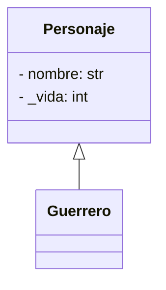
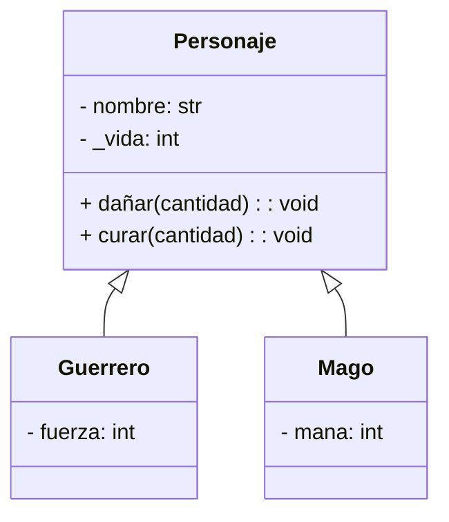
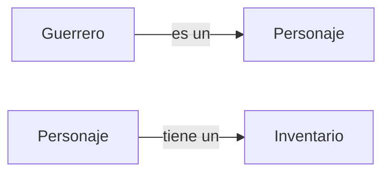

# :material-shield-lock-outline: Clase 2

La clase anterior mostró cómo agrupar datos y comportamiento dentro de una clase.
Ahora se agregan dos herramientas que hacen ese diseño más seguro y más reutilizable.
El **encapsulamiento** protege los atributos de un objeto contra modificaciones inválidas, y la **herencia** permite construir clases nuevas a partir de clases ya existentes sin repetir código.

## Encapsulamiento de datos

### ¿Por qué proteger los atributos de un objeto?

En la clase anterior, la clase `CuentaBancaria` guardaba el saldo en un atributo público, `self.saldo`.
Eso significa que cualquier parte del programa puede modificar `saldo` directamente, sin pasar por ningún método.

```python
cuenta = CuentaBancaria("Ana", 1000)
cuenta.saldo = -500
```

Nada impide esa línea y el objeto queda en un **estado inválido** (un saldo negativo) sin que Python avise del problema.
El error no está en la clase, sino en que el atributo quedó completamente abierto a cualquier modificación externa.

!!! question "¿Qué pasaría si diez funciones distintas del programa modificaran `saldo` directamente?"

    Cada una tendría que repetir su propia validación antes de modificar el atributo.
    Si alguna la olvida, el objeto puede quedar en un estado incorrecto sin que el resto del programa se entere.
    El encapsulamiento resuelve esto, la validación se escribe **una sola vez**, dentro de la clase, y todo el programa la reutiliza.

### Convención de atributo protegido con guion bajo

Python no tiene una forma de declarar un atributo verdaderamente privado.
En su lugar, se usa una **convención**, donde los atributos que no deben modificarse directamente desde fuera de la clase se nombran con un guion bajo al inicio, `_atributo`.

```python
class Jugador:
    def __init__(self, nombre):
        self.nombre = nombre
        self._vida = 100
```

### Métodos _getter_ y _setter_

Para que un atributo protegido pueda leerse y modificarse de forma controlada, la clase ofrece métodos específicos.
Un **getter** consulta el valor y un **setter** lo modifica validando que el nuevo valor sea correcto.

```python
class Jugador:
    def __init__(self, nombre):
        self.nombre = nombre
        self._vida = 100

    def obtener_vida(self):
        return self._vida          # (1)!

    def dañar(self, cantidad):
        self._vida -= cantidad
        if self._vida < 0:
            self._vida = 0         # (2)!

    def curar(self, cantidad):
        self._vida += cantidad
        if self._vida > 100:
            self._vida = 100       # (3)!
```

1. `obtener_vida()` es el getter, solo lee `_vida` y la retorna, sin modificarla.
2. `dañar()` es un setter especializado que resta vida, pero nunca deja que baje de `0`.
3. `curar()` es otro setter especializado que suma vida, pero nunca deja que suba de `100`.

```python
hero = Jugador("Hero")

hero.dañar(30)
print(hero.obtener_vida())   # (1)!

hero.dañar(90)
print(hero.obtener_vida())   # (2)!
```

1. `70`
2. `0`, aunque el daño fue de `90`, la vida nunca queda negativa por la validación dentro de `dañar()`.

!!! warning "El atributo sigue siendo accesible"

    Aun con `obtener_vida()`, `dañar()` y `curar()`, nada impide escribir `hero._vida = -50`.
    La diferencia es que **el código correcto del programa nunca necesita hacerlo**, toda modificación pasa por métodos que garantizan un valor válido.

## Herencia y reutilización de código

### ¿Por qué reutilizar código entre clases parecidas?

Un juego necesita representar distintos tipos de personajes, como guerreros, magos o arqueros.
Todos comparten atributos como `nombre` y `_vida`, y comportamientos como `dañar()` o `curar()`.
Escribir una clase completa y separada para cada tipo obligaría a copiar ese código una y otra vez.

```python
class Guerrero:
    def __init__(self, nombre):
        self.nombre = nombre
        self._vida = 100
    # ... dañar(), curar(), ...

class Mago:
    def __init__(self, nombre):
        self.nombre = nombre
        self._vida = 100
    # ... dañar(), curar(), ...
```

Si más adelante se corrige un error en `dañar()`, habría que recordar corregirlo en **todas** las copias.
La **herencia** evita esto porque se define una clase base con lo que todos los personajes comparten, y las clases específicas heredan de ella.

### Sintaxis de herencia con `class Hija(Padre):`

Una clase hereda de otra escribiendo el nombre de la clase base entre paréntesis.

```python
class Personaje:
    def __init__(self, nombre):
        self.nombre = nombre
        self._vida = 100

class Guerrero(Personaje):
    pass
```

`Guerrero` es una **clase hija** (o subclase) de `Personaje`, que es la **clase padre** (o superclase).
Aunque `Guerrero` no define nada propio todavía, ya tiene acceso a todo lo que `Personaje` define, el atributo `nombre`, el atributo `_vida` y cualquier método que `Personaje` tenga.

```python
guerrero = Guerrero("Thorin")
print(guerrero.nombre)   # (1)!
```

1. `Thorin`, `Guerrero` no definió `__init__`, así que usa el de `Personaje`, heredado automáticamente.



### El constructor de la clase hija

Cuando la clase hija necesita atributos **propios**, además de los heredados, debe definir su propio `__init__`.
Para no repetir la inicialización de los atributos del padre, se llama a `super().__init__()`.

```python
class Personaje:
    def __init__(self, nombre):
        self.nombre = nombre
        self._vida = 100

class Guerrero(Personaje):
    def __init__(self, nombre, fuerza):
        super().__init__(nombre)   # (1)!
        self.fuerza = fuerza       # (2)!
```

1. `super().__init__(nombre)` ejecuta el `__init__` de `Personaje`, que ya sabe inicializar `nombre` y `_vida`.
   No hace falta repetir esas líneas.
2. `fuerza` es un atributo que solo tiene `Guerrero`, así que se inicializa aparte, después de llamar a `super()`.

```python
thorin = Guerrero("Thorin", fuerza=15)

print(thorin.nombre)      # (1)!
print(thorin._vida)       # (2)!
print(thorin.fuerza)      # (3)!
```

1. `Thorin`, inicializado por `super().__init__()`.
2. `100`, también inicializado por `super().__init__()`.
3. `15`, inicializado directamente en el `__init__` de `Guerrero`.

!!! danger "`super().__init__()` debe llamarse antes de usar los atributos heredados"

    Si el `__init__` de `Guerrero` intentara usar `self._vida` **antes** de llamar a `super().__init__(nombre)`, el programa fallaría, ese atributo todavía no existiría en el objeto.

### _Override_ de métodos

Una clase hija puede redefinir un método heredado para darle un comportamiento distinto.
Esto se llama **sobrescritura**, y ocurre automáticamente al declarar en la hija un método con el mismo nombre que uno del padre.

```python
class Personaje:
    def __init__(self, nombre):
        self.nombre = nombre
        self._vida = 100

    def presentarse(self):
        print(f"{self.nombre} es un personaje del juego.")

class Mago(Personaje):
    def presentarse(self):
        print(f"{self.nombre} es un mago que domina la magia arcana.")   # (1)!
```

1. `Mago` define su propia versión de `presentarse()`.
   Cuando se llama sobre un objeto `Mago`, Python usa **esta** versión, no la de `Personaje`.

```python
generico = Personaje("Extra")
gandalf = Mago("Gandalf")

generico.presentarse()   # (1)!
gandalf.presentarse()    # (2)!
```

1. `Extra es un personaje del juego.`
2. `Gandalf es un mago que domina la magia arcana.`

### Extensión de métodos con `super().metodo()`

A veces no se quiere **reemplazar** por completo el comportamiento heredado, sino **agregarle** algo más.
Para eso, el método sobrescrito puede llamar a `super().metodo()` para ejecutar primero la versión del padre, y luego añadir comportamiento adicional.

```python
class Personaje:
    def dañar(self, cantidad):
        self._vida -= cantidad
        if self._vida < 0:
            self._vida = 0

class Guerrero(Personaje):
    def dañar(self, cantidad):
        cantidad_reducida = cantidad * 0.8         # (1)!
        super().dañar(cantidad_reducida)           # (2)!
```

1. El `Guerrero` tiene una armadura que reduce el daño recibido en un 20%.
2. `super().dañar(...)` reutiliza la lógica original de `Personaje` (restar vida y evitar valores negativos), aplicada sobre el daño ya reducido.

!!! tip "`super().metodo()` evita duplicar la lógica del padre"

    Sin `super()`, `Guerrero.dañar()` tendría que repetir la resta y la validación de `_vida < 0`.
    Con `super()`, esa lógica se escribe una sola vez en `Personaje`, y `Guerrero` solo agrega lo que le es propio.

### `isinstance()` e identidad de clase

La función integrada `isinstance()` permite verificar si un objeto pertenece a una clase, **incluyendo** las clases de las que hereda.

```python
thorin = Guerrero("Thorin", fuerza=15)

print(isinstance(thorin, Guerrero))     # (1)!
print(isinstance(thorin, Personaje))    # (2)!
```

1. `True`, `thorin` es un objeto `Guerrero`.
2. `True`, `Guerrero` hereda de `Personaje`, así que todo objeto `Guerrero` **también es** un `Personaje`.



### Herencia múltiple y MRO (_Method Resolution Order_)

Hasta ahora cada clase hija heredó de una sola clase padre.
Python también permite que una clase herede de **varias clases a la vez**, escribiendo todas entre paréntesis.
Cuando dos o más padres definen un método con el mismo nombre, Python necesita una regla clara para decidir cuál versión usar.
Esa regla se llama **MRO** (_Method Resolution Order_), y define el orden exacto en el que Python busca un atributo o método dentro de la jerarquía de clases.

```python
class Personaje:
    def hablar(self):
        print("Soy un personaje genérico.")

class ConEscudo(Personaje):
    def hablar(self):
        print("Uso un escudo para defenderme.")
        super().hablar()              # (1)!

class ConMagia(Personaje):
    def hablar(self):
        print("Domino hechizos arcanos.")
        super().hablar()              # (2)!

class Paladin(ConEscudo, ConMagia):   # (3)!
    def hablar(self):
        print("Soy un paladín.")
        super().hablar()              # (4)!

arthas = Paladin()
arthas.hablar()

print(Paladin.__mro__)
```

1. `ConEscudo.hablar()` no reemplaza el comportamiento del padre, lo extiende llamando a `super()`.
2. `ConMagia.hablar()` hace lo mismo, extiende en lugar de reemplazar.
3. `Paladin` hereda de **dos** clases, `ConEscudo` y `ConMagia`. El orden en que se escriben importa, `ConEscudo` va primero.
4. `Paladin.hablar()` también extiende, en lugar de reemplazar, el comportamiento heredado.

```title="Salida"
Soy un paladín.
Uso un escudo para defenderme.
Domino hechizos arcanos.
Soy un personaje genérico.
(<class 'Paladin'>, <class 'ConEscudo'>, <class 'ConMagia'>, <class 'Personaje'>, <class 'object'>)
```

Cada `hablar()` de la cadena se ejecuta **una sola vez**, en el orden que marca el MRO.
`Paladin` habla primero, luego `ConEscudo`, luego `ConMagia`, y por último `Personaje`.

!!! abstract "¿Qué es el MRO?"

    El MRO es la ruta que sigue Python para buscar un método o atributo dentro de una jerarquía de clases.
    Se calcula automáticamente con un algoritmo llamado **C3 linearization**, que garantiza un orden consistente incluso con herencia múltiple.
    Se puede consultar en cualquier momento con `NombreClase.__mro__`.

#### Uso cooperativo o no cooperativo de `super()`

El ejemplo anterior funciona porque **cada clase de la cadena llama a `super()`**.
Si alguna clase intermedia no lo hace, la cadena se corta ahí y las clases que vienen después en el MRO nunca se ejecutan.

=== "Versión cooperativa"

    ```python
    class ConEscudo(Personaje):
        def hablar(self):
            print("Uso un escudo para defenderme.")
            super().hablar()     # (1)!

    class ConMagia(Personaje):
        def hablar(self):
            print("Domino hechizos arcanos.")
            super().hablar()
    ```

    1. Cada clase delega en la siguiente del MRO, así todas se ejecutan.

    ```title="Salida de Paladin().hablar()"
    Soy un paladín.
    Uso un escudo para defenderme.
    Domino hechizos arcanos.
    Soy un personaje genérico.
    ```

=== "Versión no cooperativa"

    ```python
    class ConEscudo(Personaje):
        def hablar(self):
            print("Uso un escudo para defenderme.")   # (1)!
    ```

    1. Esta versión no llama a `super()`, así que la cadena se corta aquí.

    ```title="Salida de Paladin().hablar()"
    Soy un paladín.
    Uso un escudo para defenderme.
    ```

    `ConMagia.hablar()` y `Personaje.hablar()` nunca se ejecutan, aunque el MRO de `Paladin` los incluya. El método que faltó llamar a `super()` rompió la cadena.

### Mixins

Un **mixin** es una clase pequeña, pensada para agregarle **una sola capacidad** a otra clase mediante herencia múltiple.

> A diferencia de `ConEscudo` o `ConMagia`, un mixin no representa un tipo de personaje por sí mismo, nadie crea un objeto solo de la clase mixin.

```python
class RegistrableMixin:
    def registrar_evento(self, evento):
        print(f"[LOG] {evento}")

class Personaje:
    def __init__(self, nombre):
        self.nombre = nombre
        self._vida = 100

class Guerrero(RegistrableMixin, Personaje):
    def atacar(self, objetivo):
        self.registrar_evento(f"{self.nombre} ataca a {objetivo.nombre}")   # (1)!
        objetivo._vida -= 10

thorin = Guerrero("Thorin")
gandalf = Personaje("Gandalf")

thorin.atacar(gandalf)
```

1. `Guerrero` usa `registrar_evento()`, definido en el mixin, como si fuera un método propio, aunque `Guerrero` no lo define ni lo hereda de `Personaje`.

```title="Salida"
[LOG] Thorin ataca a Gandalf
```

!!! tip "Convenciones al escribir mixins"

    Nombrar la clase terminando en `Mixin` ayuda a reconocerlas.
    Un buen mixin resuelve **una sola responsabilidad** (registrar eventos, serializar a texto, comparar objetos) y evita lógica de inicialización compleja, para poder combinarse con distintas clases sin generar conflictos.

### Composición frente a herencia

No todas las relaciones entre clases deben resolverse con herencia.
La herencia expresa una relación **"es un"**, `Guerrero` **es un** `Personaje`.
Cuando la relación real es **"tiene un"**, conviene usar **composición**, un objeto que guarda una referencia a otro objeto como atributo, en lugar de heredar de él.

```python
class Inventario:
    def __init__(self):
        self._items = []

    def agregar(self, item):
        self._items.append(item)

    def listar(self):
        return list(self._items)

class Personaje:
    def __init__(self, nombre):
        self.nombre = nombre
        self._vida = 100
        self.inventario = Inventario()   # (1)!
```

1. `Personaje` **tiene un** `Inventario`, no hereda de él. `Inventario` es un objeto independiente, guardado como atributo.

```python title="Ejemplo de uso"
thorin = Personaje("Thorin")
thorin.inventario.agregar("Espada")
thorin.inventario.agregar("Poción")

print(thorin.inventario.listar())   # (1)!
```

1. `['Espada', 'Poción']`



## Ejercicios prácticos

### 1. Clase `Estudiante`

=== "Enunciado"

    Defina una clase `Estudiante` con un atributo `nombre` y un atributo protegido `_nota`, que inicia en `0`.
    Agregue un método `asignar_nota(valor)` que solo modifique `_nota` si `valor` está entre `0` y `100`; en caso contrario, debe imprimir un mensaje de error.
    Agregue también un método `aprobado()` que retorne `True` si `_nota` es mayor o igual a `70`, o `False` en caso contrario.

=== "Solución"

    ```python
    class Estudiante:
        def __init__(self, nombre):
            self.nombre = nombre
            self._nota = 0

        def asignar_nota(self, valor):
            if valor < 0 or valor > 100:
                print("La nota debe estar entre 0 y 100.")
                return
            self._nota = valor

        def aprobado(self):
            return self._nota >= 70

    est = Estudiante("Camila")
    est.asignar_nota(85)
    print(est.aprobado())    # (1)!

    est.asignar_nota(150)    # (2)!
    print(est._nota)         # (3)!
    ```

    1. `True`
    2. `La nota debe estar entre 0 y 100.`, la nota inválida se rechaza y `_nota` no cambia.
    3. `85`, el valor sigue siendo el último válido, sin importar el intento fallido.

### 2. Herencia con sobrescritura entre `Animal` y `Perro`

=== "Enunciado"

    Defina una clase `Animal` con un atributo `nombre` y un método `sonido()` que imprima `"Hace un sonido."`.
    Defina una clase `Perro`, que herede de `Animal`, y sobrescriba `sonido()` para que imprima `"Ladra."`.
    No es necesario definir `__init__` en `Perro`.

=== "Solución"

    ```python
    class Animal:
        def __init__(self, nombre):
            self.nombre = nombre

        def sonido(self):
            print("Hace un sonido.")

    class Perro(Animal):
        def sonido(self):
            print("Ladra.")

    generico = Animal("Animal genérico")
    rex = Perro("Rex")

    generico.sonido()   # (1)!
    rex.sonido()         # (2)!
    ```

    1. `Hace un sonido.`
    2. `Ladra.`, `Perro` sobrescribe `sonido()`, así que usa su propia versión.

## Ejercicio integrador

### Enunciado

Desarrolle un programa que administre una arena de personajes para un videojuego, usando herencia, encapsulamiento y un menú principal.

**La clase `Personaje` (clase base) debe tener:**

| Atributo | Descripción                                                             |
| -------- | ----------------------------------------------------------------------- |
| `nombre` | Identificador único del personaje                                       |
| `_vida`  | Atributo protegido; inicia en `100`; nunca baja de `0` ni sube de `100` |

**Métodos de `Personaje`**

| Método             | Descripción                                                   |
| ------------------ | ------------------------------------------------------------- |
| `obtener_vida()`   | Getter, retorna el valor actual de `_vida`                    |
| `dañar(cantidad)`  | Setter, resta `cantidad` a `_vida`, sin bajar de `0`          |
| `curar(cantidad)`  | Setter, suma `cantidad` a `_vida`, sin subir de `100`         |
| `atacar(objetivo)` | Aplica `10` de daño al `objetivo`, usando su método `dañar()` |
| `info()`           | Retorna un string con los datos del personaje                 |

**La clase `Guerrero` hereda de `Personaje` y agrega:**

| Elemento           | Descripción                                                                                     |
| ------------------ | ----------------------------------------------------------------------------------------------- |
| Atributo `fuerza`  | Recibido en su `__init__`, propio de cada guerrero.                                             |
| `atacar(objetivo)` | Sobrescrito, aplica `10 + fuerza` de daño, reutilizando la lógica de `Personaje` con `super()`. |

**La clase `Mago` hereda de `Personaje` y agrega:**

| Elemento           | Descripción                                                                                                                                |
| ------------------ | ------------------------------------------------------------------------------------------------------------------------------------------ |
| Atributo `_mana`   | Protegido; inicia en `50` y nunca baja de `0`.                                                                                             |
| `atacar(objetivo)` | Sobrescrito, si `_mana` es mayor o igual a `20`, resta `20` a `_mana` y aplica `25` de daño; si no alcanza, imprime un mensaje y no ataca. |

**Menú principal**

```
=== ARENA DE PERSONAJES ===
1. Registrar personaje
2. Atacar
3. Curar personaje
4. Ver todos los personajes
5. Salir
```

**Requisitos**

1. La opción 1 solicita un nombre y un tipo (`guerrero` o `mago`), crea el objeto correspondiente y lo agrega a una lista de personajes registrados. No se puede registrar dos veces el mismo nombre.
2. La opción 2 solicita el nombre de un personaje atacante y el de un objetivo, y ejecuta `atacar()` del atacante sobre el objetivo.
   Debe validar que ambos nombres existan.
3. La opción 3 solicita un nombre y una cantidad de vida a curar, validando la cantidad con `try-except` para valores no numéricos.
4. La opción 4 muestra la información de todos los personajes registrados, usando `info()`.

### Solución

#### Paso 1: Declarar la clase base `Personaje`

```python
class Personaje:
    def __init__(self, nombre):
        self.nombre = nombre
        self._vida = 100

    def obtener_vida(self):
        return self._vida

    def dañar(self, cantidad):
        self._vida -= cantidad
        if self._vida < 0:
            self._vida = 0

    def curar(self, cantidad):
        self._vida += cantidad
        if self._vida > 100:
            self._vida = 100

    def atacar(self, objetivo):
        objetivo.dañar(10)
        print(f"{self.nombre} ataca a {objetivo.nombre}.")

    def info(self):
        return f"{self.nombre} | Vida: {self.obtener_vida()}"
```

#### Paso 2: Declarar las clases hijas con `super()`

```python
class Guerrero(Personaje):
    def __init__(self, nombre, fuerza):
        super().__init__(nombre)
        self.fuerza = fuerza

    def atacar(self, objetivo):
        objetivo.dañar(10 + self.fuerza)   # (1)!
        print(f"{self.nombre} ataca a {objetivo.nombre} con fuerza extra.")

    def info(self):
        return super().info() + f" | Fuerza: {self.fuerza}"   # (2)!

class Mago(Personaje):
    def __init__(self, nombre):
        super().__init__(nombre)
        self._mana = 50

    def atacar(self, objetivo):
        if self._mana < 20:
            print(f"{self.nombre} no tiene suficiente maná para atacar.")
            return
        self._mana -= 20
        objetivo.dañar(25)
        print(f"{self.nombre} lanza un hechizo sobre {objetivo.nombre}.")

    def info(self):
        return super().info() + f" | Maná: {self._mana}"
```

1. `Guerrero.atacar()` no llama a `super().atacar()` porque la fórmula de daño es distinta; en cambio reutiliza directamente `objetivo.dañar()`, igual que hace la versión del padre.
2. `Guerrero.info()` sí reutiliza `super().info()` para no repetir el formato de `nombre` y vida, y solo agrega su propio dato (`fuerza`).

#### Paso 3: Buscar un personaje por nombre

```python
def buscar_personaje(personajes, nombre):
    for personaje in personajes:
        if personaje.nombre == nombre:
            return personaje
    return None
```

#### Paso 4: Implementar cada opción del menú

```python
def registrar_personaje(personajes):
    nombre = input("Nombre: ").strip()

    if buscar_personaje(personajes, nombre) is not None:
        print(f"Ya existe un personaje llamado '{nombre}'.")
        return

    tipo = input("Tipo (guerrero/mago): ").strip().lower()

    if tipo == "guerrero":
        fuerza = int(input("Fuerza: "))
        personajes.append(Guerrero(nombre, fuerza))
    elif tipo == "mago":
        personajes.append(Mago(nombre))
    else:
        print("Tipo inválido.")
        return

    print(f"Personaje '{nombre}' registrado como {tipo}.")

def atacar_personaje(personajes):
    nombre_atacante = input("Atacante: ").strip()
    nombre_objetivo = input("Objetivo: ").strip()

    atacante = buscar_personaje(personajes, nombre_atacante)
    objetivo = buscar_personaje(personajes, nombre_objetivo)

    if atacante is None or objetivo is None:
        print("Alguno de los personajes no existe.")
        return

    atacante.atacar(objetivo)

def curar_personaje(personajes):
    nombre = input("Personaje a curar: ").strip()
    personaje = buscar_personaje(personajes, nombre)

    if personaje is None:
        print(f"No existe un personaje llamado '{nombre}'.")
        return

    try:
        cantidad = int(input("Cantidad a curar: "))
    except ValueError:
        print("La cantidad debe ser numérica.")
        return

    personaje.curar(cantidad)
    print(f"'{nombre}' fue curado. Vida actual: {personaje.obtener_vida()}")

def ver_personajes(personajes):
    if not personajes:
        print("No hay personajes registrados.")
        return

    print("\n--- Personajes de la arena ---")
    for personaje in personajes:
        print(personaje.info())
```

#### Programa completo

```python
class Personaje:
    def __init__(self, nombre):
        self.nombre = nombre
        self._vida = 100

    def obtener_vida(self):
        return self._vida

    def dañar(self, cantidad):
        self._vida -= cantidad
        if self._vida < 0:
            self._vida = 0

    def curar(self, cantidad):
        self._vida += cantidad
        if self._vida > 100:
            self._vida = 100

    def atacar(self, objetivo):
        objetivo.dañar(10)
        print(f"{self.nombre} ataca a {objetivo.nombre}.")

    def info(self):
        return f"{self.nombre} | Vida: {self.obtener_vida()}"

class Guerrero(Personaje):
    def __init__(self, nombre, fuerza):
        super().__init__(nombre)
        self.fuerza = fuerza

    def atacar(self, objetivo):
        objetivo.dañar(10 + self.fuerza)
        print(f"{self.nombre} ataca a {objetivo.nombre} con fuerza extra.")

    def info(self):
        return super().info() + f" | Fuerza: {self.fuerza}"

class Mago(Personaje):
    def __init__(self, nombre):
        super().__init__(nombre)
        self._mana = 50

    def atacar(self, objetivo):
        if self._mana < 20:
            print(f"{self.nombre} no tiene suficiente maná para atacar.")
            return
        self._mana -= 20
        objetivo.dañar(25)
        print(f"{self.nombre} lanza un hechizo sobre {objetivo.nombre}.")

    def info(self):
        return super().info() + f" | Maná: {self._mana}"

def buscar_personaje(personajes, nombre):
    for personaje in personajes:
        if personaje.nombre == nombre:
            return personaje
    return None

def registrar_personaje(personajes):
    nombre = input("Nombre: ").strip()

    if buscar_personaje(personajes, nombre) is not None:
        print(f"Ya existe un personaje llamado '{nombre}'.")
        return

    tipo = input("Tipo (guerrero/mago): ").strip().lower()

    if tipo == "guerrero":
        fuerza = int(input("Fuerza: "))
        personajes.append(Guerrero(nombre, fuerza))
    elif tipo == "mago":
        personajes.append(Mago(nombre))
    else:
        print("Tipo inválido.")
        return

    print(f"Personaje '{nombre}' registrado como {tipo}.")

def atacar_personaje(personajes):
    nombre_atacante = input("Atacante: ").strip()
    nombre_objetivo = input("Objetivo: ").strip()

    atacante = buscar_personaje(personajes, nombre_atacante)
    objetivo = buscar_personaje(personajes, nombre_objetivo)

    if atacante is None or objetivo is None:
        print("Alguno de los personajes no existe.")
        return

    atacante.atacar(objetivo)

def curar_personaje(personajes):
    nombre = input("Personaje a curar: ").strip()
    personaje = buscar_personaje(personajes, nombre)

    if personaje is None:
        print(f"No existe un personaje llamado '{nombre}'.")
        return

    try:
        cantidad = int(input("Cantidad a curar: "))
    except ValueError:
        print("La cantidad debe ser numérica.")
        return

    personaje.curar(cantidad)
    print(f"'{nombre}' fue curado. Vida actual: {personaje.obtener_vida()}")

def ver_personajes(personajes):
    if not personajes:
        print("No hay personajes registrados.")
        return

    print("\n--- Personajes de la arena ---")
    for personaje in personajes:
        print(personaje.info())

personajes = []

while True:
    print("\n=== ARENA DE PERSONAJES ===")
    print("1. Registrar personaje")
    print("2. Atacar")
    print("3. Curar personaje")
    print("4. Ver todos los personajes")
    print("5. Salir")

    opcion = input("Opción: ")

    if opcion == "1":
        registrar_personaje(personajes)
    elif opcion == "2":
        atacar_personaje(personajes)
    elif opcion == "3":
        curar_personaje(personajes)
    elif opcion == "4":
        ver_personajes(personajes)
    elif opcion == "5":
        print("¡Hasta la próxima batalla!")
        break
    else:
        print("Opción inválida.")
```

!!! example "Ejemplos de ejecución"

    === "Registro"
        ```
        === ARENA DE PERSONAJES ===
        1. Registrar personaje
        ...
        Opción: 1
        Nombre: Thorin
        Tipo (guerrero/mago): guerrero
        Fuerza: 15
        Personaje 'Thorin' registrado como guerrero.

        Opción: 1
        Nombre: Gandalf
        Tipo (guerrero/mago): mago
        Personaje 'Gandalf' registrado como mago.
        ```
    === "Ataque de guerrero"
        ```
        Opción: 2
        Atacante: Thorin
        Objetivo: Gandalf
        Thorin ataca a Gandalf con fuerza extra.
        ```
    === "Ataque de mago"
        ```
        Opción: 2
        Atacante: Gandalf
        Objetivo: Thorin
        Gandalf lanza un hechizo sobre Thorin.
        ```
    === "Ver personajes"
        ```
        Opción: 4

        --- Personajes de la arena ---
        Thorin | Vida: 100 | Fuerza: 15
        Gandalf | Vida: 75 | Maná: 30
        ```
    === "Maná insuficiente"
        ```
        Opción: 2
        Atacante: Gandalf
        Objetivo: Thorin
        Gandalf no tiene suficiente maná para atacar.
        ```
    === "Personaje inexistente"
        ```
        Opción: 2
        Atacante: Thorin
        Objetivo: Legolas
        Alguno de los personajes no existe.
        ```
