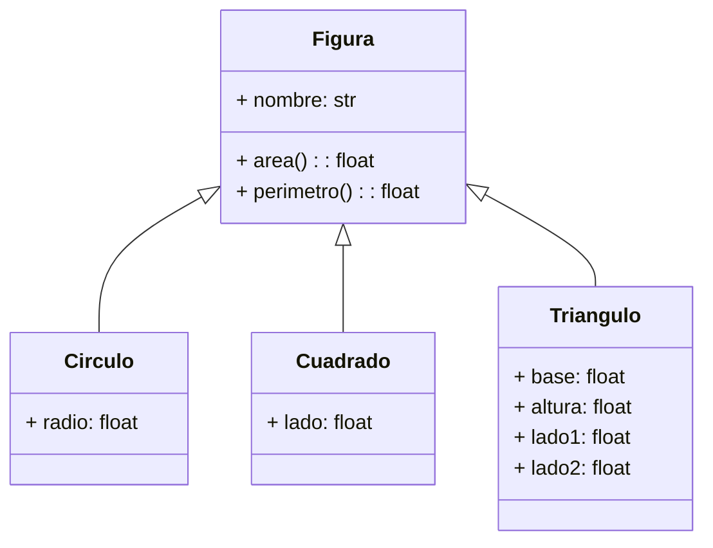

# :material-drama-masks: Clase 3

La clase anterior mostró que una clase hija puede redefinir un método heredado, dándole un comportamiento propio mediante _override_.
A ese mecanismo se le llama **polimorfismo**.
Hoy se nombra con precisión, se ve hasta dónde llega en Python sin herencia de por medio, y se formaliza con clases abstractas.

## Polimorfismo

### ¿Qué es el polimorfismo?

**Polimorfismo** significa muchas formas.
En programación, un mismo nombre de método produce comportamientos distintos según el tipo real del objeto que lo ejecuta.
Quien llama al método no necesita saber de qué tipo es el objeto exactamente, solo confía en que ese método existe y hace lo que le corresponde.

Este comportamiento ya apareció, sin nombrarlo, en la clase anterior.
En la arena de personajes, la línea `atacante.atacar(objetivo)` producía un resultado distinto según si `atacante` era un `Guerrero` o un `Mago`, sin que el código que hacía la llamada tuviera que preguntar de qué tipo era.

```python
atacante.atacar(objetivo)
```

Esa única línea ejecuta código diferente dependiendo del objeto, sin ningún `if` que distinga los casos.
Eso es polimorfismo.

!!! abstract "Definición formal"

    Un programa exhibe polimorfismo cuando un mismo mensaje (llamada a método) puede enviarse a objetos de distintos tipos, y cada uno responde con su propia implementación.
    El código que envía el mensaje permanece **igual** sin importar cuántos tipos distintos de objetos reciba.

### Polimorfismo mediante herencia

La forma más común de lograr polimorfismo es a través de una jerarquía de herencia donde cada subclase sobrescribe el mismo método con su propia lógica.

Considérese una jerarquía de figuras geométricas.
Todas comparten la necesidad de calcular un área y un perímetro, pero la fórmula es distinta para cada una.

```python
class Figura:
    def __init__(self, nombre):
        self.nombre = nombre

    def area(self):
        return 0

    def perimetro(self):
        return 0


class Circulo(Figura):
    def __init__(self, radio):
        super().__init__("Círculo")
        self.radio = radio

    def area(self):
        return 3.1416 * self.radio ** 2          # (1)!

    def perimetro(self):
        return 2 * 3.1416 * self.radio


class Cuadrado(Figura):
    def __init__(self, lado):
        super().__init__("Cuadrado")
        self.lado = lado

    def area(self):
        return self.lado ** 2                     # (2)!

    def perimetro(self):
        return 4 * self.lado


class Triangulo(Figura):
    def __init__(self, base, altura, lado1, lado2):
        super().__init__("Triángulo")
        self.base = base
        self.altura = altura
        self.lado1 = lado1
        self.lado2 = lado2

    def area(self):
        return (self.base * self.altura) / 2       # (3)!

    def perimetro(self):
        return self.base + self.lado1 + self.lado2
```

1. `Circulo` calcula su área con la fórmula π·r².
2. `Cuadrado` calcula su área elevando el lado al cuadrado.
3. `Triangulo` calcula su área con la fórmula base por altura entre dos.

Cada subclase sobrescribe `area()` y `perimetro()` con la fórmula que le corresponde.
Considérese qué ocurre al recorrer una lista que mezcla estos tres tipos:

```python
figuras = [Circulo(3), Cuadrado(5), Triangulo(6, 4, 5, 5)]

for figura in figuras:
    print(f"{figura.nombre}: área = {figura.area():.2f}, perímetro = {figura.perimetro():.2f}")
```

```title="Salida"
Círculo: área = 28.27, perímetro = 18.85
Cuadrado: área = 25.00, perímetro = 20.00
Triángulo: área = 12.00, perímetro = 16.00
```

El ciclo `for` llama `figura.area()` una sola vez y ejecuta tres implementaciones distintas: el código que recorre la lista **no cambia**, aunque el tipo de figura sí.



!!! danger "Evitar cadenas de `isinstance()` para simular polimorfismo"

    Es tentador escribir el recorrido anterior sin apoyarse en la sobrescritura, preguntando el tipo de cada figura directamente:

    ```python
    for figura in figuras:
        if isinstance(figura, Circulo):
            print(3.1416 * figura.radio ** 2)
        elif isinstance(figura, Cuadrado):
            print(figura.lado ** 2)
        elif isinstance(figura, Triangulo):
            print((figura.base * figura.altura) / 2)
    ```

    Este código funciona, pero destruye la ventaja del polimorfismo.
    Cada vez que se agregue un nuevo tipo de figura, habrá que volver a este bloque y agregar un `elif` más.
    Con el diseño polimórfico, agregar una figura nueva solo exige crear la subclase; el ciclo `for` original no se toca nunca.

### _Duck typing_: polimorfismo sin herencia común

En Python, el polimorfismo no exige que los objetos compartan una clase base.
Basta con que respondan al mismo método para poder tratarse de forma uniforme.
A esta idea se le llama _duck typing_, sin importar de qué clase provenga.

```python
class EmailNotificador:
    def enviar(self, mensaje):
        print(f"[Correo] {mensaje}")


class SMSNotificador:
    def enviar(self, mensaje):
        print(f"[SMS] {mensaje}")


class PushNotificador:
    def enviar(self, mensaje):
        print(f"[Notificación push] {mensaje}")
```

Ninguna de estas tres clases hereda de otra.
No comparten ningún ancestro común, salvo `object`, que todas las clases de Python heredan implícitamente.
Aun así, se pueden mezclar en una misma lista y recorrer de forma idéntica al ejemplo anterior:

```python
canales = [EmailNotificador(), SMSNotificador(), PushNotificador()]

for canal in canales:
    canal.enviar("El pago fue registrado correctamente.")
```

```title="Salida"
[Correo] El pago fue registrado correctamente.
[SMS] El pago fue registrado correctamente.
[Notificación push] El pago fue registrado correctamente.
```

Lo único que exige este código es que cada objeto tenga un método `enviar(mensaje)`.
No importa la clase a la que pertenezca, ni si esa clase hereda de alguna otra.

!!! note "_Duck_ typing frente a lenguajes de tipado estático"

    En lenguajes como Java o C#, tratar objetos de distintas clases de forma uniforme normalmente exige declarar una **interfaz** explícita que todas implementen.
    Python no obliga a eso: el intérprete solo verifica, en el momento de la llamada, que el método exista en el objeto.
    Por eso ningún error avisa de un método faltante hasta que el programa lo usa.

### Clases abstractas: formalizar el contrato

El _duck typing_ es flexible, pero no ofrece ninguna garantía.
Nada impide declarar una figura nueva y olvidar sobrescribir `area()`.

```python
class Rombo(Figura):
    def __init__(self, diagonal_mayor, diagonal_menor):
        super().__init__("Rombo")
        self.diagonal_mayor = diagonal_mayor
        self.diagonal_menor = diagonal_menor
    # se olvidó sobrescribir area() y perimetro()
```

`Rombo` hereda las versiones de `Figura` que retornan `0`, y el error pasa completamente inadvertido hasta que alguien se dé cuenta de que todas las áreas de rombos salen en cero.
Python no avisa nada en el momento de declarar la clase.

!!! question "¿Cuándo debería detectarse este error?"

    Idealmente, tan pronto como alguien intente crear un objeto `Rombo` sin haber completado su implementación, no varias líneas después, cuando el resultado incorrecto ya se usó en otro cálculo.

Para exigir ese contrato, Python ofrece el módulo `abc` (_Abstract Base Classes_).
Una clase abstracta declara métodos que toda subclase está **obligada a implementar**, y el intérprete lo verifica en el momento de instanciar.

```python
from abc import ABC, abstractmethod

class Figura(ABC):                     # (1)!
    def __init__(self, nombre):
        self.nombre = nombre

    @abstractmethod                    # (2)!
    def area(self):
        pass

    @abstractmethod
    def perimetro(self):
        pass
```

1. `Figura` ahora hereda de `ABC`, lo que la convierte en una clase abstracta.
2. `@abstractmethod` marca `area()` y `perimetro()` como métodos que toda subclase concreta debe definir con su propio cuerpo.

Con este cambio, `Figura` ya no puede instanciarse directamente:

```python
figura_generica = Figura("Genérica")
```

```title="Salida"
TypeError: Can't instantiate abstract class Figura without an implementation for abstract methods 'area', 'perimetro'
```

Y una subclase que no complete todos los métodos abstractos tampoco puede instanciarse:

```python
class Rombo(Figura):
    def __init__(self, diagonal_mayor, diagonal_menor):
        super().__init__("Rombo")
        self.diagonal_mayor = diagonal_mayor
        self.diagonal_menor = diagonal_menor
    # sigue sin implementar area() y perimetro()

r = Rombo(8, 5)
```

```title="Salida"
TypeError: Can't instantiate abstract class Rombo without an implementation for abstract methods 'area', 'perimetro'
```

El error ahora aparece exactamente donde debía, al intentar crear el objeto incompleto, no varias líneas después.
Una vez que `Rombo` implementa ambos métodos, la clase se comporta con normalidad y puede mezclarse con `Circulo`, `Cuadrado` y `Triangulo` en el mismo ciclo `for` de siempre.

!!! tip "¿Cuándo usar clases abstractas?"

    El _duck typing_ basta cuando el contrato entre clases es informal y el equipo confía en que cada quien implementará lo necesario.
    Una clase abstracta conviene cuando se quiere que Python **impida** crear un objeto incompleto, particularmente útil en proyectos grandes o colaborativos, donde otra persona podría heredar de `Figura` sin conocer todos sus métodos esperados.

## Ejercicios prácticos

### 1. Extender la jerarquía `Figura`

=== "Enunciado"

    Usando la clase abstracta `Figura` (con `area()` y `perimetro()` como métodos abstractos), agregue una subclase `Rectangulo` que reciba `base` y `altura`.

    Luego escriba una función `area_total(figuras)` que reciba una lista de objetos `Figura` (de cualquier subclase) y retorne la suma de todas sus áreas, sin usar `isinstance()` en ningún punto.

=== "Solución"

    ```python
    from abc import ABC, abstractmethod

    class Figura(ABC):
        def __init__(self, nombre):
            self.nombre = nombre

        @abstractmethod
        def area(self):
            pass

        @abstractmethod
        def perimetro(self):
            pass


    class Rectangulo(Figura):
        def __init__(self, base, altura):
            super().__init__("Rectángulo")
            self.base = base
            self.altura = altura

        def area(self):
            return self.base * self.altura

        def perimetro(self):
            return 2 * (self.base + self.altura)


    def area_total(figuras):
        total = 0
        for figura in figuras:
            total += figura.area()      # (1)!
        return total


    figuras = [Circulo(2), Cuadrado(4), Rectangulo(3, 6)]
    print(f"Área total: {area_total(figuras):.2f}")
    ```

    1. `figura.area()` ejecuta la implementación correcta sin importar la subclase concreta, gracias al polimorfismo.

    !!! example "Ejemplo de ejecución"

        ```
        Área total: 46.57
        ```

### 2. Cálculo polimórfico de salario

=== "Enunciado"

    Defina una clase abstracta `Empleado` con un atributo `nombre`, un atributo `salario_base` y un método abstracto `calcular_salario()`.

    Defina dos subclases:

    - `Vendedor`, que recibe además `ventas` y una `comision` (porcentaje). Su `calcular_salario()` retorna `salario_base + ventas * comision`.
    - `Gerente`, que recibe además un `bono` fijo. Su `calcular_salario()` retorna `salario_base + bono`.

    Escriba una función `nomina_total(empleados)` que sume el salario de una lista mixta de empleados.

=== "Solución"

    ```python
    from abc import ABC, abstractmethod

    class Empleado(ABC):
        def __init__(self, nombre, salario_base):
            self.nombre = nombre
            self.salario_base = salario_base

        @abstractmethod
        def calcular_salario(self):
            pass


    class Vendedor(Empleado):
        def __init__(self, nombre, salario_base, ventas, comision):
            super().__init__(nombre, salario_base)
            self.ventas = ventas
            self.comision = comision

        def calcular_salario(self):
            return self.salario_base + self.ventas * self.comision


    class Gerente(Empleado):
        def __init__(self, nombre, salario_base, bono):
            super().__init__(nombre, salario_base)
            self.bono = bono

        def calcular_salario(self):
            return self.salario_base + self.bono


    def nomina_total(empleados):
        total = 0
        for empleado in empleados:
            total += empleado.calcular_salario()
        return total


    empleados = [
        Vendedor("Marcela", 400000, 2000000, 0.05),
        Gerente("Esteban", 900000, 250000),
    ]

    for empleado in empleados:
        print(f"{empleado.nombre}: ₡{empleado.calcular_salario():,.0f}")

    print(f"Nómina total: ₡{nomina_total(empleados):,.0f}")
    ```

    !!! example "Ejemplo de ejecución"

        ```
        Marcela: ₡500,000
        Esteban: ₡1,150,000
        Nómina total: ₡1,650,000
        ```

## Ejercicio integrador

### Enunciado

Desarrolle un sistema de facturación de una tienda que administre distintos tipos de cliente, cada uno con su propia regla de descuento, aplicando polimorfismo con clases abstractas.

**La clase `Cliente` (abstracta) debe tener:**

| Elemento                    | Descripción                                                                                                     |
| --------------------------- | --------------------------------------------------------------------------------------------------------------- |
| `nombre`                    | Identificador único del cliente                                                                                 |
| `_compras`                  | Lista protegida con el monto de cada factura generada; inicia vacía                                             |
| `calcular_descuento(monto)` | Método abstracto; cada subclase lo implementa a su manera                                                       |
| `generar_factura(monto)`    | Método concreto; usa `calcular_descuento(monto)` para calcular el total y registra el monto final en `_compras` |
| `total_comprado()`          | Retorna la suma de todos los montos registrados en `_compras`                                                   |

**Subclases de `Cliente`:**

| Clase              | Regla de descuento                                                                          |
| ------------------ | ------------------------------------------------------------------------------------------- |
| `ClienteRegular`   | Sin descuento                                                                               |
| `ClienteMayorista` | 10% de descuento si el monto de la compra es mayor o igual a ₡100 000; si no, sin descuento |
| `ClienteVIP`       | 20% de descuento siempre                                                                    |

**Menú principal:**

```
=== FACTURACIÓN ===
1. Registrar cliente
2. Generar factura
3. Ver historial de un cliente
4. Ver todos los clientes
5. Salir
```

**Requisitos:**

1. La opción 1 solicita un nombre y un tipo (`regular`, `mayorista` o `vip`), crea el objeto correspondiente y lo agrega a una lista de clientes registrados. No se puede registrar el mismo nombre dos veces.
2. La opción 2 solicita el nombre de un cliente y un monto, valida que el cliente exista y que el monto sea numérico con `try-except`, y ejecuta `generar_factura(monto)` sobre el cliente correspondiente.
3. La opción 3 muestra todas las compras registradas de un cliente y su total acumulado, usando `total_comprado()`.
4. La opción 4 recorre todos los clientes registrados e imprime su nombre, tipo y total comprado, sin usar `isinstance()` en ningún punto.

### Solución

#### Paso 1: Declarar la clase abstracta `Cliente`

```python
from abc import ABC, abstractmethod

class Cliente(ABC):
    def __init__(self, nombre):
        self.nombre = nombre
        self._compras = []

    @abstractmethod
    def calcular_descuento(self, monto):
        pass

    def generar_factura(self, monto):
        descuento = self.calcular_descuento(monto)   # (1)!
        total = monto - descuento
        self._compras.append(total)
        return total

    def total_comprado(self):
        return sum(self._compras)
```

1. `generar_factura()` está definido una sola vez, en la clase base, pero produce un resultado distinto según qué subclase la invoque, porque `calcular_descuento()` es polimórfico.

#### Paso 2: Declarar las subclases con su propia regla de descuento

```python
class ClienteRegular(Cliente):
    def calcular_descuento(self, monto):
        return 0


class ClienteMayorista(Cliente):
    def calcular_descuento(self, monto):
        if monto >= 100000:
            return monto * 0.10
        return 0


class ClienteVIP(Cliente):
    def calcular_descuento(self, monto):
        return monto * 0.20
```

Cada subclase solo se preocupa de su propia fórmula.
`generar_factura()` y `total_comprado()` se heredan sin repetirse.

#### Paso 3: Buscar un cliente por nombre y registrar uno nuevo

```python
def buscar_cliente(clientes, nombre):
    for cliente in clientes:
        if cliente.nombre == nombre:
            return cliente
    return None


def registrar_cliente(clientes):
    nombre = input("Nombre: ").strip()

    if buscar_cliente(clientes, nombre) is not None:
        print(f"Ya existe un cliente llamado '{nombre}'.")
        return

    tipo = input("Tipo (regular/mayorista/vip): ").strip().lower()

    if tipo == "regular":
        clientes.append(ClienteRegular(nombre))
    elif tipo == "mayorista":
        clientes.append(ClienteMayorista(nombre))
    elif tipo == "vip":
        clientes.append(ClienteVIP(nombre))
    else:
        print("Tipo inválido.")
        return

    print(f"Cliente '{nombre}' registrado como {tipo}.")
```

#### Paso 4: Implementar el resto de opciones del menú

```python
def generar_factura_cliente(clientes):
    nombre = input("Cliente: ").strip()
    cliente = buscar_cliente(clientes, nombre)

    if cliente is None:
        print(f"No existe un cliente llamado '{nombre}'.")
        return

    try:
        monto = float(input("Monto de la compra: "))
    except ValueError:
        print("El monto debe ser numérico.")
        return

    total = cliente.generar_factura(monto)
    print(f"Factura generada para '{nombre}'. Total a pagar: ₡{total:,.2f}")


def ver_historial(clientes):
    nombre = input("Cliente: ").strip()
    cliente = buscar_cliente(clientes, nombre)

    if cliente is None:
        print(f"No existe un cliente llamado '{nombre}'.")
        return

    if not cliente._compras:
        print(f"'{nombre}' no tiene compras registradas.")
        return

    print(f"\n--- Historial de {nombre} ---")
    for i, monto in enumerate(cliente._compras, start=1):
        print(f"Factura {i}: ₡{monto:,.2f}")
    print(f"Total comprado: ₡{cliente.total_comprado():,.2f}")


def ver_clientes(clientes):
    if not clientes:
        print("No hay clientes registrados.")
        return

    print("\n--- Clientes registrados ---")
    for cliente in clientes:
        tipo = type(cliente).__name__                # (1)!
        print(f"{cliente.nombre} ({tipo}): ₡{cliente.total_comprado():,.2f} comprados")
```

1. `type(cliente).__name__` consulta el nombre de la clase real del objeto solo para **mostrarlo**, no para decidir qué código ejecutar. La lógica de descuento sigue resolviéndose internamente en cada objeto; esto no rompe el polimorfismo.

#### Programa completo

```python
from abc import ABC, abstractmethod

class Cliente(ABC):
    def __init__(self, nombre):
        self.nombre = nombre
        self._compras = []

    @abstractmethod
    def calcular_descuento(self, monto):
        pass

    def generar_factura(self, monto):
        descuento = self.calcular_descuento(monto)
        total = monto - descuento
        self._compras.append(total)
        return total

    def total_comprado(self):
        return sum(self._compras)


class ClienteRegular(Cliente):
    def calcular_descuento(self, monto):
        return 0


class ClienteMayorista(Cliente):
    def calcular_descuento(self, monto):
        if monto >= 100000:
            return monto * 0.10
        return 0


class ClienteVIP(Cliente):
    def calcular_descuento(self, monto):
        return monto * 0.20


def buscar_cliente(clientes, nombre):
    for cliente in clientes:
        if cliente.nombre == nombre:
            return cliente
    return None


def registrar_cliente(clientes):
    nombre = input("Nombre: ").strip()

    if buscar_cliente(clientes, nombre) is not None:
        print(f"Ya existe un cliente llamado '{nombre}'.")
        return

    tipo = input("Tipo (regular/mayorista/vip): ").strip().lower()

    if tipo == "regular":
        clientes.append(ClienteRegular(nombre))
    elif tipo == "mayorista":
        clientes.append(ClienteMayorista(nombre))
    elif tipo == "vip":
        clientes.append(ClienteVIP(nombre))
    else:
        print("Tipo inválido.")
        return

    print(f"Cliente '{nombre}' registrado como {tipo}.")


def generar_factura_cliente(clientes):
    nombre = input("Cliente: ").strip()
    cliente = buscar_cliente(clientes, nombre)

    if cliente is None:
        print(f"No existe un cliente llamado '{nombre}'.")
        return

    try:
        monto = float(input("Monto de la compra: "))
    except ValueError:
        print("El monto debe ser numérico.")
        return

    total = cliente.generar_factura(monto)
    print(f"Factura generada para '{nombre}'. Total a pagar: ₡{total:,.2f}")


def ver_historial(clientes):
    nombre = input("Cliente: ").strip()
    cliente = buscar_cliente(clientes, nombre)

    if cliente is None:
        print(f"No existe un cliente llamado '{nombre}'.")
        return

    if not cliente._compras:
        print(f"'{nombre}' no tiene compras registradas.")
        return

    print(f"\n--- Historial de {nombre} ---")
    for i, monto in enumerate(cliente._compras, start=1):
        print(f"Factura {i}: ₡{monto:,.2f}")
    print(f"Total comprado: ₡{cliente.total_comprado():,.2f}")


def ver_clientes(clientes):
    if not clientes:
        print("No hay clientes registrados.")
        return

    print("\n--- Clientes registrados ---")
    for cliente in clientes:
        tipo = type(cliente).__name__
        print(f"{cliente.nombre} ({tipo}): ₡{cliente.total_comprado():,.2f} comprados")


clientes = []

while True:
    print("\n=== FACTURACIÓN ===")
    print("1. Registrar cliente")
    print("2. Generar factura")
    print("3. Ver historial de un cliente")
    print("4. Ver todos los clientes")
    print("5. Salir")

    opcion = input("Opción: ")

    if opcion == "1":
        registrar_cliente(clientes)
    elif opcion == "2":
        generar_factura_cliente(clientes)
    elif opcion == "3":
        ver_historial(clientes)
    elif opcion == "4":
        ver_clientes(clientes)
    elif opcion == "5":
        print("¡Hasta la próxima!")
        break
    else:
        print("Opción inválida.")
```

!!! example "Ejemplos de ejecución"

    === "Registro y facturación"
        ```
        === FACTURACIÓN ===
        1. Registrar cliente
        ...
        Opción: 1
        Nombre: Ana
        Tipo (regular/mayorista/vip): regular
        Cliente 'Ana' registrado como regular.

        Opción: 1
        Nombre: Ferretería Central
        Tipo (regular/mayorista/vip): mayorista
        Cliente 'Ferretería Central' registrado como mayorista.

        Opción: 2
        Cliente: Ferretería Central
        Monto de la compra: 150000
        Factura generada para 'Ferretería Central'. Total a pagar: ₡135,000.00
        ```
    === "Cliente VIP"
        ```
        Opción: 1
        Nombre: Camila
        Tipo (regular/mayorista/vip): vip
        Cliente 'Camila' registrado como vip.

        Opción: 2
        Cliente: Camila
        Monto de la compra: 50000
        Factura generada para 'Camila'. Total a pagar: ₡40,000.00
        ```
    === "Ver historial"
        ```
        Opción: 3
        Cliente: Ferretería Central

        --- Historial de Ferretería Central ---
        Factura 1: ₡135,000.00
        Total comprado: ₡135,000.00
        ```
    === "Ver todos los clientes"
        ```
        Opción: 4

        --- Clientes registrados ---
        Ana (ClienteRegular): ₡0.00 comprados
        Ferretería Central (ClienteMayorista): ₡135,000.00 comprados
        Camila (ClienteVIP): ₡40,000.00 comprados
        ```
    === "Monto inválido"
        ```
        Opción: 2
        Cliente: Ana
        Monto de la compra: quinientos
        El monto debe ser numérico.
        ```
    === "Cliente inexistente"
        ```
        Opción: 2
        Cliente: Legolas
        No existe un cliente llamado 'Legolas'.
        ```
