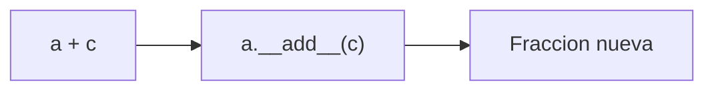

# :material-toolbox-outline: Clase 4

Primero, vamos a ver tres etiquetas especiales que cambian las reglas de un método: métodos que no necesitan un objeto, métodos que operan sobre la clase misma, y atributos que en realidad esconden lógica de validación.
Después, vamos a tener la posibilidad de que los objetos propios respondan a operadores como `+`, `==` o `print()`, tal como ya lo hacen `int`, `str` o `list`.

## ¿Qué es un decorador?

Un **decorador** es una línea que empieza con `@`, escrita justo encima de la definición de un método, que le indica a Python que ese método debe tratarse de forma distinta a un método normal.

Sin decorador, la regla siempre fue la misma desde la primera clase, el primer parámetro de todo método es `self`, y se invoca desde un objeto (`objeto.metodo()`).
Con `@staticmethod`, `@classmethod` o `@property`, esa regla cambia de formas específicas que se ven a continuación.

!!! tip "Ya se usó un decorador antes..."

    `@abstractmethod`, visto en la clase anterior, también es un decorador; cambiaba las reglas de un método para obligar a toda subclase concreta a implementarlo.
    Un decorador, en general, es una _etiqueta_ que modifica el comportamiento de lo que decora.

!!! note "No hace falta crear decoradores propios"

    Escribir un decorador nuevo es una construcción de funciones más avanzada, fuera del alcance de este curso.
    Basta con reconocer qué hace cada uno de los tres decoradores de hoy y en qué situación usarlo.

## Atributos de clase vs. atributos de instancia

Hasta ahora, todo atributo vivía dentro de `__init__` con la forma `self.algo = valor`: un **atributo de instancia**, con una copia independiente por cada objeto.
Existe un segundo tipo de atributo, necesario para lo que viene en la siguiente sección.

Un **atributo de clase** se declara dentro del cuerpo de la clase, pero fuera de cualquier método.
Su valor es **compartido** por todos los objetos de esa clase, en vez de tener una copia por objeto.

```python
class CuentaBancaria:
    banco = "Banco Nacional"        # (1)!

    def __init__(self, titular, saldo):
        self.titular = titular      # (2)!
        self.saldo = saldo
```

1. `banco` es un atributo de clase: existe una sola vez, y lo comparten todas las cuentas.
2. `titular` y `saldo` son atributos de instancia: cada cuenta guarda los suyos por separado.

```python
cuenta1 = CuentaBancaria("Ana", 1000)
cuenta2 = CuentaBancaria("Luis", 500)

print(cuenta1.banco)   # (1)!
print(cuenta2.banco)   # (2)!
```

1. `Banco Nacional`
2. `Banco Nacional` – ninguna cuenta recibió este valor en `__init__`; ambas leen el mismo atributo de clase.

Un uso típico de un atributo de clase es llevar un conteo global, algo que ningún objeto individual podría saber por sí solo.

```python
class CuentaBancaria:
    total_cuentas = 0                      # (1)!

    def __init__(self, titular, saldo):
        self.titular = titular
        self.saldo = saldo
        CuentaBancaria.total_cuentas += 1  # (2)!

cuenta1 = CuentaBancaria("Ana", 1000)
cuenta2 = CuentaBancaria("Luis", 500)
cuenta3 = CuentaBancaria("Marcela", 750)

print(cuenta1.total_cuentas)  # (3)!
```

1. `total_cuentas` inicia en cero, una sola vez, compartido por toda la clase.
2. Cada vez que se crea una cuenta nueva, se incrementa el atributo de **clase**, no uno de instancia.
3. `3` – se han creado tres cuentas en total, y cualquier objeto puede consultarlo.

!!! danger "Modificar un atributo de clase desde una instancia crea uno nuevo de instancia"

    ```python
    cuenta1.total_cuentas = 99

    print(cuenta1.total_cuentas)          # (1)!
    print(cuenta2.total_cuentas)          # (2)!
    print(CuentaBancaria.total_cuentas)   # (3)!
    ```

    1. `99`
    2. `3` – no cambió.
    3. `3` – tampoco cambió.

    La línea `cuenta1.total_cuentas = 99` no modifica el atributo de clase: crea un atributo de **instancia** nuevo, exclusivo de `cuenta1`, que a partir de ese momento oculta al de clase solo para ese objeto.
    El conteo real, compartido por todos, sigue intacto.
    Por eso el conteo debe modificarse siempre con `CuentaBancaria.total_cuentas`, nunca con `self.total_cuentas`. Esa necesidad de operar sobre la clase misma, y no sobre un objeto, es exactamente para lo que sirve `@classmethod`.

## Métodos que no necesitan un objeto: `@staticmethod`

Considérese una función que valida si un monto es válido para depositar o retirar.
Esa función no necesita leer ni modificar ningún atributo de una cuenta en particular: solo revisa el valor que recibe.
Sin embargo, pertenece conceptualmente a `CuentaBancaria`, no a ningún otro lugar del programa.

Un **método estático** no recibe `self` ni ningún otro parámetro automático.
Se comporta como una función normal, pero vive agrupada dentro de la clase a la que pertenece por significado.

```python
class CuentaBancaria:
    def __init__(self, titular, saldo):
        self.titular = titular
        self.saldo = saldo

    @staticmethod
    def es_monto_valido(monto):                          # (1)!
        return isinstance(monto, (int, float)) and monto > 0
```

1. Ningún parámetro representa al objeto ni a la clase; `monto` es el único dato que la función necesita.

Un método estático puede llamarse tanto desde la clase como desde un objeto:

```python
print(CuentaBancaria.es_monto_valido(500))   # (1)!
print(CuentaBancaria.es_monto_valido(-20))   # (2)!

cuenta = CuentaBancaria("Ana", 1000)
print(cuenta.es_monto_valido(300))           # (3)!
```

1. `True`
2. `False`
3. `True` – también funciona desde una instancia, aunque `cuenta` no participa en el cálculo.

!!! note "No puede tocar atributos de instancia"

    Como no recibe `self`, un método estático no tiene forma de leer o modificar los atributos de un objeto particular.
    Si necesitara hacerlo, dejaría de ser un buen candidato para `@staticmethod`.

## Métodos que operan sobre la clase misma: `@classmethod`

El problema del atributo de clase, visto un poco más arriba, deja pendiente lo siguiente: se necesita una forma segura de consultar `total_cuentas` sin arriesgarse a que alguien la sobrescriba sin querer desde una instancia.

Un **método de clase** recibe `cls` (la clase misma, no un objeto) como primer parámetro.
Puede leer y modificar atributos de clase con `cls.atributo`, y crear instancias nuevas con `cls(...)`.

```python
class CuentaBancaria:
    total_cuentas = 0

    def __init__(self, titular, saldo):
        self.titular = titular
        self.saldo = saldo
        CuentaBancaria.total_cuentas += 1

    @classmethod
    def cuentas_creadas(cls):        # (1)!
        return cls.total_cuentas
```

1. `cls` representa a la clase `CuentaBancaria`; `cls.total_cuentas` siempre lee el valor real y compartido, sin riesgo de leer un atributo de instancia que lo oculte.

El uso más importante de `@classmethod` es como **constructor alternativo**: una forma distinta de crear objetos, a partir de datos que no vienen ya separados en parámetros individuales.

```python
    @classmethod
    def desde_texto(cls, texto):
        titular, saldo = texto.split("-")   # (1)!
        return cls(titular, float(saldo))   # (2)!
```

1. Separa la cadena `"Luis-1500"` en `"Luis"` y `"1500"` usando el guion como separador.
2. `cls(...)` construye un objeto llamando al constructor de la clase actual, se escribe `cls` y no `CuentaBancaria` directamente, para que el método funcione igual si algún día una subclase lo hereda.

```python
cuenta1 = CuentaBancaria("Ana", 1000)
cuenta2 = CuentaBancaria.desde_texto("Luis-1500")

print(cuenta2.titular, cuenta2.saldo)   # (1)!
print(CuentaBancaria.cuentas_creadas()) # (2)!
```

1. `Luis 1500.0`
2. `2`

| Tipo                | Primer parámetro   | Se llama con              | Uso típico                                         |
| ------------------- | ------------------ | ------------------------- | -------------------------------------------------- |
| Método de instancia | `self` (el objeto) | `objeto.metodo()`         | Leer o modificar el estado de un objeto concreto   |
| `@classmethod`      | `cls` (la clase)   | `Clase.metodo()`          | Constructores alternativos, datos de toda la clase |
| `@staticmethod`     | Ninguno automático | `[Clase/objeto].metodo()` | Función utilitaria relacionada con la clase        |

## Atributos controlados: `@property`

El patrón para proteger un atributo era declararlo con guion bajo (`self._saldo`) y exponer métodos manuales: `obtener_saldo()`, `fijar_saldo(valor)`.
Esto funciona, pero tiene un costo: quien usa la clase debe recordar llamar métodos con paréntesis en vez de simplemente leer o asignar el atributo, como se hace con cualquier variable.

```python
cuenta.obtener_saldo()        # parece distinto a leer un atributo normal
cuenta.fijar_saldo(1500)      # parece distinto a asignar un atributo normal
```

`@property` resuelve esto: permite que un método se **lea** con sintaxis de atributo, sin paréntesis.
`@atributo.setter` permite que, además, se pueda **asignar** con `=`, ejecutando una validación antes de guardar el valor.

```python
class CuentaBancaria:
    def __init__(self, titular, saldo):
        self.titular = titular
        self.saldo = saldo          # (1)!

    @property
    def saldo(self):                # (2)!
        return self._saldo

    @saldo.setter
    def saldo(self, valor):         # (3)!
        if valor < 0:
            raise ValueError("El saldo no puede ser negativo")
        self._saldo = valor
```

1. Esta línea, dentro de `__init__`, en realidad ya está llamando al **setter** de `saldo` definido más abajo, no a un atributo simple.
2. El getter se llama `saldo`, igual que el atributo que se quiere exponer, y retorna el valor guardado internamente en `self._saldo`.
3. El setter también se llama `saldo`; recibe el valor que alguien intenta asignar y decide si guardarlo o rechazarlo.

```python
cuenta = CuentaBancaria("Ana", 1000)
print(cuenta.saldo)     # (1)!

cuenta.saldo = 1500     # (2)!
print(cuenta.saldo)     # (3)!

cuenta.saldo = -200     # (4)!
```

1. `1000` – se lee como un atributo normal, sin paréntesis, aunque por dentro ejecuta un método.
2. Se asigna como un atributo normal, pero por dentro se ejecuta el setter, que valida el valor.
3. `1500`
4. `ValueError: El saldo no puede ser negativo` – el setter rechaza la asignación antes de que llegue a guardarse.

!!! abstract "Property frente a getter/setter manual"

    === "Con `@property`/`.setter`"

        ```python
        cuenta.saldo = 1500
        print(cuenta.saldo)
        ```

    === "Con getter/setter manual"

        ```python
        cuenta.fijar_saldo(1500)
        print(cuenta.obtener_saldo())
        ```

    Ambos enfoques logran el mismo control sobre el valor. `@property` tiene la ventaja de que, desde fuera, el objeto se sigue usando exactamente igual que si `saldo` fuera un atributo público y sencillo.

!!! danger "Olvidar el guion bajo dentro del propio getter o setter"

    ```python
    class CuentaBancaria:
        def __init__(self, titular, saldo):
            self.titular = titular
            self.saldo = saldo

        @property
        def saldo(self):
            return self.saldo        # (1)!

        @saldo.setter
        def saldo(self, valor):
            self.saldo = valor       # (2)!

    cuenta = CuentaBancaria("Ana", 1000)
    ```

    1. Debería ser `self._saldo`. Al escribir `self.saldo`, el getter se está llamando **a sí mismo**.
    2. El mismo error en el setter: se llama a sí mismo en vez de guardar en `self._saldo`.

    ```title="Salida"
    RecursionError: maximum recursion depth exceeded
    ```

    > El getter y el setter deben leer y escribir en un nombre **distinto** al de la property (por convención, el mismo nombre con un guion bajo al inicio). Si usan el mismo nombre que la property, se llaman a sí mismos indefinidamente.

!!! note "También existe `@atributo.deleter`"

    Permite definir qué ocurre al ejecutar `del objeto.atributo`. Se usa con mucha menos frecuencia que el getter y el setter, y queda fuera del alcance de este curso, basta con saber que existe.

---

## ¿Por qué los objetos propios no se comportan como los tipos nativos?

```python
class Fraccion:
    def __init__(self, numerador, denominador):
        self.numerador = numerador
        self.denominador = denominador

f = Fraccion(1, 2)
print(f)
```

```title="Salida"
<__main__.Fraccion object at 0x1046b8c50>
```

`print(f)` no muestra `1/2`, como cabría esperar: muestra el tipo del objeto y su dirección en memoria.
Compárese con tipos que Python ya conoce de fábrica:

```python
print([1, 2, 3])
print("hola" == "hola")
print(3 + 4)
```

```title="Salida"
[1, 2, 3]
True
7
```

`list`, `str` e `int` sí saben imprimirse, compararse y sumarse de forma útil, porque sus clases (definidas internamente en Python) implementan un conjunto de métodos (métodos con nombre entre doble guion bajo, como `__str__`, `__eq__` o `__add__`) que Python ejecuta automáticamente al usar `print()`, `==` o `+`.

> Ese mecanismo no es nuevo: `__init__` es exactamente el mismo tipo de método, ejecutado automáticamente al instanciar.

## Representación en texto: `__str__` y `__repr__`

`__str__` se ejecuta al hacer `print(objeto)` o `str(objeto)`, y está pensado para mostrarse a un usuario final.
`__repr__` se ejecuta al mostrar el objeto en la consola, o cuando aparece dentro de una estructura como una lista, y está pensado para depuración.

```python
class Fraccion:
    def __init__(self, numerador, denominador):
        self.numerador = numerador
        self.denominador = denominador

    def __str__(self):
        return f"{self.numerador}/{self.denominador}"           # (1)!

    def __repr__(self):
        return f"Fraccion({self.numerador}, {self.denominador})" # (2)!
```

1. Pensado para el usuario final: una fracción se lee como `"1/2"`.
2. Pensado para depuración: muestra cómo reconstruir el objeto exactamente.

```python
f = Fraccion(1, 2)
print(f)      # (1)!
print([f])    # (2)!
```

1. `1/2` – usa `__str__`.
2. `[Fraccion(1, 2)]` – al imprimir una lista, Python usa `__repr__` de cada elemento, no `__str__`.

!!! note "`__repr__` como respaldo de `__str__`"

    Si una clase define `__repr__` pero no `__str__`, Python usa `__repr__` también para `print()`. Por eso, cuando solo hace falta una de las dos representaciones, suele bastar con definir `__repr__`.

## Comparación entre objetos

Sin ayuda, `==` compara la identidad de dos objetos (si son literalmente el mismo objeto en memoria), no si representan el mismo valor:

```python
f1 = Fraccion(1, 2)
f2 = Fraccion(1, 2)
print(f1 == f2)
```

```title="Salida"
False
```

Aunque `f1` y `f2` representan la misma fracción, Python los considera distintos porque son dos objetos diferentes.
`__eq__` redefine qué significa `==` para esta clase:

```python
class Fraccion:
    # ... __init__, __str__, __repr__ ...

    def __eq__(self, otro):
        return self.numerador * otro.denominador == otro.numerador * self.denominador  # (1)!

    def __lt__(self, otro):
        return self.numerador * otro.denominador < otro.numerador * self.denominador   # (2)!
```

1. Compara `a/b == c/d` mediante multiplicación cruzada (`a*d == c*b`), para no depender de la división ni de redondeos con decimales.
2. Mismo truco para `<`: compara `a/b < c/d` como `a*d < c*b`.

```python
a = Fraccion(1, 2)
b = Fraccion(2, 4)
c = Fraccion(3, 4)

print(a == b)          # (1)!
print(a < c)           # (2)!
print(sorted([c, a, b]))  # (3)!
```

1. `True` – `1/2` y `2/4` representan el mismo valor.
2. `True` – `1/2` es menor que `3/4`.
3. `[Fraccion(1, 2), Fraccion(2, 4), Fraccion(3, 4)]` – con `__lt__` definido, `sorted()` ya sabe ordenar una lista de fracciones sin que se le indique ningún criterio adicional.

!!! tip "No hace falta implementar los seis operadores de comparación a mano"

    Con `__eq__` y `__lt__` definidos, `sorted()`, `<` y `==` ya funcionan. Si además se necesitan `<=`, `>` y `>=`, el módulo `functools` ofrece un atajo: el decorador `@functools.total_ordering`, aplicado a la clase, completa automáticamente los operadores restantes a partir de `__eq__` y `__lt__`.

| Operador | Método   |
| -------- | -------- |
| `==`     | `__eq__` |
| `!=`     | `__ne__` |
| `<`      | `__lt__` |
| `<=`     | `__le__` |
| `>`      | `__gt__` |
| `>=`     | `__ge__` |

!!! note "Efecto secundario de definir `__eq__`"

    Al definir `__eq__`, Python deja de permitir que el objeto se use como clave de un diccionario o como elemento de un `set`, porque pierde su comportamiento *hasheable* por defecto:

    ```python
    f = Fraccion(1, 2)
    conjunto = {f}
    ```

    ```title="Salida"
    TypeError: cannot use 'Fraccion' as a set element (unhashable type: 'Fraccion')
    ```

## Operadores aritméticos

`+` se traduce, para objetos propios, en una llamada a `__add__`.

```python
class Fraccion:
    # ... __init__, __str__, __repr__, __eq__, __lt__ ...

    def __add__(self, otro):
        nuevo_numerador = self.numerador * otro.denominador + otro.numerador * self.denominador
        nuevo_denominador = self.denominador * otro.denominador
        return Fraccion(nuevo_numerador, nuevo_denominador)   # (1)!
```

1. `__add__` retorna una fracción **nueva**; ni `self` ni `otro` se modifican.

```python
a = Fraccion(1, 2)
c = Fraccion(3, 4)

suma = a + c    # (1)!
print(suma)     # (2)!
```

1. Python traduce `a + c` a `a.__add__(c)`.
2. `10/8` – la clase no simplifica fracciones automáticamente; eso quedaría como una mejora aparte, fuera del alcance de hoy.



!!! danger "Olvidar el `return` dentro de `__add__`"

    ```python
    def __add__(self, otro):
        nuevo_numerador = self.numerador * otro.denominador + otro.numerador * self.denominador
        nuevo_denominador = self.denominador * otro.denominador
        Fraccion(nuevo_numerador, nuevo_denominador)   # falta el return

    a = Fraccion(1, 2)
    b = Fraccion(1, 4)
    resultado = a + b
    print(resultado)
    ```

    ```title="Salida"
    None
    ```

| Operador | Método        |
| -------- | ------------- |
| `+`      | `__add__`     |
| `-`      | `__sub__`     |
| `*`      | `__mul__`     |
| `/`      | `__truediv__` |

> Existen más métodos que los vistos hoy. Por ejemplo:
>
> | Método         | Permite escribir     |
> | -------------- | -------------------- |
> | `__len__`      | `len(objeto)`        |
> | `__contains__` | `elemento in objeto` |

## Ejercicios prácticos

### Validación de código de producto

Una tienda identifica cada producto con un código de seis caracteres: una letra seguida de cinco dígitos (por ejemplo, `A12345`). Validar ese formato no depende de ningún producto en particular, así que conviene resolverlo con un método que no necesite un objeto para funcionar.

1. Defina una clase `Producto` con atributos `codigo`, `nombre` y `precio`, recibidos en `__init__`.
2. Agregue un `@staticmethod` llamado `es_codigo_valido(codigo)` que retorne `True` si el código mide exactamente 6 caracteres, el primero es una letra y los cinco restantes son dígitos.
3. Escriba una función `registrar_producto()` que pida el código por teclado, lo valide con `Producto.es_codigo_valido(...)` antes de crear el objeto, y muestre un mensaje de error si el código no es válido.

### Solución

```python
class Producto:
    def __init__(self, codigo, nombre, precio):
        self.codigo = codigo
        self.nombre = nombre
        self.precio = precio

    @staticmethod
    def es_codigo_valido(codigo):
        return len(codigo) == 6 and codigo[0].isalpha() and codigo[1:].isdigit()  # (1)!


def registrar_producto():
    codigo = input("Código del producto (letra + 5 dígitos): ").strip().upper()

    if not Producto.es_codigo_valido(codigo):
        print(f"Código inválido: '{codigo}'. Debe ser una letra seguida de 5 dígitos.")
        return None

    nombre = input("Nombre: ").strip()
    precio = float(input("Precio: "))
    producto = Producto(codigo, nombre, precio)
    print(f"Producto '{producto.nombre}' registrado con código {producto.codigo}.")
    return producto


registrar_producto()
```

1. `codigo[0].isalpha()` exige que el primer carácter sea una letra; `codigo[1:].isdigit()` exige que el resto sean solo dígitos.

!!! example "Caso de ejecución"

    === "Código válido"
        ```
        Código del producto (letra + 5 dígitos): a12345
        Nombre: Teclado
        Precio: 15000
        Producto 'Teclado' registrado con código A12345.
        ```
    === "Código inválido"
        ```
        Código del producto (letra + 5 dígitos): ab1234
        Código inválido: 'AB1234'. Debe ser una letra seguida de 5 dígitos.
        ```

### Registro de estudiantes desde texto

Un archivo externo entrega los datos de cada estudiante como una sola línea de texto, con el formato `"nombre,nota"`. Se necesita una forma de construir objetos `Estudiante` directamente a partir de ese texto, además de llevar un conteo de cuántos estudiantes se han registrado en total.

1. Defina una clase `Estudiante` con atributos `nombre` y `nota`, recibidos en `__init__`.
2. Agregue un atributo de clase `total_estudiantes` que inicie en `0` y se incremente en cada `__init__`.
3. Agregue un `@classmethod` llamado `desde_texto(cls, texto)` que separe el texto por la coma y retorne un `Estudiante` nuevo.
4. Agregue un segundo `@classmethod` llamado `cantidad_registrada(cls)` que retorne el valor de `total_estudiantes`.

### Solución

```python
class Estudiante:
    total_estudiantes = 0

    def __init__(self, nombre, nota):
        self.nombre = nombre
        self.nota = nota
        Estudiante.total_estudiantes += 1

    @classmethod
    def desde_texto(cls, texto):
        nombre, nota = texto.split(",")           # (1)!
        return cls(nombre.strip(), float(nota))   # (2)!

    @classmethod
    def cantidad_registrada(cls):
        return cls.total_estudiantes


e1 = Estudiante.desde_texto("Marcela,8.5")
e2 = Estudiante.desde_texto("Esteban,7.2")

print(e1.nombre, e1.nota)
print(e2.nombre, e2.nota)
print(Estudiante.cantidad_registrada())
```

1. Separa `"Marcela,8.5"` en `"Marcela"` y `"8.5"` usando la coma como separador.
2. `cls(...)` crea el objeto; `nombre.strip()` elimina espacios sobrantes y `float(nota)` convierte la nota a número.

!!! example "Caso de ejecución"

    ```
    Marcela 8.5
    Esteban 7.2
    2
    ```

### Temperatura con rango físico válido

Una temperatura en grados Celsius no puede bajar del cero absoluto (-273.15 °C). Además, suele necesitarse la misma temperatura expresada en Fahrenheit, un valor que siempre se puede calcular a partir de los grados Celsius y que no tendría sentido guardar por separado.

1. Defina una clase `Temperatura` con una property `celsius`, cuyo setter rechace cualquier valor menor a -273.15 lanzando un `ValueError`.
2. Agregue una segunda property, `fahrenheit`, de solo lectura (sin setter), que calcule el valor a partir de `celsius` usando la fórmula `F = C * 9/5 + 32`.

### Solución

```python
class Temperatura:
    def __init__(self, celsius):
        self.celsius = celsius

    @property
    def celsius(self):
        return self._celsius

    @celsius.setter
    def celsius(self, valor):
        if valor < -273.15:
            raise ValueError("La temperatura no puede ser menor al cero absoluto")
        self._celsius = valor

    @property
    def fahrenheit(self):                       # (1)!
        return self._celsius * 9 / 5 + 32


t = Temperatura(25)
print(t.celsius)
print(t.fahrenheit)   # (2)!

t.celsius = -300
```

1. `fahrenheit` no tiene setter: se lee como un atributo, pero no se puede asignar directamente, porque siempre se calcula a partir de `celsius`.
2. Se lee sin paréntesis, aunque por dentro ejecute un cálculo cada vez.

!!! example "Caso de ejecución"

    ```
    25
    77.0
    ValueError: La temperatura no puede ser menor al cero absoluto
    ```

### Puntos en el plano

Dos puntos en un plano cartesiano deben poder compararse por sus coordenadas y sumarse para obtener un punto nuevo, en vez de comportarse como objetos genéricos sin ningún significado matemático.

1. Defina una clase `Punto2D` con atributos `x` e `y`, recibidos en `__init__`.
2. Implemente `__str__` para que el punto se imprima como `"(x, y)"`.
3. Implemente `__eq__` para que dos puntos sean iguales si tienen las mismas coordenadas.
4. Implemente `__add__` para que sumar dos puntos retorne un `Punto2D` nuevo, con la suma de cada coordenada.

### Solución

```python
class Punto2D:
    def __init__(self, x, y):
        self.x = x
        self.y = y

    def __str__(self):
        return f"({self.x}, {self.y})"

    def __eq__(self, otro):
        return self.x == otro.x and self.y == otro.y

    def __add__(self, otro):
        return Punto2D(self.x + otro.x, self.y + otro.y)   # (1)!


p1 = Punto2D(2, 3)
p2 = Punto2D(2, 3)
p3 = Punto2D(1, 5)

print(p1 == p2)   # (2)!
print(p1 == p3)   # (3)!

suma = p1 + p3
print(suma)       # (4)!
```

1. Retorna un punto nuevo; ni `self` ni `otro` cambian sus coordenadas.
2. `True` – mismas coordenadas.
3. `False` – coordenadas distintas.
4. `(3, 8)` – `2+1` y `3+5`.

!!! example "Caso de ejecución"

    ```
    True
    False
    (3, 8)
    ```

## Inventario de una tienda

Una tienda necesita administrar su inventario de productos, cada uno con un código validado, un precio protegido contra valores negativos, y la posibilidad de compararse y combinarse con otros productos.

**La clase `Producto` debe tener:**

| Elemento                       | Descripción                                                                                                    |
| ------------------------------ | -------------------------------------------------------------------------------------------------------------- |
| `codigo`, `nombre`, `cantidad` | Atributos recibidos en `__init__`                                                                              |
| `precio`                       | Property con setter que rechaza valores negativos                                                              |
| `total_productos`              | Atributo de clase; cuenta cuántos productos se han creado en total                                             |
| `es_codigo_valido(codigo)`     | `@staticmethod`; una letra seguida de 5 dígitos                                                                |
| `cantidad_registrada()`        | `@classmethod`; retorna `total_productos`                                                                      |
| `__str__`                      | Muestra código, nombre, precio y cantidad en una sola línea                                                    |
| `__eq__` y `__lt__`            | Comparan productos por `precio`, para permitir `sorted()`, `min()` y `max()` sobre el inventario               |
| `__add__`                      | Fusiona dos productos del mismo código, sumando sus cantidades; lanza `ValueError` si los códigos no coinciden |

**Menú principal:**

```
=== INVENTARIO ===
1. Registrar producto
2. Ver inventario ordenado por precio
3. Ver producto más barato y más caro
4. Ver total del inventario
5. Salir
```

**Requisitos:**

1. La opción 1 solicita código, nombre, precio y cantidad; valida el código con `Producto.es_codigo_valido(...)`, evita códigos repetidos, y valida precio y cantidad numéricos con `try-except`.
2. La opción 2 muestra todos los productos ordenados de menor a mayor precio, usando `sorted()` sobre la lista de productos, sin ninguna clave adicional.
3. La opción 3 muestra el producto más barato y el más caro del inventario, usando `min()` y `max()`.
4. La opción 4 calcula y muestra la suma de `precio * cantidad` de todos los productos registrados.

### Solución

```python
class Producto:
    total_productos = 0

    def __init__(self, codigo, nombre, precio, cantidad):
        self.codigo = codigo
        self.nombre = nombre
        self.precio = precio
        self.cantidad = cantidad
        Producto.total_productos += 1

    @property
    def precio(self):
        return self._precio

    @precio.setter
    def precio(self, valor):
        if valor < 0:
            raise ValueError("El precio no puede ser negativo")
        self._precio = valor

    @staticmethod
    def es_codigo_valido(codigo):
        return len(codigo) == 6 and codigo[0].isalpha() and codigo[1:].isdigit()

    @classmethod
    def cantidad_registrada(cls):
        return cls.total_productos

    def __str__(self):
        return f"{self.codigo} | {self.nombre} | ₡{self.precio:,.2f} | {self.cantidad} unid."

    def __eq__(self, otro):
        return self.precio == otro.precio

    def __lt__(self, otro):
        return self.precio < otro.precio

    def __add__(self, otro):
        if self.codigo != otro.codigo:
            raise ValueError("Solo se pueden fusionar productos con el mismo código")
        return Producto(self.codigo, self.nombre, self.precio, self.cantidad + otro.cantidad)


def buscar_producto(inventario, codigo):
    for producto in inventario:
        if producto.codigo == codigo:
            return producto
    return None


def registrar_producto(inventario):
    codigo = input("Código (letra + 5 dígitos): ").strip().upper()

    if not Producto.es_codigo_valido(codigo):
        print(f"Código inválido: '{codigo}'.")
        return
    if buscar_producto(inventario, codigo) is not None:
        print(f"El código '{codigo}' ya está registrado.")
        return

    nombre = input("Nombre: ").strip()

    try:
        precio = float(input("Precio: "))
        cantidad = int(input("Cantidad: "))
    except ValueError:
        print("Precio y cantidad deben ser numéricos.")
        return

    try:
        inventario.append(Producto(codigo, nombre, precio, cantidad))  # (1)!
    except ValueError as error:
        print(f"Error: {error}")
        return

    print(f"Producto '{nombre}' registrado.")


def ver_inventario_ordenado(inventario):
    if not inventario:
        print("No hay productos registrados.")
        return

    print("\n--- Inventario ordenado por precio ---")
    for producto in sorted(inventario):     # (2)!
        print(producto)


def ver_extremos(inventario):
    if not inventario:
        print("No hay productos registrados.")
        return

    print(f"Más barato: {min(inventario)}")  # (3)!
    print(f"Más caro:   {max(inventario)}")


def total_inventario(inventario):
    total = sum(p.precio * p.cantidad for p in inventario)
    print(f"Total del inventario: ₡{total:,.2f}")


inventario = []

while True:
    print("\n=== INVENTARIO ===")
    print("1. Registrar producto")
    print("2. Ver inventario ordenado por precio")
    print("3. Ver producto más barato y más caro")
    print("4. Ver total del inventario")
    print("5. Salir")

    opcion = input("Opción: ")

    if opcion == "1":
        registrar_producto(inventario)
    elif opcion == "2":
        ver_inventario_ordenado(inventario)
    elif opcion == "3":
        ver_extremos(inventario)
    elif opcion == "4":
        total_inventario(inventario)
    elif opcion == "5":
        print("¡Hasta la próxima!")
        break
    else:
        print("Opción inválida.")
```

1. Si el setter de `precio` rechaza el valor (por ser negativo), la excepción se captura aquí y el producto no se agrega al inventario.
2. `sorted()` ordena directamente la lista de objetos `Producto`, gracias a `__lt__`; no hace falta indicarle ningún criterio adicional.
3. `min()` y `max()` también funcionan sobre la lista completa gracias a los mismos métodos.

!!! example "Casos de ejecución"

    === "Registro y vista ordenada"
        ```
        === INVENTARIO ===
        1. Registrar producto
        ...
        Opción: 1
        Código (letra + 5 dígitos): a12345
        Nombre: Teclado
        Precio: 15000
        Cantidad: 10
        Producto 'Teclado' registrado.

        Opción: 1
        Código (letra + 5 dígitos): b67890
        Nombre: Mouse
        Precio: 8000
        Cantidad: 20
        Producto 'Mouse' registrado.

        Opción: 1
        Código (letra + 5 dígitos): c11111
        Nombre: Monitor
        Precio: 120000
        Cantidad: 5
        Producto 'Monitor' registrado.

        Opción: 2

        --- Inventario ordenado por precio ---
        B67890 | Mouse | ₡8,000.00 | 20 unid.
        A12345 | Teclado | ₡15,000.00 | 10 unid.
        C11111 | Monitor | ₡120,000.00 | 5 unid.
        ```
    === "Extremos y total"
        ```
        Opción: 3
        Más barato: B67890 | Mouse | ₡8,000.00 | 20 unid.
        Más caro:   C11111 | Monitor | ₡120,000.00 | 5 unid.

        Opción: 4
        Total del inventario: ₡910,000.00
        ```
    === "Código inválido"
        ```
        Opción: 1
        Código (letra + 5 dígitos): xy123
        Código inválido: 'XY123'.
        ```
