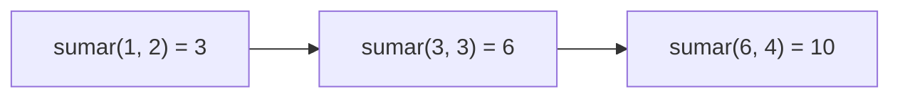

# :material-function-variant: Clase 5

Una función normalmente se escribe y se llama por su cuenta: recibe datos, hace un cálculo, retorna un resultado.
Pero una función también puede recibir otra función como dato de entrada, o construir y devolver una función nueva.

## Funciones de orden superior

Una **función de orden superior** es una función que recibe otra función como argumento, retorna una función como resultado, o ambas cosas a la vez.
La idea suena abstracta al principio, pero tiene un ejemplo concreto: el parámetro `key` de `sorted()` es justamente eso, una función que se le entrega para que indique cómo comparar los elementos.

Esta idea también separa dos estilos de programar. El estilo **imperativo** describe paso a paso cómo se llega a un resultado, normalmente con un bucle y una variable acumuladora.

```python
numeros = [1, 2, 3, 4, 5]

cuadrados = []
for numero in numeros:
    cuadrados.append(numero ** 2)

print(cuadrados)
```

```title="Salida"
[1, 4, 9, 16, 25]
```

El estilo **declarativo** describe qué transformación se quiere aplicar, sin escribir el bucle explícitamente; la transformación en sí se entrega como una función.

```python
def elevar_al_cuadrado(numero):
    return numero ** 2


def aplicar(funcion, valor):
    return funcion(valor)


print(aplicar(elevar_al_cuadrado, 5))   # (1)!
```

1. `25` – `aplicar` no sabe de antemano qué cálculo va a hacer; recibe la función `elevar_al_cuadrado` como dato y la ejecuta sobre `valor`.

!!! note "El nombre de una función también es un valor"

    En la línea `aplicar(elevar_al_cuadrado, 5)`, `elevar_al_cuadrado` se escribe sin paréntesis.
    Escribirlo con paréntesis la ejecutaría de inmediato y pasaría su resultado en vez de la función; sin paréntesis, se pasa la función misma, para que sea `aplicar` quien decida cuándo ejecutarla.

### Funciones como parámetros

El mismo patrón se aplica con cualquier función de validación, no solo con `elevar_al_cuadrado`. Considérese una función que registra una calificación, pero que antes debe validarla de alguna forma; la forma exacta de validar puede cambiar según el contexto.

```python
def es_nota_valida(nota):
    return 0 <= nota <= 100


def es_positivo(nota):
    return nota > 0


def registrar(nota, validador):
    if not validador(nota):                     # (1)!
        print(f"Nota rechazada: {nota}")
        return
    print(f"Nota registrada: {nota}")


registrar(85, es_nota_valida)   # (2)!
registrar(-10, es_positivo)     # (3)!
```

1. `validador` es un parámetro como cualquier otro; en este caso, guarda una función y se ejecuta llamándolo con paréntesis.
2. `Nota registrada: 85`
3. `Nota rechazada: -10`

> `registrar` no necesita conocer de antemano cuántas reglas de validación existen: cualquier función que reciba un número y retorne `True` o `False` puede pasarse como `validador`.

## Decoradores

### Construir un decorador propio

Un decorador es una función que recibe otra función y retorna una función nueva que la reemplaza; la etiqueta `@nombre`, escrita justo encima de una definición, es la forma en que Python aplica esa función automáticamente.

Antes de usar la sintaxis `@`, conviene ver el mecanismo de forma manual.

```python
def medir_tiempo(func):
    def envoltura(*args, **kwargs):         # (1)!
        inicio = time.time()
        resultado = func(*args, **kwargs)   # (2)!
        fin = time.time()
        print(f"{func.__name__} tardó {fin - inicio:.4f} s")
        return resultado                    # (3)!
    return envoltura                        # (4)!


def calcular_suma(hasta):
    return sum(range(hasta))


calcular_suma = medir_tiempo(calcular_suma)   # (5)!
resultado = calcular_suma(1_000_000)
```

1. `*args` recoge cualquier cantidad de argumentos posicionales y `**kwargs` cualquier cantidad de argumentos con nombre, porque `envoltura` no sabe de antemano qué firma tendrá la función que va a envolver.
2. `func` es la función original, recibida como parámetro de `medir_tiempo`; se llama aquí dentro, con los mismos argumentos que recibió `envoltura`.
3. El resultado de `func` se retorna igual, para que quien llame a la versión decorada reciba el mismo valor que habría recibido sin el decorador.
4. `medir_tiempo` no ejecuta nada por sí misma: construye `envoltura` y la retorna, sin llamarla.
5. Esta línea reemplaza `calcular_suma` por la versión envuelta; a partir de aquí, cada llamada a `calcular_suma` en realidad ejecuta `envoltura`.

La línea `calcular_suma = medir_tiempo(calcular_suma)` es exactamente lo que la sintaxis `@` automatiza.

```python
import time


def medir_tiempo(func):
    def envoltura(*args, **kwargs):
        inicio = time.time()
        resultado = func(*args, **kwargs)
        fin = time.time()
        print(f"{func.__name__} tardó {fin - inicio:.4f} s")
        return resultado
    return envoltura


@medir_tiempo                       # (1)!
def calcular_suma(hasta):
    return sum(range(hasta))


calcular_suma(1_000_000)
```

1. `@medir_tiempo`, escrito justo encima de `def calcular_suma`, equivale a la línea manual `calcular_suma = medir_tiempo(calcular_suma)`; Python la ejecuta automáticamente en el momento en que se define la función.

```title="Salida"
calcular_suma tardó 0.0312 s
```

!!! danger "Errores comunes al escribir un decorador"

    Olvidar `return envoltura` al final de la función externa hace que el decorador retorne `None` en vez de una función; la función decorada deja de poder llamarse.

    ```python
    def medir_tiempo(func):
        def envoltura(*args, **kwargs):
            return func(*args, **kwargs)
        # falta return envoltura

    @medir_tiempo
    def saludar():
        print("Hola")

    saludar()
    ```

    ```title="Salida"
    TypeError: 'NoneType' object is not callable
    ```

    Olvidar `*args, **kwargs` en `envoltura` hace que el decorador solo funcione con funciones sin parámetros; cualquier función decorada que reciba argumentos falla al llamarse.

    ```python
    def medir_tiempo(func):
        def envoltura():              # falta *args, **kwargs
            return func()
        return envoltura

    @medir_tiempo
    def calcular_suma(hasta):
        return sum(range(hasta))

    calcular_suma(1_000_000)
    ```

    ```title="Salida"
    TypeError: medir_tiempo.<locals>.envoltura() takes 0 positional arguments but 1 was given
    ```

!!! tip "functools.wraps conserva la identidad de la función original"

    Después de decorar `calcular_suma`, `calcular_suma.__name__` ya no vale `"calcular_suma"`, sino `"envoltura"`, porque `calcular_suma` ahora apunta a esa función interna.
    Lo mismo ocurre con `help(calcular_suma)`, que muestra la documentación de `envoltura` en vez de la original.

    ```python
    from functools import wraps


    def medir_tiempo(func):
        @wraps(func)                    # (1)!
        def envoltura(*args, **kwargs):
            inicio = time.time()
            resultado = func(*args, **kwargs)
            fin = time.time()
            print(f"{func.__name__} tardó {fin - inicio:.4f} s")
            return resultado
        return envoltura
    ```

    1. `@wraps(func)` copia el nombre, la documentación y otros metadatos de `func` hacia `envoltura`, de modo que `calcular_suma.__name__` siga valiendo `"calcular_suma"` después de decorarla, y `help(calcular_suma)` siga mostrando la firma correcta en vez de la de `envoltura`.

### Decoradores encadenados

Varios decoradores pueden aplicarse a la misma función, uno encima de otro. Supóngase que ya existe, además de `medir_tiempo`, un segundo decorador `validar_no_negativo`, que rechaza la llamada si `hasta` es negativo antes de dejar que la función se ejecute.

```python
@medir_tiempo
@validar_no_negativo
def calcular_suma(hasta):
    return sum(range(hasta))
```

Python los aplica de abajo hacia arriba: primero envuelve `calcular_suma` con `validar_no_negativo`, y ese resultado lo vuelve a envolver con `medir_tiempo`.
El código anterior equivale a `calcular_suma = medir_tiempo(validar_no_negativo(calcular_suma))`, así que el decorador más cercano a la función es el que la recibe primero.

## Funciones integradas de orden superior

Python también trae funciones de orden superior ya construidas, listas para usar sin necesidad de escribir un decorador propio.

### `map()`: transformar cada elemento

`map()` aplica una misma función a cada elemento de un iterable, y produce un resultado transformado por cada uno.

```python
def elevar_al_cuadrado(numero):
    return numero ** 2


numeros = [1, 2, 3, 4, 5]
resultado = map(elevar_al_cuadrado, numeros)

print(resultado)          # (1)!
print(list(resultado))    # (2)!
```

1. `<map object at 0x...>` – `map()` retorna un objeto `map`, un iterador que genera los valores uno por uno solo cuando se recorre.
2. `[1, 4, 9, 16, 25]` – `list(...)` recorre ese objeto `map` por completo y junta los resultados en una lista.

!!! danger "Imprimir el objeto map sin convertirlo"

    Imprimir directamente el resultado de `map()`, sin envolverlo en `list(...)`, muestra la dirección del objeto `map` en memoria, no los valores calculados.
    Para ver o recorrer los resultados, hace falta convertir el objeto `map` con `list()`, o recorrerlo con un `for`.

### `filter()`: seleccionar elementos

`filter()` recorre un iterable y conserva únicamente los elementos para los que una función retorna `True`.

```python
def es_par(numero):
    return numero % 2 == 0


numeros = [1, 2, 3, 4, 5, 6, 7, 8]
pares = filter(es_par, numeros)

print(list(pares))   # (1)!
```

1. `[2, 4, 6, 8]` – `filter()` llama a `es_par` con cada número y conserva solo los que devolvieron `True`; el resto se descarta.

A diferencia de `map()`, la función que recibe `filter()` siempre debe retornar un valor booleano: decide si cada elemento se queda o se va, no lo transforma.

### `reduce()`: combinar todos los elementos en uno

`reduce()` no es una función integrada del lenguaje como `map()` y `filter()`: vive en el módulo `functools`, y hay que importarla antes de usarla.

```python
from functools import reduce


def sumar(acumulado, numero):
    return acumulado + numero


numeros = [1, 2, 3, 4]
total = reduce(sumar, numeros)

print(total)   # (1)!
```

1. `10` – `reduce()` combina todos los elementos de la lista en un único valor, aplicando `sumar` repetidamente.

A diferencia de `map()` y `filter()`, la función que recibe `reduce()` toma dos parámetros: el resultado acumulado hasta el momento, y el siguiente elemento de la lista.



`reduce()` primero combina los dos primeros elementos, después combina ese resultado con el tercero, y así sucesivamente hasta agotar la lista.

| Función  | Retorna                                 | Función que recibe                                      | Uso típico                                      |
| -------- | --------------------------------------- | ------------------------------------------------------- | ----------------------------------------------- |
| `map`    | Un objeto `map` (un valor por elemento) | Recibe un elemento, retorna uno transformado            | Transformar cada elemento de una lista          |
| `filter` | Un objeto `filter` (algunos elementos)  | Recibe un elemento, retorna `True`/`False`              | Seleccionar elementos que cumplen una condición |
| `reduce` | Un único valor                          | Recibe acumulado y elemento, retorna el nuevo acumulado | Combinar todos los elementos en un resultado    |

### `sorted()`: ordenar con una función

`sorted()` aplica primero la función `key` a cada elemento, y compara esos resultados en vez de comparar los elementos directamente.

```python
palabras = ["kiwi", "mora", "arándano", "uva", "granadilla"]
ordenadas_por_longitud = sorted(palabras, key=len)   # (1)!

print(ordenadas_por_longitud)
```

1. `key=len` le indica a `sorted()` que compare las palabras por su longitud, no alfabéticamente; `len` se pasa sin paréntesis, igual que cualquier otra función que se entrega como dato.

```title="Salida"
['uva', 'kiwi', 'mora', 'arándano', 'granadilla']
```

!!! note "`key` recibe una función, no un valor"

    `key=len` funciona porque `len` es una función que Python puede llamar internamente con cada elemento, como `len(palabra)`.

### `min()` y `max()`: encontrar extremos con una función

`min()` y `max()` aceptan el mismo parámetro `key` que `sorted()`, y lo usan para encontrar el elemento cuyo valor transformado es el menor o el mayor de todos.

```python
palabras = ["kiwi", "mora", "arándano", "uva", "granadilla"]

mas_corta = min(palabras, key=len)
mas_larga = max(palabras, key=len)

print(mas_corta)   # (1)!
print(mas_larga)   # (2)!
```

1. `uva` – la palabra con menos caracteres.
2. `granadilla` – la palabra con más caracteres.

`map()`, `filter()` y `reduce()` reciben la función como argumento posicional; `sorted()`, `min()` y `max()` la reciben con el nombre `key`, pero el mecanismo de fondo es el mismo en los dos casos.

### Combinar `map()` y `filter()`

`map()` y `filter()` se pueden encadenar, porque ambas reciben un iterable y retornan un objeto que también puede recorrerse como iterable.

```python
def es_par(numero):
    return numero % 2 == 0


def elevar_al_cuadrado(numero):
    return numero ** 2


numeros = [1, 2, 3, 4, 5, 6, 7, 8]

pares = filter(es_par, numeros)                       # (1)!
cuadrados_de_pares = map(elevar_al_cuadrado, pares)   # (2)!

print(list(cuadrados_de_pares))
```

1. Primero se conservan solo los números pares.
2. El resultado filtrado se le pasa directamente a `map()`, sin necesidad de convertirlo a lista antes.

```title="Salida"
[4, 16, 36, 64]
```

Este tipo de encadenamiento funciona, pero anidar varias llamadas de `map()` y `filter()` puede volverse difícil de leer a medida que crecen. Las comprensiones de listas ofrecen una forma más clara de escribir esta misma composición en una sola expresión.

## Ejercicios prácticos

### Contador de llamadas

=== "Enunciado"
    Un sistema necesita saber cuántas veces se invoca una función determinada durante la ejecución del programa, sin modificar el código interno de esa función.

    1. Escriba un decorador `contar_llamadas(func)` que lleve un conteo de cuántas veces se ha llamado la función decorada, y lo imprima en cada llamada.
    2. Aplíquelo con `@contar_llamadas` a una función `procesar_pedido(id_pedido)` que imprima el número de pedido recibido.
    3. Llame `procesar_pedido` tres veces con distintos números de pedido.

=== "Solución"
    ```python
    def contar_llamadas(func):
        contador = {"veces": 0}   # (1)!

        def envoltura(*args, **kwargs):
            contador["veces"] += 1
            print(f"Llamada número {contador['veces']} a {func.__name__}")
            return func(*args, **kwargs)
        return envoltura


    @contar_llamadas
    def procesar_pedido(id_pedido):
        print(f"Procesando pedido {id_pedido}")


    procesar_pedido(101)
    procesar_pedido(102)
    procesar_pedido(103)
    ```

    1. El conteo se guarda en un diccionario, en vez de una variable simple, porque `envoltura` necesita modificarlo en cada llamada; un diccionario definido en `contar_llamadas` permanece disponible entre llamadas sucesivas de `envoltura`.

    !!! example "Caso de ejecución"

        ```
        Llamada número 1 a procesar_pedido
        Procesando pedido 101
        Llamada número 2 a procesar_pedido
        Procesando pedido 102
        Llamada número 3 a procesar_pedido
        Procesando pedido 103
        ```

### Tarifas de encomiendas

=== "Enunciado"
    Antes de publicar sus tarifas, una empresa de encomiendas debe agregarle a cada una el 13% de impuesto de ventas.

    1. Escriba una función `agregar_impuesto(tarifa)` que retorne la tarifa con el 13% agregado.
    2. Use `map()` para aplicar esa función a una lista de tarifas.
    3. Imprima la lista resultante convertida a `list`.

=== "Solución"
    ```python
    def agregar_impuesto(tarifa):
        return round(tarifa * 1.13, 2)


    tarifas = [1000, 2500, 15000, 8990]
    tarifas_con_impuesto = list(map(agregar_impuesto, tarifas))

    print(tarifas_con_impuesto)
    ```

    !!! example "Caso de ejecución"

        ```
        [1130.0, 2825.0, 16950.0, 10158.7]
        ```

### Palabras largas

=== "Enunciado"
    Un buscador debe descartar las palabras demasiado cortas antes de indexarlas, porque no aportan información útil a la búsqueda.

    1. Escriba una función `es_palabra_larga(palabra)` que retorne `True` si la palabra tiene más de 4 caracteres.
    2. Use `filter()` para conservar solo las palabras largas de una lista de palabras.
    3. Imprima la lista resultante convertida a `list`.

=== "Solución"
    ```python
    def es_palabra_larga(palabra):
        return len(palabra) > 4


    palabras = ["sol", "montaña", "río", "biblioteca", "paz", "computadora"]
    palabras_largas = list(filter(es_palabra_larga, palabras))

    print(palabras_largas)
    ```

    !!! example "Caso de ejecución"

        ```
        ['montaña', 'biblioteca', 'computadora']
        ```

### Distancia en el arcade

=== "Enunciado"
    Una máquina arcade guarda la distancia recorrida por un jugador en cada intento de una carrera. ¿Cuál fue su mejor intento, sin recorrer la lista manualmente con un `for`?

    1. Escriba una función `mayor(acumulado, distancia)` que retorne el mayor entre los dos valores recibidos.
    2. Use `reduce()` con esa función para obtener la mayor distancia de una lista de intentos.
    3. Imprima el resultado.

=== "Solución"
    ```python
    from functools import reduce


    def mayor(acumulado, distancia):
        return acumulado if acumulado > distancia else distancia


    distancias = [340, 520, 180, 610, 495]
    mejor_distancia = reduce(mayor, distancias)

    print(mejor_distancia)
    ```

    !!! example "Caso de ejecución"

        ```
        610
        ```

## Reporte de gastos de un viaje

Un grupo de estudiantes registra los gastos de un viaje de graduación, cada uno con una categoría y un monto. El reporte debe transformar, filtrar y resumir esos datos sin escribir bucles explícitos para cada operación.

**Cada gasto se representa como un diccionario:**

| Campo       | Descripción                                       |
| ----------- | ------------------------------------------------- |
| `categoria` | Texto: `"transporte"`, `"comida"` o `"hospedaje"` |
| `monto`     | Número, en colones, sin impuesto                  |

**Menú principal:**

```
=== REPORTE DE GASTOS ===
1. Registrar gasto
2. Ver gastos con impuesto de servicio (10%)
3. Ver solo gastos de comida
4. Ver el gasto más alto
5. Ver el total del viaje
6. Salir
```

**Requisitos:**

1. La opción 1 solicita categoría y monto, valida que el monto sea un número positivo con `try-except`, y solo acepta una de las tres categorías definidas.
2. La opción 2 usa `map()` con una función que agrega 10% a cada monto, y muestra cada gasto junto con su monto ajustado.
3. La opción 3 usa `filter()` con una función que revisa la categoría, y muestra únicamente los gastos de comida.
4. La opción 4 usa `reduce()` para encontrar el gasto de mayor monto, sin usar `max()`.
5. La opción 5 usa `reduce()` para sumar el monto de todos los gastos registrados.

### Solución

#### Programa completo

```python
from functools import reduce


def es_monto_valido(monto):
    return isinstance(monto, (int, float)) and monto > 0


def agregar_servicio(gasto):
    return {"categoria": gasto["categoria"], "monto": round(gasto["monto"] * 1.10, 2)}   # (1)!


def es_de_comida(gasto):
    return gasto["categoria"] == "comida"


def mayor_gasto(acumulado, gasto):
    return acumulado if acumulado["monto"] > gasto["monto"] else gasto


def sumar_montos(acumulado, gasto):
    return acumulado + gasto["monto"]


def registrar_gasto(gastos):
    categoria = input("Categoría (transporte/comida/hospedaje): ").strip().lower()

    if categoria not in ("transporte", "comida", "hospedaje"):
        print(f"Categoría inválida: '{categoria}'.")
        return

    try:
        monto = float(input("Monto: "))
    except ValueError:
        print("El monto debe ser numérico.")
        return

    if not es_monto_valido(monto):
        print("El monto debe ser un número positivo.")
        return

    gastos.append({"categoria": categoria, "monto": monto})
    print(f"Gasto de '{categoria}' registrado.")


def ver_con_servicio(gastos):
    if not gastos:
        print("No hay gastos registrados.")
        return

    print("\n--- Gastos con impuesto de servicio ---")
    for gasto in map(agregar_servicio, gastos):
        print(f"{gasto['categoria']}: ₡{gasto['monto']:,.2f}")


def ver_comida(gastos):
    if not gastos:
        print("No hay gastos registrados.")
        return

    de_comida = list(filter(es_de_comida, gastos))
    if not de_comida:
        print("No hay gastos de comida registrados.")
        return

    print("\n--- Gastos de comida ---")
    for gasto in de_comida:
        print(f"₡{gasto['monto']:,.2f}")


def ver_gasto_mas_alto(gastos):
    if not gastos:
        print("No hay gastos registrados.")
        return

    gasto_alto = reduce(mayor_gasto, gastos)   # (2)!
    print(f"Gasto más alto: {gasto_alto['categoria']} — ₡{gasto_alto['monto']:,.2f}")


def ver_total(gastos):
    if not gastos:
        print("No hay gastos registrados.")
        return

    total = reduce(sumar_montos, gastos, 0)   # (3)!
    print(f"Total del viaje: ₡{total:,.2f}")


gastos = []

while True:
    print("\n=== REPORTE DE GASTOS ===")
    print("1. Registrar gasto")
    print("2. Ver gastos con impuesto de servicio (10%)")
    print("3. Ver solo gastos de comida")
    print("4. Ver el gasto más alto")
    print("5. Ver el total del viaje")
    print("6. Salir")

    opcion = input("Opción: ")

    if opcion == "1":
        registrar_gasto(gastos)
    elif opcion == "2":
        ver_con_servicio(gastos)
    elif opcion == "3":
        ver_comida(gastos)
    elif opcion == "4":
        ver_gasto_mas_alto(gastos)
    elif opcion == "5":
        ver_total(gastos)
    elif opcion == "6":
        print("¡Buen viaje!")
        break
    else:
        print("Opción inválida.")
```

1. Retorna un diccionario nuevo con el monto ajustado, en vez de modificar el diccionario original; así el gasto guardado en `gastos` conserva su monto sin impuesto.
2. `reduce()` recorre la lista de gastos comparando montos de dos en dos, igual que en el ejercicio "Distancia en el arcade", pero aquí cada elemento es un diccionario en vez de un número.
3. El tercer argumento de `reduce()`, `0`, es el valor inicial del acumulado. Sin él, `reduce()` tomaría el primer gasto como punto de partida, y `sumar_montos` fallaría al intentar sumarle un número a un diccionario.

!!! example "Casos de ejecución"

    === "Registro y servicio"
        ```
        === REPORTE DE GASTOS ===
        1. Registrar gasto
        ...
        Opción: 1
        Categoría (transporte/comida/hospedaje): transporte
        Monto: 45000
        Gasto de 'transporte' registrado.

        Opción: 1
        Categoría (transporte/comida/hospedaje): comida
        Monto: 12000
        Gasto de 'comida' registrado.

        Opción: 1
        Categoría (transporte/comida/hospedaje): hospedaje
        Monto: 80000
        Gasto de 'hospedaje' registrado.

        Opción: 2

        --- Gastos con impuesto de servicio ---
        transporte: ₡49,500.00
        comida: ₡13,200.00
        hospedaje: ₡88,000.00
        ```
    === "Comida y gasto más alto"
        ```
        Opción: 3

        --- Gastos de comida ---
        ₡12,000.00

        Opción: 4
        Gasto más alto: hospedaje — ₡80,000.00
        ```
    === "Total del viaje"
        ```
        Opción: 5
        Total del viaje: ₡137,000.00
        ```
    === "Monto inválido"
        ```
        Opción: 1
        Categoría (transporte/comida/hospedaje): comida
        Monto: -500
        El monto debe ser un número positivo.
        ```
