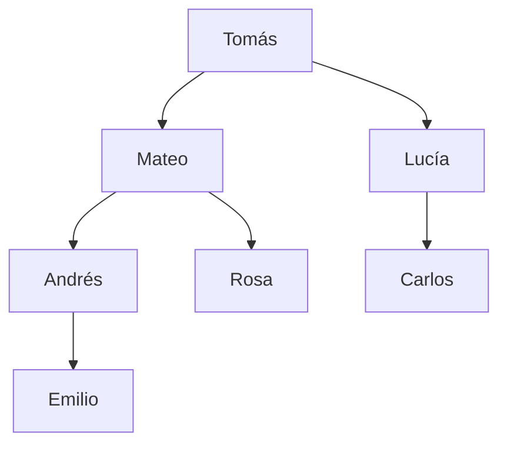
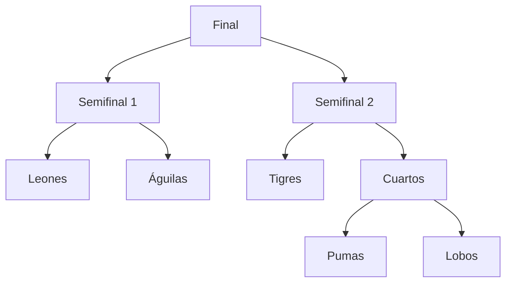

<!-- Colocar formato matemático -->
<script id="MathJax-script" async src="https://unpkg.com/mathjax@3/es5/tex-mml-chtml.js"></script>
<script>
  window.MathJax = {
    tex: {
      inlineMath: [["\\(", "\\)"]],
      displayMath: [["\\[", "\\]"]],
      processEscapes: true,
      processEnvironments: true
    },
    options: {
      ignoreHtmlClass: ".*|",
      processHtmlClass: "arithmatex"
    }
  };
</script>

# :material-file-tree: Clase 7

Una lista guarda datos uno detrás de otro, pero mucha información no forma una fila: los descendientes de una persona, las carpetas de un computador o los partidos de un torneo se organizan en niveles.
Esta clase presenta los árboles binarios, la estructura que representa esas jerarquías, y cómo medirlos con recursión.

## Árboles binarios

### Estructura

Un **árbol** es un conjunto de **nodos** conectados en jerarquía.
Cada nodo guarda un valor y de él cuelgan otros nodos.

En un **árbol binario**, cada nodo tiene como máximo dos hijos: el **hijo izquierdo** y el **hijo derecho**.
El siguiente árbol muestra los descendientes de una persona.
Cada persona tiene como máximo dos hijos.



### Terminología

| Término  | Significado                                 | En el ejemplo                               |
| -------- | ------------------------------------------- | -------------------------------------------------- |
| Raíz     | Nodo sin padre, donde empieza el árbol      | Tomás                                              |
| Padre    | Nodo del que cuelga otro nodo               | Mateo es padre de Andrés y Rosa                    |
| Hijo     | Nodo que cuelga directamente de otro        | Andrés y Rosa son hijos de Mateo                   |
| Hoja     | Nodo sin hijos                              | Rosa, Carlos y Emilio                              |
| Subárbol | Un nodo junto con todos sus descendientes   | El subárbol de Mateo: Mateo, Andrés, Rosa y Emilio |
| Nivel    | Distancia a la raíz, que está en el nivel 0 | Andrés está en el nivel 2                          |
| Altura   | Mayor nivel que existe en el árbol          | 3, el nivel de Emilio                              |
| Tamaño   | Cantidad total de nodos                     | 7                                                  |

### Formas de un árbol

La forma del árbol determina cuántos nodos puede tener y qué tan rápido se recorre.

=== "Lleno"
    Todo nodo tiene 0 o 2 hijos.

    ```mermaid
    flowchart TD
        A --> B
        A --> C
        B --> D
        B --> E
    ```
=== "Completo"
    Todos los niveles están llenos, salvo quizá el último, que se llena de izquierda a derecha.

    ```mermaid
    flowchart TD
        A --> B
        A --> C
        B --> D
        B --> E
        C --> F
    ```
=== "Degenerado"
    Todo nodo tiene un solo hijo. El árbol se comporta como una lista.

    ```mermaid
    flowchart TD
        A --> B
        B --> C
        C --> D
    ```

La altura limita el tamaño. Con altura $h$, un árbol tiene como mínimo $h + 1$ nodos (degenerado) y como máximo $2^{h+1} - 1$, cuando todos los niveles están llenos. Con altura 3, el tamaño está entre 4 y 15.

## La clase Nodo

Un nodo guarda su valor y una referencia a cada uno de sus hijos.

```python
class Nodo:
    def __init__(self, valor, izquierdo=None, derecho=None):
        self.valor = valor
        self.izquierdo = izquierdo   # (1)!
        self.derecho = derecho
```

1. Un nodo sin hijo en ese lado guarda `None`.

Como cada hijo es otro `Nodo`, un árbol se arma anidando nodos. La indentación sigue la forma del diagrama.

```python
arbol = Nodo("Tomás",
             Nodo("Mateo",
                  Nodo("Andrés", Nodo("Emilio")),
                  Nodo("Rosa")),
             Nodo("Lucía",
                  Nodo("Carlos")))

print(arbol.valor)                       # (1)!
print(arbol.izquierdo.valor)             # (2)!
print(arbol.izquierdo.derecho.valor)     # (3)!
print(arbol.derecho.derecho)             # (4)!
```

1. `Tomás` – la variable `arbol` guarda la raíz, y desde ella se llega a todo el árbol.
2. `Mateo` – el hijo izquierdo de la raíz.
3. `Rosa` – el hijo derecho de Mateo.
4. `None` – Lucía solo tiene hijo izquierdo.

!!! danger "Leer un atributo de None"

    Lucía no tiene hijo derecho, así que `arbol.derecho.derecho` es `None`, y `None` no tiene atributos.

    ```python
    print(arbol.derecho.derecho.valor)   # (1)!
    ```

    1. `AttributeError: 'NoneType' object has no attribute 'valor'` – el programa se detiene.

    Antes de usar un nodo hay que comprobar que existe.

## Recursión sobre árboles

Cada hijo de un nodo es la raíz de un subárbol más pequeño con la misma estructura.
Por eso las medidas y las búsquedas en un árbol se calculan con recursión: se resuelve el problema en cada subárbol y se combinan los resultados.

!!! note "El caso base es el árbol vacío"

    Un subárbol vacío es `None`. Todas las funciones de esta clase lo tratan primero, para no leer atributos de un nodo que no existe.

### Tamaño

El tamaño de un árbol es 1, por el nodo actual, más el tamaño de cada subárbol.

```python
def tamano(nodo):
    if nodo is None:
        return 0                                                # (1)!
    return 1 + tamano(nodo.izquierdo) + tamano(nodo.derecho)    # (2)!


print(tamano(arbol))   # (3)!
```

1. Un árbol vacío no tiene nodos.
2. Se cuenta el nodo actual y se le suman los nodos de sus dos subárboles.
3. `7` – el tamaño del árbol de Tomás.

### Cantidad de hojas

Si un nodo no tiene hijos, es una hoja y aporta 1; es un segundo caso base.

```python
def contar_hojas(nodo):
    if nodo is None:
        return 0
    if nodo.izquierdo is None and nodo.derecho is None:
        return 1
    return contar_hojas(nodo.izquierdo) + contar_hojas(nodo.derecho)


print(contar_hojas(arbol))   # (1)!
```

1. `3` – Rosa, Carlos y Emilio.

### Altura

La altura de un nodo es 1 más la altura de su subárbol más alto. `max()` elige entre los dos.

```python
def altura(nodo):
    if nodo is None:
        return -1
    return 1 + max(altura(nodo.izquierdo), altura(nodo.derecho))


print(altura(arbol))            # (1)!
print(altura(arbol.derecho))    # (2)!
```

1. `3` – el camino más largo baja de Tomás a Emilio.
2. `1` – el subárbol de Lucía solo llega hasta Carlos.

!!! note "¿Por qué el árbol vacío vale -1?"

    Con -1 en el caso base, una hoja queda con altura 0 y un árbol de un solo nodo también tiene altura 0.

### Buscar un valor

Buscar un valor es una pregunta de sí o no.
La función responde `True` en cuanto encuentra el valor y solo sigue con los subárboles si el nodo actual no coincide.

```python
def contiene(nodo, valor):
    if nodo is None:
        return False
    if nodo.valor == valor:
        return True
    return contiene(nodo.izquierdo, valor) or contiene(nodo.derecho, valor)   # (1)!


print(contiene(arbol, "Rosa"))    # (2)!
print(contiene(arbol, "Pedro"))   # (3)!
```

1. Si el subárbol izquierdo ya retorna `True`, `or` no evalúa el derecho.
2. `True` – Rosa es hija de Mateo.
3. `False` – ningún nodo tiene ese valor y la recursión llega hasta las hojas.

### Nodos de un nivel

Para contar los nodos de un nivel, la función recibe un parámetro más: cuántos niveles faltan por bajar.
Cada llamada a un hijo resta 1 y cuando llega a 0 el nodo actual está en el nivel buscado.

```python
def contar_en_nivel(nodo, nivel):
    if nodo is None:
        return 0
    if nivel == 0:
        return 1
    return contar_en_nivel(nodo.izquierdo, nivel - 1) + contar_en_nivel(nodo.derecho, nivel - 1)


print(contar_en_nivel(arbol, 2))   # (1)!
print(contar_en_nivel(arbol, 3))   # (2)!
```

1. `3` – Andrés, Rosa y Carlos.
2. `1` – solo Emilio.

## Ejercicios prácticos

### Identificar los elementos de un árbol

=== "Enunciado"
    Considere el siguiente árbol.

    ```python
    raiz = Nodo(8,
                Nodo(3,
                     Nodo(1),
                     Nodo(6, Nodo(4), Nodo(7))),
                Nodo(10,
                     None,
                     Nodo(14, Nodo(13))))
    ```

    1. Indique la raíz y las hojas.
    2. Indique el tamaño y la altura.
    3. Indique el padre y el nivel del nodo 13.

=== "Solución"
    1. La raíz es 8. Las hojas son 1, 4, 7 y 13.
    2. El tamaño es 9. La altura es 3, porque los caminos más largos, 8, 3, 6, 4 y 8, 10, 14, 13, tienen cuatro nodos.
    3. El padre del 13 es el 14, y su nivel es 3.

### Valor máximo

=== "Enunciado"
    Con el árbol del ejercicio anterior:

    1. Escriba una función recursiva `mayor` que retorne el mayor valor del árbol.
    2. Imprima el resultado para `raiz`.

    El árbol vacío no tiene valores, así que su resultado no debe influir en `max()`.

=== "Solución"
    ```python
    def mayor(nodo):
        if nodo is None:
            return float("-inf")   # (1)!
        return max(nodo.valor, mayor(nodo.izquierdo), mayor(nodo.derecho))


    print(mayor(raiz))
    ```

    1. `-inf` es menor que cualquier número, así que un subárbol vacío nunca gana en `max()`. Con 0 el resultado sería incorrecto si todos los valores fueran negativos.

    !!! example "Caso de ejecución"

        ```
        14
        ```

### Nodos con un solo hijo

=== "Enunciado"
    Con el mismo árbol:

    1. Escriba una función recursiva que cuente los nodos que tienen exactamente un hijo.
    2. Imprima el resultado para `raiz`.

=== "Solución"
    ```python
    def contar_un_hijo(nodo):
        if nodo is None:
            return 0

        tiene_izquierdo = nodo.izquierdo is not None
        tiene_derecho = nodo.derecho is not None
        propio = 1 if tiene_izquierdo != tiene_derecho else 0   # (1)!

        return propio + contar_un_hijo(nodo.izquierdo) + contar_un_hijo(nodo.derecho)


    print(contar_un_hijo(raiz))
    ```

    1. Las dos condiciones son distintas solo cuando el nodo tiene un hijo: una hoja tiene ambas en `False` y un nodo completo, ambas en `True`.

    !!! example "Caso de ejecución"

        ```
        2
        ```

### Árboles iguales

=== "Enunciado"
    Dos árboles son iguales si tienen la misma forma y el mismo valor en cada posición.

    ```python
    a = Nodo(5, Nodo(2), Nodo(9))
    b = Nodo(5, Nodo(2), Nodo(9))
    c = Nodo(5, Nodo(9), Nodo(2))
    ```

    1. Escriba una función recursiva `son_iguales` que reciba dos nodos y retorne `True` si sus árboles son iguales.
    2. Imprima el resultado para `a` y `b`, y para `a` y `c`.

=== "Solución"
    ```python
    def son_iguales(primero, segundo):
        if primero is None and segundo is None:
            return True
        if primero is None or segundo is None:   # (1)!
            return False
        return (primero.valor == segundo.valor
                and son_iguales(primero.izquierdo, segundo.izquierdo)
                and son_iguales(primero.derecho, segundo.derecho))


    print(son_iguales(a, b))
    print(son_iguales(a, c))
    ```

    1. Solo uno de los dos es `None`, así que las formas difieren.

    !!! example "Caso de ejecución"

        ```
        True
        False
        ```

## Ejercicio integrador — Torneo eliminatorio

Un torneo eliminatorio se representa como un árbol: las hojas son los equipos inscritos y cada nodo interno es un partido, cuyos hijos son los dos equipos, o los dos partidos previos, que lo alimentan.

El colegio organiza un torneo con cinco equipos. Tigres pasa directo a la semifinal, y el cuadro queda así:



**Menú principal:**

```
=== TORNEO ELIMINATORIO ===
1. Ver cantidad de equipos
2. Ver cantidad de partidos
3. Ver cantidad de rondas
4. Ver equipos y rondas de un lado del cuadro
5. Buscar un nombre en el cuadro
6. Salir
```

**Requisitos:**

1. Defina la clase `Nodo` y las funciones recursivas `tamano`, `contar_hojas`, `altura` y `contiene`.
2. Construya el cuadro del diagrama anidando nodos.
3. La opción 1 cuenta los equipos, que son las hojas.
4. La opción 2 cuenta los partidos, que son los nodos que no son hojas.
5. La opción 3 muestra la altura del árbol completo, que es la cantidad de rondas.
6. La opción 4 solicita el lado, `I` o `D`, y muestra cuántos equipos y cuántas rondas tiene el subárbol de ese lado. Cualquier otro valor debe rechazarse.
7. La opción 5 solicita un nombre y usa `contiene` para indicar si aparece en el cuadro, ya sea como equipo o como partido.

### Solución

```python
class Nodo:
    def __init__(self, valor, izquierdo=None, derecho=None):
        self.valor = valor
        self.izquierdo = izquierdo
        self.derecho = derecho


def tamano(nodo):
    if nodo is None:
        return 0
    return 1 + tamano(nodo.izquierdo) + tamano(nodo.derecho)


def contar_hojas(nodo):
    if nodo is None:
        return 0
    if nodo.izquierdo is None and nodo.derecho is None:
        return 1
    return contar_hojas(nodo.izquierdo) + contar_hojas(nodo.derecho)


def altura(nodo):
    if nodo is None:
        return -1
    return 1 + max(altura(nodo.izquierdo), altura(nodo.derecho))


def contiene(nodo, valor):
    if nodo is None:
        return False
    if nodo.valor == valor:
        return True
    return contiene(nodo.izquierdo, valor) or contiene(nodo.derecho, valor)


torneo = Nodo("Final",
              Nodo("Semifinal 1", Nodo("Leones"), Nodo("Águilas")),
              Nodo("Semifinal 2",
                   Nodo("Tigres"),
                   Nodo("Cuartos", Nodo("Pumas"), Nodo("Lobos"))))

while True:
    print("\n=== TORNEO ELIMINATORIO ===")
    print("1. Ver cantidad de equipos")
    print("2. Ver cantidad de partidos")
    print("3. Ver cantidad de rondas")
    print("4. Ver equipos y rondas de un lado del cuadro")
    print("5. Buscar un nombre en el cuadro")
    print("6. Salir")

    opcion = input("Opción: ")

    if opcion == "1":
        print(f"Equipos: {contar_hojas(torneo)}")

    elif opcion == "2":
        partidos = tamano(torneo) - contar_hojas(torneo)   # (1)!
        print(f"Partidos: {partidos}")

    elif opcion == "3":
        print(f"Rondas: {altura(torneo)}")

    elif opcion == "4":
        lado = input("Lado (I/D): ").strip().upper()

        if lado == "I":
            subarbol = torneo.izquierdo   # (2)!
        elif lado == "D":
            subarbol = torneo.derecho
        else:
            print("Lado inválido.")
            continue

        print(f"Equipos: {contar_hojas(subarbol)}")
        print(f"Rondas: {altura(subarbol)}")

    elif opcion == "5":
        nombre = input("Nombre: ").strip()

        if contiene(torneo, nombre):   # (3)!
            print(f"'{nombre}' está en el cuadro.")
        else:
            print(f"'{nombre}' no está en el cuadro.")

    elif opcion == "6":
        print("¡Hasta luego!")
        break

    else:
        print("Opción inválida.")
```

1. Los nodos que no son hojas son los partidos, así que se restan las hojas al tamaño.
2. Cada hijo de la final es la raíz de un subárbol, y las mismas funciones se aplican a él sin cambios.
3. La búsqueda recorre el cuadro completo, así que también encuentra nombres de partidos como `Final`.

!!! example "Casos de ejecución"

    === "Equipos, partidos y rondas"
        ```
        === TORNEO ELIMINATORIO ===
        1. Ver cantidad de equipos
        ...
        Opción: 1
        Equipos: 5

        Opción: 2
        Partidos: 4

        Opción: 3
        Rondas: 3
        ```
    === "Lado del cuadro"
        ```
        Opción: 4
        Lado (I/D): I
        Equipos: 2
        Rondas: 1

        Opción: 4
        Lado (I/D): d
        Equipos: 3
        Rondas: 2
        ```
    === "Buscar un nombre"
        ```
        Opción: 5
        Nombre: Tigres
        'Tigres' está en el cuadro.

        Opción: 5
        Nombre: Osos
        'Osos' no está en el cuadro.
        ```
    === "Lado inválido"
        ```
        Opción: 4
        Lado (I/D): X
        Lado inválido.
        ```
