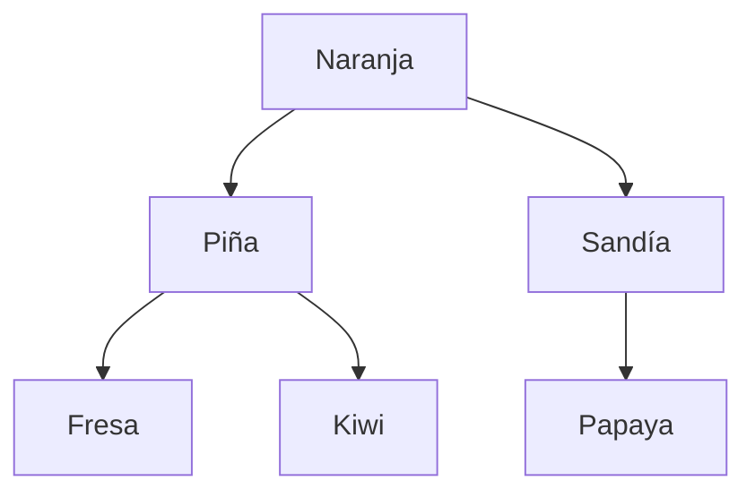
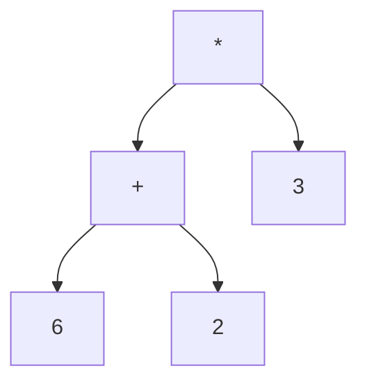
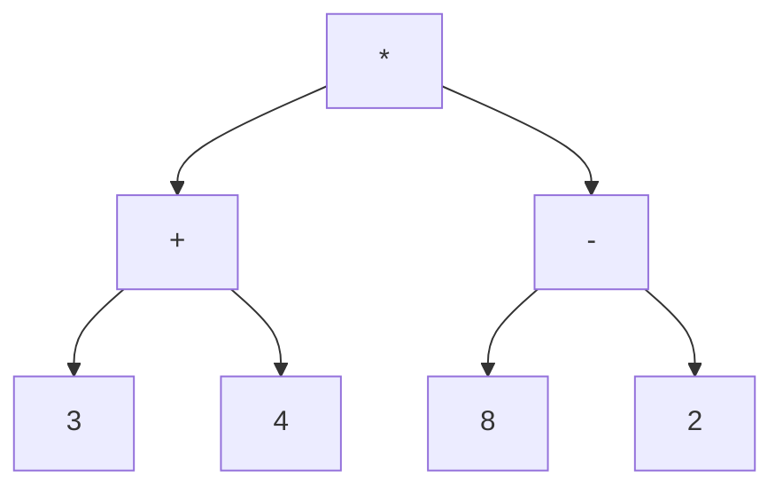

<!-- Colocar formato matemático -->
<script id="MathJax-script" async src="https://unpkg.com/mathjax@3/es5/tex-mml-chtml.js"></script>
<script>
  window.MathJax = {
    tex: {
      inlineMath: [["\\(", "\\)"]],
      displayMath: [["\\[", "\\]"]],
      processEscapes: true,
      processEnvironments: true
    },
    options: {
      ignoreHtmlClass: ".*|",
      processHtmlClass: "arithmatex"
    }
  };
</script>

# :material-walk: Clase 8

Las funciones de la clase anterior visitaban todos los nodos del árbol, pero el orden no importaba: el tamaño es el mismo sin importar qué nodo se cuente primero.
Otros problemas sí dependen del orden, como imprimir una jerarquía o calcular una expresión.
Esta clase presenta los recorridos en profundidad, que fijan ese orden, primero con recursión y después con una pila. Al final se ve el recorrido por niveles, que usa una cola.

## Recorridos en profundidad

Recorrer un árbol es **visitar cada nodo exactamente una vez**. Visitar significa hacer algo con el nodo, como imprimir su valor o guardarlo en una lista.

Un recorrido **en profundidad** (DFS, *depth-first search*) baja hasta una hoja antes de pasar al siguiente hermano.
En cada nodo hay tres tareas: visitar el nodo, recorrer el subárbol izquierdo y recorrer el subárbol derecho.
El izquierdo siempre va antes que el derecho, así que solo falta decidir cuándo se visita el nodo. Cada decisión da un recorrido distinto.

| Recorrido | Orden                     |
| --------- | ------------------------- |
| Preorden  | raíz, izquierdo, derecho  |
| En orden  | izquierdo, raíz, derecho  |
| Postorden | izquierdo, derecho, raíz  |

El resto de la clase usa este árbol de frutas, donde Papaya es el hijo derecho de Sandía.



### Recorridos recursivos

Los tres recorridos tienen la estructura de las funciones de la clase anterior: el árbol vacío es el caso base y cada subárbol se resuelve con una llamada recursiva.
Cada función retorna una lista con los valores en el orden de visita, y usa la clase `Nodo` de la clase anterior.

```python
frutas = Nodo("Naranja",
              Nodo("Piña", Nodo("Fresa"), Nodo("Kiwi")),
              Nodo("Sandía", None, Nodo("Papaya")))
```

> Las tres funciones solo se diferencian en la posición de `nodo.valor`.

=== "Preorden"
    ```python
    def preorden(nodo):
        if nodo is None:
            return []
        return [nodo.valor] + preorden(nodo.izquierdo) + preorden(nodo.derecho)   # (1)!
    ```

    1. El valor del nodo va antes de las listas de sus subárboles.

=== "En orden"
    ```python
    def en_orden(nodo):
        if nodo is None:
            return []
        return en_orden(nodo.izquierdo) + [nodo.valor] + en_orden(nodo.derecho)   # (1)!
    ```

    1. El valor del nodo queda entre la lista del subárbol izquierdo y la del derecho.

=== "Postorden"
    ```python
    def postorden(nodo):
        if nodo is None:
            return []
        return postorden(nodo.izquierdo) + postorden(nodo.derecho) + [nodo.valor]   # (1)!
    ```

    1. El valor del nodo va después de las listas de sus subárboles.

```python
print(preorden(frutas))
print(en_orden(frutas))
print(postorden(frutas))
```

```
['Naranja', 'Piña', 'Fresa', 'Kiwi', 'Sandía', 'Papaya']
['Fresa', 'Piña', 'Kiwi', 'Naranja', 'Sandía', 'Papaya']
['Fresa', 'Kiwi', 'Piña', 'Papaya', 'Sandía', 'Naranja']
```

### ¿Qué orden usar?

Un árbol también puede representar una expresión aritmética: las hojas son números y los demás nodos son operadores.
Este árbol representa el cálculo $(6 + 2) \times 3$.



```python
expresion = Nodo("*", Nodo("+", Nodo(6), Nodo(2)), Nodo(3))

print(preorden(expresion))
print(en_orden(expresion))
print(postorden(expresion))
```

```
['*', '+', 6, 2, 3]
[6, '+', 2, '*', 3]
[6, 2, '+', 3, '*']
```

| Recorrido | Resultado   | Cuándo conviene                                                                                 |
| --------- | ----------- | ----------------------------------------------------------------------------------------------- |
| Preorden  | `* + 6 2 3` | El padre se procesa antes que sus hijos, como al copiar un árbol o imprimir una jerarquía.      |
| En orden  | `6 + 2 * 3` | La expresión se lee como se escribe habitualmente.                                              |
| Postorden | `6 2 + 3 *` | Los hijos se procesan antes que el padre, como al calcular un valor que depende de ellos.       |

Las funciones `altura` y `tamano` de la clase anterior ya seguían el patrón del postorden: combinan los resultados de los hijos al final.

!!! danger "El en orden pierde los paréntesis"

    El resultado `6 + 2 * 3` vale 12 si se respeta la prioridad de la multiplicación, pero el árbol representa un cálculo que vale 24.
    El postorden no tiene este problema: `6 2 + 3 *` solo se puede leer de una forma, porque la suma ocurre antes de multiplicar por 3.

## Recorridos iterativos con pila

### ¿Por qué evitar la recursión?

Cada llamada recursiva queda pendiente en la pila de llamadas de Python, que admite unas 1000 llamadas.
Un árbol degenerado, que se comporta como una lista, supera ese límite.

```python
profundo = None
for numero in range(2000):
    profundo = Nodo(numero, profundo)   # (1)!

print(preorden(profundo))
```

1. Cada nodo nuevo recibe el árbol anterior como hijo izquierdo, así que el resultado es una cadena de 2000 nodos.

```
RecursionError: maximum recursion depth exceeded
```

La solución es no depender de la pila de llamadas y administrar una propia.
Una **pila** es una estructura donde el último elemento que entra es el primero que sale. En Python es una lista: `append` agrega al tope y `pop()` retira el tope.

### Preorden iterativo

La pila guarda los nodos que faltan por visitar.
Mientras no esté vacía, se saca un nodo, se visita y se apilan sus hijos.
Un `None` apilado cumple el papel del caso base: al sacarlo, no se hace nada.

```python
def preorden_iterativo(raiz):
    resultado = []
    pila = [raiz]
    while pila:
        nodo = pila.pop()
        if nodo is None:
            continue
        resultado.append(nodo.valor)
        pila.append(nodo.derecho)     # (1)!
        pila.append(nodo.izquierdo)
    return resultado


print(len(preorden_iterativo(profundo)))   # (2)!
```

1. El derecho se apila primero porque la pila saca el último que entró: así el izquierdo se visita antes.
2. `2000` – el árbol que falló con recursión se recorre completo.

### En orden iterativo

En el en orden no se puede visitar el nodo apenas sale de la pila, porque antes hay que visitar todo su subárbol izquierdo.
La solución es bajar por la izquierda apilando cada nodo y visitar al desapilar. Después se continúa con el subárbol derecho del nodo visitado.

```python
def en_orden_iterativo(raiz):
    resultado = []
    pila = []
    actual = raiz
    while actual is not None or pila:   # (1)!
        while actual is not None:
            pila.append(actual)
            actual = actual.izquierdo
        actual = pila.pop()
        resultado.append(actual.valor)
        actual = actual.derecho
    return resultado
```

1. El recorrido sigue mientras haya un nodo por explorar o nodos esperando en la pila.

La tabla sigue el recorrido de `frutas`. La pila se escribe con el tope a la derecha.

| Nodo visitado | Pila después de visitarlo | Siguiente `actual` |
| ------------- | ------------------------- | ------------------ |
| Fresa         | Naranja, Piña             | `None`             |
| Piña          | Naranja                   | Kiwi               |
| Kiwi          | Naranja                   | `None`             |
| Naranja       | vacía                     | Sandía             |
| Sandía        | vacía                     | Papaya             |
| Papaya        | vacía                     | `None`             |

### Postorden iterativo

El postorden es el más difícil de hacer con una pila, porque la raíz se visita después de sus dos subárboles.
Existe un atajo: un preorden que visita primero el hijo derecho produce raíz, derecho, izquierdo. Al invertir esa lista queda izquierdo, derecho, raíz, que es el postorden.

```python
def postorden_iterativo(raiz):
    resultado = []
    pila = [raiz]
    while pila:
        nodo = pila.pop()
        if nodo is None:
            continue
        resultado.append(nodo.valor)
        pila.append(nodo.izquierdo)   # (1)!
        pila.append(nodo.derecho)
    return resultado[::-1]            # (2)!
```

1. El orden de apilado es el contrario al del preorden: ahora el derecho sale primero.
2. Invertir la lista convierte raíz, derecho, izquierdo en izquierdo, derecho, raíz.

Los recorridos iterativos deben dar el mismo resultado que los recursivos.

```python
print(preorden(frutas) == preorden_iterativo(frutas))
print(en_orden(frutas) == en_orden_iterativo(frutas))
print(postorden(frutas) == postorden_iterativo(frutas))
```

```
True
True
True
```

## Recorrido por niveles

El recorrido en profundidad termina un camino completo antes de empezar otro. A veces se necesita lo contrario: visitar primero todos los nodos cercanos a la raíz, nivel por nivel.
Eso permite, por ejemplo, encontrar el nodo más cercano a la raíz que cumple una condición. Este es el recorrido **en anchura** (BFS, *breadth-first search*).

La pila no sirve aquí, porque saca primero el último nodo que entró. Se necesita una **cola**, donde el primero que entra es el primero que sale.

| Estructura | Sale primero         | Recorrido    |
| ---------- | -------------------- | ------------ |
| Pila       | El último en entrar  | Profundidad  |
| Cola       | El primero en entrar | Niveles      |

En Python, la cola se implementa con `deque`, del módulo `collections`. Con `append` se agrega al final y con `popleft()` se retira del principio.
Una lista también podría usarse, pero `pop(0)` obliga a mover todos los elementos restantes, y `popleft()` no.

El algoritmo es el del preorden iterativo con la cola en lugar de la pila.

```python
from collections import deque


def por_niveles(raiz):
    resultado = []
    cola = deque([raiz])
    while cola:
        nodo = cola.popleft()   # (1)!
        if nodo is None:
            continue
        resultado.append(nodo.valor)
        cola.append(nodo.izquierdo)   # (2)!
        cola.append(nodo.derecho)
    return resultado


print(por_niveles(frutas))
```

1. Sale el nodo que lleva más tiempo esperando, que es el más cercano a la raíz.
2. Los hijos entran al final de la cola, detrás de los demás nodos de su nivel, así que salen después de ellos. El izquierdo se agrega primero porque es el que debe salir primero.

```
['Naranja', 'Piña', 'Sandía', 'Fresa', 'Kiwi', 'Papaya']
```

!!! note "Preparación para grafos"

    El preorden iterativo es la base del recorrido en profundidad de grafos, y el recorrido por niveles lo es del recorrido en anchura. Ambos se ven en las próximas clases.

## Ejercicios prácticos

### Recorridos a mano

=== "Enunciado"
    Considere el siguiente árbol.

    ```python
    arbol = Nodo(5,
                 Nodo(2, Nodo(7), Nodo(1)),
                 Nodo(9, None, Nodo(4, Nodo(6))))
    ```

    1. Escriba el preorden, el en orden y el postorden sin ejecutar código.
    2. Compruebe las respuestas con las funciones de la clase.

=== "Solución"
    ```
    Preorden:  5, 2, 7, 1, 9, 4, 6
    En orden:  7, 2, 1, 5, 9, 6, 4
    Postorden: 7, 1, 2, 6, 4, 9, 5
    ```

    El nodo 9 no tiene hijo izquierdo, así que en el en orden aparece justo después del 5. El subárbol del 4 se recorre completo antes de visitar el 9 en el postorden.

### Reconstruir un árbol

=== "Enunciado"
    Un árbol de valores distintos tiene estos recorridos.

    ```
    Preorden: 6, 2, 8, 5, 3, 9
    En orden: 8, 2, 5, 6, 3, 9
    ```

    1. Dibuje el árbol.
    2. Escriba su postorden.
    3. Un solo recorrido no determina el árbol: con el preorden 1, 2 hay dos árboles posibles. Dibújelos y explique cómo el en orden permite elegir uno.
    4. Compruebe los puntos 1 y 2 construyendo el árbol con `Nodo`.

=== "Solución"
    La raíz es el primer valor del preorden, el 6. En el en orden, lo que queda a la izquierda del 6 es su subárbol izquierdo, 8, 2, 5, y lo que queda a la derecha es el derecho, 3, 9.
    El mismo razonamiento se repite en cada subárbol: el preorden indica su raíz, el 2 y el 3, y el en orden separa sus hijos.

    ```mermaid
    flowchart TD
        A[6] --> B[2]
        A --> C[3]
        B --> D[8]
        B --> E[5]
        C --> F[9]
    ```

    Postorden: 8, 5, 2, 9, 3, 6.

    Con el preorden 1, 2, el 2 puede ser hijo izquierdo o derecho del 1. En el en orden, un hijo izquierdo aparece antes que su padre, 2, 1, y un hijo derecho aparece después, 1, 2. Por eso el preorden da la raíz y el en orden da la posición de cada nodo respecto a ella.

### Organigrama con sangría

=== "Enunciado"
    Un organigrama muestra qué unidades dependen de otras.

    ```python
    colegio = Nodo("Dirección",
                   Nodo("Académico", Nodo("Matemática"), Nodo("Ciencias")),
                   Nodo("Administrativo", Nodo("Soporte")))
    ```

    1. Escriba una función recursiva `mostrar_jerarquia` que reciba un nodo y su nivel, e imprima cada unidad con 4 espacios de sangría por nivel.
    2. Llámela con `colegio` y nivel 0.

=== "Solución"
    ```python
    def mostrar_jerarquia(nodo, nivel=0):
        if nodo is None:
            return
        print("    " * nivel + nodo.valor)   # (1)!
        mostrar_jerarquia(nodo.izquierdo, nivel + 1)
        mostrar_jerarquia(nodo.derecho, nivel + 1)


    mostrar_jerarquia(colegio)
    ```

    1. El nodo se imprime antes de visitar a sus hijos, así que la función sigue el preorden.

    !!! example "Caso de ejecución"

        ```
        Dirección
            Académico
                Matemática
                Ciencias
            Administrativo
                Soporte
        ```

### Buscar con pila

=== "Enunciado"
    Con el árbol del primer ejercicio:

    1. Escriba una función `contiene_iterativo` que reciba la raíz y un valor, y retorne `True` si el valor está en el árbol.
    2. La función no puede ser recursiva y debe detenerse apenas encuentre el valor.
    3. Imprima el resultado para 4 y para 8.

=== "Solución"
    ```python
    def contiene_iterativo(raiz, valor):
        pila = [raiz]
        while pila:
            nodo = pila.pop()
            if nodo is None:
                continue
            if nodo.valor == valor:
                return True   # (1)!
            pila.append(nodo.derecho)
            pila.append(nodo.izquierdo)
        return False


    print(contiene_iterativo(arbol, 4))
    print(contiene_iterativo(arbol, 8))
    ```

    1. El `return` termina la función aunque queden nodos en la pila.

    !!! example "Caso de ejecución"

        ```
        True
        False
        ```

### Salida más cercana

=== "Enunciado"
    En el plano de un edificio, los nodos son espacios y las hojas son salidas.

    ```python
    edificio = Nodo("Entrada",
                    Nodo("Pasillo A", Nodo("Laboratorio", Nodo("Salida norte"))),
                    Nodo("Pasillo B", Nodo("Salida este")))
    ```

    1. Escriba una función `salida_mas_cercana` que retorne la salida que se encuentra con menos pasos desde la entrada.
    2. La función debe detenerse apenas encuentre una hoja.
    3. Imprima el resultado para `edificio`.

=== "Solución"
    ```python
    from collections import deque


    def salida_mas_cercana(raiz):
        cola = deque([raiz])
        while cola:
            nodo = cola.popleft()
            if nodo is None:
                continue
            if nodo.izquierdo is None and nodo.derecho is None:   # (1)!
                return nodo.valor
            cola.append(nodo.izquierdo)
            cola.append(nodo.derecho)


    print(salida_mas_cercana(edificio))
    ```

    1. Una hoja sin hijos es una salida. Como la cola visita por niveles, la primera hoja que sale es la más cercana a la raíz. Un recorrido en profundidad habría encontrado primero la Salida norte, que está más lejos.

    !!! example "Caso de ejecución"

        ```
        Salida este
        ```

## Ejercicio integrador — Calculadora de expresiones

Una calculadora guarda cada expresión como un árbol para mostrarla en tres notaciones y calcular su resultado sin analizar texto.
El programa trabaja con la expresión $(3 + 4) \times (8 - 2)$.



**Menú principal:**

```
=== CALCULADORA DE EXPRESIONES ===
1. Ver notación prefija
2. Ver notación habitual
3. Ver notación postfija
4. Evaluar la expresión
5. Salir
```

**Requisitos:**

1. Construya el árbol anidando nodos. Las hojas guardan números enteros y los demás nodos guardan el operador como texto.
2. Las opciones 1 y 3 usan los recorridos iterativos con pila, preorden y postorden, y muestran los valores separados por espacios.
3. La opción 2 usa una función recursiva que retorna el texto de la expresión con paréntesis alrededor de cada operación.
4. La opción 4 usa una función recursiva que calcula primero los dos subárboles y después aplica el operador del nodo. Los operadores se obtienen de un diccionario de expresiones lambda.

### Solución

```python
class Nodo:
    def __init__(self, valor, izquierdo=None, derecho=None):
        self.valor = valor
        self.izquierdo = izquierdo
        self.derecho = derecho


def preorden_iterativo(raiz):
    resultado = []
    pila = [raiz]
    while pila:
        nodo = pila.pop()
        if nodo is None:
            continue
        resultado.append(nodo.valor)
        pila.append(nodo.derecho)
        pila.append(nodo.izquierdo)
    return resultado


def postorden_iterativo(raiz):
    resultado = []
    pila = [raiz]
    while pila:
        nodo = pila.pop()
        if nodo is None:
            continue
        resultado.append(nodo.valor)
        pila.append(nodo.izquierdo)
        pila.append(nodo.derecho)
    return resultado[::-1]


OPERACIONES = {
    "+": lambda a, b: a + b,
    "-": lambda a, b: a - b,
    "*": lambda a, b: a * b,
}


def es_hoja(nodo):
    return nodo.izquierdo is None and nodo.derecho is None


def con_parentesis(nodo):
    if es_hoja(nodo):
        return str(nodo.valor)
    izquierda = con_parentesis(nodo.izquierdo)   # (1)!
    derecha = con_parentesis(nodo.derecho)
    return f"({izquierda} {nodo.valor} {derecha})"


def evaluar(nodo):
    if es_hoja(nodo):
        return nodo.valor
    izquierda = evaluar(nodo.izquierdo)   # (2)!
    derecha = evaluar(nodo.derecho)
    return OPERACIONES[nodo.valor](izquierda, derecha)   # (3)!


expresion = Nodo("*",
                 Nodo("+", Nodo(3), Nodo(4)),
                 Nodo("-", Nodo(8), Nodo(2)))

while True:
    print("\n=== CALCULADORA DE EXPRESIONES ===")
    print("1. Ver notación prefija")
    print("2. Ver notación habitual")
    print("3. Ver notación postfija")
    print("4. Evaluar la expresión")
    print("5. Salir")

    opcion = input("Opción: ")

    if opcion == "1":
        print(" ".join(map(str, preorden_iterativo(expresion))))   # (4)!

    elif opcion == "2":
        print(con_parentesis(expresion))

    elif opcion == "3":
        print(" ".join(map(str, postorden_iterativo(expresion))))

    elif opcion == "4":
        print(f"Resultado: {evaluar(expresion)}")

    elif opcion == "5":
        print("¡Hasta luego!")
        break

    else:
        print("Opción inválida.")
```

1. El texto de cada subárbol se construye antes de armar el del nodo. Es la misma lógica del en orden, con paréntesis alrededor de cada operación.
2. Los dos subárboles se calculan antes de usar el operador. Es la lógica del postorden: el nodo se procesa al final.
3. `nodo.valor` es el operador, que funciona como llave del diccionario. El valor encontrado es la lambda que se llama con los dos resultados.
4. `map(str, ...)` convierte los números a texto, porque `join` solo acepta cadenas.

!!! example "Casos de ejecución"

    === "Notaciones"
        ```
        === CALCULADORA DE EXPRESIONES ===
        1. Ver notación prefija
        ...
        Opción: 1
        * + 3 4 - 8 2

        Opción: 2
        ((3 + 4) * (8 - 2))

        Opción: 3
        3 4 + 8 2 - *
        ```
    === "Evaluar"
        ```
        Opción: 4
        Resultado: 42
        ```
    === "Opción inválida"
        ```
        Opción: 7
        Opción inválida.
        ```
