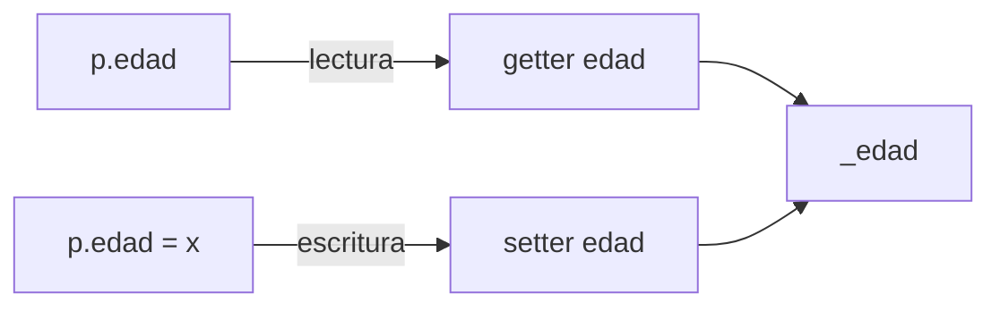
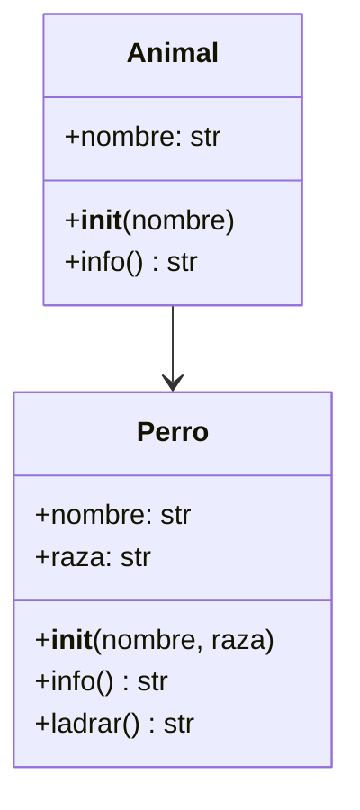
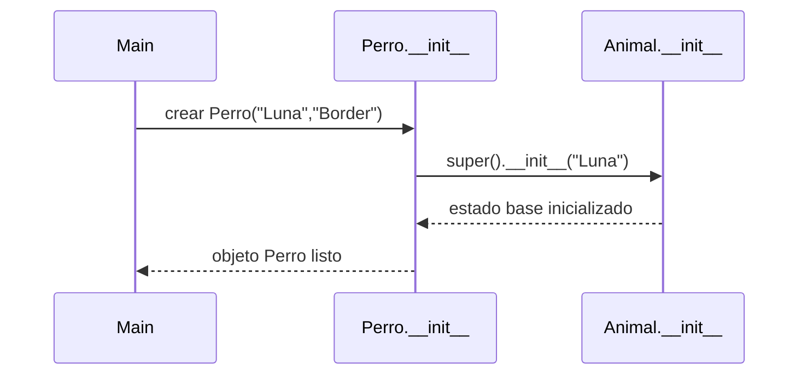
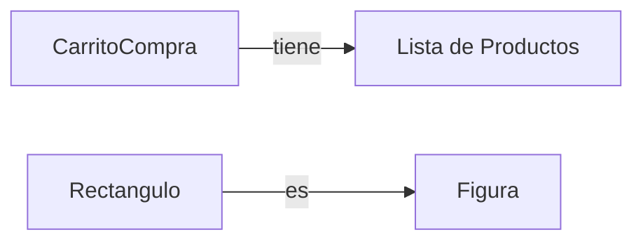

# Clase 3: Encapsulamiento de datos y Herencia en Python

En esta clase, se van a cubrir los temas de **encapsulamiento de datos** y **herencia** en la programación orientada a objetos (OOP) en el lenguaje de programación Python.

## ¿Qué es el encapsulamiento?

El **encapsulamiento** es un principio de la programación orientada a objetos que busca **ocultar los detalles internos** de una clase y exponer únicamente una **interfaz pública** para interactuar con ella.

Esto permite:

- **Proteger** la integridad de los datos.
- **Validar** valores antes de asignarlos.
- **Facilitar** cambios internos sin afectar a quien usa la clase.

### Convenciones de acceso en Python

Aunque Python no impone privacidad estricta, existen **convenciones** para indicar la intención de uso de un atributo:

| Tipo de acceso | Sintaxis    | Significado                                                                   |
| -------------- | ----------- | ----------------------------------------------------------------------------- |
| Público        | `atributo`  | Se puede acceder desde fuera de la clase.                                     |
| Privado        | `_atributo` | Convención: uso interno o en subclases, no debería usarse fuera directamente. |

!!! warning "Aclaración sobre su uso"

    En Python, el encapsulamiento es **por convención**, no por restricción estricta. Es responsabilidad del programador respetar estas reglas.
    En el curso **NO** es obligatorio el uso de estas convenciones.

### Uso básico de `@property` y `@atributo.setter`

En Python, `@property` permite definir un **getter** (lectura controlada) para un atributo, mientras que `@atributo.setter` añade un **setter** (asignación controlada con validación).

```python
class Persona:
    def __init__(self, nombre: str, edad: int):
        self._nombre = nombre
        self._edad = 0
        self.edad = edad # (1)!

    @property            # (2)!
    def edad(self) -> int:
        return self._edad

    @edad.setter         # (3)!
    def edad(self, valor: int):
        if valor < 0:
            raise ValueError("La edad no puede ser negativa")
        self._edad = valor
```

1. Usa el **setter** que se creó (`@edad.setter`) para asignar el valor inicial.
2. **Getter**: devuelve el valor encapsulado (`self._edad`) cuando se accede con `persona.edad`.
3. **Setter**: valida antes de asignar, cuando se hace `self.edad = valor`.

**Acceso al atributo**

```python
p = Persona("Ana", 20)
print(p.edad)   # (1)!
p.edad = 25     # (2)!
```

1. Llama automáticamente al getter.
2. Llama automáticamente al setter.

En el diagrama a continuación se ilustra el funcionamiento del getter y setter.



!!! abstract "Aclaración importante"

    - Aquí existen **dos cosas distintas**:
        - `self._edad`: el **atributo real** donde se guarda el valor.
        - `edad`: una **propiedad** (getter/setter) que actúa como “interfaz pública”.
    - Cuando se escribe `persona.edad`, Python **llama al getter**.
    - Cuando se escribe `persona.edad = 30`, Python **llama al setter** que valida y luego asigna en `self._edad`.
    - Es decir: **`edad` no es una variable nueva**, sino un “puente” controlado hacia `_edad`.

!!! tip "Ideas clave"

    - Usar `@property` para exponer atributos de solo lectura.
    - Evitar exponer atributos internos directamente.

### Comparación con getters y setters clásicos

=== "Con @property"

    ```python
    class Persona:
        def __init__(self, nombre: str):
            self._nombre = nombre

        @property      # (1)!
        def nombre(self) -> str:
            return self._nombre

        @nombre.setter # (2)!
        def nombre(self, nuevo: str):
            if not nuevo:
                raise ValueError("El nombre no puede ser vacío")
            self._nombre = nuevo
    ```

    1. `@property` indica que es un método para exponer el atributo privado `_nombre`.
    2. Permite cambiar el atributo privado `_nombre`.

=== "Con getters/setters tradicionales"

    ```python
    class Persona:
        def __init__(self, nombre: str):
            self._nombre = nombre

        def get_nombre(self):
            return self._nombre

        def set_nombre(self, nuevo):
            self._nombre = nuevo
    ```

!!! note "Uso en el curso"

    Pueden utilizar cualquiera de las dos formas para crear métodos getters/setters.
    Los puristas de Python prefieren usar `@property` y `@atributo.setter` por su simplicidad a la hora de asignar.

### Ejercicio guiado

=== "Enunciado"

    Cree una clase `Producto` que tenga:

    - Atributo `nombre` (string).
    - Atributo privado `_precio` (float).

    Implemente:

    - `@property precio` con validación para que no pueda ser negativo.
    - Método `aplicar_descuento(porcentaje)` que reduzca el precio.

=== "Solución"

    ```python
    class Producto:
        def __init__(self, nombre: str, precio: float):
            self.nombre = nombre
            self._precio = 0
            self.precio = precio   # usa el setter

        @property
        def precio(self) -> float:
            return self._precio

        @precio.setter
        def precio(self, valor: float):
            if valor < 0:
                raise ValueError("El precio no puede ser negativo")
            self._precio = valor

        def aplicar_descuento(self, porcentaje: float) -> None:
            self.precio = self.precio * (1 - porcentaje/100)

    p = Producto("Libro", 100)
    p.aplicar_descuento(10)
    print(p.precio)  # 90.0
    ```

!!! question "Pregunta rápida"

    ¿Por qué se recomienda usar `@property` y `@atributo.setter` en lugar de exponer directamente atributos internos?

---

## ¿Qué es herencia?

La **herencia** permite definir una clase nueva a partir de otra existente para **reutilizar** atributos y métodos, así como **especializar** comportamientos donde sea necesario.

### Concepto y sintaxis básica

La herencia define una relación entre una **clase hija** y una **clase padre**.
La clase hija recibe atributos y métodos de la clase padre y puede añadir nuevos o modificarlos.



```python title="Ejemplo básico"
class Animal:
    def __init__(self, nombre: str):      # (1)!
        self.nombre = nombre

    def info(self) -> str:                # (2)!
        return f"Animal: {self.nombre}"

class Perro(Animal):                      # (3)!
    def __init__(self, nombre: str, raza: str):
        super().__init__(nombre)          # (4)!
        self.raza = raza

    def ladrar(self) -> str:
        return "Guau!"

p = Perro("Luna", "Border Collie")
print(p.info())                           # (5)!
print(p.ladrar())                         # (6)!
```

1. Constructor del padre con estado común.
2. Método disponible para todas las subclases.
3. Declaración de herencia: `Perro(Animal)`.
4. `super()` asegura la inicialización del padre.
5. Usa método heredado
6. Método propio

### Acceso a atributos y métodos del padre

Una subclase accede a los **atributos inicializados** por el padre y a sus **métodos públicos**.
Es importante mantener **invariantes** del padre al extender la clase hija.

```python
class Animal:
    def __init__(self, nombre: str):
        self.nombre = nombre              # (1)!
        self._salud = 100                 # (2)!

    def info(self) -> str:
        return f"{self.nombre} (salud={self._salud})"

class Gato(Animal):
    def curar(self, puntos: int) -> None: # (3)!
        self._salud = min(100, self._salud + puntos)

g = Gato("Garfield")
print(g.info())   # lee estado definido en el padre
g.curar(5)
print(g.info())   # modifica estado protegido del padre
```

1. Atributo público accesible desde la hija.
2. Atributo “protegido” por convención (`_salud`).
3. La subclase agrega comportamiento sin romper la interfaz del padre.

### Sobrescritura de métodos

La subclase puede **redefinir** métodos del padre para especializar el comportamiento.
Conviene mantener la **misma firma** y, si corresponde, **extender** el comportamiento con `super()`.

=== "Reemplazo completo"

    ```python
    class Animal:
        def descripcion(self) -> str:
            return "Ser vivo del reino Animal"

    class Ave(Animal):
        def descripcion(self) -> str:             # (1)!
            return "Ave: vertebrado con plumas"
    ```

    1. Sobrescritura que reemplaza el comportamiento.

=== "Extensión con `super()`"

    ```python
    class Animal:
        def descripcion(self) -> str:
            return "Ser vivo del reino Animal"

    class Murcielago(Animal):
        def descripcion(self) -> str:             # (1)!
            base = super().descripcion()          # (2)!
            return f"{base}. Es un mamífero que vuela"
    ```

    1. Mismo nombre para coherencia.
    2. **Extiende** el comportamiento sin descartarlo.

!!! warning "Buena práctica"

    Evitar cambiar parámetros, tipos de datos y significado del método sobrescrito.

### Uso de `super()`

`super()` permite invocar métodos del padre (típicamente `__init__`) para **evitar duplicación** y garantizar inicialización y lógica común.



=== "Constructor encadenado"

    ```python
    class Animal:
        def __init__(self, nombre: str):
            self.nombre = nombre
            self._salud = 100

    class Perro(Animal):
        def __init__(self, nombre: str, raza: str):
            super().__init__(nombre)      # (1)!
            self.raza = raza              # (2)!
    ```

    1. Inicializa el estado común.
    2. Completa el estado específico de la subclase.

=== "Extender lógica del padre"

    ```python
    class Sensor:
        def __init__(self):
            self._calibrado = False

        def calibrar(self):
            self._calibrado = True

    class SensorTemperatura(Sensor):
        def __init__(self):
            super().__init__()
            self._offset = None

        def calibrar(self):
            super().calibrar()             # (1)!
            self._offset = 0.05            # (2)!
    ```

    1. Conserva la lógica original.
    2. Añade detalles propios de la subclase.

!!! tip "Consejo"

    Llamar a `super().__init__()` **al inicio** del constructor de la subclase para asegurar que el objeto queda en estado válido antes de añadir campos propios.

### Herencia múltiple y MRO (Method Resolution Order)

Python permite que una clase herede de **múltiples padres**.
En estos casos, es necesario definir un **orden de resolución de métodos** (_MRO, Method Resolution Order_), que indica en qué orden se buscan los atributos y métodos.

```python title="Ejemplo básico con MRO"
class RastreableMixin:
    def etiqueta(self) -> str:
        return "[Rastreable]"

class Animal:
    def etiqueta(self) -> str:
        return "[Animal]"

class PerroRastreador(RastreableMixin, Animal):   # (1)!
    pass

obj = PerroRastreador()
print(obj.etiqueta())                 # (2)!
print(PerroRastreador.__mro__)        # (3)!
```

1. El orden de herencia importa: primero `RastreableMixin`, luego `Animal`.
2. Python busca `etiqueta` en `RastreableMixin` antes que en `Animal`.
3. El **MRO** se muestra como:
   `(PerroRastreador, RastreableMixin, Animal, object)`.

!!! abstract "Definición de MRO"

    El MRO es la **ruta que sigue Python** para buscar atributos y métodos en una jerarquía.
    Se calcula usando el algoritmo **C3 linearization**, que garantiza orden consistente.

#### Uso cooperativo de `super()`

El problema típico ocurre cuando varias clases heredan de un mismo ancestro y se busca resolver todas las referencias.

=== "Versión no cooperativa"

    ```python
    class A:
        def saludar(self): print("Soy A")

    class B(A):
        def saludar(self):
            print("Soy B")

    class C(A):
        def saludar(self):
            print("Soy C")

    class D(B, C):
        pass

    d = D()
    d.saludar()
    print(D.__mro__)
    ```

    - El MRO es: `(D, B, C, A, object)`.
    - `D().saludar()` llama primero a `B.saludar`.
    - Si `B` **no** llama a `super()`, nunca se ejecutará `C.saludar` ni `A.saludar`.


    Para que todos los métodos en la jerarquía se ejecuten **una sola vez**, cada clase debe llamar a `super()`.

=== "Versión cooperativa"

    ```python
    class B(A):
        def saludar(self):
            print("Soy B")
            super().saludar()   # Coopera

    class C(A):
        def saludar(self):
            print("Soy C")
            super().saludar()   # Coopera

    class D(B, C):
        def saludar(self):
            print("Soy D")
            super().saludar()   # Coopera

    d = D()
    d.saludar()
    ```

    Salida:

    ```
    Soy D
    Soy B
    Soy C
    Soy A
    ```

!!! warning "Si no se usa `super()`"

    - El flujo puede **cortar la cadena de llamadas**, y algunas clases nunca se ejecutan.
    - Especialmente útil en resolución de atributos.
    - Esto rompe el principio de inicialización **cooperativa**.
    - En jerarquías complejas, el error es difícil de detectar.

### Ejercicio guiado

=== "Enunciado"

    Crear una jerarquía de clases para representar empleados:

    - `Persona` con método `presentar`.
    - `Empleado` (hereda de `Persona`) que redefine `presentar`.
    - `Profesor` y `Investigador` (ambos heredan de `Empleado`) con su propia versión de `presentar`.
    - `ProfesorInvestigador` (hereda de `Profesor` y `Investigador`).

    Analizar:

    1. ¿Cuál es el MRO de `ProfesorInvestigador`?
    2. ¿Qué salida se obtiene al llamar `presentar()` con y sin `super()` en cada clase?

=== "Solución"

    ```python
    class Persona:
        def presentar(self): print("Soy una persona")

    class Empleado(Persona):
        def presentar(self):
            print("Soy empleado")
            super().presentar()

    class Profesor(Empleado):
        def presentar(self):
            print("Soy profesor")
            super().presentar()

    class Investigador(Empleado):
        def presentar(self):
            print("Soy investigador")
            super().presentar()

    class ProfesorInvestigador(Profesor, Investigador):
        def presentar(self):
            print("Soy profesor-investigador")
            super().presentar()

    pi = ProfesorInvestigador()
    pi.presentar()
    print(ProfesorInvestigador.__mro__)
    ```

    Salida:

    ```
    Soy profesor-investigador
    Soy profesor
    Soy investigador
    Soy empleado
    Soy una persona
    ```

    MRO:

    ```
    (ProfesorInvestigador, Profesor, Investigador, Empleado, Persona, object)
    ```

### Mixins

Un _Mixin_ es una clase que aporta **funcionalidades específicas y pequeñas** que se añaden a otra clase por medio de herencia múltiple.
No representan relaciones jerárquicas, sino capacidades adicionales.

```python
class ConLogMixin:
    def log(self, msg: str) -> None:
        print(f"[LOG] {msg}")

class Pedido(ConLogMixin):
    def procesar(self):
        self.log("Procesando pedido…")
```

!!! tip "Uso recomendado"

    - Que el nombre termine con `Mixin` para reconocerlo fácilmente.
    - Diseñar Mixins con **una sola responsabilidad**.
    - Evitar lógica de inicialización compleja en Mixins.

### Composición vs. Herencia

En muchos casos conviene usar **composición** en lugar de herencia.



- **Herencia**: Un `Rectangulo` **es una** `Figura`.
- **Composición**: Un `CarritoCompra` **tiene** una lista de productos.
