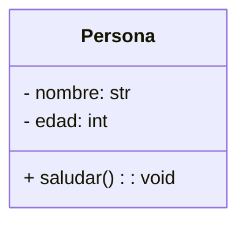
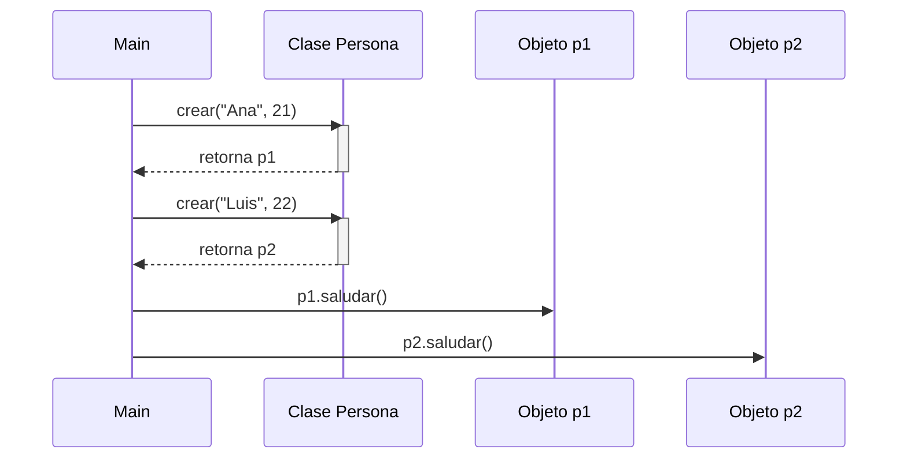

# Clase 2: Introducción a OOP

En esta clase, se introduce el tema de programación orientada a objetos (OOP por sus siglas en inglés).

## ¿Qué es la programación orientada a objetos?

La **programación orientada a objetos** corresponde a un _paradigma de programación_; es decir, una forma de escribir código que organiza la lógica en **objetos**.

Un **objeto**:

- Representa **algo del mundo real** o **un concepto**.
- Tiene **atributos** (datos que describen su estado).
- Tiene **métodos** (acciones que puede realizar).

!!! example "Ejemplo"

    Un objeto `Perro` podría tener atributos como `nombre` y `edad`, y métodos como `ladrar()` o `correr()`.

## ¿Por qué usar OOP?

La OOP sirve para:

1. **Modelar problemas** de forma más cercana a la realidad.
2. **Organizar el código** en bloques reutilizables.
3. Facilitar el **mantenimiento y la expansión** del programa.

## Conceptos clave

| Concepto       | Definición                                                                                  |
| -------------- | ------------------------------------------------------------------------------------------- |
| **Clase**      | Plantilla o molde que define cómo serán los objetos (qué datos tendrán y qué podrán hacer). |
| **Objeto**     | Una instancia de una clase. Cada objeto tiene sus propios valores de atributos.             |
| **Atributo**   | Variable que almacena datos dentro de un objeto.                                            |
| **Método**     | Función que pertenece a un objeto y que puede usar o modificar sus atributos.               |
| **`__init__`** | Método especial de inicialización; define y da valor inicial a atributos                    |
| **`self`**     | Referencia a **esta** instancia; permite acceder a su estado                                |

!!! warning "Errores frecuentes"

    - Olvidar `self` como primer parámetro en métodos de instancia.
    - Declarar atributos **fuera** de `__init__` **y** pretender que existan en todas las instancias.
    - Tratar la **clase** como si fuera un objeto (p. ej., usar `Persona.nombre` esperando el nombre de cada persona).

## Diagrama conceptual del ejemplo a realizar





## Ejemplo mínimo en Python

```python
class Persona:
    def __init__(self, nombre, edad):  # (1)!
        self.nombre = nombre           # (2)!
        self.edad = edad

    def saludar(self):                 # (3)!
        print(f"Hola, soy {self.nombre} y tengo {self.edad} años.")  # (4)

# Crear (instanciar) objetos
p1 = Persona("Ana", 21)                # (5)!
p2 = Persona("Luis", 22)

# Usar métodos de instancia
p1.saludar()
p2.saludar()                           # (6)!
```

1. `__init__` se ejecuta al crear cada objeto; sirve para **inicializar atributos**.
2. `self.nombre` y `self.edad` son **atributos de instancia**; pertenecen a **esta** persona.
3. `saludar` es un **método de instancia**: siempre define `self` como primer parámetro.
4. Dentro del método, `self` permite **acceder al estado** de esta instancia.
5. `p1` es un objeto con `nombre="Ana"`, `edad=21`.
6. La llamada `obj.metodo()` ejecuta el comportamiento en **ese** objeto.

---

## Estado independiente por objeto

```python
class Contador:
    def __init__(self, valor_inicial=0):
        self.valor = valor_inicial

c1 = Contador()
c2 = Contador(10)

c1.valor += 5
c2.valor += 1

print(c1.valor)  # (1)!
print(c2.valor)  # (2)!
print(id(c1) != id(c2))  # (3)!
```

1. 5
2. 11
3. `True`: objetos distintos

!!! note "Concepto clave"

     Aunque `c1` y `c2` provienen de la **misma clase**, cada objeto **almacena su propio estado**.
     Cambiar `c1.valor` **no** afecta `c2.valor`, y viceversa.

---

## Métodos de instancia: consultar y mutar

Los métodos se suelen dividir en estos dos tipos por funcoinalidad.

=== "Consultar (no cambia estado)"

    ```python
    class Rectangulo:
        def __init__(self, base, altura):
            self.base = base
            self.altura = altura

        def area(self):                # consulta
            return self.base * self.altura

    r = Rectangulo(3, 4)
    print(r.area())  # (1)!
    ```

    1. 12

=== "Mutar (cambia estado)"

    ```python
    class Rectangulo:
        def __init__(self, base, altura):
            self.base = base
            self.altura = altura

        def escalar(self, factor):     # mutación
            self.base *= factor
            self.altura *= factor

    r = Rectangulo(3, 4)
    r.escalar(2)
    print(r.base, r.altura)  # 6 8
    ```

!!! tip "Buenas prácticas con métodos"

    - **Un método, una responsabilidad** clara.
    - Nombres **descriptivos** (verbos para acciones).
    - Evitar efectos secundarios en métodos que aparentan consultar.

## Ejemplo de métodos de instancia

```python
class Producto:
    def __init__(self, nombre: str, precio: float, stock: int = 0):
        self.nombre = nombre
        self.precio = precio
        self.stock = stock

    def disponible(self) -> bool:
        return self.stock > 0

    def reponer(self, cantidad: int) -> None:
        self.stock += cantidad

    def vender(self, cantidad: int) -> bool:
        if cantidad <= self.stock:
            self.stock -= cantidad
            return True
        return False

a = Producto("Cuaderno", 900.0, 5)
b = Producto("Bolígrafo", 350.0)

print(a.disponible(), b.disponible()) # (1)!
b.reponer(10)
print(b.disponible())                 # (2)!
```

1. `True`, `False`
2. `True`

!!! question "Preguntas rápidas"

    1. ¿Qué rol cumple `__init__` en la creación de objetos?
    2. ¿Cómo accede un método al estado de su propia instancia?
    3. ¿Qué diferencia hay entre un método que **consulta** y uno que **muta**?

## Errores típicos y cómo evitarlos

=== "Olvidar `self`"

    ```python
    class A:
        def f():           # Falta `self`
            print("hola")
    ```

    **Solución:** `def f(self): ...`

=== "Atributos fuera de `__init__`"

    ```python
    class A:
        def set_x(self, x):
            self.x = x  # si no se llama, otras rutas podrían no crear
    ```

    **Mejor:** crear `self.x` en `__init__`, y luego modificarlo en métodos.

=== "No colocar `self` en la definición de atributos"

    ```python
    class A:
        def __init__(self, x):
            x = x  # asigna a una variable local, no al atributo
    ```

    **Correcto:** `self.x = x`

## Ejercicios guiados

### Ejercicio 1

=== "Enunciado: Libro"

    Cree una clase `Libro` con atributos de instancia `titulo` (str) y `paginas` (int).

    Añada:

    - `descripcion()`: **consultor** que retorna `"<titulo> (<paginas> págs.)"`.
    - `agregar_paginas(n)`: **mutador** que suma `n` si `n > 0`.

    Instancie dos libros y demuestre que sus estados son independientes.

=== "Solución"

    ```python
    class Libro:
        def __init__(self, titulo: str, paginas: int):
            self.titulo = titulo
            self.paginas = paginas

        def descripcion(self) -> str:           # consultor
            return f"{self.titulo} ({self.paginas} págs.)"

        def agregar_paginas(self, n: int) -> None:  # mutador
            if n > 0:
                self.paginas += n

    l1 = Libro("POO en Python", 180)
    l2 = Libro("Algoritmos", 250)

    l1.agregar_paginas(20)

print(l1.descripcion()) # (1)!
print(l2.descripcion()) # (2)!

````

    1. POO en Python (200 págs.)
    2. Algoritmos (250 págs.)


### Ejercicio 2

=== "Enunciado: Termómetro"

    Cree `Termometro` con atributo `celsius` (float).

    Añada:

    - `a_fahrenheit()`: **consultor** que retorna la conversión.
    - `ajustar(delta)`: **mutador** que suma `delta` al valor en °C.
    Instancie dos termómetros y evidencie que mutar uno no afecta el otro.

=== "Solución"

    ```python
    class Termometro:
        def __init__(self, celsius: float):
            self.celsius = celsius

        def a_fahrenheit(self) -> float:    # consultor
            return self.celsius * 9/5 + 32

        def ajustar(self, delta: float) -> None:  # mutador
            self.celsius += delta

    t1 = Termometro(20.0)
    t2 = Termometro(30.0)

    t1.ajustar(5.0)

print(t1.celsius, t1.a_fahrenheit()) # (1)!
print(t2.celsius, t2.a_fahrenheit()) # (2)!
````

    1. `25.0 77.0`
    2. `30.0 86.0`
