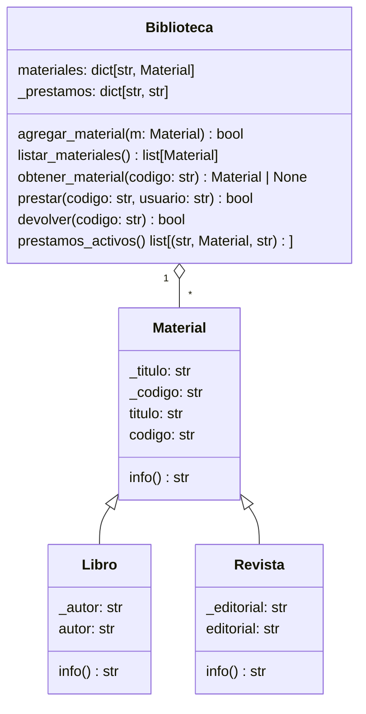

# Clase 4: Ejercicio de OOP

En esta clase, se va a realizar un ejercicio amplio de programación orientada a objetos, donde se implementen los conceptos vistos en las semanas anteriores en una solución al enunciado a continuación.

## Descripción

Desarrollar un programa en Python que simule un **sistema de gestión de biblioteca**, aplicando:

- **Clases y objetos**
- **Herencia**: `Material` → `Libro`, `Revista`
- **Encapsulamiento** con `@property` y validaciones
- **Composición**: una `Biblioteca` **tiene** materiales y préstamos
- **Menú interactivo** que opera sobre un repositorio interno de materiales

!!! tip "Estructura del proyecto"

    - `modelos.py`: definiciones de clases (`Material`, `Libro`, `Revista`, `Biblioteca`).
    - `main.py`: interacción con la persona usuaria (menú), validaciones de entrada y llamadas a métodos.

## Requisitos de diseño

### Clase `Material` (base)

| Elemento       | Detalle                                               |
| -------------- | ----------------------------------------------------- |
| **Atributos**  | - `_titulo: str`<br>- `_codigo: str`                  |
| **Métodos**    | `info() → str`: Retorna `"{_titulo} ({_codigo})"`     |
| **Validación** | `_titulo` y `_codigo` no pueden ser vacíos (_setter_) |

### Clase `Libro` (hereda de `Material`)

| Elemento       | Detalle                                     |
| -------------- | ------------------------------------------- |
| **Atributos**  | `_autor: str` (encapsulado con `@property`) |
| **Métodos**    | `info()` sobrescribe para incluir autor     |
| **Validación** | `autor` no puede ser vacío                  |

### Clase `Revista` (hereda de `Material`)

| Elemento       | Detalle                                         |
| -------------- | ----------------------------------------------- |
| **Atributos**  | `_editorial: str` (encapsulado con `@property`) |
| **Métodos**    | `info()` sobrescribe para incluir editorial     |
| **Validación** | `editorial` no puede ser vacía                  |

### Clase `Biblioteca`

| Elemento      | Detalle                                                                                                                                                                                                                                                                                                                                 |
| ------------- | --------------------------------------------------------------------------------------------------------------------------------------------------------------------------------------------------------------------------------------------------------------------------------------------------------------------------------------- |
| **Atributos** | - `materiales: dict[str, Material]`<br>- `_prestamos: dict[str, str]` (clave: **código**, valor: usuario)                                                                                                                                                                                                                               |
| **Métodos**   | - `agregar_material(material)` (sin códigos duplicados)<br>- `listar_materiales() → list[Material]`<br>- `obtener_material(codigo) → Material or None`<br>- `prestar(codigo, usuario) → bool` (verifica existencia y disponibilidad)<br>- `devolver(codigo) → bool`<br>- `prestamos_activos() → list[tuple[codigo, Material, usuario]]` |

## Menú interactivo

| Opción | Acción                    |
| :----: | ------------------------- |
|   1    | Registrar **libro**       |
|   2    | Registrar **revista**     |
|   3    | Ver **materiales**        |
|   4    | **Prestar** material      |
|   5    | **Devolver** material     |
|   6    | Ver **préstamos activos** |
|   7    | Salir                     |

??? example "Ejemplo de uso esperado"

    ```
    --- Menú ---
    1. Registrar libro
    2. Registrar revista
    3. Ver materiales disponibles
    4. Prestar material
    5. Devolver material
    6. Ver préstamos activos
    7. Salir

    Opción: 1
    Título: Cien años de soledad
    Código: L001
    Autor: Gabriel García Márquez
    Libro registrado con éxito.

    Opción: 4
    Código del material: L001
    Usuario: Ana
    Préstamo realizado.

    Opción: 6
    Préstamos:
     - L001 → Cien años de soledad (L001) | Usuario: Ana
    ```

---

## Diagrama de clases



---

## Solución

=== "`modelos.py`"

    ```python
    """
    Módulo de modelos para el sistema de biblioteca.
    Contiene:
        - Material (base),
        - Libro
        - Revista
        - Biblioteca
    """

    from typing import Dict, List, Optional, Tuple


    class Material:
        """Clase base para materiales bibliográficos."""

        def __init__(self, titulo: str, codigo: str) -> None:
            self._titulo = ""
            self._codigo = ""
            self.titulo = titulo
            self.codigo = codigo

        # Titulo
        @property
        def titulo(self) -> str:
            return self._titulo

        @titulo.setter
        def titulo(self, valor: str) -> None:
            if not isinstance(valor, str) or not valor.strip():
                raise ValueError("El título no puede ser vacío.")
            self._titulo = valor.strip()

        # Código
        @property
        def codigo(self) -> str:
            return self._codigo

        @codigo.setter
        def codigo(self, valor: str) -> None:
            if not isinstance(valor, str) or not valor.strip():
                raise ValueError("El código no puede ser vacío.")
            self._codigo = valor.strip()

        def info(self) -> str:
            """Retorna una representación corta del material."""
            return f"{self.titulo} ({self.codigo})"


    class Libro(Material):
        """Representa un libro con autor."""

        def __init__(self, titulo: str, codigo: str, autor: str) -> None:
            super().__init__(titulo, codigo)
            self._autor = ""
            self.autor = autor

        @property
        def autor(self) -> str:
            return self._autor

        @autor.setter
        def autor(self, valor: str) -> None:
            if not isinstance(valor, str) or not valor.strip():
                raise ValueError("El autor no puede ser vacío.")
            self._autor = valor.strip()

        def info(self) -> str:
            return f"{self.titulo} ({self.codigo}) — Autor: {self.autor}"


    class Revista(Material):
        """Representa una revista con editorial."""

        def __init__(self, titulo: str, codigo: str, editorial: str) -> None:
            super().__init__(titulo, codigo)
            self._editorial = ""
            self.editorial = editorial        # setter valida

        @property
        def editorial(self) -> str:
            return self._editorial

        @editorial.setter
        def editorial(self, valor: str) -> None:
            if not isinstance(valor, str) or not valor.strip():
                raise ValueError("La editorial no puede ser vacía.")
            self._editorial = valor.strip()

        def info(self) -> str:
            return f"{self.titulo} ({self.codigo}) — Editorial: {self.editorial}"


    class Biblioteca:
        """
        Repositorio de materiales + control de préstamos.
        Composición: la biblioteca 'tiene' materiales y préstamos.
        """

        def __init__(self) -> None:
            # Diccionario por código → Material para búsquedas O(1).
            self.materiales: Dict[str, Material] = {}
            # Tabla de préstamos: código → usuario.
            self._prestamos: Dict[str, str] = {}

        # --- Gestión de materiales ---

        def agregar_material(self, material: Material) -> bool:
            """Agrega un material si el código no existe. Retorna True si se agregó."""
            if not isinstance(material, Material):
                raise TypeError("Se requiere una instancia de Material o subclase.")
            if material.codigo in self.materiales:
                return False                     # Evita duplicados.
            self.materiales[material.codigo] = material
            return True

        def listar_materiales(self) -> List[Material]:
            """Lista de materiales (no ordenada)."""
            return list(self.materiales.values())

        def obtener_material(self, codigo: str) -> Optional[Material]:
            """Obtiene un material por código, o None si no existe."""
            return self.materiales.get((codigo or "").strip())

        # --- Gestión de préstamos ---

        def prestar(self, codigo: str, usuario: str) -> bool:
            """
            Intenta prestar el material 'codigo' a 'usuario'.
            Reglas: debe existir y no estar ya prestado.
            """
            if not isinstance(usuario, str) or not usuario.strip():
                raise ValueError("El usuario no puede ser vacío.")
            codigo = (codigo or "").strip()
            if codigo not in self.materiales:
                return False                  # No existe.
            if codigo in self._prestamos:
                return False                  # Ya prestado.
            self._prestamos[codigo] = usuario.strip()
            return True

        def devolver(self, codigo: str) -> bool:
            """Devuelve un material; True si se encontraba prestado."""
            codigo = (codigo or "").strip()
            if codigo in self._prestamos:
                del self._prestamos[codigo]
                return True
            return False

        def prestamos_activos(self) -> List[Tuple[str, Material, str]]:
            """
            Retorna tuplas (codigo, material, usuario) para cada préstamo activo.
            """
            salida: List[Tuple[str, Material, str]] = []
            for codigo, usuario in self._prestamos.items():
                mat = self.materiales.get(codigo)
                if mat is not None:           # Verificación por robustez.
                    salida.append((codigo, mat, usuario))
            return salida

        # --- Operación segura de cambio de código ---

        def actualizar_codigo(self, codigo_actual: str, nuevo_codigo: str) -> bool:
            """
            Actualiza el **código** de un material ya registrado y re-indexa todas las estructuras.
            - Falla si `codigo_actual` no existe o `nuevo_codigo` ya está en uso.
            - Si el material estaba prestado, migra el préstamo al nuevo código.
            """
            ca = (codigo_actual or "").strip()
            nc = (nuevo_codigo or "").strip()
            if not ca or not nc:
                return False
            if ca not in self.materiales:
                return False
            if nc in self.materiales:
                return False

            material = self.materiales.pop(ca)
            material.codigo = nc
            self.materiales[nc] = material

            if ca in self._prestamos:
                self._prestamos[nc] = self._prestamos.pop(ca)

            return True
    ```

=== "`main.py`"

    ```python
    """
    Punto de entrada del sistema de biblioteca.
    Menú textual para registrar materiales (libros, revistas), prestar, devolver y listar.
    """

    from modelos import Biblioteca, Libro, Revista

    # Instancia única de la biblioteca para toda la sesión.
    bib = Biblioteca()


    # -------------------- utilidades de entrada --------------------

    def leer_no_vacio(mensaje: str) -> str:
        """Lee una cadena no vacía desde consola."""
        while True:
            texto = input(mensaje).strip()
            if texto:
                return texto
            print("La entrada no puede ser vacía.")


    def leer_opcion(mensaje: str, minimo: int, maximo: int) -> int:
        """Lee una opción entera dentro de un rango [minimo, maximo]."""
        while True:
            try:
                op = int(input(mensaje))
                if minimo <= op <= maximo:
                    return op
                print(f"Ingrese una opción entre {minimo} y {maximo}.")
            except ValueError:
                print("Entrada inválida: se esperaba un número entero.")


    # -------------------- acciones del menú --------------------

    def registrar_libro() -> None:
        """Crea y registra un libro en la biblioteca."""
        titulo = leer_no_vacio("Título: ")
        codigo = leer_no_vacio("Código: ")
        autor = leer_no_vacio("Autor: ")
        try:
            ok = bib.agregar_material(Libro(titulo, codigo, autor))
            print("Libro registrado con éxito." if ok else "Ya existe un material con ese código.")
        except ValueError as e:
            print(f"Error: {e}")


    def registrar_revista() -> None:
        """Crea y registra una revista en la biblioteca."""
        titulo = leer_no_vacio("Título: ")
        codigo = leer_no_vacio("Código: ")
        editorial = leer_no_vacio("Editorial: ")
        try:
            ok = bib.agregar_material(Revista(titulo, codigo, editorial))
            print("Revista registrada con éxito." if ok else "Ya existe un material con ese código.")
        except ValueError as e:
            print(f"Error: {e}")


    def ver_materiales() -> None:
        """Lista todos los materiales registrados."""
        mats = bib.listar_materiales()
        if not mats:
            print("No hay materiales registrados.")
            return
        print("Materiales:")
        for m in mats:
            print(f" - {m.info()}")


    def prestar_material() -> None:
        """Solicita préstamo de un material por código."""
        codigo = leer_no_vacio("Código del material: ")
        usuario = leer_no_vacio("Usuario: ")
        ok = bib.prestar(codigo, usuario)
        if ok:
            print("Préstamo realizado.")
        else:
            existe = bib.obtener_material(codigo) is not None
            print("Ya está prestado." if existe else "No existe un material con ese código.")


    def devolver_material() -> None:
        """Devuelve un material por código."""
        codigo = leer_no_vacio("Código del material: ")
        ok = bib.devolver(codigo)
        print("Devolución realizada." if ok else "Ese material no estaba prestado.")


    def ver_prestamos_activos() -> None:
        """Muestra todos los préstamos activos (código, material, usuario)."""
        prs = bib.prestamos_activos()
        if not prs:
            print("No hay préstamos activos.")
            return
        print("Préstamos:")
        for codigo, material, usuario in prs:
            print(f" - {codigo} → {material.info()} | Usuario: {usuario}")


    # -------------------- menú --------------------

    def mostrar_menu() -> None:
        """Imprime el menú principal."""
        print("""
    --- Menú ---
    1. Registrar libro
    2. Registrar revista
    3. Ver materiales disponibles
    4. Prestar material
    5. Devolver material
    6. Ver préstamos activos
    7. Salir
    """)


    def main() -> None:
        """Bucle principal de la aplicación."""
        while True:
            mostrar_menu()
            opcion = leer_opcion("Opción: ", 1, 7)
            if opcion == 1:
                registrar_libro()
            elif opcion == 2:
                registrar_revista()
            elif opcion == 3:
                ver_materiales()
            elif opcion == 4:
                prestar_material()
            elif opcion == 5:
                devolver_material()
            elif opcion == 6:
                ver_prestamos_activos()
            elif opcion == 7:
                print("¡Hasta luego!")
                break


    if __name__ == "__main__":
        main()
    ```

---
