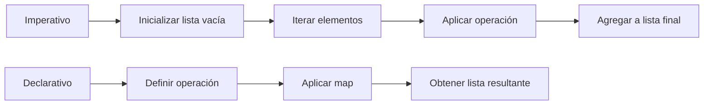

# Clase 6: Programación funcional

En esta clase, se van a introducir los principios fundamentales de la **programación funcional** en Python, el uso de las funciones integradas `map()`, `filter()`, y `sorted()`, junto con el uso de expresiones `lambda`, compresiones de listas y expresiones generadoras.

---

## Introducción

La **programación funcional** es un paradigma de programación que se centra en el uso de **funciones como bloques fundamentales de construcción**.
A diferencia de la programación imperativa, que describe una secuencia de pasos a ejecutar, la programación funcional busca describir el **qué** se quiere obtener, en lugar de detallar **cómo** llegar a ese resultado.

Una de sus ideas principales es evitar modificar estados o variables en el tiempo (_inmutabilidad_), por medio de que las funciones siempre produzcan el mismo resultado ante los mismos parámetros de entrada (_funciones puras_).

### ¿Qué es la programación funcional?

!!! note "Definición general"

    La programación funcional es un estilo de programación que trata la **computación como la evaluación de funciones matemáticas**.
    Se evitan cambios de estado y datos mutables.

### Diferencia con otros paradigmas

- La programación funcional suele usarse para **procesar colecciones de datos de forma concisa** (por ejemplo, transformar listas, filtrar elementos o combinar resultados).
- La OOP resulta más útil cuando queremos **modelar entidades del mundo real** con atributos y comportamientos.

---

## Funciones de orden superior y programación declarativa

Las **funciones de orden superior** son un concepto fundamental en la programación funcional.
Es **una función que recibe otras funciones como parámetros, o devuelve una función como resultado**.

Hasta el momento, se ha recibido/retornado datos por las funciones, pero Python también permite recibir/retornar funciones.
Esto permite escribir programas donde la lógica se construye por la composición de funciones.

### Definición de funciones de orden superior

!!! note "Definición"

    Una **función de orden superior** es aquella que **recibe una función como argumento y/o devuelve otra función**.

A continuación, se presenta un ejemplo para introducir el concepto:

```python

def aplicar_operacion(funcion, numeros):  # (1)!
    return [funcion(x) for x in numeros]

# Función normal
def cuadrado(n):  # (2)!
    return n ** 2

# Uso
resultado = aplicar_operacion(cuadrado, [1, 2, 3, 4])
print(resultado)  # [1, 4, 9, 16]
```

1. `aplicar_operacion` es de **orden superior** porque recibe `funcion` como parámetro.
2. `cuadrado` es una función normal que se pasa como argumento.

### Ejemplos de funciones que reciben otras funciones

Python incluye funciones integradas que son de orden superior, como `map()`, `filter()` y `sorted()` con su argumento `key`.

```python title="Ejemplo con sorted y una función como parámetro"
palabras = ["python", "java", "c", "javascript"]

ordenadas = sorted(palabras, key=len) # (1)!
print(ordenadas)  # (2)!
```

1. Ordena las palabras según su longitud
2. `['c', 'java', 'python', 'javascript']`

Aquí:

- `sorted` es una función de orden superior.
- `len` es otra función que se pasa como argumento para definir el criterio de ordenamiento.

En el ejemplo anterior, es importante observar que `len` es una función que devuelve un número entero (la cantidad de caracteres de un string).
Por esta razón, es que puede ser un `key` de la función `sorted`.

### Programación declarativa: expresar _qué_ en lugar de _cómo_

La **programación imperativa** obliga a detallar paso a paso _cómo_ se resuelve un problema.
La **programación declarativa**, en cambio, se centra en expresar _qué_ se quiere lograr, dejando que el lenguaje o las funciones integradas gestionen los detalles.

=== "Estilo imperativo"

    ``` python
    numeros = [1, 2, 3, 4, 5]
    cuadrados = []
    for n in numeros:
        cuadrados.append(n**2)
    ```

=== "Estilo declarativo"

    ``` python
    numeros = [1, 2, 3, 4, 5]
    cuadrados = list(map(lambda x: x**2, numeros))
    ```

!!! tip

    En el ejemplo anterior, el enfoque imperativo describe **cómo construir** la lista paso a paso.
    El enfoque declarativo con `map` describe **qué se desea obtener**: aplicar una operación de cuadrado a cada elemento.

### Diagrama comparativo



!!! question "Preguntas para reforzar"

    - ¿Qué condiciones debe cumplir una función para considerarse de orden superior?
    - ¿Qué ventajas aporta el estilo declarativo en comparación con el imperativo?

---

## Expresiones lambda

Las **expresiones lambda** en Python permiten definir funciones de manera rápida y concisa, sin necesidad de usar la palabra clave `def`.
Se les conoce también como **funciones anónimas**, porque no requieren un nombre explícito.

Son especialmente útiles en contextos donde necesitamos pasar una función corta como argumento a otra función de orden superior (`map`, `filter`, `sorted`, entre otros).

### Definición y sintaxis de `lambda`

La sintaxis general es:

```python title="Sintaxis"
lambda argumentos: expresión
```

- `lambda` es la palabra clave.
- Los **argumentos** funcionan igual que en una función normal.
- La **expresión** es lo que se evalúa y se devuelve.

A continuación se muestra un ejemplo sencillo para la suma de dos números:

```python title="Función lambda para sumar dos números"
suma = lambda x, y: x + y  # (1)!
print(suma(3, 5))  # (2)!
```

1. Se almacena la función creada con lambda en la variable `suma`
2. `8`

### Comparación con funciones definidas con `def`

Veamos cómo una misma operación puede escribirse con `def` y con `lambda`:

=== "Función definida con `def`"

    ``` python
    def cuadrado(n):
        return n ** 2
    ```

=== "Función definida con `lambda`"

    ```python
    cuadrado = lambda n: n ** 2
    ```

!!! info

    - Una función definida con `def` permite escribir múltiples líneas, incluir docstrings y ser reutilizada ampliamente.
    - Una función `lambda`, en cambio, se limita a **una sola expresión**, lo que la hace práctica pero menos flexible.

### Casos de uso típicos

Las expresiones lambda se suelen usar en:

1. **Funciones de orden superior**:
   ```python
   numeros = [1, 2, 3, 4]
   cuadrados = list(map(lambda x: x**2, numeros))
   print(cuadrados)  # [1, 4, 9, 16]
   ```
2. **Filtrado de elementos**:
   ```python
   pares = list(filter(lambda x: x % 2 == 0, numeros))
   print(pares)  # [2, 4]
   ```
3. **Ordenamiento con criterios personalizados**:
   ```python
   palabras = ["python", "java", "c", "javascript"]
   ordenadas = sorted(palabras, key=lambda s: len(s))
   print(ordenadas)  # ['c', 'java', 'python', 'javascript']
   ```

!!! question "Preguntas para reflexionar"

    - ¿Cuál es la diferencia más importante entre una función definida con `def` y una función `lambda`?

---

## Funciones integradas para programación funcional

Python incluye varias funciones integradas que permiten aplicar el paradigma funcional de manera natural.
Entre las más usadas están `map()`, `filter()` y `sorted()`.
Estas funciones son ejemplos claros de **funciones de orden superior**, porque reciben otra función como argumento.

### `map()`

La función `map()` aplica una función a cada elemento de un iterable y devuelve un objeto `map` (que puede convertirse en lista, tupla, entre otros).

```python title="Sintaxis"
map(funcion, iterable)
```

Un ejemplo sencillo del uso de `map()` se muestra en el siguiente bloque de código:

```python title="Elevar al cuadrado cada número"
numeros = [1, 2, 3, 4, 5]
cuadrados = list(map(lambda x: x**2, numeros))
print(cuadrados)  # (1)!
```

1. `[1, 4, 9, 16, 25]`

!!! tip

    `map()` transforma cada elemento de la colección según la función indicada.
     Es útil para **aplicar la misma operación a todos los elementos**.

### `filter()`

La función `filter()` selecciona únicamente los elementos que cumplen con una condición lógica (que devuelva `True`).

```python title="Sintaxis"
filter(funcion_condicion, iterable)
```

Como ejemplo introductorio, se tiene el siguiente código:

```python title="Quedarse solo con números pares"
numeros = [1, 2, 3, 4, 5, 6]
pares = list(filter(lambda x: x % 2 == 0, numeros))
print(pares)  # (1)!
```

1. `[2, 4, 6]`

!!! info

    `filter()` **no transforma** los datos, sino que **descarta** los que no cumplen con la condición.

!!! question "Preguntas para reforzar"

    - ¿Qué diferencia hay entre `map()` y `filter()` en cuanto al tipo de operación que realizan?

---

## Comprensiones y expresiones generadoras

Además de `map()`, `filter()` y `reduce()`, Python ofrece una sintaxis especial muy legible: las **comprensiones** y las **expresiones generadoras**.
Estas permiten escribir operaciones de transformación y filtrado en una sola línea, de manera más clara que usando funciones integradas.

### Comprensiones de listas

Las **comprensiones de listas** permiten construir listas a partir de un iterable.
Se aplican transformaciones y condiciones en una sola expresión.

```python title="Sintaxis"
[expresion for elemento in iterable if condicion]
```

Un ejemplo sencillo para introducir el tema, se muestra a continuación:

```python title="Elevar al cuadrado los números del 1 al 5"
cuadrados = [x**2 for x in range(1, 6)]
print(cuadrados)  # [1, 4, 9, 16, 25]
```

A continuación, se muestra una comparación entre el uso de compresión de listas y las funciones integradas `map` y `filter` para elevar los números pares al cuadrado de una lista.

=== "Con `map` / `filter`"

    ```python
    numeros = [1, 2, 3, 4, 5]
    pares = list(filter(lambda x: x % 2 == 0, numeros))
    cuadrados = list(map(lambda x: x**2, pares))
    ```

=== "Con compresión de listas"

    ```python
    numeros = [1, 2, 3, 4, 5]
    cuadrados = [x**2 for x in numeros if x % 2 == 0]

    ```

### Ejemplos prácticos para compresión de listas

```python title="Filtrar nombres que empiezan con 'A'"
nombres = ["Ana", "Pedro", "Alberto", "Lucía"]
resultado = [n for n in nombres if n.startswith("A")]
print(resultado)  # (1)!
```

1. `['Ana', 'Alberto']`

```python title="Crear una lista de tuplas (n, n^2)"
parejas = [(n, n**2) for n in range(1, 6)]
print(parejas)  # (1)!
```

1. `[(1,1), (2,4), (3,9), (4,16), (5,25)]`

### Expresiones generadoras

Una **expresión generadora** es similar a una comprensión de listas, pero en lugar de crear la lista completa en memoria, crea un **objeto generador** que produce los elementos bajo demanda.

```python title="Sintaxis"
(expresion for elemento in iterable if condicion)
```

Como primer ejemplo, se tiene el siguiente código:

```python title="Generador que produce cuadrados de números pares"
generador = (x**2 for x in range(1, 6) if x % 2 == 0)

print(next(generador))  # (1)!
print(next(generador))  # (2)!
```

1. `4`
2. `16`

Los generadores funcionan muy bien con funciones como `sum()` y `any()` que consumen iterables:

```python title="Sumar los cuadrados de números pares"
suma = sum(x**2 for x in range(1, 6) if x % 2 == 0)
print(suma)  # (1)!
```

1. `20`

```python title="Verificar si hay ALGÚN número mayor que 10"
existe = any(x > 10 for x in [2, 5, 8, 11])
print(existe)  # (1)!
```

1. `True`

### Diferencia entre lista y generador

| Comprensión de lista                                              | Expresión generadora                                     |
| ----------------------------------------------------------------- | -------------------------------------------------------- |
| Calcula **todos los valores de una vez** y los guarda en memoria. | Calcula los valores **uno a uno bajo demanda**.          |
| Ocupa más memoria si la colección es grande.                      | Muy eficiente en memoria, ideal para secuencias grandes. |
| Devuelve una lista.                                               | Devuelve un objeto generador (iterador).                 |

---

## Ejercicio final

Dada una lista de números enteros, se quiere:

1. Filtrar los números positivos.
2. Obtener el cuadrado de cada número positivo.
3. Quedarnos solo con los que sean pares.

=== "Con funciones integradas"

    1. Filtrar números positivos (`filter`)
    ```python
    numeros = [-5, -2, 0, 1, 2, 3, 4, 5]

    positivos = list(filter(lambda x: x > 0, numeros))
    print(positivos)  # [1, 2, 3, 4, 5]
    ```

    2. Obtener sus cuadrados (`map`)
    ```python
    cuadrados = list(map(lambda x: x**2, positivos))
    print(cuadrados)  # [1, 4, 9, 16, 25]
    ```

    3. Filtrar los pares (`filter`)
    ```python
    pares = list(filter(lambda x: x % 2 == 0, cuadrados))
    print(pares)  # [4, 16]
    ```

=== "Con compresiones de listas"

    La misma operación se puede escribir de forma más legible usando una **comprensión de listas**:

    ```python
    numeros = [-5, -2, 0, 1, 2, 3, 4, 5]

    resultado = sum([x**2 for x in numeros if x > 0 and (x**2) % 2 == 0])
    print(resultado)  # 20
    ```
