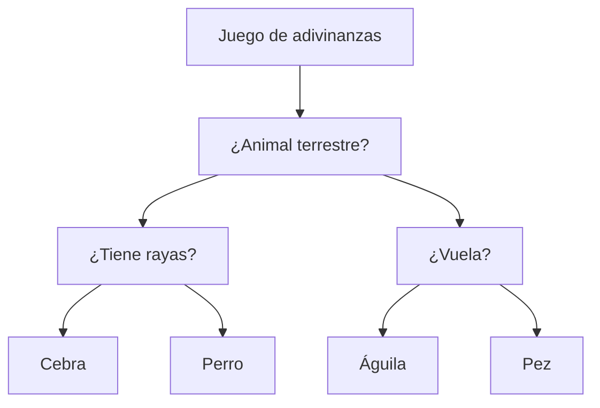
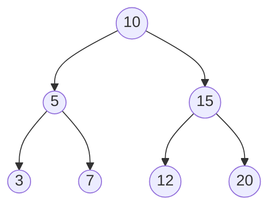
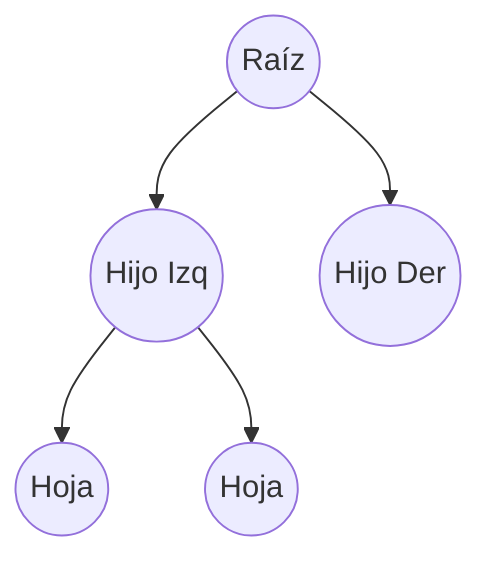
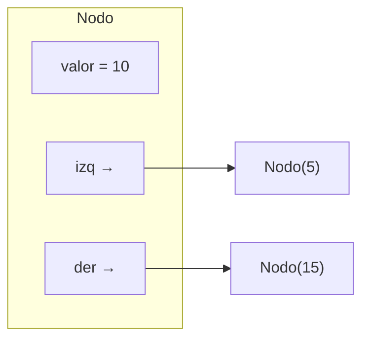
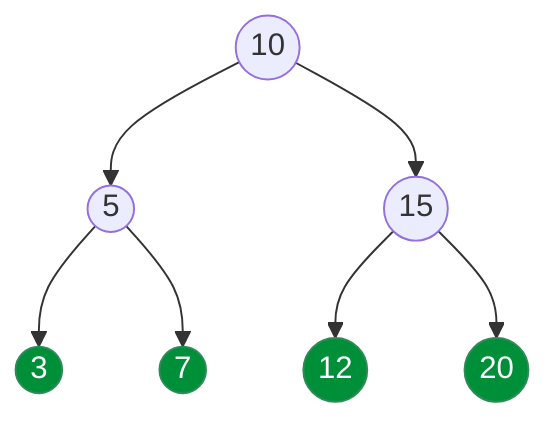
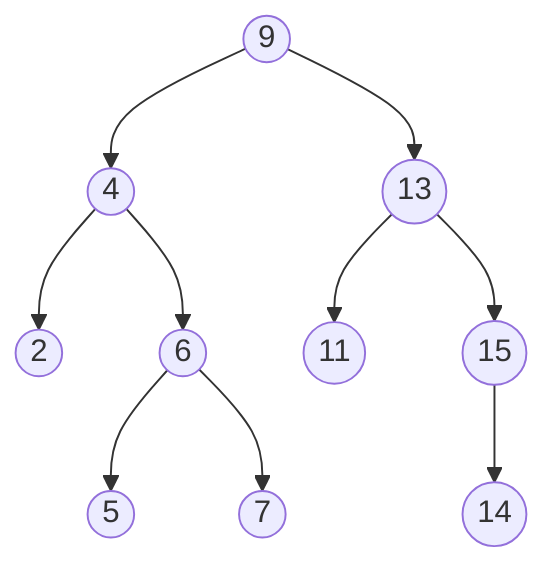

# Clase 7: Árboles binarios

## Definición general

!!! info "Concepto general"

    Un **árbol binario** es una estructura de datos **jerárquica** compuesta por elementos llamados **nodos**.
    Cada nodo puede tener como máximo **dos hijos**: un **hijo izquierdo** y un **hijo derecho**.
    Esta restricción lo distingue de los árboles generales, donde un nodo puede tener cualquier cantidad de hijos.

Los árboles binarios se utilizan para representar estructuras donde la información se **divide de manera recursiva**, por ejemplo:

- La **evaluación de expresiones matemáticas** (`(3 + 5) * 2`).
- La **organización jerárquica** de decisiones en un juego.
- La **indexación** de datos en estructuras como los **árboles binarios de búsqueda (BST)** o **heaps**.



!!! tip "Idea central"

    Un árbol binario se construye **recursivamente**:
    cada nodo es a su vez la raíz de dos subárboles, los cuales también son árboles binarios.

### Componentes de un árbol binario

Cada nodo contiene tres elementos principales:

| Componente                               | Descripción                                           |
| ---------------------------------------- | ----------------------------------------------------- |
| **Valor o dato**                         | La información almacenada (número, texto, objeto)     |
| **Referencia al hijo izquierdo (`izq`)** | Apunta al subárbol izquierdo o es `None` si no existe |
| **Referencia al hijo derecho (`der`)**   | Apunta al subárbol derecho o es `None` si no existe   |

**Ejemplo visual:**



!!! quote "Definición formal"

    Un **árbol binario** es:

    - Vacío (sin nodos), o
    - Un nodo raíz que tiene dos subárboles binarios (izquierdo y derecho).

### Terminología

| Término      | Significado                                                 |
| ------------ | ----------------------------------------------------------- |
| **Raíz**     | Nodo superior del árbol (sin padre).                        |
| **Hijo**     | Nodo descendiente directo de otro.                          |
| **Padre**    | Nodo que tiene hijos.                                       |
| **Hoja**     | Nodo sin hijos.                                             |
| **Subárbol** | Árbol formado por un nodo y todos sus descendientes.        |
| **Altura**   | Longitud del camino más largo desde la raíz hasta una hoja. |
| **Nivel**    | Distancia (en aristas) desde la raíz hasta el nodo.         |
| **Tamaño**   | Número total de nodos del árbol.                            |



!!! note "Observaciones clave"

    - No todos los nodos deben tener dos hijos; algunos pueden tener uno o ninguno.
    - El árbol **vacío** también se considera un árbol binario válido.
    - Un árbol binario se puede ver como una **colección de subárboles** conectados.
    - Cada nodo es la **raíz de su propio subárbol**.

## La clase `Nodo`

Cada nodo almacena un **valor** y dos **referencias** a sus hijos.
En Python, se puede representar con una clase sencilla:

```python
class Nodo:
    def __init__(self, valor):
        self.valor = valor
        self.izq = None
        self.der = None
```

!!! tip "Estructura del nodo"

    - `valor`: almacena el dato del nodo.
    - `izq`: referencia al subárbol izquierdo.
    - `der`: referencia al subárbol derecho.



### Construcción manual de un árbol binario

Se puede crear un árbol pequeño **manualmente** conectando los nodos entre sí.

```python
# Creación de nodos individuales
raiz = Nodo(10)
raiz.izq = Nodo(5)
raiz.der = Nodo(15)
raiz.izq.izq = Nodo(3)
raiz.izq.der = Nodo(7)
raiz.der.izq = Nodo(12)
raiz.der.der = Nodo(20)
```

**Visualización del árbol:**


!!! example "Ejemplo de impresión simple"

    ```python
    print(raiz.valor)        # 10
    print(raiz.izq.valor)    # 5
    print(raiz.der.valor)    # 15
    ```

## Funciones sobre el árbol

### Altura del árbol

La **altura** de un árbol es la longitud del camino más largo desde la raíz hasta una hoja.
Se puede calcular **recursivamente**:

```python
def altura(nodo):
    if nodo is None:
        return 0
    return 1 + max(altura(nodo.izq), altura(nodo.der))
```

!!! tip

    Si el árbol tiene un solo nodo, la altura es 1.
    Un árbol vacío tiene altura 0.

**Ejemplo de llamada:**

```python
print(altura(raiz))  # 3
```

### Tamaño del árbol

El **tamaño** representa el número total de nodos que contiene el árbol.

```python
def tamano(nodo):
    if nodo is None:
        return 0
    return 1 + tamano(nodo.izq) + tamano(nodo.der)
```

!!! note

    Esta función recorre todos los nodos una vez, por lo que su complejidad temporal es **O(n)**.

**Ejemplo:**

```python
print(tamano(raiz))  # 7
```

### Contar hojas

Un **nodo hoja** es aquel que no tiene hijos.
Se puede contar también de forma recursiva:

```python
def contar_hojas(nodo):
    if nodo is None:
        return 0
    if nodo.izq is None and nodo.der is None:
        return 1
    return contar_hojas(nodo.izq) + contar_hojas(nodo.der)
```

**Ejemplo:**

```python
print(contar_hojas(raiz))  # 4
```



### Resumen

| Función        | Descripción                  | Tipo de operación | Complejidad |
| -------------- | ---------------------------- | ----------------- | ----------- |
| `altura`       | Devuelve la altura del árbol | Recursiva         | O(n)        |
| `tamano`       | Cuenta todos los nodos       | Recursiva         | O(n)        |
| `contar_hojas` | Cuenta nodos sin hijos       | Recursiva         | O(n)        |

## Recorridos en profundidad (DFS)

Para esta parte, se van a tratar los tres tipos principales de **recorridos en profundidad** en árboles binarios: **preorden**, **en orden** y **postorden**, junto con sus implementaciones **recursivas** e **iterativas**.

### Concepto general

Un recorrido en profundidad (_Depth-First Search_, DFS) visita **todos los nodos de un árbol**, yendo lo más profundo posible por cada rama antes de retroceder.


!!! note "Orden general"

    El orden en que se visitan los nodos depende del tipo de recorrido que se realice.

### Tipos de recorridos DFS

| Recorrido     | Orden de visita            | Descripción breve                        |
| ------------- | -------------------------- | ---------------------------------------- |
| **Preorden**  | Nodo → Izquierda → Derecha | Se procesa el nodo antes de sus hijos.   |
| **En orden**  | Izquierda → Nodo → Derecha | Se procesa el nodo entre sus hijos.      |
| **Postorden** | Izquierda → Derecha → Nodo | Se procesa el nodo después de sus hijos. |

### Implementación recursiva

=== "Preorden"

    ```python
    def preorden(nodo, resultado):
        if nodo is None:
            return
        resultado.append(nodo.valor)     # Visitar nodo
        preorden(nodo.izq, resultado)    # Recorrer izquierda
        preorden(nodo.der, resultado)    # Recorrer derecha
    ```

=== "En orden"

    ```python
    def en_orden(nodo, resultado):
        if nodo is None:
            return
        en_orden(nodo.izq, resultado)
        resultado.append(nodo.valor)     # Visitar nodo
        en_orden(nodo.der, resultado)
    ```

=== "Postorden"

    ```python
    def postorden(nodo, resultado):
        if nodo is None:
            return
        postorden(nodo.izq, resultado)
        postorden(nodo.der, resultado)
        resultado.append(nodo.valor)     # Visitar nodo
    ```

!!! tip

    Cada recorrido sigue una **estructura recursiva** similar.
    Lo único que cambia es **el momento en que se procesa el nodo**.

**Ejemplo visual de recorrido**


| Tipo      | Orden de visita         |
| --------- | ----------------------- |
| Preorden  | 10, 5, 3, 7, 15, 12, 20 |
| En orden  | 3, 5, 7, 10, 12, 15, 20 |
| Postorden | 3, 7, 5, 12, 20, 15, 10 |

!!! note "Usos comunes de los recorridos"

    - En un **árbol binario de búsqueda (BST)**, el recorrido **en orden** devuelve los valores **ordenados**.
    - El recorrido **postorden** se usa comúnmente para **eliminar árboles** o **evaluar expresiones**.

### Implementación iterativa

A veces no se desea usar recursión (por ejemplo, por límites de pila).
En estos casos se utilizan **estructuras de pila (`stack`)** para simular la llamada recursiva.

=== "Preorden"

    ```python
    def preorden_iter(nodo):
        if nodo is None:
            return []
        pila, resultado = [nodo], []
        while pila:
            actual = pila.pop()
            resultado.append(actual.valor)
            if actual.der:
                pila.append(actual.der)
            if actual.izq:
                pila.append(actual.izq)
        return resultado
    ```

=== "En orden"

    ```python
    def en_orden_iter(nodo):
        resultado, pila = [], []
        actual = nodo
        while pila or actual:
            while actual:
                pila.append(actual)
                actual = actual.izq
            actual = pila.pop()
            resultado.append(actual.valor)
            actual = actual.der
        return resultado
    ```

!!! tip

    - En **preorden**, el nodo se procesa al ser desapilado.
    - En **en orden**, el nodo se procesa después de recorrer toda la rama izquierda.

### Complejidad temporal y espacial

| Tipo de recorrido | Tiempo | Espacio (pila) |
| ----------------- | ------ | -------------- |
| Recursivo         | O(n)   | O(h)           |
| Iterativo         | O(n)   | O(h)           |

!!! note ""

    Donde **n** es el número de nodos y **h** la altura del árbol.

## Ejercicios



### Construir el árbol e imprimir los tres recorridos

=== "Enunciado"

    1. Construir en Python el árbol exactamente como en el diagrama.
    2. Implementar funciones **recursivas** de `preorden`, `en_orden` y `postorden`.
    3. Imprimir las listas resultantes.

=== "Código"

    ```python
    class Nodo:
        def __init__(self, valor):
            self.valor = valor
            self.izq = None
            self.der = None

    # Construcción manual del árbol nuevo
    raiz = Nodo(9)
    raiz.izq = Nodo(4)
    raiz.der = Nodo(13)

    raiz.izq.izq = Nodo(2)
    raiz.izq.der = Nodo(6)
    raiz.izq.der.izq = Nodo(5)
    raiz.izq.der.der = Nodo(7)

    raiz.der.izq = Nodo(11)
    raiz.der.der = Nodo(15)
    raiz.der.der.izq = Nodo(14)

    def preorden(n, out):
        if n is None: return
        out.append(n.valor)
        preorden(n.izq, out)
        preorden(n.der, out)

    def en_orden(n, out):
        if n is None: return
        en_orden(n.izq, out)
        out.append(n.valor)
        en_orden(n.der, out)

    def postorden(n, out):
        if n is None: return
        postorden(n.izq, out)
        postorden(n.der, out)
        out.append(n.valor)

    # Prueba
    po, ino, pso = [], [], []
    preorden(raiz, po)
    en_orden(raiz, ino)
    postorden(raiz, pso)
    print("Preorden   :", po)
    print("En orden   :", ino)
    print("Postorden  :", pso)
    ```

=== "Salida esperada"

    ```
    Preorden   : [9, 4, 2, 6, 5, 7, 13, 11, 15, 14]
    En orden   : [2, 4, 5, 6, 7, 9, 11, 13, 14, 15]
    Postorden  : [2, 5, 7, 6, 4, 11, 14, 15, 13, 9]
    ```

### Altura y tamaño sobre el nuevo árbol

=== "Enunciado"

    1. Implementar `altura(nodo)` y `tamano(nodo)`.
    2. Verificar los resultados sobre el árbol dado.

=== "Código"

    ```python
    def altura(n):
        if n is None:
            return 0
        return 1 + max(altura(n.izq), altura(n.der))

    def tamano(n):
        if n is None:
            return 0
        return 1 + tamano(n.izq) + tamano(n.der)

    print("Altura:", altura(raiz))  # esperado: 4
    print("Tamaño:", tamano(raiz))  # esperado: 10
    ```

=== "Explicación"

    - **Altura = 4** porque la ruta más larga puede ser `9 → 13 → 15 → 14` (4 niveles) o `9 → 4 → 6 → 7`.
    - **Tamaño = 10** nodos: {9,4,13,2,6,5,7,11,15,14}.

### Versiones iterativas de recorridos

=== "Enunciado"

    Reescribir los recorridos **preorden** y **en orden** en forma **iterativa** y comparar los resultados con la versión recursiva.

=== "Código"

    ```python
    def preorden_iter(n):
        if n is None: return []
        pila, out = [n], []
        while pila:
            x = pila.pop()
            out.append(x.valor)
            if x.der: pila.append(x.der)
            if x.izq: pila.append(x.izq)
        return out

    def en_orden_iter(n):
        out, pila = [], []
        act = n
        while pila or act:
            while act:
                pila.append(act)
                act = act.izq
            act = pila.pop()
            out.append(act.valor)
            act = act.der
        return out

    print("Preorden iter:", preorden_iter(raiz))  # [9, 4, 2, 6, 5, 7, 13, 11, 15, 14]
    print("En orden iter:", en_orden_iter(raiz))  # [2, 4, 5, 6, 7, 9, 11, 13, 14, 15]
    ```
