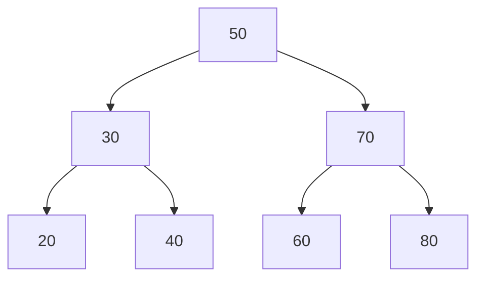
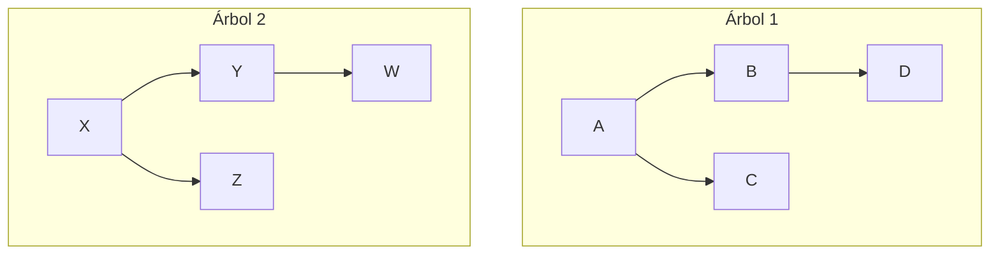
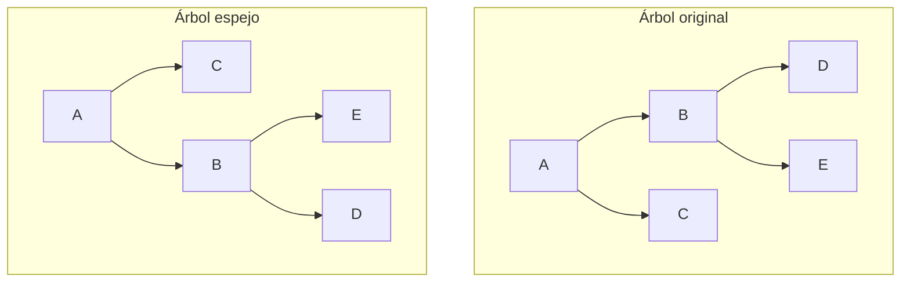
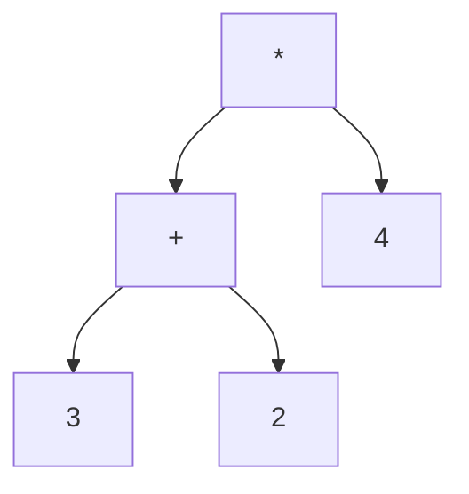
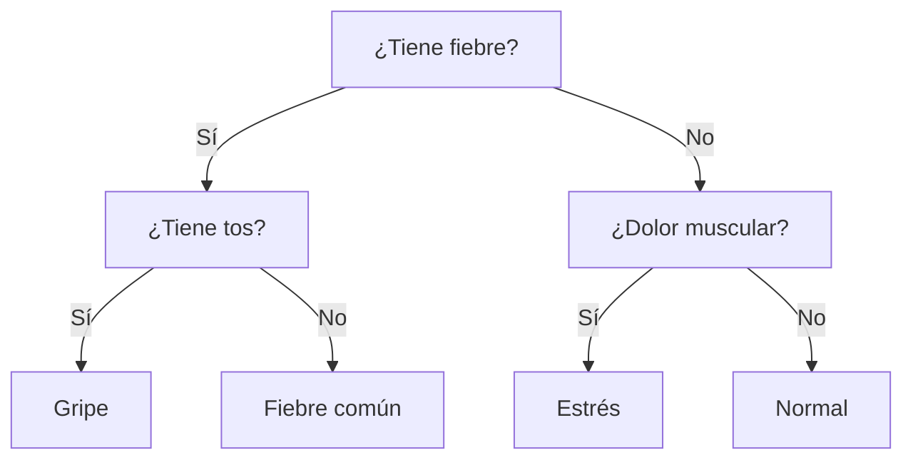
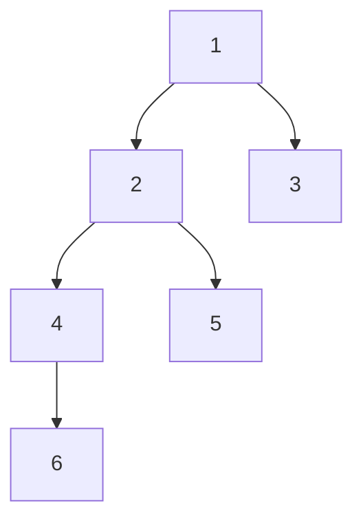
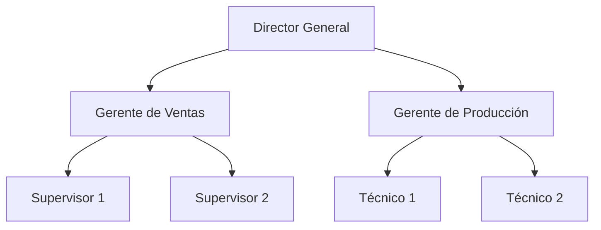

# Clase 8: Ejercicios de árboles binarios

En esta clase, se van a repasar los conceptos vistos la clase anterior de árboles binarios, así como aplicar el tema en ejercicios prácticos.

## Verificación de balance en un árbol binario

Un **árbol binario balanceado** es aquel donde las alturas de sus subárboles izquierdo y derecho **no difieren en más de una unidad** para _cada_ nodo.
Esto garantiza que las operaciones como búsqueda o recorrido sean eficientes, y evita que el árbol se _degenere_ en una lista.

!!! info "Definición formal"

    Un árbol binario está **balanceado** si, para cada nodo:
    $|altura(\text{izquierdo}) - altura(\text{derecho})| \le 1$
    y **ambos subárboles** también están balanceados.

### Idea principal

El algoritmo se basa en **recursión**:

1. Calcular la altura del subárbol izquierdo.
2. Calcular la altura del subárbol derecho.
3. Verificar que la diferencia sea menor o igual a 1.
4. Aplicar el mismo proceso recursivamente a cada hijo.

### Implementación

```python
class Nodo:
    def __init__(self, valor):
        self.valor = valor
        self.izq = None
        self.der = None

# Calcula la altura de un árbol
def altura(raiz):
    if raiz is None:
        return 0
    return 1 + max(altura(raiz.izq), altura(raiz.der))

# Verifica si el árbol está balanceado
def esta_balanceado(raiz):
    if raiz is None:
        return True

    altura_izq = altura(raiz.izq)
    altura_der = altura(raiz.der)
    diferencia = abs(altura_izq - altura_der)

    return (diferencia <= 1 and
            esta_balanceado(raiz.izq) and
            esta_balanceado(raiz.der))

# Ejemplo de uso
raiz = Nodo(1)
raiz.izq = Nodo(2)
raiz.der = Nodo(3)
raiz.izq.izq = Nodo(4)
raiz.izq.der = Nodo(5)
raiz.der.der = Nodo(6)

if esta_balanceado(raiz):
    print("Árbol balanceado")    # (1)!
else:
    print("Árbol desbalanceado")
```

1. Esta es la línea que se imprime.

---

## Árboles Binarios de Búsqueda (BST)

Un **Árbol Binario de Búsqueda (BST)** es una estructura que mantiene sus elementos ordenados de manera jerárquica, lo cual permite realizar operaciones como **búsqueda**, **inserción** y **eliminación** de forma eficiente.

!!! info "Propiedad del BST"

    Para cada nodo del árbol:

    - Todos los valores del **subárbol izquierdo** son **menores** que el valor del nodo.
    - Todos los valores del **subárbol derecho** son **mayores** que el valor del nodo.

### Relación con el recorrido _inorden_

Un recorrido **inorden** en un BST siempre devuelve los valores en **orden ascendente**.  
Por ejemplo, si se insertan los valores `50, 30, 70, 20, 40, 60, 80`, el recorrido inorden producirá:

```
20, 30, 40, 50, 60, 70, 80
```

### Representación visual



!!! note

    Cada inserción coloca el nuevo valor en la posición correcta según la propiedad del BST.

### Implementación

```python
class Nodo:
    def __init__(self, valor):
        self.valor = valor
        self.izq = None
        self.der = None

# Inserta un valor en el BST de forma recursiva
def insertar(raiz, valor):
    if raiz is None:
        # Acá se crea el nuevo nodo
        return Nodo(valor)

    if valor < raiz.valor:
        raiz.izq = insertar(raiz.izq, valor)
    elif valor > raiz.valor:
        raiz.der = insertar(raiz.der, valor)
    # Si el valor ya existe, no se inserta nuevamente
    return raiz

# Recorrido inorden: en orden ascendente
def inorden(raiz):
    if raiz:
        inorden(raiz.izq)
        print(raiz.valor, end=" ")
        inorden(raiz.der)

# Ejemplo de uso
raiz = None
valores = [50, 30, 70, 20, 40, 60, 80]

for v in valores:
    raiz = insertar(raiz, v)

print("Recorrido inorden del BST:")
inorden(raiz)
```

---

## Ejercicio 1: Comparar dos árboles

Se busca determinar si **dos árboles binarios tienen la misma estructura**, independientemente de los valores almacenados en cada nodo.

!!! info "Objetivo"

    Aplicar recursión para comparar la forma estructural de dos árboles, sin importar los valores que contengan.
    Posteriormente, extender el algoritmo para verificar también si son **idénticos** (misma estructura y mismos valores).

### Idea general

1. Si ambos nodos son `None`, se consideran iguales.
2. Si uno es `None` y el otro no, se consideran diferentes.
3. En caso contrario, se comparan:
   - Las estructuras del subárbol izquierdo.
   - Las estructuras del subárbol derecho.
   - (_Extensión_) Los valores almacenados en cada nodo.

### Representación visual



Ambos árboles poseen la misma estructura, aunque los valores sean distintos.

### Implementación

```python
class Nodo:
    def __init__(self, valor):
        self.valor = valor
        self.izq = None
        self.der = None

# Compara la estructura de dos árboles
def misma_estructura(a, b):
    if a is None and b is None:
        return True
    if a is None or b is None:
        return False
    return (misma_estructura(a.izq, b.izq) and
            misma_estructura(a.der, b.der))

# Extensión: compara también los valores
def son_identicos(a, b):
    if a is None and b is None:
        return True
    if a is None or b is None:
        return False
    return (a.valor == b.valor and
            son_identicos(a.izq, b.izq) and
            son_identicos(a.der, b.der))

# Ejemplo de uso

# Árbol 1
a = Nodo(1)
a.izq = Nodo(2)
a.der = Nodo(3)

# Árbol 2
b = Nodo(10)
b.izq = Nodo(20)
b.der = Nodo(30)

print("¿Tienen la misma estructura?", misma_estructura(a, b)) # (1)!
print("¿Son idénticos?", son_identicos(a, b))                 # (2)!
```

1. `True`
2. `False`

---

## Ejercicio 2: Árbol espejo

El **árbol espejo** de un árbol binario se obtiene al **intercambiar los subárboles izquierdo y derecho** de todos los nodos.
El resultado es una versión reflejada del árbol original.

!!! info "Objetivo"

    Aplicar recursión para transformar un árbol en su versión espejo e interpretar los cambios en los recorridos.

### Representación visual



### Implementación

```python
class Nodo:
    def __init__(self, valor):
        self.valor = valor
        self.izq = None
        self.der = None

# Convierte un árbol a su versión espejo
def espejo(raiz):
    if raiz is None:
        return None

    raiz.izq, raiz.der = raiz.der, raiz.izq  # Intercambia los hijos
    espejo(raiz.izq)
    espejo(raiz.der)
    return raiz

# Recorrido inorden
def inorden(raiz):
    if raiz:
        inorden(raiz.izq)
        print(raiz.valor, end=" ")
        inorden(raiz.der)

# Ejemplo de uso

# Árbol original
raiz = Nodo("A")
raiz.izq = Nodo("B")
raiz.der = Nodo("C")
raiz.izq.izq = Nodo("D")
raiz.izq.der = Nodo("E")

print("Recorrido inorden original:")          # (1)!
inorden(raiz)

espejo(raiz)

print("Recorrido inorden del árbol espejo:")  # (2)!
inorden(raiz)
```

1. `Recorrido inorden original: D B E A C`
2. `Recorrido inorden del árbol espejo: C A E B D`

---

## Ejercicio 3: Árbol de expresiones matemáticas

Un **árbol de expresiones** representa una operación aritmética donde cada nodo interno es un operador (`+`, `-`, `*`, `/`) y cada hoja es un operando numérico.
Este tipo de árboles se utiliza en _intérpretes_ y _compiladores_ para evaluar expresiones.

!!! info "Objetivo"

    Comprender cómo los árboles binarios pueden representar operaciones matemáticas y cómo evaluarlas mediante recorridos recursivos.

### Ejemplo visual



La expresión representada por este árbol es: $(3 + 2) \cdot 4$

### Implementación

```python
class Nodo:
    def __init__(self, valor):
        self.valor = valor
        self.izq = None
        self.der = None

# Evalúa una expresión aritmética representada como árbol
def evaluar(raiz):
    if raiz is None:
        return 0

    # Si es hoja, devuelve el valor numérico
    if raiz.izq is None and raiz.der is None:
        return int(raiz.valor)

    # Evalúa los subárboles
    izq = evaluar(raiz.izq)
    der = evaluar(raiz.der)

    # Aplica el operador
    if raiz.valor == '+':
        return izq + der
    elif raiz.valor == '-':
        return izq - der
    elif raiz.valor == '*':
        return izq * der
    elif raiz.valor == '/':
        return izq / der

# Ejemplo de uso
raiz = Nodo('*')
raiz.izq = Nodo('+')
raiz.der = Nodo('4')
raiz.izq.izq = Nodo('3')
raiz.izq.der = Nodo('2')

resultado = evaluar(raiz)
print("Resultado:", resultado)  # (1)!
```

1. `Resultado: 20`

---

## Ejercicio 4: Árbol de decisiones

Un **árbol de decisiones** permite modelar procesos en los que se toman decisiones basadas en condiciones o respuestas.
Cada nodo representa una **pregunta**, y cada hoja representa una **acción o resultado final**.

!!! info "Objetivo"

    Aplicar árboles binarios para representar procesos de decisión y recorrerlos según las respuestas del usuario.

### Ejemplo visual



### Implementación

```python
class NodoDecision:
    def __init__(self, pregunta, si=None, no=None):
        self.pregunta = pregunta
        self.si = si
        self.no = no

# Recorre el árbol según las respuestas del usuario
def recorrer(raiz):
    if raiz.si is None and raiz.no is None:
        print("Diagnóstico:", raiz.pregunta)
        return

    respuesta = input(raiz.pregunta + " (s/n): ").lower()
    if respuesta == "s":
        recorrer(raiz.si)
    elif respuesta == "n":
        recorrer(raiz.no)
    else:
        print("Respuesta no válida.")
        recorrer(raiz)

# Ejemplo de uso
arbol = NodoDecision("¿Tiene fiebre?",
    NodoDecision("¿Tiene tos?",
        NodoDecision("Gripe"),
        NodoDecision("Fiebre común")
    ),
    NodoDecision("¿Tiene dolor muscular?",
        NodoDecision("Estrés"),
        NodoDecision("Normal")
    )
)

recorrer(arbol)
```

**Posible interacción**

```
¿Tiene fiebre? (s/n): s
¿Tiene tos? (s/n): n
Diagnóstico: Fiebre común
```

---

## Ejercicio 5: Camino más largo (_diámetro del árbol_)

El **diámetro** de un árbol binario es la longitud del camino más largo entre dos hojas.
Este camino puede pasar por la raíz o por cualquier nodo intermedio.

!!! info "Objetivo"

    Implementar un algoritmo recursivo para calcular el diámetro de un árbol binario.

### Idea principal

El diámetro se obtiene al comparar tres valores:

1. El diámetro del subárbol izquierdo.
2. El diámetro del subárbol derecho.
3. La suma de las alturas de ambos subárboles (camino que pasa por el nodo actual).

El mayor de los tres corresponde al diámetro del árbol.

### Representación visual



El camino más largo es `6 → 4 → 2 → 1 → 3`, con una longitud de 4.

### Implementación

```python
class Nodo:
    def __init__(self, valor):
        self.valor = valor
        self.izq = None
        self.der = None

def altura(raiz):
    if raiz is None:
        return 0
    return 1 + max(altura(raiz.izq), altura(raiz.der))

def diametro(raiz):
    if raiz is None:
        return 0

    altura_izq = altura(raiz.izq)
    altura_der = altura(raiz.der)

    diam_izq = diametro(raiz.izq)
    diam_der = diametro(raiz.der)

    return max(altura_izq + altura_der + 1, max(diam_izq, diam_der))

# Ejemplo de uso
raiz = Nodo(1)
raiz.izq = Nodo(2)
raiz.der = Nodo(3)
raiz.izq.izq = Nodo(4)
raiz.izq.der = Nodo(5)
raiz.izq.izq.izq = Nodo(6)

print("Diámetro del árbol:", diametro(raiz))  # (1)!
```

1. `Diámetro del árbol: 5`

---

## Ejercicio 6: Jerarquía organizacional

Un árbol binario puede representar la **estructura jerárquica** de una organización, donde cada nodo representa un empleado y los subárboles representan sus subordinados.

!!! info "Objetivo"

    Aplicar árboles binarios para modelar estructuras jerárquicas y analizar información como niveles, cantidad de empleados o jerarquías máximas.

### Ejemplo visual



### Implementación

```python
class Empleado:
    def __init__(self, nombre):
        self.nombre = nombre
        self.izq = None   # Subordinado izquierdo
        self.der = None   # Subordinado derecho

# Cuenta el total de empleados
def contar_empleados(raiz):
    if raiz is None:
        return 0
    return 1 + contar_empleados(raiz.izq) + contar_empleados(raiz.der)

# Muestra la jerarquía con indentación
def mostrar_jerarquia(raiz, nivel=0):
    if raiz is not None:
        print("  " * nivel + "- " + raiz.nombre)
        mostrar_jerarquia(raiz.izq, nivel + 1)
        mostrar_jerarquia(raiz.der, nivel + 1)

# Ejemplo de uso
raiz = Empleado("Director General")
raiz.izq = Empleado("Gerente de Ventas")
raiz.der = Empleado("Gerente de Producción")
raiz.izq.izq = Empleado("Supervisor 1")
raiz.izq.der = Empleado("Supervisor 2")
raiz.der.izq = Empleado("Técnico 1")
raiz.der.der = Empleado("Técnico 2")

print("Estructura jerárquica:")
mostrar_jerarquia(raiz)

print("\nTotal de empleados:", contar_empleados(raiz))
```

**Salida esperada:**

```
Estructura jerárquica:
- Director General
  - Gerente de Ventas
    - Supervisor 1
    - Supervisor 2
  - Gerente de Producción
    - Técnico 1
    - Técnico 2

Total de empleados: 7
```
