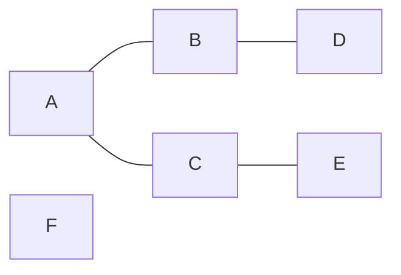
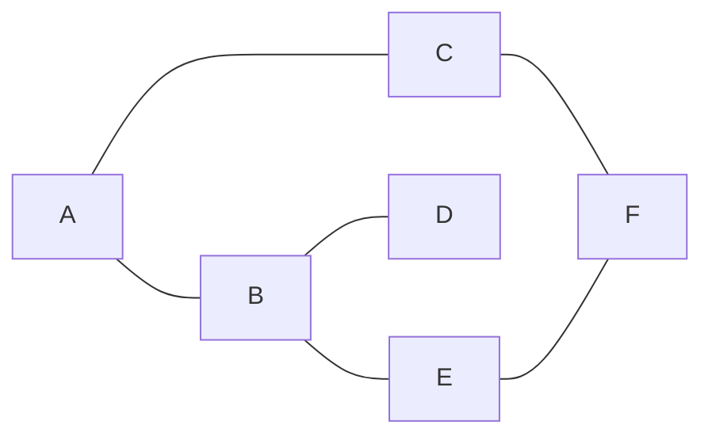
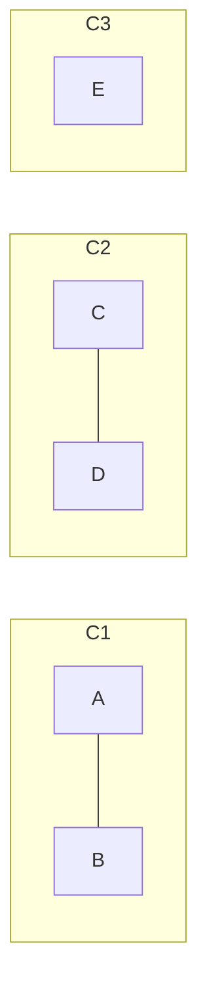

# Clase 9: Aplicaciones y ejercicios sobre grafos

En esta clase, se van a aplicar los conceptos de representación, recorrido y detección de ciclos en grafos para resolver problemas prácticos de análisis y modelado.

## Objetivos

- Modelar situaciones reales mediante grafos dirigidos y no dirigidos.
- Aplicar DFS y BFS para resolver problemas de conectividad y búsqueda.
- Analizar la existencia de componentes conexas en diferentes contextos.

---

## Ejercicio 1: Verificar conectividad en un grafo no dirigido

!!! question "Planteamiento"

    Dado un grafo no dirigido, determine si todos los vértices están conectados.

!!! tip "Sugerencia"

    - Use **DFS** o **BFS** desde un vértice inicial.
    - Si algún nodo no fue visitado, el grafo no es conexo.



```python title="Solución"
def dfs(nodo):
    if nodo not in visitados:
        visitados.add(nodo)
        for vecino in grafo[nodo]:
            dfs(vecino)

grafo = {
          'A': ['B', 'C'],
          'B': ['A', 'D'],
          'C': ['A', 'E'],
          'D': ['B'],
          'E': ['C']
        }

visitados = set()

dfs('A')

if len(visitados) == len(grafo):
    print("El grafo es conexo.")
else:
    print("El grafo no es conexo.")
```

## Ejercicio 2: Propagación de información en una red

!!! question "Planteamiento"

    Una empresa desea simular cómo se propaga un mensaje en una red interna de computadoras.
    Cada computadora está conectada con algunas otras.
    Si una computadora recibe el mensaje, lo reenvía inmediatamente a todas las conectadas.

    Determine cuántas computadoras recibirán el mensaje, dado un nodo inicial.

!!! tip "Sugerencia"

    - Modele el problema como un **grafo no dirigido**.
    - Use **BFS** para recorrer los equipos que recibirán el mensaje.
    - El número total de nodos visitados representa la cantidad de computadoras notificadas.



```python title="Solución"
from collections import deque

red = {
    'A': ['B', 'C'],
    'B': ['A', 'D', 'E'],
    'C': ['A', 'F'],
    'D': ['B'],
    'E': ['B', 'F'],
    'F': ['C', 'E']
    }

inicio = 'A'
visitados = set([inicio])
cola = deque([inicio])

while cola:
    nodo = cola.popleft()
    for vecino in red[nodo]:
        if vecino not in visitados:
            visitados.add(vecino)
            cola.append(vecino)

print(f"Total de computadoras notificadas: {len(visitados)}")
```

## Ejercicio 3: Rutas en un mapa de ciudades

!!! question "Planteamiento"

    Modele un conjunto de ciudades y carreteras como un grafo **no dirigido**.
    Determine si es posible llegar de una ciudad origen a una ciudad destino.
    Implemente una búsqueda **BFS** para encontrar la ruta más corta (en número de saltos).

**Ejemplo de entrada:**

```text
Ciudades: A, B, C, D, E
Carreteras: A-B, A-C, B-D, C-E
Buscar ruta de A a E
```

```python title="Solución"
from collections import deque

grafo = {
    'A': ['B', 'C'],
    'B': ['A', 'D'],
    'C': ['A', 'E'],
    'D': ['B'],
    'E': ['C']
}

def bfs_ruta(origen, destino):
    visitados = set([origen])
    cola = deque([[origen]])

    while cola:
        camino = cola.popleft()
        nodo = camino[-1]

        if nodo == destino:
            return camino

        for vecino in grafo[nodo]:
            if vecino not in visitados:
                visitados.add(vecino)
                cola.append(camino + [vecino])

    return None

ruta = bfs_ruta('A', 'E')
print("Ruta encontrada:", ruta)
```

## Ejercicio 4: Dependencias de tareas

!!! question "Planteamiento"

    Se tiene un conjunto de tareas con dependencias.
    Modele el problema como un **grafo dirigido**, donde una arista `u → v` indica que `u` debe realizarse antes que `v`.
    Determine si las tareas pueden completarse (es decir, si **no hay ciclos**).

!!! tip "Sugerencia"

    - Si no hay ciclo, las tareas se pueden ejecutar en algún orden.

**Ejemplo de entrada:**

```python
dependencias = {
'A': ['B'],
'B': ['C'],
'C': []
}
```

=== "Sin ciclo"

    ```mermaid
    graph LR
      A --> B
      B --> C
      A --> C
    ```
    - Realizable (`A, B, C`).

=== "Con ciclo"

    ```mermaid
    graph LR
      A --> B
      B --> C
      C --> A
    ```
    - No realizable (ciclo).

```python title="Solución"
# Detección de ciclo en grafo dirigido mediante DFS y pila de recursion
dependencias = {
    'A': ['B'],
    'B': ['C'],
    'C': []
}

visitado = set()
en_pila = set()

def hay_ciclo(u):
    visitado.add(u)
    en_pila.add(u)
    for v in dependencias[u]:
        if v not in visitado and hay_ciclo(v):
            return True
        if v in en_pila:
            return True
    en_pila.remove(u)
    return False

ciclo = any(hay_ciclo(u) for u in dependencias if u not in visitado)
print("Con ciclo" if ciclo else "Sin ciclo")
```

## Ejercicio 5: Componentes conexas

!!! question "Planteamiento"

    Dado un grafo no dirigido, determine cuántas **componentes conexas** tiene.
    Cada recorrido DFS que inicie desde un nodo no visitado representa una nueva componente.



```python title="Solución"
grafo = {
    'A': ['B'],
    'B': ['A'],
    'C': ['D'],
    'D': ['C'],
    'E': []
    }

visitados = set()
componentes = 0

def dfs(nodo):
    if nodo not in visitados:
        visitados.add(nodo)
        for vecino in grafo[nodo]:
            dfs(vecino)

for nodo in grafo:
    if nodo not in visitados:
        dfs(nodo)
        componentes += 1

print("Número de componentes conexas:", componentes)
```
