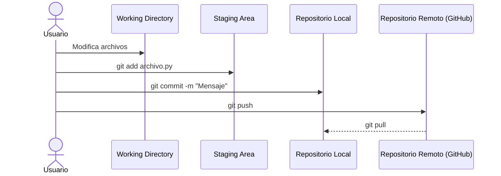
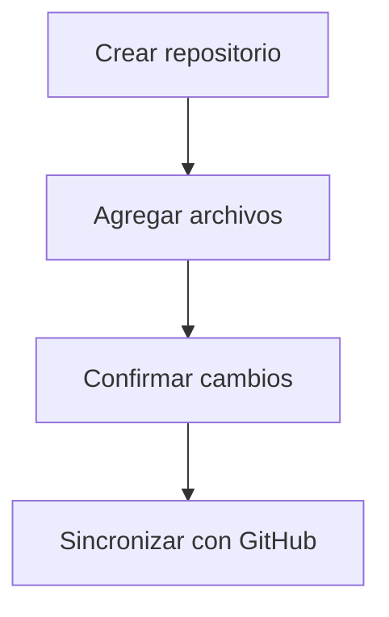
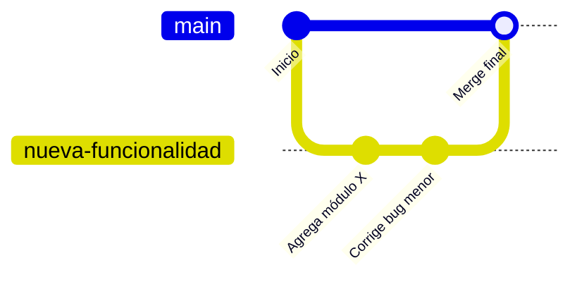

# Clase 10: Introducción a Git y GitHub

!!! info "¿Por qué usar un sistema de control de versiones?"

    En el desarrollo de software, los proyectos evolucionan constantemente.
    Se agregan funcionalidades, se corrigen errores y se prueban nuevas ideas.
    Sin un sistema que lleve registro de todos estos cambios, **es muy fácil perder trabajo o sobrescribir código**.

**Git** resuelve estos problemas al permitir:

- Guardar diferentes versiones del proyecto (`commits`).
- Retroceder en el tiempo si algo falla.
- Trabajar en equipo sin sobrescribir archivos.
- Saber **quién hizo qué y cuándo**.

**GitHub**, por su parte, es una plataforma en línea que permite:

- Almacenar repositorios Git en la nube.
- Colaborar con otros desarrolladores.
- Revisar código, crear ramas, reportar errores y gestionar proyectos.

!!! example "Resumen"

    - **Git**: Sistema local que gestiona las versiones del proyecto.
    - **GitHub**: Plataforma en la nube donde se comparten y colaboran los repositorios Git.

## Conceptos fundamentales de Git

Git organiza el trabajo en **tres áreas principales**:

| Área                       | Descripción                                                               |
| -------------------------- | ------------------------------------------------------------------------- |
| _Working Directory_        | Donde se trabaja directamente con los archivos (el código fuente actual). |
| _Staging Area (Index)_     | Zona temporal donde se preparan los archivos para ser guardados.          |
| _Repositorio local (.git)_ | Donde se almacenan permanentemente las versiones confirmadas (_commits_). |

!!! tip "Git registra cada cambio como un **snapshot**"

    Cada *commit* es como una _foto_ del proyecto en un momento determinado.
    Esto permite comparar versiones y restaurar estados anteriores fácilmente.

### ¿Qué es un repositorio?

Un **repositorio** es una carpeta donde Git almacena todo el historial de cambios del proyecto.
Al inicializar un repositorio con:

```bash
git init
```

Se crea una subcarpeta oculta llamada `.git` que contiene:

- Los commits y metadatos.
- Las ramas (_branches_).
- Las configuraciones locales.

!!! note

    Nunca se debe borrar la carpeta `.git`, pues se perdería todo el historial del proyecto.

### ¿Qué es un _commit_?

Un **commit** representa una versión específica del proyecto con un mensaje descriptivo.
Cada commit tiene un identificador único (`SHA`) que lo diferencia de los demás.

```bash
git commit -m "Agrega función de login"
```

!!! info "Buenas prácticas"

    - Usar mensajes claros: `"Agrega módulo de autenticación"`, `"Corrige bug en cálculo de total"`.
    - Realizar *commits* pequeños y frecuentes.

### Diagrama conceptual: flujo básico de Git



## Instalación y configuración inicial

!!! info "Instalación de Git"

    Git se puede descargar desde su página oficial [git-scm.com](https://git-scm.com/downloads).
    En la instalación se recomienda dejar las opciones por defecto.

Una vez instalado, se puede verificar su versión con:

```bash
git --version
```

## Configuración del usuario

Git necesita saber quién realiza los cambios para poder asociarlos a los commits.
Por eso se configura el nombre y el correo electrónico:

```bash
git config --global user.name "Nombre"
git config --global user.email "email@ejemplo.com"
```

!!! note "Importante"

    Use el mismo nombre y correo de su cuenta de GitHub

Para revisar la configuración:

```bash
git config --list
```

!!! tip

    Esta información se guarda en un archivo oculto llamado `.gitconfig` dentro del directorio del usuario.
    También se puede modificar directamente desde un editor de texto.

## Comandos esenciales de Git

El flujo de trabajo típico con Git puede resumirse en cuatro pasos principales:
**inicializar**, **agregar**, **guardar** y **sincronizar**.



### Crear o clonar un repositorio

**Crear un repositorio nuevo:**

```bash
git init
```

!!! info "Práctica más común"

    Lo usual es crear el repositorio en GitHub y luego clonarlo con el comando a continuación.

**Clonar un repositorio existente desde GitHub:**

```bash
git clone <https://github.com/usuario/proyecto.git>
```

### Revisar el estado del proyecto

```bash
git status
```

Muestra qué archivos han cambiado, cuáles están listos para confirmar y cuáles no.

### Agregar archivos al área de preparación

```bash
git add archivo.py
```

O bien, agregar todos los archivos modificados (dentro del directorio actual):

```bash
git add .
```

### Guardar los cambios (`commit`)

```bash
git commit -m "Mensaje descriptivo del cambio"
```

### Ver el historial de cambios

```bash
git log
```

Para un resumen más compacto:

```bash
git log --oneline
```

### Sincronizar con GitHub

**Enviar cambios al repositorio remoto:**

```bash
git push
```

**Descargar los cambios más recientes:**

```bash
git pull
```

!!! note "Nota"

    En algunos casos se usa `git push origin main` o `git pull origin main`.
    Esto indica explícitamente el nombre del repositorio remoto (`origin`) y la rama (`main`).
    Sin embargo, Git normalmente recuerda esta configuración después del primer uso.

### Restaurar archivos o deshacer cambios

!!! danger "Cuidado"

    Tener cuidado con el uso de estos comandos porque se puede perder los cambios realizados si se realizan de forma incorrecta.

**Deshacer cambios no confirmados:**

```bash
git restore archivo.py
```

**Eliminar archivos del repositorio:**

```bash
git rm archivo.txt
```

**Comparar versiones antes de confirmar:**

```bash
git diff
```

## Introducción a ramas (_branches_)

!!! info "¿Qué es una rama?"

    Una **rama** es una línea de desarrollo independiente dentro de un mismo proyecto.
    Permite trabajar en nuevas funciones o pruebas sin afectar el código principal.

### Ver ramas existentes

```bash
git branch
```

La rama activa se marca con un asterisco (`*`).

### Crear una nueva rama

```bash
git branch nueva-rama
```

O crearla y cambiarse a ella en un solo paso:

```bash
git checkout -b nueva-rama
```

### Cambiar de rama

```bash
git checkout main
```

### Fusionar ramas (`merge`)

```bash
git merge nueva-rama
```

!!! tip

    Es recomendable realizar el _merge_ desde la rama principal (`main`) después de probar que los cambios funcionan correctamente.
    Sin embargo, la integración de cambios también se puede realizar directamente por medio de un _pull request_ en GitHub.

### Eliminar una rama

```bash
git branch -d nueva-rama
```

### Visualización del flujo de ramas


