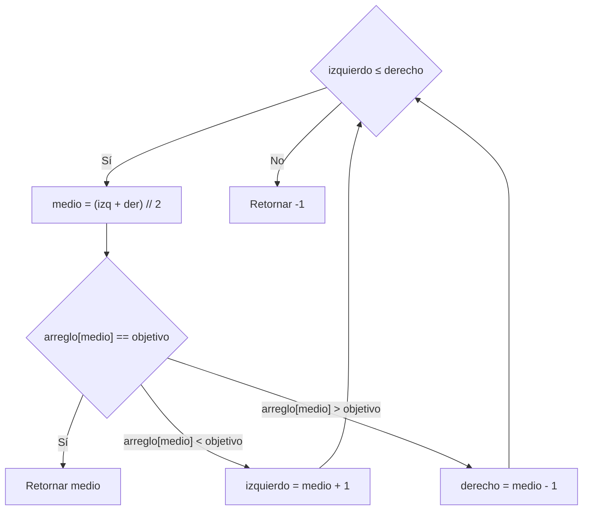

<!-- Colocar formato matemático -->
<script id="MathJax-script" async src="https://unpkg.com/mathjax@3/es5/tex-mml-chtml.js"></script>
<script>
  window.MathJax = {
    tex: {
      inlineMath: [["\\(", "\\)"]],
      displayMath: [["\\[", "\\]"]],
      processEscapes: true,
      processEnvironments: true
    },
    options: {
      ignoreHtmlClass: ".*|",
      processHtmlClass: "arithmatex"
    }
  };
</script>

# :material-numeric: Algoritmos

## Algoritmos sobre arreglos

### Máximo y mínimo

El problema más elemental sobre arreglos es encontrar el _valor máximo_ o _mínimo_ de un conjunto de datos.
Se recorre el arreglo una sola vez, manteniendo una variable que guarda el mejor valor visto hasta el momento.

!!! warning "Requisito"

    El arreglo debe tener al menos un elemento. Inicializar con `numeros[0]` lanza un `IndexError` si el arreglo está vacío.

=== "C++"

    ```cpp
    vector<int> numeros = {213, 34, 12, 43, 65, 78, 100, 1, -1, -234};

    int maximo = numeros[0];
    for (int x : numeros) {
        if (x > maximo) {
            maximo = x;
        }
    }

    cout << maximo << endl;  // 213
    ```

=== "Python"

    ```python
    numeros = [213, 34, 12, 43, 65, 78, 100, 1, -1, -234]

    maximo = numeros[0]
    for x in numeros:
        if x > maximo:
            maximo = x

    print(maximo)  # 213
    ```

La complejidad es $O(n)$: cada elemento se visita exactamente una vez.

!!! tip "Índice del máximo"

    Si se necesita la _posición_ del elemento máximo en lugar de su valor, se itera con `range(len(...))` y se guarda el índice:

    === "C++"

        ```cpp
        int indice_max = 0;
        for (int i = 1; i < (int)numeros.size(); i++) {
            if (numeros[i] > numeros[indice_max]) {
                indice_max = i;
            }
        }

        cout << indice_max << endl;   // 0  (el valor 213 está en la posición 0)
        ```

    === "Python"

        ```python
        indice_max = 0
        for i in range(1, len(numeros)):
            if numeros[i] > numeros[indice_max]:
                indice_max = i

        print(indice_max)   # 0  (el valor 213 está en la posición 0)
        ```

!!! note "Funciones de Python"

    En competencias se puede usar `max(lista)` y `min(lista)` directamente.
    Conocer la implementación manual es útil cuando el criterio de comparación es más complejo, por ejemplo: encontrar el estudiante con la nota más alta en una lista de tuplas `(nombre, nota)`.

### Sumas de prefijos

Suponga que tiene un arreglo de `n` números y debe responder muchas consultas de la forma: _¿cuánto suman los elementos entre el índice `i` y el índice `j`?_

Si se recorre el arreglo desde `i` hasta `j` para cada consulta, la complejidad total es $O(n \cdot q)$, donde `q` es el número de consultas.
Las _sumas de prefijos_ permiten responder cada consulta en $O(1)$, pagando solo un preprocesamiento de $O(n)$ al inicio.

#### Construcción

Se construye un arreglo auxiliar `prefijos` donde `prefijos[k]` almacena la suma de todos los elementos desde el índice `0` hasta el índice `k`.

=== "C++"

    ```cpp
    vector<int> numeros  = {23, 14, 12, 21, 45, 32};
    vector<int> prefijos(numeros.size());

    prefijos[0] = numeros[0];
    for (int i = 1; i < (int)numeros.size(); i++) {
        prefijos[i] = prefijos[i-1] + numeros[i];
    }
    ```

=== "Python"

    ```python
    numeros  = [23, 14, 12, 21, 45, 32]
    prefijos = [0] * len(numeros)

    prefijos[0] = numeros[0]
    for i in range(1, len(numeros)):
        prefijos[i] = prefijos[i-1] + numeros[i]
    ```

| Índice | Valor | Prefijo acumulado |
| ------ | ----- | ----------------- |
| 0      | 23    | 23                |
| 1      | 14    | 37                |
| 2      | 12    | 49                |
| 3      | 21    | 70                |
| 4      | 45    | 115               |
| 5      | 32    | 147               |

#### Consulta de rango

Para obtener la suma entre los índices `i` y `j` se usa la fórmula:

$\text{suma}(i, j) = \text{prefijos}[j] - \text{prefijos}[i - 1]$

=== "C++"

    ```cpp
    int suma_rango(vector<int>& prefijos, int i, int j) {
        if (i == 0) {
            return prefijos[j];
        }
        return prefijos[j] - prefijos[i - 1];
    }
    ```

=== "Python"

    ```python
    def suma_rango(prefijos, i, j):
        if i == 0:
            return prefijos[j]
        return prefijos[j] - prefijos[i - 1]
    ```

!!! example "Ejemplo"

    Suma del rango `[2, 4]` sobre `[23, 14, 12, 21, 45, 32]`:

    ```
    prefijos[4] - prefijos[1] = 115 - 37 = 78
    ```

!!! warning "Caso borde: i = 0"

    Cuando `i = 0`, no existe `prefijos[-1]` (en Python daría el último elemento), así que siempre tratar ese caso por separado, retornando `prefijos[j]` directamente.

---

### Búsqueda binaria

- La _búsqueda lineal_ revisa cada elemento del arreglo uno por uno, con complejidad $O(n)$.
- La _búsqueda binaria_ aprovecha el hecho de que el arreglo está _ordenado_ para descartar la mitad del espacio en cada comparación, logrando $O(\log n)$.

!!! warning "Requisito"

    El arreglo debe estar ordenado de menor a mayor antes de aplicar este algoritmo.
    Aplicarlo sobre un arreglo desordenado produce resultados incorrectos sin ningún mensaje de error.

Se mantienen dos punteros, `izquierdo` y `derecho`, que delimitan la zona donde puede estar el objetivo.
En cada paso se inspecciona el _elemento del medio_:

- Si es el objetivo, se retorna su índice.
- Si es menor que el objetivo, este solo puede estar a la derecha: se avanza `izquierdo`.
- Si es mayor, este solo puede estar a la izquierda: se retrocede `derecho`.



=== "C++"

    ```cpp
    int busqueda_binaria(vector<int>& arreglo, int objetivo) {
        int izquierdo = 0, derecho = (int)arreglo.size() - 1;

        while (izquierdo <= derecho) {
            int medio = (izquierdo + derecho) / 2;

            if (arreglo[medio] == objetivo) {
                return medio;
            } else if (arreglo[medio] < objetivo) {
                izquierdo = medio + 1;
            } else {
                derecho = medio - 1;
            }
        }

        return -1;
    }
    ```

=== "Python"

    ```python
    def busqueda_binaria(arreglo, objetivo):
        izquierdo, derecho = 0, len(arreglo) - 1

        while izquierdo <= derecho:
            medio = (izquierdo + derecho) // 2

            if arreglo[medio] == objetivo:
                return medio
            elif arreglo[medio] < objetivo:
                izquierdo = medio + 1
            else:
                derecho = medio - 1

        return -1
    ```

!!! example "Ejemplo de ejecución"

    === "Objetivo encontrado"
        Arreglo: `[1, 2, 3, 4, 5, 6, 7, 8, 9, 10]`, objetivo: `7`

        | Paso | izq | der | medio | arreglo[medio] | Acción        |
        |------|-----|-----|-------|----------------|---------------|
        | 1    | 0   | 9   | 4     | 5              | izq = 5       |
        | 2    | 5   | 9   | 7     | 8              | der = 6       |
        | 3    | 5   | 6   | 5     | 6              | izq = 6       |
        | 4    | 6   | 6   | 6     | 7              | retorna *6*   |

    === "Objetivo no encontrado"
        Arreglo: `[1, 2, 3, 4, 5, 6, 7, 8, 9, 10]`, objetivo: `11`

        | Paso | izq | der | medio | arreglo[medio] | Acción        |
        |------|-----|-----|-------|----------------|---------------|
        | 1    | 0   | 9   | 4     | 5              | izq = 5       |
        | 2    | 5   | 9   | 7     | 8              | izq = 8       |
        | 3    | 8   | 9   | 8     | 9              | izq = 9       |
        | 4    | 9   | 9   | 9     | 10             | izq = 10      |
        | 5    | 10  | 9   | —     | —              | retorna *-1*  |

!!! abstract "Comparación de complejidad"

    | Algoritmo          | Mejor caso | Peor caso |
    |--------------------|------------|-----------|
    | Búsqueda lineal    | $O(1)$   | $O(n)$      |
    | Búsqueda binaria   | $O(1)$   | $O(\log n)$ |

    En un arreglo de 1 000 000 elementos, la búsqueda binaria necesita como máximo 20 comparaciones:
    $\log_2(1 000 000) \approx 20$.

## Algoritmos sobre números

### Algoritmo de Euclides

El _máximo común divisor_ (MCD) de dos números `a` y `b` es el número entero más grande que divide a ambos sin dejar residuo.

!!! warning "Requisito"

    Ambos valores deben ser enteros no negativos. Si ambos son 0, el resultado está indefinido matemáticamente.

El _algoritmo de Euclides_ se define de forma recursiva:

$$\text{mcd}(a, b) = \begin{cases} a & \text{si } b = 0 \\ \text{mcd}(b,\; a \bmod b) & \text{si } b > 0 \end{cases}$$

!!! note "Operación módulo"

    La operación $a \bmod b$ (`a % b` en Python) devuelve el _residuo_ de dividir `a` entre `b`.
    Por ejemplo, $17 \bmod 5 = 2$ porque: $17 = 3 \cdot 5 + 2$.

Esto se repite reduciendo los valores en cada paso hasta que el segundo número sea cero.
En este punto, el primero es el MCD.

=== "C++"

    ```cpp
    int mcd(int a, int b) {
        while (b != 0) {
            int temp = b;
            b = a % b;
            a = temp;
        }
        return a;
    }

    cout << mcd(48, 18) << endl;  // 6
    ```

=== "Python"

    ```python
    def mcd(a, b):
        while b != 0:
            a, b = b, a % b
        return a

    print(mcd(48, 18))  # 6
    ```

!!! example "Ejemplo de ejecución"

    `mcd(48, 18)`:

    | Paso | a  | b  | a % b |
    |------|----|----|-------|
    | 1    | 48 | 18 | 12    |
    | 2    | 18 | 12 | 6     |
    | 3    | 12 | 6  | 0     |
    | 4    | 6  | 0  | Retorna 6 |

!!! tip "Mínimo común múltiplo"

    El _mínimo común múltiplo_ (MCM) se obtiene a partir del MCD con la fórmula:

    $\text{mcm}(a, b) = \frac{a \cdot b}{\text{mcd}(a, b)}$

    === "C++"

        ```cpp
        int mcm(int a, int b) {
            return a * b / mcd(a, b);
        }

        cout << mcm(4, 6) << endl;  // 12
        ```

    === "Python"

        ```python
        def mcm(a, b):
            return a * b // mcd(a, b)

        print(mcm(4, 6))  # 12
        ```

!!! abstract "Complejidad"

    El algoritmo de Euclides tiene complejidad $O(\log(\min(a, b)))$.
    Para números de hasta $10^{18}$, termina en menos de 90 pasos.

### Exponenciación binaria

La _exponenciación binaria_ calcula $a^n$ de forma eficiente en $O(\log n)$, en lugar de $O(n)$ que tomaría multiplicar `a` por sí mismo `n` veces.

!!! warning "Requisito"

    El exponente `n` debe ser un entero no negativo ($n \geq 0$). La implementación no soporta exponentes negativos.

La reducción de complejidad se basa en la siguiente observación:

- Si `n` es par: $a^n = \left(a^{\lfloor n/2 \rfloor}\right)^2$
- Si `n` es impar: $a^n = \left(a^{\lfloor n/2 \rfloor}\right)^2 \cdot a$

En lugar de hacer `n` multiplicaciones, se hace la mitad del trabajo en cada paso recursivo.

=== "C++"

    ```cpp
    long long potencia(long long a, long long n) {
        if (n == 0) {
            return 1;
        }

        long long mitad = potencia(a, n / 2);

        if (n % 2 == 0) {
            return mitad * mitad;
        } else {
            return mitad * mitad * a;
        }
    }
    ```

=== "Python"

    ```python
    def potencia(a, n):
        if n == 0:
            return 1

        mitad = potencia(a, n // 2)

        if n % 2 == 0:
            return mitad * mitad
        else:
            return mitad * mitad * a
    ```

!!! example "Ejemplo de ejecución"

    `potencia(2, 10)`:

    ```
    potencia(2, 10)
      1. mitad = potencia(2, 5)
            2. mitad = potencia(2, 2)
                  3. mitad = potencia(2, 1)
                        4. mitad = potencia(2, 0) = 1
                        5. 1 * 1 * 2 = 2
                  6. 2 * 2 = 4
            7. 4 * 4 * 2 = 32
      8. 32 * 32 = 1024
    ```

    Solo *4 multiplicaciones* en lugar de 10.

### Test de primalidad en O(√n)

Un número `n` es _primo_ si sus únicos divisores son 1 y él mismo.
La forma directa de verificarlo sería revisar todos los números desde `2` hasta `n - 1`, pero eso es $O(n)$.

Si `n` tiene un divisor $d > \sqrt{n}$, entonces $\frac{n}{d} < \sqrt{n}$, lo que significa que ya hay un divisor más pequeño que $\sqrt{n}$.
Por lo tanto, basta revisar divisores hasta $\sqrt{n}$.
Tiene una complejidad temporal de $O(\sqrt{n})$.

=== "C++"

    ```cpp
    bool es_primo(int n) {
        if (n < 2) {
            return false;
        }
        int x = 2;
        while (x * x <= n) {
            if (n % x == 0) {
                return false;
            }
            x++;
        }
        return true;
    }

    cout << es_primo(97) << endl;   // 1 (true)
    cout << es_primo(100) << endl;  // 0 (false)
    ```

=== "Python"

    ```python
    def es_primo(n):
        if n < 2:
            return False
        x = 2
        while x * x <= n:
            if n % x == 0:
                return False
            x += 1
        return True

    print(es_primo(97))   # True
    print(es_primo(100))  # False
    ```

!!! warning "No usar para muchas consultas"

    Si se necesita saber si miles de números son primos, este test resulta lento, por lo que conviene usar la _Criba de Eratóstenes_.

### Factorización

La factorización de un número `n` consiste en encontrar todos los valores que lo dividen exactamente.
La observación clave es que si `d` divide a `n` y $d \leq \sqrt{n}$, entonces $n / d$ también es divisor, lo que permite encontrarlos de a pares revisando solo hasta $\sqrt{n}$, con complejidad $O(\sqrt{n})$.

=== "C++"

    ```cpp
    vector<int> divisores(int n) {
        vector<int> resultado;
        for (int i = 1; (long long)i * i <= n; i++) {
            if (n % i == 0) {
                resultado.push_back(i);
                if (i != n / i) {
                    resultado.push_back(n / i);
                }
            }
        }
        sort(resultado.begin(), resultado.end());
        return resultado;
    }
    ```

=== "Python"

    ```python
    from math import isqrt # Retorna un entero en lugar de float

    def divisores(n):
        resultado = []
        for i in range(1, isqrt(n) + 1):
            if n % i == 0:
                resultado.append(i)
                if i != n // i:
                    resultado.append(n // i)
        resultado.sort()
        return resultado

    print(divisores(36))  # [1, 2, 3, 4, 6, 9, 12, 18, 36]
    ```

!!! example "Ejemplo para n = 36"

    $\sqrt{36} = 6$, por lo tanto se revisan i = 1, 2, 3, 4, 5, 6:

    | i  | 36 % i | Par (36 // i)               |
    |----|--------|-----------------------------|
    | 1  | 0      | 36                          |
    | 2  | 0      | 18                          |
    | 3  | 0      | 12                          |
    | 4  | 0      | 9                           |
    | 5  | 1      | —                           |
    | 6  | 0      | 6 (igual a i)               |

    Resultado: `[1, 2, 3, 4, 6, 9, 12, 18, 36]`

!!! tip "Factorización prima"

    Para encontrar los _factores primos_ de `n`, se divide `n` mientras sea divisible:

    === "C++"

        ```cpp
        vector<int> factores_primos(int n) {
            vector<int> factores;
            int d = 2;
            while ((long long)d * d <= n) {
                while (n % d == 0) {
                    factores.push_back(d);
                    n /= d;
                }
                d++;
            }
            if (n > 1) {
                factores.push_back(n);
            }
            return factores;
        }
        ```

    === "Python"

        ```python
        def factores_primos(n):
            factores = []
            d = 2
            while d * d <= n:
                while n % d == 0:
                    factores.append(d)
                    n //= d
                d += 1
            if n > 1:
                factores.append(n)
            return factores

        print(factores_primos(360))  # [2, 2, 2, 3, 3, 5]
        ```

---

### Criba de Eratóstenes

La _Criba de Eratóstenes_ genera todos los números primos en el rango $[2, n]$ de forma eficiente.
Aplicar el test de primalidad individual a cada número tomaría $O(n\sqrt{n})$ en total.
La _Criba de Eratóstenes_ hace lo mismo en $O(n \cdot \log(\log(n)))$, que en la práctica es casi lineal.

La idea es comenzar con todos los números marcados como primos y luego, para cada primo encontrado, _eliminar todos sus múltiplos_.

=== "C++"

    ```cpp
    vector<int> criba(int n) {
        vector<bool> es_primo(n + 1, true);
        es_primo[0] = es_primo[1] = false;

        for (int i = 2; (long long)i * i <= n; i++) {
            if (es_primo[i]) {
                for (int j = i * i; j <= n; j += i) {  // (1)!
                    es_primo[j] = false;
                }
            }
        }

        vector<int> primos;
        for (int i = 2; i <= n; i++) {
            if (es_primo[i]) primos.push_back(i);
        }
        return primos;
    }
    ```

    1. Se empieza en `i * i` porque los múltiplos menores (`2i`, `3i`, ..., `(i-1)i`) ya fueron eliminados por primos anteriores.

=== "Python"

    ```python
    def criba(n):
        es_primo = [True] * (n + 1)
        es_primo[0] = es_primo[1] = False

        i = 2
        while i * i <= n:
            if es_primo[i]:
                for j in range(i * i, n + 1, i):   # (1)!
                    es_primo[j] = False
            i += 1

        return [i for i in range(2, n + 1) if es_primo[i]]

    print(criba(30))  # [2, 3, 5, 7, 11, 13, 17, 19, 23, 29]
    ```

    1. Se empieza en `i * i` porque los múltiplos menores (`2i`, `3i`, ..., `(i-1)i`) ya fueron eliminados por primos anteriores.

!!! example "Visualización para n = 15"

    Estado inicial: todos marcados como primos.

    ```
    [F, F, T, T, T, T, T, T, T, T, T, T, T, T, T, T]
     0  1  2  3  4  5  6  7  8  9 10 11 12 13 14 15
    ```

    === "i = 2"
        Se eliminan 4, 6, 8, 10, 12, 14.
        ```
        [F, F, T, T, F, T, F, T, F, T, F, T, F, T, F, T]
        ```

    === "i = 3"
        Se eliminan 9, 15 (6 y 12 ya estaban eliminados).
        ```
        [F, F, T, T, F, T, F, T, F, F, F, T, F, T, F, F]
        ```

    === "i = 4 (no es primo, se salta)"
        Sin cambios.

    === "Resultado"
        Primos hasta 15: *2, 3, 5, 7, 11, 13*

!!! abstract "Complejidad"

    | Algoritmo              | Para encontrar todos los primos ≤ n |
    |------------------------|--------------------------------------|
    | Test individual $O(\sqrt{n})$  | $O(n\sqrt{n})$       |
    | Criba de Eratóstenes             | $O(n \cdot \log(\log(n)))$   |

    Para $n = 10^6$, la criba es aproximadamente _300 veces más rápida_.
