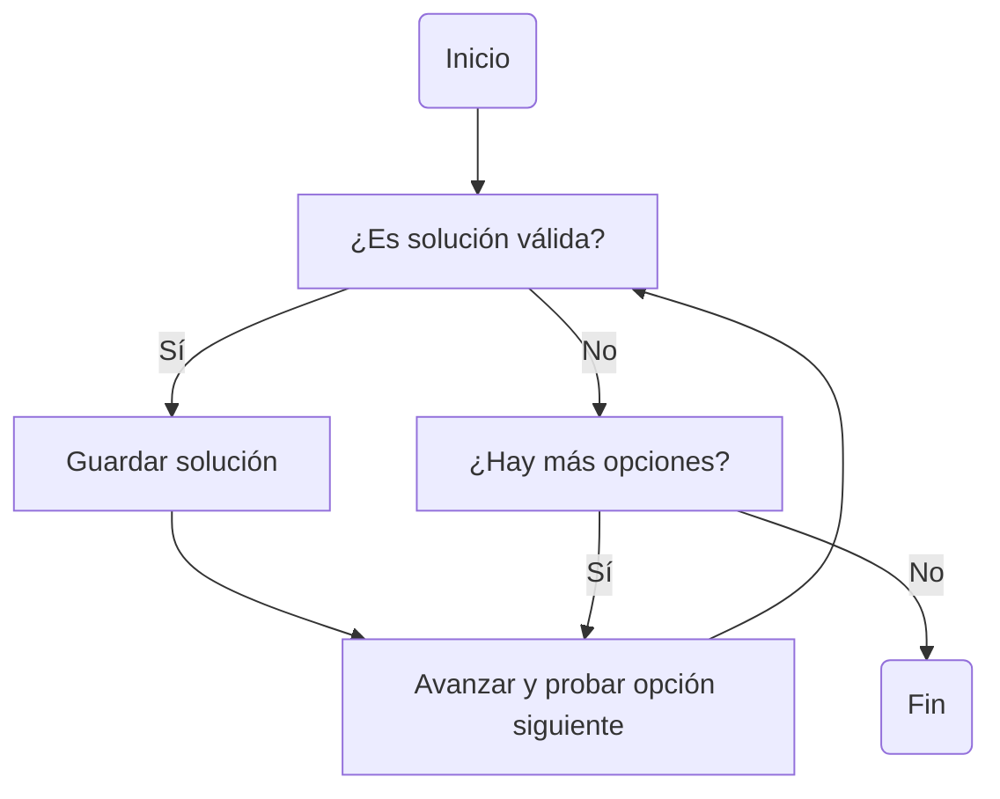

# :material-source-branch: _Backtracking_

**Backtracking** (o búsqueda con retroceso) es una técnica de diseño algorítmico que permite **explorar todas las soluciones posibles** de un problema, **descartando aquellas que no cumplen las condiciones**.

Se basa en **construir una solución paso a paso**, y cuando se detecta que el camino actual **no puede llevar a una solución válida**, el algoritmo **retrocede (_backtrack_)** y prueba una alternativa.



## ¿Cuándo se usa?

Se aplica cuando:

- Se necesita **generar todas las combinaciones o permutaciones posibles**.
- El espacio de soluciones es **grande**, pero se puede **podar o descartar caminos inválidos rápidamente** (poda de búsqueda).
- No se conoce una estrategia voraz ni una fórmula matemática directa para resolver el problema.

## Desventajas

- Es costoso en tiempo si no se aplican podas.
- En problemas con grandes espacios de búsqueda, puede ser ineficiente sin optimizaciones.

---

## Ejemplo: Algoritmo de las `N` Reinas

El problema de las **N reinas** consiste en colocar `N` reinas en un tablero de ajedrez de `N x N` de forma que **ninguna reina se ataque entre sí**.
Las reinas se atacan si están en la **misma fila**, **columna** o **diagonal**.
El objetivo es encontrar **una o todas las configuraciones posibles** válidas.

```python
def es_seguro(tablero, fila, col, n):
    # Verificar columna
    for i in range(fila):
        if tablero[i] == col:
            return False

    # Verificar diagonal izquierda
    for i in range(fila):
        if tablero[i] == col - (fila - i):
            return False

    # Verificar diagonal derecha
    for i in range(fila):
        if tablero[i] == col + (fila - i):
            return False

    return True

def resolver_n_reinas(n):
    soluciones = []
    tablero = [-1] * n  # tablero[i] = columna donde está la reina en la fila i

    def backtrack(fila):
        if fila == n:
            soluciones.append(tablero[:])  # Se encontró una solución válida
            return

        for col in range(n):
            if es_seguro(tablero, fila, col, n):
                tablero[fila] = col  # Colocar reina
                backtrack(fila + 1)  # Ir a la siguiente fila
                tablero[fila] = -1  # Backtrack (quitar reina)

    backtrack(0)
    return soluciones
```

**1. Representación del tablero**

- Se usa una lista `tablero` de tamaño `n`, donde `tablero[i] = j` significa que hay una reina en la **fila `i` y columna `j`**.
- No se necesita una matriz: como colocamos una reina por fila, cada índice ya representa una fila.

**2. Función `es_seguro()`**

- Verifica si una reina en la posición `(fila, col)` es atacada por alguna reina anterior:
  - **Columna:** ya hay una reina en la misma columna.
  - **Diagonal izquierda:** la reina se encuentra a la misma distancia a la izquierda.
  - **Diagonal derecha:** la reina se encuentra a la misma distancia a la derecha.

**3. Función `backtrack(fila)`**

- Si `fila == n`, se ha colocado una reina en cada fila, por lo tanto, se guarda una copia del tablero como solución.
- Si no:
  - Se prueban todas las columnas posibles para la fila actual.
  - Para cada columna válida:
    - Se coloca una reina.
    - Se avanza a la siguiente fila con una llamada recursiva.
    - Si esa rama falla, se **retrocede (backtrack)** quitando la reina.

---

## Ejemplo: Permutaciones y combinaciones de un conjunto

Dado un conjunto de elementos distintos, por ejemplo:

```python
conjunto = [1, 2, 3]
```

Se desea:

1. **Generar todas las permutaciones posibles** (donde el orden importa).
2. **Generar todas las combinaciones posibles de tamaño `k`** (donde el orden no importa).

### 1. Permutaciones

```python
def permutaciones(conjunto):
    resultado = []
    visitado = [False] * len(conjunto)

    def backtrack(parcial):
        if len(parcial) == len(conjunto):
            resultado.append(parcial[:])
            return

        for i in range(len(conjunto)):
            if not visitado[i]:
                visitado[i] = True
                parcial.append(conjunto[i])
                backtrack(parcial)
                parcial.pop()
                visitado[i] = False

    backtrack([])
    return resultado

# Ejemplo
print(permutaciones([1, 2, 3]))
```

- Se construye la solución parcial en una lista `parcial`.
- Se usa un arreglo `visitado` para evitar reutilizar elementos.
- En cada paso se prueban todos los elementos **no visitados**.
- Cuando la solución parcial tiene el mismo largo que el conjunto, se agrega como permutación válida.
- Al salir del paso recursivo, se **retrocede** eliminando el último elemento y marcando como no visitado.

### 2. Combinaciones

```python
def combinaciones(conjunto, k):
    resultado = []

    def backtrack(inicio, parcial):
        if len(parcial) == k:
            resultado.append(parcial[:])
            return

        for i in range(inicio, len(conjunto)):
            parcial.append(conjunto[i])
            backtrack(i + 1, parcial)
            parcial.pop()

    backtrack(0, [])
    return resultado

# Ejemplo
print(combinaciones([1, 2, 3, 4], 2))
```

- Se construye una combinación parcial.
- Se comienza desde `inicio` para evitar reusar elementos anteriores y así mantener el orden y evitar duplicados.
- Si se alcanza tamaño `k`, se agrega como combinación válida.
- Al retroceder, se elimina el último elemento para explorar otras posibilidades.

---

## Ejemplo: _Sudoku Solver_

```python
def es_valido(tablero, fila, col, num):
    # Verifica si el número ya está en la misma fila
    for j in range(9):
        if tablero[fila][j] == num:
            return False

    # Verifica si el número ya está en la misma columna
    for i in range(9):
        if tablero[i][col] == num:
            return False

    # Verifica si el número ya está en el subcuadro 3x3
    inicio_fila = (fila // 3) * 3
    inicio_col = (col // 3) * 3
    for i in range(3):
        for j in range(3):
            if tablero[inicio_fila + i][inicio_col + j] == num:
                return False

    return True  # El número es válido en esta celda

def resolver_sudoku(tablero):
    # Recorremos cada celda del tablero
    for fila in range(9):
        for col in range(9):
            if tablero[fila][col] == 0:
                # Celda vacía: intentar colocar un número del 1 al 9
                for num in range(1, 10):
                    if es_valido(tablero, fila, col, num):
                        tablero[fila][col] = num  # Colocamos provisionalmente

                        if resolver_sudoku(tablero):
                            return True  # Se encontró una solución válida

                        tablero[fila][col] = 0  # Retroceder (backtrack)

                # Ningún número válido funcionó en esta celda
                return False

    # No quedan celdas vacías, el tablero está completo
    return True
```

**1. Verificación de validez (`es_valido`)**

Antes de colocar un número en una celda, se comprueba que:

- No se repita en la **fila**.
- No se repita en la **columna**.
- No se repita en el **cuadro 3x3** correspondiente.

Esto asegura que las reglas del Sudoku se respeten antes de avanzar.

**2. Backtracking (`resolver_sudoku`)**

El algoritmo principal sigue estos pasos:

- Se busca la próxima celda vacía (con valor 0).
- Para esa celda, se intenta colocar cada número del 1 al 9:
  - Si el número es válido, se coloca provisionalmente.
  - Se llama recursivamente a `resolver_sudoku()` para resolver el resto del tablero.
- Si ningún número funciona, se **retrocede** y se prueba otra opción.

**3. Corte de recursión**

El algoritmo termina exitosamente cuando ya no quedan celdas vacías.  
Se retorna `True` porque el tablero fue completado correctamente.

---

## Ejemplo: Resolver un laberinto

Dado un **laberinto representado como una matriz `N x N`**, donde:

- `1` indica un camino libre.
- `0` indica una pared (no se puede pasar).
- El objetivo es encontrar **un camino desde la celda de inicio** `(0, 0)` **hasta la celda de destino** `(N-1, N-1)` **moviendo solo en las 4 direcciones cardinales**: arriba, abajo, izquierda y derecha.
- No se permite salir de la matriz ni pasar por celdas marcadas como `0`.
- El algoritmo debe marcar el camino encontrado.

```python
def es_valido(laberinto, x, y, solucion):
    N = len(laberinto)
    # Verifica si (x, y) está dentro del tablero, es transitable y no ha sido visitado
    return (
        0 <= x < N and
        0 <= y < N and
        laberinto[x][y] == 1 and
        solucion[x][y] == 0
    )

def resolver_laberinto(laberinto):
    N = len(laberinto)

    # Crear matriz de solución con ceros
    solucion = [[0] * N for _ in range(N)]

    # Intentar resolver desde (0, 0)
    if backtrack_laberinto(laberinto, 0, 0, solucion):
        return solucion  # Devuelve el camino marcado con 1
    else:
        return None  # No hay solución

def backtrack_laberinto(laberinto, x, y, solucion):
    N = len(laberinto)

    # Caso base: se llega a la meta
    if x == N - 1 and y == N - 1 and laberinto[x][y] == 1:
        solucion[x][y] = 1
        return True

    # Verificar si se puede avanzar a (x, y)
    if es_valido(laberinto, x, y, solucion):
        solucion[x][y] = 1  # Marcar celda como parte del camino

        # Moverse hacia abajo
        if backtrack_laberinto(laberinto, x + 1, y, solucion):
            return True

        # Moverse hacia la derecha
        if backtrack_laberinto(laberinto, x, y + 1, solucion):
            return True

        # Moverse hacia arriba
        if backtrack_laberinto(laberinto, x - 1, y, solucion):
            return True

        # Moverse hacia la izquierda
        if backtrack_laberinto(laberinto, x, y - 1, solucion):
            return True

        # Retroceso: ninguna dirección sirvió
        solucion[x][y] = 0
        return False

    return False
```

**1. Representación del laberinto**

- Una matriz `N x N` donde `1` son celdas libres y `0` son obstáculos.
- Se inicia en `(0, 0)` y se busca llegar a `(N-1, N-1)`.

**2. Estructura del algoritmo**

- Se crea una matriz `solucion` del mismo tamaño que el laberinto, inicializada en ceros.
- En cada paso, si la celda es válida, se marca como `1` (parte del camino).
- Se prueban movimientos en **las 4 direcciones posibles**.
- Si alguna de las llamadas recursivas retorna `True`, se propaga hacia atrás.

**3. Retroceso (_backtrack_)**

- Si desde una celda `(x, y)` no se puede llegar a la meta, se **desmarca la celda** (`solucion[x][y] = 0`) y se prueba otra dirección.
- Esto permite explorar otras rutas si una opción falla.

**4. Caso base**

- Si se alcanza `(N-1, N-1)` y esa celda es transitable (`1`), se marca como parte de la solución y se retorna `True`.

**5. Resultado**

- Si hay un camino válido, la función devuelve la matriz `solucion` con `1`s marcando el camino.
- Si no hay solución, retorna `None`.

---
