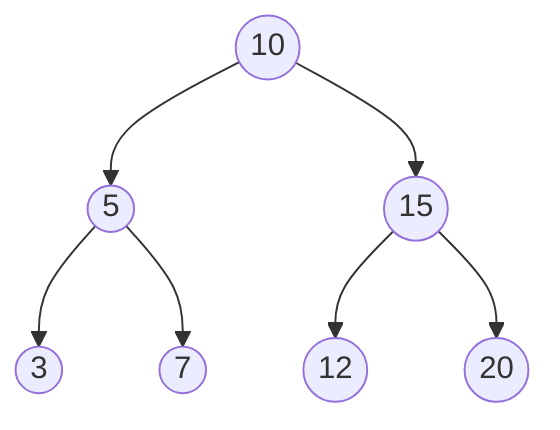

<!-- Colocar formato matemático -->
<script id="MathJax-script" async src="https://unpkg.com/mathjax@3/es5/tex-mml-chtml.js"></script>
<script>
  window.MathJax = {
    tex: {
      inlineMath: [["\\(", "\\)"]],
      displayMath: [["\\[", "\\]"]],
      processEscapes: true,
      processEnvironments: true
    },
    options: {
      ignoreHtmlClass: ".*|",
      processHtmlClass: "arithmatex"
    }
  };
</script>

# :material-layers: Estructuras de Datos

## ¿Por qué importa la estructura de datos?

Un algoritmo necesita almacenar y recuperar datos durante su ejecución.
La forma en que se organizan esos datos (la _estructura de datos_) determina qué operaciones son eficientes y cuáles no.
Elegir la estructura incorrecta puede convertir un algoritmo $O(n)$ en uno $O(n^2)$ sin cambiar una sola línea de lógica.
Cada una tiene un conjunto de operaciones eficientes y escenarios donde resulta la elección natural.

## Pilas

Una _pila_ es una estructura de datos que sigue el principio LIFO (_Last In, First Out_).
El último elemento que entra es el primero que sale.

> La analogía clásica es una pila de platos.
> Solo se puede agregar o quitar un plato de arriba, nunca del fondo.

Las dos operaciones fundamentales son _apilar_ (agregar arriba) y _desapilar_ (quitar del arriba).
Ambas tienen complejidad $O(1)$.

La idea central de una pila es que lo último que se guardó es lo primero que se recupera.
Por eso, una pila resulta natural cuando el problema exige _cerrar lo más reciente antes de continuar_.

En Python, una lista funciona como pila.
`append()` apila y `pop()` desapila.

```python
pila = []

pila.append(3)  # (1)!
pila.append(2)  # (2)!
pila.append(5)  # (3)!

print(pila[-1])  # 5 (arriba de la pila)
pila.pop()       # desapila 5
print(pila[-1])  # 2
pila.pop()       # desapila 2
print(pila[-1])  # 3
```

1. La pila ahora contiene `[3]`.
2. La pila ahora contiene `[3, 2]`.
3. La pila ahora contiene `[3, 2, 5]`.

!!! example "Aplicación para verificar paréntesis balanceados"

    Un uso clásico de las pilas es verificar si los paréntesis de una expresión están bien cerrados.
    Cada vez que se encuentra un `(` se apila; cada vez que se encuentra un `)` se desapila.
    Si la pila queda vacía al final, los paréntesis están balanceados.

    ```python
    def parentesis_balanceados(expresion):
        pila = []
        for caracter in expresion:
            if caracter == "(":
                pila.append(caracter)
            elif caracter == ")":
                if not pila:          # (1)!
                    return False
                pila.pop()
        return len(pila) == 0         # (2)!

    print(parentesis_balanceados("(a + b) * (c - d)"))   # True
    print(parentesis_balanceados("((a + b)"))            # False
    print(parentesis_balanceados("x + y) * z"))          # False
    ```

    1. Si la pila está vacía y se encuentra un `)`, hay un cierre sin apertura correspondiente.
    2. Si quedan elementos en la pila, hay aperturas que nunca se cerraron.

### ¿Cuándo pensar en una pila?

- Cuando el último dato agregado debe salir primero.
- Cuando hay apertura y cierre de símbolos, como paréntesis, llaves o etiquetas.
- Cuando se necesita deshacer acciones, por ejemplo en editores o navegación.

## Colas y colas de prioridad

### Colas

Una _cola_ sigue el principio FIFO (_First In, First Out_).
El primer elemento que entra es el primero que sale.

> La estructura funciona como una fila de personas en una caja.
> El primero en llegar es el primero en ser atendido.

Las dos operaciones fundamentales son _encolar_ (agregar al final) y _desencolar_ (quitar del frente).
Ambas deben tener complejidad $O(1)$.

Si el problema premia al que llegó primero y no al más importante, la cola normal suele ser la opción correcta.

En Python, se usa `collections.deque` en lugar de una lista simple, porque `pop(0)` en una lista tiene complejidad $O(n)$ (tiene que mover todos los elementos una posición), mientras que `popleft()` en un deque es $O(1)$.

```python
from collections import deque

cola = deque()

cola.append(3)   # (1)!
cola.append(2)   # (2)!
cola.append(5)   # (3)!

print(cola[0])   # 3 (el primero en llegar)
cola.popleft()   # atiende al primero: sale el 3
print(cola[0])   # 2
cola.popleft()   # sale el 2
print(cola[0])   # 5
```

1. La cola ahora contiene `[3]`.
2. La cola ahora contiene `[3, 2]`.
3. La cola ahora contiene `[3, 2, 5]`.

### Cola de prioridad

Una _cola de prioridad_ es una variante de la cola donde cada elemento tiene una prioridad asociada.
El elemento que sale primero no es el que llegó primero, sino el de mayor (o menor) prioridad.

> Una sala de emergencias sirve como analogía.
> El paciente más grave es atendido antes, sin importar cuándo llegó.

Las operaciones de inserción y extracción tienen complejidad $O(\log{(n)})$ y consultar el elemento prioritario es $O(1)$.

Python implementa colas de prioridad mediante el módulo `heapq`, que mantiene una lista organizada como un _montículo mínimo_ (min-heap).
El elemento más pequeño siempre está en la posición 0.

```python
import heapq

cola = []
heapq.heappush(cola, 3)   # (1)!
heapq.heappush(cola, 7)
heapq.heappush(cola, 5)
heapq.heappush(cola, 2)

print(heapq.heappop(cola))  # 2 (el menor sale primero)
print(heapq.heappop(cola))  # 3
print(heapq.heappop(cola))  # 5
print(heapq.heappop(cola))  # 7
```

1. `heappush` inserta el elemento y reorganiza la lista para mantener la propiedad del montículo.

!!! tip "Cola de prioridad máxima"

    `heapq` siempre extrae el mínimo.
    Para extraer el máximo, se insertan los valores negados y luego se niega el resultado al extraer.

    ```python
    import heapq

    cola = []
    heapq.heappush(cola, -3)
    heapq.heappush(cola, -7)
    heapq.heappush(cola, -5)

    print(-heapq.heappop(cola))  # 7 (el mayor sale primero)
    print(-heapq.heappop(cola))  # 5
    ```

| Operación         | Cómo se hace              | Complejidad    |
| ----------------- | ------------------------- | -------------- |
| Insertar          | `heapq.heappush(cola, x)` | $O(\log{(n)})$ |
| Extraer el mínimo | `heapq.heappop(cola)`     | $O(\log{(n)})$ |
| Ver el mínimo     | `cola[0]`                 | $O(1)$         |

## Conjuntos

Un _conjunto_ es una colección de elementos sin duplicados.
Cuando se intenta agregar un elemento que ya existe, simplemente no ocurre nada.
Esta propiedad lo hace ideal para responder rápidamente la pregunta: "¿está este elemento en la colección?".

El `set` de Python usa una tabla de _hash_ internamente, lo que hace que la inserción, búsqueda y eliminación sean $O(1)$ en promedio.

```python
s = set()
s.add(3)
s.add(2)
s.add(5)

print(3 in s)   # True
print(4 in s)   # False

s.discard(3)    # (1)!
s.add(4)

print(3 in s)   # False
print(4 in s)   # True
```

1. `discard` elimina el elemento si existe y no lanza error si no está. La alternativa `remove()` sí lanza un error si el elemento no existe.

Una propiedad clave es que insertar el mismo elemento varias veces no tiene efecto.

```python
s = set()
s.add(5)
s.add(5)
s.add(5)
print(len(s))   # 1
```

Los conjuntos también soportan las operaciones matemáticas clásicas.

```python
a = {1, 2, 3, 4}
b = {3, 4, 5, 6}

print(a | b)    # {1, 2, 3, 4, 5, 6}  (unión)
print(a & b)    # {3, 4}              (intersección)
print(a - b)    # {1, 2}              (diferencia)
print(a ^ b)    # {1, 2, 5, 6}        (diferencia simétrica)
```

!!! example "Aplicación con elementos en común"

    Encontrar cuántos elementos comparten dos listas se resuelve eficientemente con conjuntos.
    Sin conjuntos, esto requeriría $O(n^2)$. Con conjuntos, es $O(n)$.

    ```python
    a = [5, 2, 8, 9, 2, 5]
    b = [3, 2, 9, 5, 1]

    comunes = set(a) & set(b)
    print(len(comunes))   # 3 (los números 2, 5 y 9)
    print(comunes)        # {2, 5, 9}
    ```

| Operación | Cómo se hace   | Complejidad  |
| --------- | -------------- | ------------ |
| Insertar  | `s.add(x)`     | $O(1)$ prom. |
| Eliminar  | `s.discard(x)` | $O(1)$ prom. |
| Buscar    | `x in s`       | $O(1)$ prom. |
| Tamaño    | `len(s)`       | $O(1)$       |

### Complemento de un conjunto

El _complemento_ de un conjunto reúne los elementos que _no_ pertenecen a ese conjunto, pero sí pertenecen a un _conjunto universal_ previamente definido.
No se puede hablar de complemento sin decir antes cuál es el universo de referencia.

Por ejemplo, si el conjunto universal es: $U = \{1, 2, 3, 4, 5, 6, 7, 8\}$; y se tiene: $A = \{2, 4, 6, 8\}$.
Entonces el complemento de $A$ respecto de $U$ es: $A^c = \{1, 3, 5, 7\}$.

> El complemento cambia si cambia el conjunto universal.

### Conjunto potencia

El _conjunto potencia_ de un conjunto $A$ es el conjunto formado por _todos los subconjuntos posibles_ de $A$.
Se suele representar como $P(A)$ o $2^A$.

Si $A = \{1, 2\}$, entonces sus subconjuntos son:

- $\{\}$
- $\{1\}$
- $\{2\}$
- $\{1, 2\}$

Por lo tanto, su conjunto potencia es:

$P(A) = \{\{\}, \{1\}, \{2\}, \{1, 2\}\}$

> Si un conjunto tiene $n$ elementos, su conjunto potencia tiene $2^n$ subconjuntos.

### ¿Cuándo pensar en un conjunto?

- Cuando interesa saber si un elemento ya apareció.
- Cuando se requiere eliminar duplicados.
- Cuando se necesita calcular unión, intersección o diferencia.
- Cuando importa la pertenencia, pero no un valor asociado a cada elemento.

## Mapas (diccionarios)

Un _mapa_ es una estructura que asocia _claves_ con _valores_.
El `dict` de Python implementa un mapa mediante una tabla de hash.
Insertar, buscar y eliminar son $O(1)$ en promedio.

```python
m = {}
m["Ana"]   = 95
m["Bruno"] = 82
m["Carla"] = 91

print(m["Bruno"])   # 82
```

Si se accede a una clave que no existe, Python lanza un `KeyError`.
Para evitarlo, se puede usar `get()` con un valor por defecto, o bien verificar antes con el operador `in`.

```python
print(m.get("Diego", 0))   # 0 (Diego no está, devuelve el valor por defecto)

if "Ana" in m:
    print("Ana tiene nota:", m["Ana"])
```

Para recorrer todas las claves y valores, se usa `items()`.

```python
for clave, valor in m.items():
    print(f"{clave}: {valor}")
```

```
Ana: 95
Bruno: 82
Carla: 91
```

!!! example "Aplicación para contar frecuencia de elementos"

    Un mapa es la estructura perfecta para contar cuántas veces aparece cada elemento en una lista.

    ```python
    texto = ["manzana", "pera", "manzana", "uva", "pera", "manzana"]
    frecuencia = {}

    for fruta in texto:
        frecuencia[fruta] = frecuencia.get(fruta, 0) + 1  # (1)!

    for fruta, cantidad in frecuencia.items():
        print(f"{fruta}: {cantidad}")
    ```

    1. `get(fruta, 0)` devuelve 0 si la fruta no está aún en el mapa, evitando el `KeyError`.

    ```
    manzana: 3
    pera: 2
    uva: 1
    ```

| Operación             | Cómo se hace                | Complejidad  |
| --------------------- | --------------------------- | ------------ |
| Insertar / actualizar | `m[clave] = valor`          | $O(1)$ prom. |
| Consultar             | `m[clave]` o `m.get(clave)` | $O(1)$ prom. |
| Buscar clave          | `clave in m`                | $O(1)$ prom. |
| Eliminar              | `del m[clave]`              | $O(1)$ prom. |
| Iterar                | `m.items()`                 | $O(n)$       |

### ¿Cuándo pensar en un mapa?

- Cuando cada elemento tiene información asociada.
- Cuando se necesita contar frecuencias.
- Cuando se requiere consultar por identificador, nombre, código o llave.
- Cuando la pregunta no es solo "¿existe?", sino "¿qué valor le corresponde?".

## Árboles

Un _árbol_ es una estructura de datos jerárquica formada por _nodos_ conectados mediante _aristas_.
A diferencia de las listas, donde cada elemento apunta al siguiente en línea recta, un árbol permite que cada nodo tenga múltiples hijos, formando una estructura ramificada.

> Los árboles aparecen de forma natural en muchos contextos, como el sistema de archivos de una computadora, el árbol genealógico de una familia o la estructura de decisiones en un juego.

### Terminología



| Término  | Significado                                              |
| -------- | -------------------------------------------------------- |
| _Raíz_   | El nodo inicial del árbol, sin padre (en el ejemplo, 10) |
| _Nodo_   | Cada elemento del árbol                                  |
| _Hijo_   | Nodo que depende directamente de otro                    |
| _Padre_  | Nodo del que depende otro                                |
| _Hoja_   | Nodo sin hijos (en el ejemplo, 3, 7, 12 y 20)            |
| _Altura_ | Número de niveles del árbol (en el ejemplo, 3)           |

### Árbol binario de búsqueda

Un _árbol binario de búsqueda_ (BST, por _Binary Search Tree_) es un árbol donde cada nodo tiene a lo sumo dos hijos, izquierdo y derecho.
Además, se cumple la siguiente propiedad en cada nodo:

- Todos los valores en el subárbol _izquierdo_ son _menores_ que el nodo.
- Todos los valores en el subárbol _derecho_ son _mayores_ que el nodo.

Esta propiedad hace que buscar, insertar y eliminar un valor tomen $O(\log{(n)})$ en un árbol equilibrado (diferencia máxima entre la altura del subárbol izquierdo y derecho es como máximo 1).

El árbol del diagrama anterior es un BST válido.
A la izquierda de 10 están {3, 5, 7}, todos menores, y a la derecha están {12, 15, 20}, todos mayores.

### Implementación en Python

Python no tiene un árbol binario integrado, por lo que se construye con clases.

```python
class Nodo:
    def __init__(self, valor):
        self.valor = valor
        self.izquierdo = None
        self.derecho = None


class ArbolBST:
    def __init__(self):
        self.raiz = None

    def insertar(self, valor):
        self.raiz = self._insertar(self.raiz, valor)

    def _insertar(self, nodo, valor):
        if nodo is None:                              # (1)!
            return Nodo(valor)
        if valor < nodo.valor:
            nodo.izquierdo = self._insertar(nodo.izquierdo, valor)
        elif valor > nodo.valor:
            nodo.derecho = self._insertar(nodo.derecho, valor)
        return nodo                                   # (2)!

    def buscar(self, valor):
        return self._buscar(self.raiz, valor)

    def _buscar(self, nodo, valor):
        if nodo is None:                              # (3)!
            return False
        if valor == nodo.valor:
            return True
        if valor < nodo.valor:
            return self._buscar(nodo.izquierdo, valor)
        return self._buscar(nodo.derecho, valor)

    def recorrido_en_orden(self):
        self._en_orden(self.raiz)
        print()

    def _en_orden(self, nodo):
        if nodo:
            self._en_orden(nodo.izquierdo)  # (4)!
            print(nodo.valor, end=" ")
            self._en_orden(nodo.derecho)
```

1. Si se llega a un espacio vacío, aquí se coloca el nuevo nodo.
2. Se devuelve el nodo actual para mantener la estructura del árbol intacta hacia arriba.
3. Si se llega a un espacio vacío, el valor buscado no está en el árbol.
4. Recorrer primero el subárbol izquierdo garantiza que los valores salgan en orden ascendente.

Usando el árbol.

```python
arbol = ArbolBST()
arbol.insertar(10)
arbol.insertar(5)
arbol.insertar(15)
arbol.insertar(3)
arbol.insertar(7)
arbol.insertar(12)
arbol.insertar(20)

print(arbol.buscar(7))   # True
print(arbol.buscar(9))   # False

arbol.recorrido_en_orden()
```

```
True
False
3 5 7 10 12 15 20
```

!!! note "El recorrido en orden siempre produce valores ordenados"

    El recorrido en orden (izquierdo, raíz, derecho) visita los nodos en orden ascendente precisamente porque el árbol respeta la propiedad BST.
    Insertar `n` elementos y recorrerlos en orden es una forma de ordenar en $O(n \log{(n)})$.

### ¿Cuándo pensar en un árbol?

- Cuando los datos tienen estructura jerárquica.
- Cuando interesa mantener orden y buscar con base en ese orden.
- Cuando hacen falta recorridos estructurados, como preorden, inorden o postorden.
- Cuando el problema habla de subárboles, ancestros, descendientes o niveles.

## Comparación entre estructuras

| Estructura        | Idea clave        | Sale primero                 | Operación típica             | Uso clásico            |
| ----------------- | ----------------- | ---------------------------- | ---------------------------- | ---------------------- |
| Pila              | LIFO              | Lo último que entró          | `push/pop`                   | Deshacer, paréntesis   |
| Cola              | FIFO              | Lo primero que entró         | `enqueue/dequeue`            | Turnos, BFS            |
| Cola de prioridad | Prioridad         | Lo más urgente o menor/mayor | Insertar y extraer prioridad | Agenda urgente         |
| Conjunto          | Unicidad          | No aplica                    | Pertenencia                  | Evitar duplicados      |
| Mapa              | Clave-valor       | No aplica                    | Buscar por clave             | Frecuencias, registros |
| Árbol             | Jerarquía u orden | Depende del recorrido        | Insertar, buscar, recorrer   | Carpetas, BST          |
