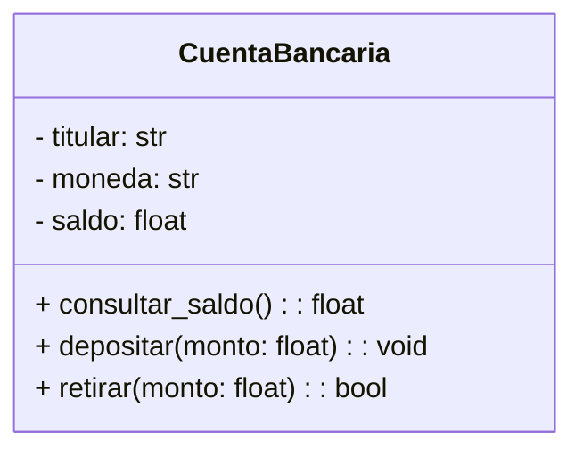

# Práctica evaluada 1: `CuentaBancaria`

Implemente una clase `CuentaBancaria` que modele una cuenta simple.

### **Requerimientos funcionales**

- **Atributos de instancia** (inicializados en `__init__`):
  - `titular: str`
  - `moneda: str` (por ejemplo `"CRC"` o `"USD"`)
  - `saldo: float`
    - Inicia con el parámetro `saldo_inicial`, por defecto `0.0`. Recuerde el uso de parámetros predeterminados.
- **Métodos de instancia**:
  - `consultar_saldo() -> float`
    Devuelve el saldo **sin** modificarlo (consultor).
  - `depositar(monto: float) -> None`
    Suma `monto` al saldo **solo si `monto > 0`**.
  - `retirar(monto: float) -> bool`
    Resta `monto` del saldo **solo si `0 < monto <= saldo`**.
    Retorna `True` si se realizó la operación, `False` en caso contrario

### **Requerimientos de demostración**

- Crear **al menos dos** objetos `CuentaBancaria` con estados iniciales distintos.
- Ejecutar una secuencia de operaciones (`depositar`, `retirar`, `consultar_saldo`) sobre **cada** objeto y **mostrar por pantalla**:
  - El titular y el saldo después de las operaciones.
  - Que las operaciones sobre una cuenta **no** afectan el estado de la otra (estado independiente).

### **Restricciones**

- No usar variables globales; toda la información debe vivir en las instancias.
- Entregue un único archivo `cuenta_bancaria.py` con la solución.

---

## Criterios de evaluación

| Criterio                         | Descripción                                                                                                    |  Puntos |
| -------------------------------- | -------------------------------------------------------------------------------------------------------------- | ------: |
| Definición de clase y `__init__` | La clase existe, `__init__` recibe parámetros adecuados y **crea** los atributos `titular`, `moneda`, `saldo`. |      15 |
| Atributos de instancia           | Los atributos se **inicializan en `__init__`** y se acceden vía `self`.                                        |      10 |
| `consultar_saldo()` (consultor)  | Retorna el saldo **sin efectos secundarios**.                                                                  |      10 |
| `depositar(monto)` (mutador)     | Valida `monto > 0` y actualiza el saldo correctamente.                                                         |      15 |
| `retirar(monto)` (mutador)       | Valida `0 < monto <= saldo`, actualiza correctamente y retorna `True/False` según corresponda.                 |      20 |
| Estado independiente             | Se crean al menos dos cuentas y se evidencia que operar sobre una **no** cambia la otra.                       |      10 |
| Demostración y salida            | Secuencia de pruebas clara y resultados coherentes.                                                            |      10 |
| Estilo y buenas prácticas        | Nombres descriptivos, uso correcto de `self` y comentarios claros.                                             |      10 |
| **Total**                        |                                                                                                                | **100** |
