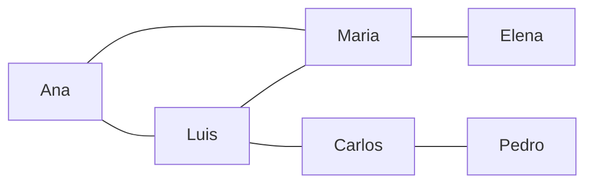

# Práctica evaluada 2: Red de contactos

!!! question "Planteamiento"

    En una red social, cada persona es un nodo y las amistades son aristas.
    Dada una persona, encuentre todas las que se encuentran a una distancia máxima de **2 grados de separación**.

!!! tip "Sugerencia"

    - Modele la red como un grafo no dirigido.
    - Use **BFS** y detenga la búsqueda cuando la distancia supere 2.
    - Devuelva la lista de nodos alcanzables.



- Respuesta esperada para `Ana`: `{Luis, Maria, Carlos, Elena}`.

!!! tip

    - Utilice una cola de `deque` con tuplas `(nodo, distancia)`.
    - Corte la expansión cuando `distancia == 2`.

```python
from collections import deque

red = {
    'Ana': ['Luis', 'María'],
    'Luis': ['Ana', 'Carlos', 'Maria'],
    'María': ['Ana', 'Elena', 'Luis'],
    'Carlos': ['Luis', 'Pedro'],
    'Elena': ['María'],
    'Pedro': ['Carlos']
}

def contactos_en_dos_grados(inicio):
    visitados = {inicio}
    cola = deque([(inicio, 0)])
    resultado = []

    while cola:
        # Sacar elemento de la cola

        # Caso 1: Distancia entre 0 y 2 –> Agregar a la lista de resultado

        # Caso 2: Distancia menor que 2 –> Recorrer vecinos
        # En el loop, se agrega a visitados si no lo está
        # y se agrega a la cola

    return resultado

print(contactos_en_dos_grados('Ana'))
```
