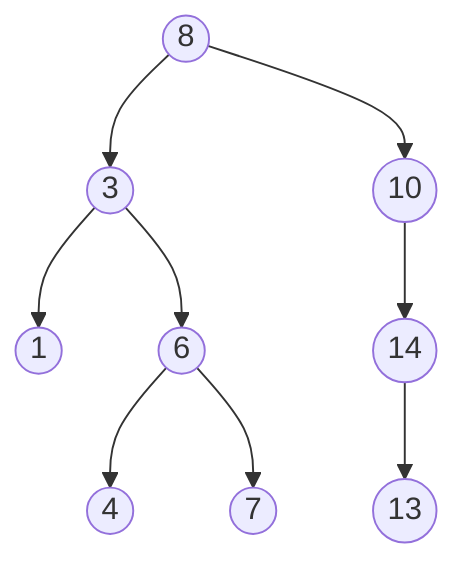

# Tarea 2: Árboles Binarios

!!! info "Objetivo general"

    Aplicar los conocimientos aprendidos sobre árboles binarios para
    implementar un **árbol binario de búsqueda (BST)** que permita realizar
    búsquedas, recorridos y operaciones básicas sobre los nodos.

## Descripción general

Un **árbol binario de búsqueda** (_Binary Search Tree_) es una estructura donde
cada nodo cumple la propiedad:

> Los valores **menores** se ubican en el subárbol **izquierdo**  
> Los valores **mayores o iguales** se ubican en el subárbol **derecho**.

El objetivo de esta tarea es implementar un BST que permita:

- Realizar búsquedas.
- Calcular altura y número de hojas.
- Obtener valores mínimos y máximos.
- Recorrer el árbol en **preorden**, **en orden** y **postorden**.

## Estructura de clases

Cree dos clases principales:

- Clase `Nodo`

```python
class Nodo:
    def __init__(self, valor):
        self.valor = valor
        self.izq = None
        self.der = None
```

- Clase `ArbolBST`

Contendrá la raíz y los métodos solicitados:

| Método           | Descripción                                                               |
| ---------------- | ------------------------------------------------------------------------- |
| `buscar(valor)`  | Retorna `True` si el valor existe en el árbol, `False` en caso contrario. |
| `en_orden()`     | Devuelve una lista con los valores en orden ascendente.                   |
| `preorden()`     | Devuelve la lista en orden de recorrido preorden.                         |
| `postorden()`    | Devuelve la lista en orden postorden.                                     |
| `minimo()`       | Retorna el valor más pequeño del árbol.                                   |
| `maximo()`       | Retorna el valor más grande del árbol.                                    |
| `altura()`       | Calcula la altura del árbol.                                              |
| `contar_hojas()` | Devuelve el número total de hojas.                                        |

!!! tip "Sugerencia"

    Todos los recorridos y cálculos pueden implementarse de forma **recursiva**
    utilizando funciones auxiliares internas.

## Programa principal (`main.py`)

En el archivo principal, se debe:

1.  Crear un árbol BST con los siguientes valores ya predefinidos:

    ```python
    valores = [8, 3, 10, 1, 6, 14, 4, 7, 13]
    ```

    !!! note

         Cree este árbol manualmente, asignando nodos. No es necesario utilizar
         un método de inserción.

2.  Mostrar en pantalla:
    - Los tres recorridos (preorden, en orden, postorden).
    - La altura del árbol.
    - El número de hojas.
    - El valor mínimo y máximo.
    - Una búsqueda de ejemplo (`buscar(6)` y `buscar(9)`).

## Representación visual del BST

Observe que hay nodos que deben estar en `None` (el árbol no está completo).
Deben asignar correctamente si el nodo izquierdo o derecho es el que está en
`None`, de forma que se mantengan las reglas del BST.



## Resultados esperados

| Operación        | Resultado esperado               |
| ---------------- | -------------------------------- |
| `en_orden()`     | `[1, 3, 4, 6, 7, 8, 10, 13, 14]` |
| `preorden()`     | `[8, 3, 1, 6, 4, 7, 10, 14, 13]` |
| `postorden()`    | `[1, 4, 7, 6, 3, 13, 14, 10, 8]` |
| `altura()`       | `4`                              |
| `contar_hojas()` | `4`                              |
| `minimo()`       | `1`                              |
| `maximo()`       | `14`                             |
| `buscar(6)`      | `True`                           |
| `buscar(9)`      | `False`                          |

---

## Criterios de evaluación

| Criterio                                                                       | Descripción                                    | Puntos |
| ------------------------------------------------------------------------------ | ---------------------------------------------- | ------ |
| Estructura correcta de las clases `Nodo` y `ArbolBST`                          | Diseño y relaciones adecuadas entre nodos      | 20     |
| Implementación funcional de los recorridos                                     | Los tres recorridos devuelven listas correctas | 20     |
| Funciones adicionales (`buscar`, `minimo`, `maximo`, `altura`, `contar_hojas`) | Resultados válidos y consistentes              | 25     |
| Correcta construcción del árbol base y demostración de resultados              | Árbol reflejado correctamente en las pruebas   | 20     |
| Claridad del código y documentación                                            | Comentarios, estilo y legibilidad              | 15     |

!!! tip "Recuerde..."

    **Pruebe cada método individualmente** antes de integrarlo.

**Para la entrega:** un único archivo `bst.py` que contenga las clases y el código de prueba.
